# 🧬 썬데이허그 AI 에이전트 시스템

# 전체 워크플로우 다이어그램

-----

## 목차

1. [전체 시스템 아키텍처](#part-1-전체-시스템-아키텍처)
1. [주문 에이전트](#21-주문-에이전트)
1. [CS 에이전트](#22-cs-에이전트)
1. [마케팅 에이전트](#23-마케팅-에이전트)
1. [상세페이지 에이전트](#24-상세페이지-에이전트)
1. [재고 에이전트](#25-재고-에이전트)
1. [회계 에이전트](#26-회계-에이전트)
1. [지원사업 에이전트](#27-지원사업-에이전트)
1. [제품기획 에이전트](#28-제품기획-에이전트)
1. [법률 에이전트](#29-법률-에이전트)
1. [지재권 에이전트](#210-지재권-에이전트)
1. [분석 에이전트](#211-분석-에이전트)
1. [위기관리 에이전트](#212-위기관리-에이전트)
1. [물류 에이전트](#213-물류-에이전트)
1. [미디어 에이전트](#214-미디어-에이전트)
1. [제휴 에이전트](#215-제휴-에이전트)
1. [로열티 에이전트](#216-로열티-에이전트)
1. [에이전트 간 상호작용](#part-3-에이전트-간-상호작용)

-----

# PART 1: 전체 시스템 아키텍처

## 🧬 조직 유기체 개요

```
썬데이허그 = 하나의 유기체

🧠 두뇌: 총괄 에이전트 + 대표
🔌 신경계: 데이터 흐름 & 알림
🫀 장기: 17개 메인 에이전트
🩸 혈액: 데이터 (고객/주문/재고/매출)
🧫 세포: 53개 서브에이전트
```

## 1.1 중앙 신경계 구조

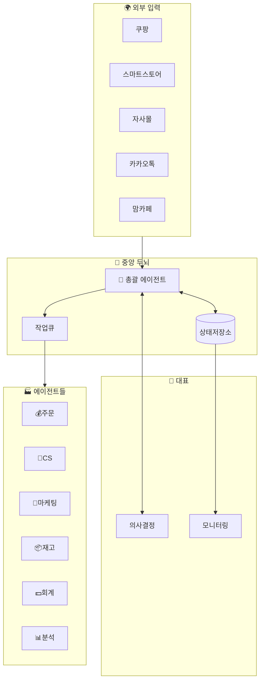
```mermaid
graph TB
    subgraph 외부["🌍 외부 입력"]
        C[쿠팡]
        S[스마트스토어]
        A[자사몰]
        K[카카오톡]
        M[맘카페]
    end

    subgraph 두뇌["🧠 중앙 두뇌"]
        SEC[🤖 총괄 에이전트]
        STATE[(상태저장소)]
        QUEUE[작업큐]
    end

    subgraph 대표["👤 대표"]
        DECIDE[의사결정]
        VIEW[모니터링]
    end

    subgraph 장기["🏭 에이전트들"]
        ORD[💰주문]
        CS[💬CS]
        MKT[📢마케팅]
        INV[📦재고]
        ACC[💵회계]
        ANA[📊분석]
    end

    외부 --> SEC
    SEC <--> STATE
    SEC --> QUEUE
    QUEUE --> 장기
    SEC <--> DECIDE
    STATE --> VIEW
```

## 1.2 이벤트 처리 흐름

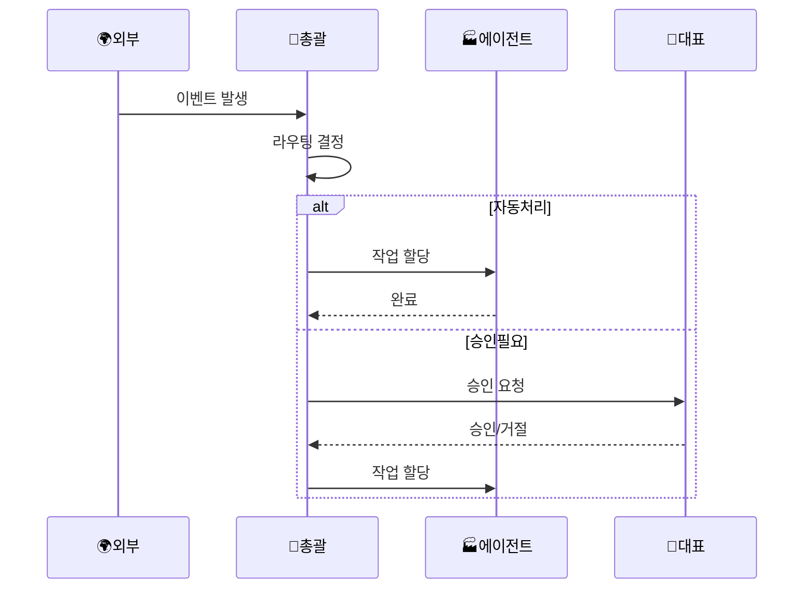
```mermaid
sequenceDiagram
    participant EXT as 🌍외부
    participant SEC as 🤖총괄
    participant AGT as 🏭에이전트
    participant CEO as 👤대표

    EXT->>SEC: 이벤트 발생
    SEC->>SEC: 라우팅 결정

    alt 자동처리
        SEC->>AGT: 작업 할당
        AGT-->>SEC: 완료
    else 승인필요
        SEC->>CEO: 승인 요청
        CEO-->>SEC: 승인/거절
        SEC->>AGT: 작업 할당
    end
```

-----

# PART 2: 에이전트별 상세 워크플로우

-----

## 2.1 💰 주문 에이전트

**서브에이전트**: 주문수집(📥), 배송관리(🚚), 반품교환(↩️)

### 주문수집 플로우

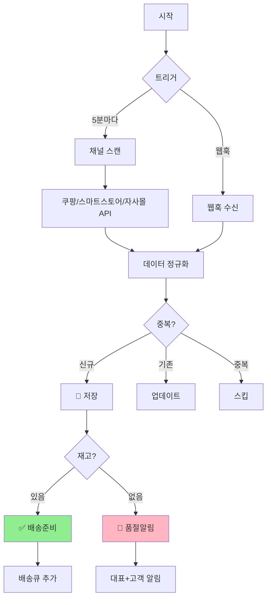
```mermaid
graph TB
    A[시작] --> B{트리거}
    B -->|5분마다| C[채널 스캔]
    B -->|웹훅| D[웹훅 수신]

    C --> E[쿠팡/스마트스토어/자사몰 API]
    E --> F[데이터 정규화]
    D --> F

    F --> G{중복?}
    G -->|신규| H[💾 저장]
    G -->|기존| I[업데이트]
    G -->|중복| J[스킵]

    H --> K{재고?}
    K -->|있음| L[✅ 배송준비]
    K -->|없음| M[🚨 품절알림]

    L --> N[배송큐 추가]
    M --> O[대표+고객 알림]

    style L fill:#90EE90
    style M fill:#FFB6C1
```

### 배송관리 플로우

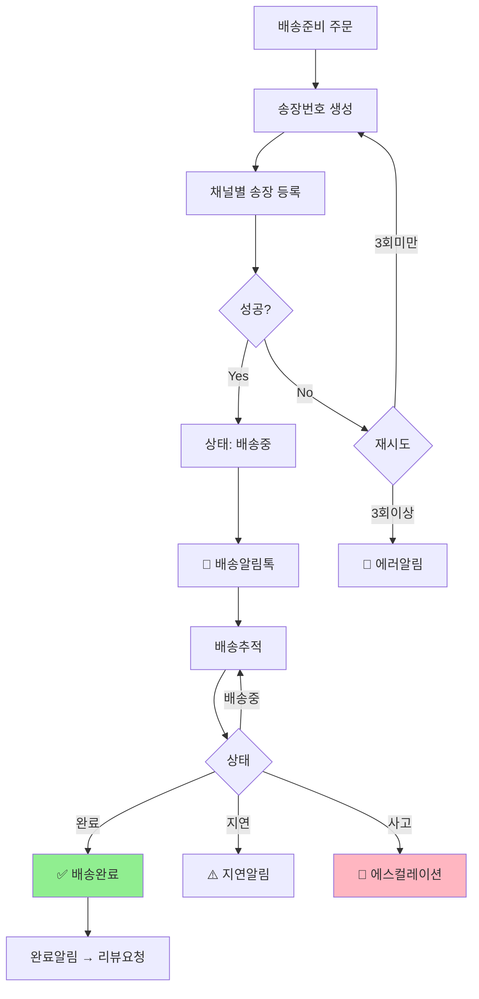
```mermaid
graph TB
    A[배송준비 주문] --> B[송장번호 생성]
    B --> C[채널별 송장 등록]

    C --> D{성공?}
    D -->|Yes| E[상태: 배송중]
    D -->|No| F{재시도}
    F -->|3회미만| B
    F -->|3회이상| G[🚨 에러알림]

    E --> H[📱 배송알림톡]
    H --> I[배송추적]

    I --> J{상태}
    J -->|배송중| I
    J -->|완료| K[✅ 배송완료]
    J -->|지연| L[⚠️ 지연알림]
    J -->|사고| M[🚨 에스컬레이션]

    K --> N[완료알림 → 리뷰요청]

    style K fill:#90EE90
    style M fill:#FFB6C1
```

### 반품/교환 플로우

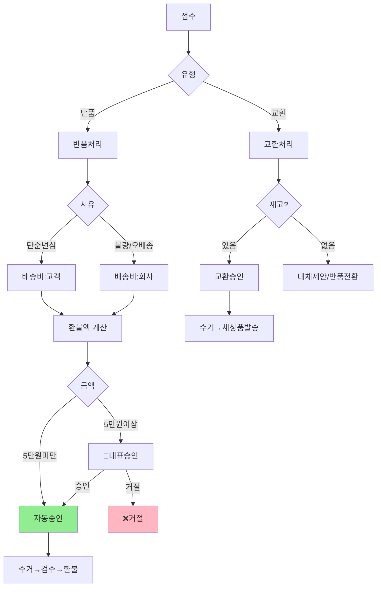
```mermaid
graph TB
    A[접수] --> B{유형}
    B -->|반품| C[반품처리]
    B -->|교환| D[교환처리]

    C --> E{사유}
    E -->|단순변심| F[배송비:고객]
    E -->|불량/오배송| G[배송비:회사]

    F --> H[환불액 계산]
    G --> H

    H --> I{금액}
    I -->|5만원미만| J[자동승인]
    I -->|5만원이상| K[👤대표승인]

    K -->|승인| J
    K -->|거절| L[❌거절]

    J --> M[수거→검수→환불]

    D --> N{재고?}
    N -->|있음| O[교환승인]
    N -->|없음| P[대체제안/반품전환]

    O --> Q[수거→새상품발송]

    style J fill:#90EE90
    style L fill:#FFB6C1
```

-----

## 2.2 💬 CS 에이전트

**서브에이전트**: 문의응대(💭), 리뷰관리(⭐), AS처리(🔧), VOC분석(📊)

### 문의응대 플로우

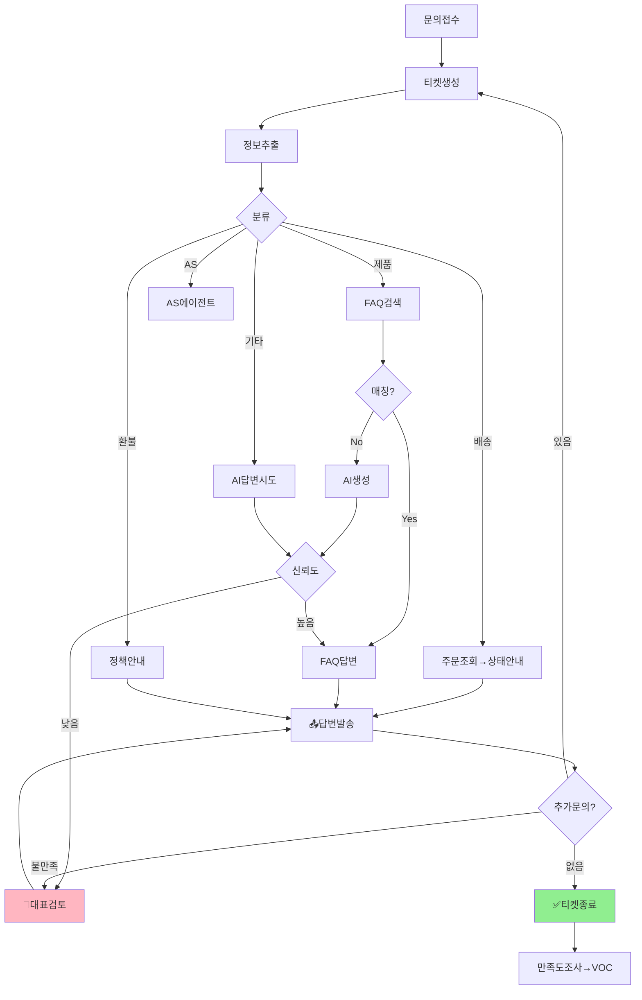
```mermaid
graph TB
    A[문의접수] --> B[티켓생성]
    B --> C[정보추출]
    C --> D{분류}

    D -->|배송| E[주문조회→상태안내]
    D -->|제품| F[FAQ검색]
    D -->|환불| G[정책안내]
    D -->|AS| H[AS에이전트]
    D -->|기타| I[AI답변시도]

    F --> J{매칭?}
    J -->|Yes| K[FAQ답변]
    J -->|No| L[AI생성]

    L --> M{신뢰도}
    M -->|높음| K
    M -->|낮음| N[👤대표검토]

    I --> M

    E --> O[📤답변발송]
    K --> O
    G --> O
    N --> O

    O --> P{추가문의?}
    P -->|없음| Q[✅티켓종료]
    P -->|있음| B
    P -->|불만족| N

    Q --> R[만족도조사→VOC]

    style Q fill:#90EE90
    style N fill:#FFB6C1
```

### 리뷰관리 플로우

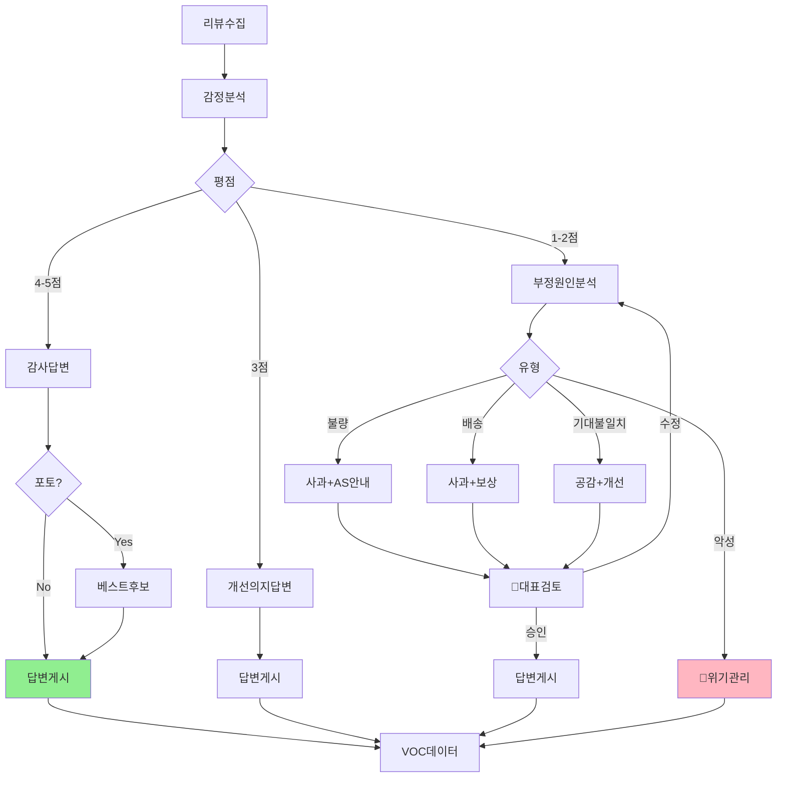
```mermaid
graph TB
    A[리뷰수집] --> B[감정분석]

    B --> C{평점}
    C -->|4-5점| D[감사답변]
    C -->|3점| E[개선의지답변]
    C -->|1-2점| F[부정원인분석]

    D --> G{포토?}
    G -->|Yes| H[베스트후보]
    G -->|No| I[답변게시]
    H --> I

    E --> J[답변게시]

    F --> K{유형}
    K -->|불량| L[사과+AS안내]
    K -->|배송| M[사과+보상]
    K -->|기대불일치| N[공감+개선]
    K -->|악성| O[🚨위기관리]

    L --> P[👤대표검토]
    M --> P
    N --> P

    P -->|승인| Q[답변게시]
    P -->|수정| F

    I --> R[VOC데이터]
    J --> R
    Q --> R
    O --> R

    style I fill:#90EE90
    style O fill:#FFB6C1
```

### AS처리 플로우

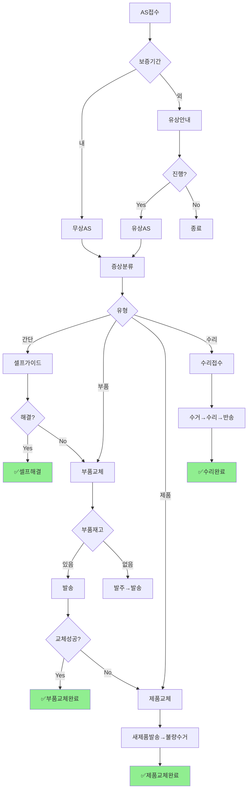
```mermaid
graph TB
    A[AS접수] --> B{보증기간}
    B -->|내| C[무상AS]
    B -->|외| D[유상안내]

    D --> E{진행?}
    E -->|Yes| F[유상AS]
    E -->|No| G[종료]

    C --> H[증상분류]
    F --> H

    H --> I{유형}
    I -->|간단| J[셀프가이드]
    I -->|부품| K[부품교체]
    I -->|제품| L[제품교체]
    I -->|수리| M[수리접수]

    J --> N{해결?}
    N -->|Yes| O[✅셀프해결]
    N -->|No| K

    K --> P{부품재고}
    P -->|있음| Q[발송]
    P -->|없음| R[발주→발송]

    Q --> S{교체성공?}
    S -->|Yes| T[✅부품교체완료]
    S -->|No| L

    L --> U[새제품발송→불량수거]
    U --> V[✅제품교체완료]

    M --> W[수거→수리→반송]
    W --> X[✅수리완료]

    style O fill:#90EE90
    style T fill:#90EE90
    style V fill:#90EE90
    style X fill:#90EE90
```

### VOC분석 플로우

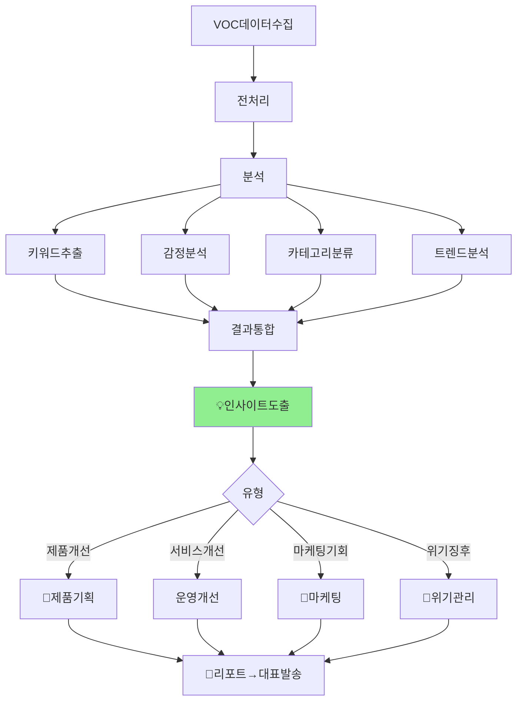
```mermaid
graph TB
    A[VOC데이터수집] --> B[전처리]
    B --> C[분석]

    C --> D[키워드추출]
    C --> E[감정분석]
    C --> F[카테고리분류]
    C --> G[트렌드분석]

    D --> H[결과통합]
    E --> H
    F --> H
    G --> H

    H --> I[💡인사이트도출]

    I --> J{유형}
    J -->|제품개선| K[🎁제품기획]
    J -->|서비스개선| L[운영개선]
    J -->|마케팅기회| M[📢마케팅]
    J -->|위기징후| N[🚨위기관리]

    K --> O[📝리포트→대표발송]
    L --> O
    M --> O
    N --> O

    style I fill:#90EE90
```

-----

## 2.3 📢 마케팅 에이전트

**서브에이전트**: 퍼포먼스(📈), 콘텐츠(🎨), CRM(💌), 프로모션(🎉), 인플루언서(👥), 소셜리스닝(👂)

### 퍼포먼스 마케팅 플로우

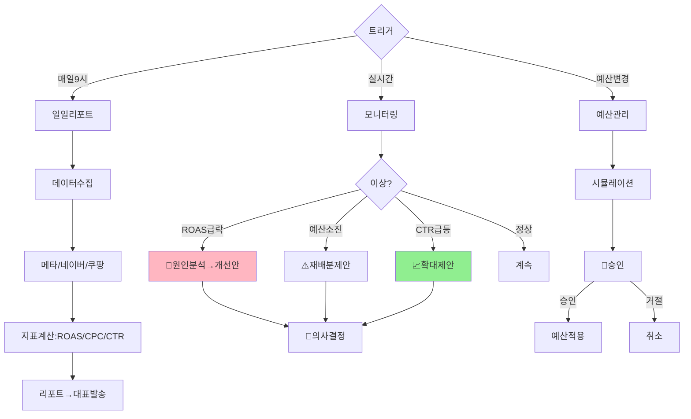
```mermaid
graph TB
    A{트리거} -->|매일9시| B[일일리포트]
    A -->|실시간| C[모니터링]
    A -->|예산변경| D[예산관리]

    B --> E[데이터수집]
    E --> F[메타/네이버/쿠팡]
    F --> G[지표계산:ROAS/CPC/CTR]
    G --> H[리포트→대표발송]

    C --> I{이상?}
    I -->|ROAS급락| J[🚨원인분석→개선안]
    I -->|예산소진| K[⚠️재배분제안]
    I -->|CTR급등| L[📈확대제안]
    I -->|정상| M[계속]

    J --> N[👤의사결정]
    K --> N
    L --> N

    D --> O[시뮬레이션]
    O --> P[👤승인]
    P -->|승인| Q[예산적용]
    P -->|거절| R[취소]

    style J fill:#FFB6C1
    style L fill:#90EE90
```

### 콘텐츠 마케팅 플로우

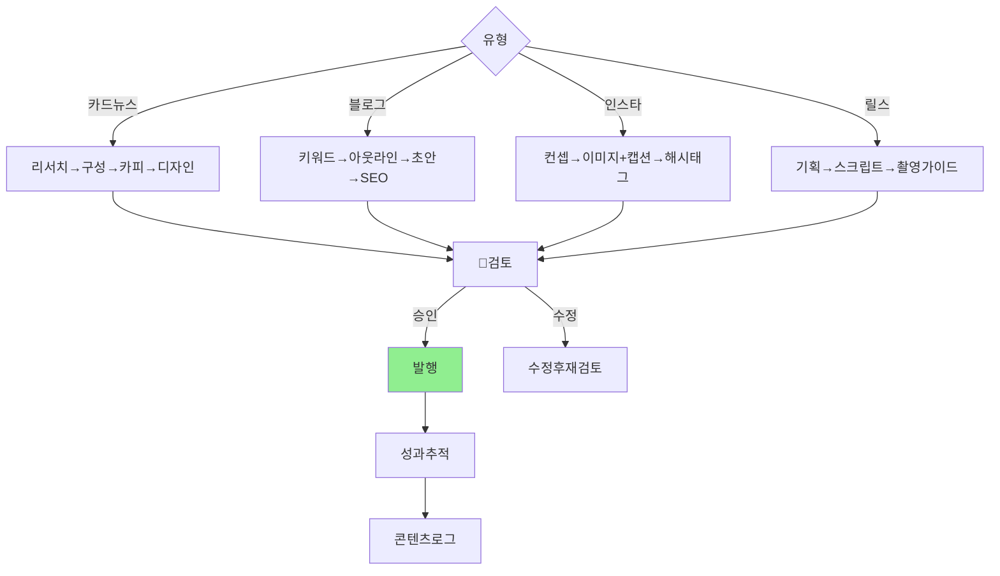
```mermaid
graph TB
    A{유형} -->|카드뉴스| B[리서치→구성→카피→디자인]
    A -->|블로그| C[키워드→아웃라인→초안→SEO]
    A -->|인스타| D[컨셉→이미지+캡션→해시태그]
    A -->|릴스| E[기획→스크립트→촬영가이드]

    B --> F[👤검토]
    C --> F
    D --> F
    E --> F

    F -->|승인| G[발행]
    F -->|수정| H[수정후재검토]

    G --> I[성과추적]
    I --> J[콘텐츠로그]

    style G fill:#90EE90
```

### CRM 마케팅 플로우

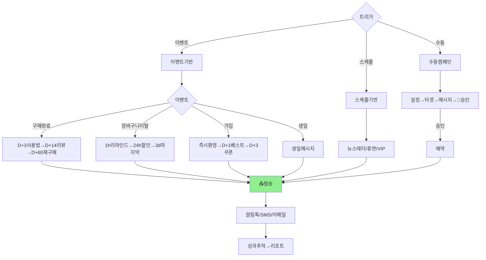
```mermaid
graph TB
    A{트리거} -->|이벤트| B[이벤트기반]
    A -->|스케줄| C[스케줄기반]
    A -->|수동| D[수동캠페인]

    B --> E{이벤트}
    E -->|구매완료| F[D+3사용법→D+14리뷰→D+60재구매]
    E -->|장바구니이탈| G[1h리마인드→24h할인→3d마지막]
    E -->|가입| H[즉시환영→D+1베스트→D+3쿠폰]
    E -->|생일| I[생일메시지]

    C --> J[뉴스레터/휴면/VIP]

    D --> K[설정→타겟→메시지→👤승인]
    K -->|승인| L[예약]

    F --> M[📤발송]
    G --> M
    H --> M
    I --> M
    J --> M
    L --> M

    M --> N[알림톡/SMS/이메일]
    N --> O[성과추적→리포트]

    style M fill:#90EE90
```

### 프로모션 기획 플로우

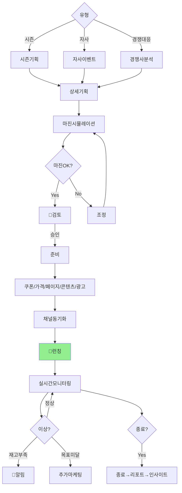
```mermaid
graph TB
    A{유형} -->|시즌| B[시즌기획]
    A -->|자사| C[자사이벤트]
    A -->|경쟁대응| D[경쟁사분석]

    B --> E[상세기획]
    C --> E
    D --> E

    E --> F[마진시뮬레이션]
    F --> G{마진OK?}
    G -->|Yes| H[👤검토]
    G -->|No| I[조정]
    I --> F

    H -->|승인| J[준비]
    J --> K[쿠폰/가격/페이지/콘텐츠/광고]
    K --> L[채널동기화]
    L --> M[🚀런칭]

    M --> N[실시간모니터링]
    N --> O{이상?}
    O -->|재고부족| P[🚨알림]
    O -->|목표미달| Q[추가마케팅]
    O -->|정상| N

    N --> R{종료?}
    R -->|Yes| S[종료→리포트→인사이트]

    style M fill:#90EE90
```

### 인플루언서 마케팅 플로우

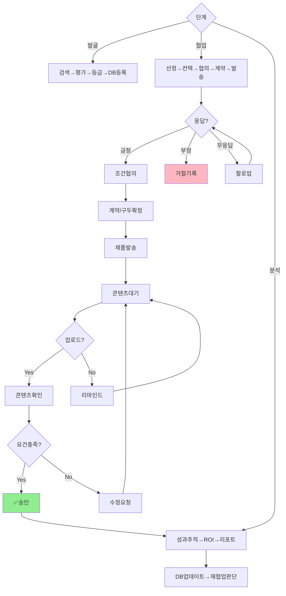
```mermaid
graph TB
    A{단계} -->|발굴| B[검색→평가→등급→DB등록]
    A -->|협업| C[선정→컨택→협의→계약→발송]
    A -->|분석| D[성과추적→ROI→리포트]

    C --> E{응답?}
    E -->|긍정| F[조건협의]
    E -->|부정| G[거절기록]
    E -->|무응답| H[팔로업]
    H --> E

    F --> I[계약/구두확정]
    I --> J[제품발송]
    J --> K[콘텐츠대기]

    K --> L{업로드?}
    L -->|Yes| M[콘텐츠확인]
    L -->|No| N[리마인드]
    N --> K

    M --> O{요건충족?}
    O -->|Yes| P[✅승인]
    O -->|No| Q[수정요청]
    Q --> K

    P --> D
    D --> R[DB업데이트→재협업판단]

    style P fill:#90EE90
    style G fill:#FFB6C1
```

### 소셜리스닝 플로우

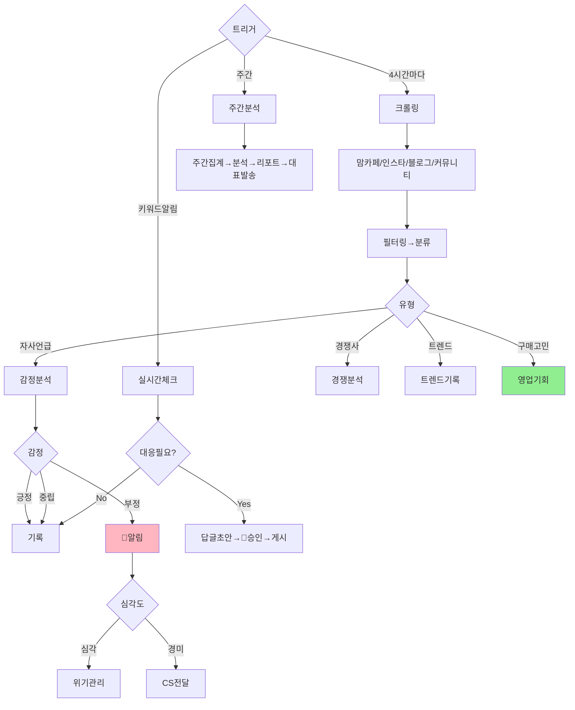
```mermaid
graph TB
    A{트리거} -->|4시간마다| B[크롤링]
    A -->|키워드알림| C[실시간체크]
    A -->|주간| D[주간분석]

    B --> E[맘카페/인스타/블로그/커뮤니티]
    E --> F[필터링→분류]

    F --> G{유형}
    G -->|자사언급| H[감정분석]
    G -->|경쟁사| I[경쟁분석]
    G -->|트렌드| J[트렌드기록]
    G -->|구매고민| K[영업기회]

    H --> L{감정}
    L -->|긍정| M[기록]
    L -->|부정| N[🚨알림]
    L -->|중립| M

    N --> O{심각도}
    O -->|심각| P[위기관리]
    O -->|경미| Q[CS전달]

    C --> R{대응필요?}
    R -->|Yes| S[답글초안→👤승인→게시]
    R -->|No| M

    D --> T[주간집계→분석→리포트→대표발송]

    style N fill:#FFB6C1
    style K fill:#90EE90
```

-----

## 2.4 🎨 상세페이지 에이전트

**서브에이전트**: 기획(📋), 제작(🎨), 최적화(📈)

### 상세페이지 제작 플로우

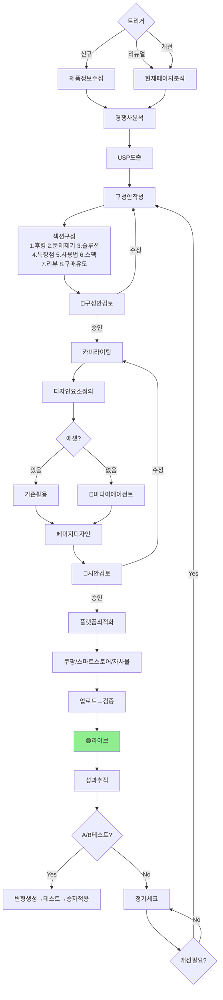
```mermaid
graph TB
    A{트리거} -->|신규| B[제품정보수집]
    A -->|리뉴얼| C[현재페이지분석]
    A -->|개선| C

    B --> D[경쟁사분석]
    C --> D

    D --> E[USP도출]
    E --> F[구성안작성]

    F --> G["섹션구성<br/>1.후킹 2.문제제기 3.솔루션<br/>4.특장점 5.사용법 6.스펙<br/>7.리뷰 8.구매유도"]

    G --> H[👤구성안검토]
    H -->|승인| I[카피라이팅]
    H -->|수정| F

    I --> J[디자인요소정의]
    J --> K{에셋?}
    K -->|있음| L[기존활용]
    K -->|없음| M[📸미디어에이전트]

    L --> N[페이지디자인]
    M --> N

    N --> O[👤시안검토]
    O -->|승인| P[플랫폼최적화]
    O -->|수정| I

    P --> Q[쿠팡/스마트스토어/자사몰]
    Q --> R[업로드→검증]
    R --> S[🟢라이브]

    S --> T[성과추적]
    T --> U{A/B테스트?}
    U -->|Yes| V[변형생성→테스트→승자적용]
    U -->|No| W[정기체크]

    W --> X{개선필요?}
    X -->|Yes| F
    X -->|No| W

    style S fill:#90EE90
```

-----

## 2.5 📦 재고 에이전트

**서브에이전트**: 재고동기화(🔄), 발주관리(📝), 원가분석(💰)

### 재고관리 플로우

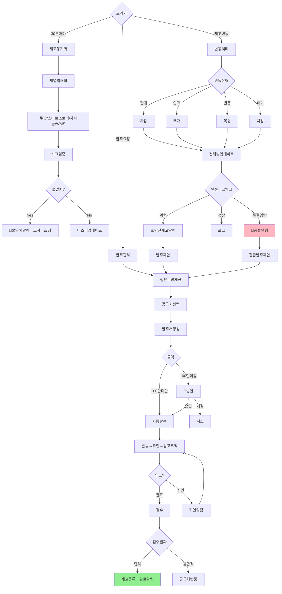
```mermaid
graph TB
    A{트리거} -->|30분마다| B[재고동기화]
    A -->|재고변동| C[변동처리]
    A -->|발주요청| D[발주관리]

    B --> E[채널별조회]
    E --> F[쿠팡/스마트스토어/자사몰/WMS]
    F --> G[비교검증]

    G --> H{불일치?}
    H -->|Yes| I[🚨불일치알림→조사→조정]
    H -->|No| J[마스터업데이트]

    C --> K{변동유형}
    K -->|판매| L[차감]
    K -->|입고| M[추가]
    K -->|반품| N[복원]
    K -->|폐기| O[차감]

    L --> P[전채널업데이트]
    M --> P
    N --> P
    O --> P

    P --> Q{안전재고체크}
    Q -->|위험| R[⚠️안전재고알림]
    Q -->|품절임박| S[🚨품절알림]
    Q -->|정상| T[로그]

    R --> U[발주제안]
    S --> V[긴급발주제안]

    D --> W[필요수량계산]
    U --> W
    V --> W

    W --> X[공급처선택]
    X --> Y[발주서생성]

    Y --> Z{금액}
    Z -->|100만미만| AA[자동발송]
    Z -->|100만이상| AB[👤승인]

    AB -->|승인| AA
    AB -->|거절| AC[취소]

    AA --> AD[발송→확인→입고추적]
    AD --> AE{입고?}
    AE -->|완료| AF[검수]
    AE -->|지연| AG[지연알림]
    AG --> AD

    AF --> AH{검수결과}
    AH -->|합격| AI[재고등록→완료알림]
    AH -->|불합격| AJ[공급처반품]

    style S fill:#FFB6C1
    style AI fill:#90EE90
```

-----

## 2.6 💵 회계 에이전트

**서브에이전트**: 매출정산(💰), 비용관리(💸), 세무(📋), 손익분석(📊)

### 매출/정산 플로우

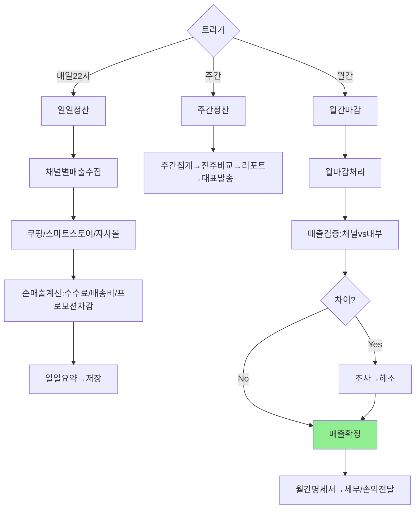
```mermaid
graph TB
    A{트리거} -->|매일22시| B[일일정산]
    A -->|주간| C[주간정산]
    A -->|월간| D[월간마감]

    B --> E[채널별매출수집]
    E --> F[쿠팡/스마트스토어/자사몰]
    F --> G[순매출계산:수수료/배송비/프로모션차감]
    G --> H[일일요약→저장]

    C --> I[주간집계→전주비교→리포트→대표발송]

    D --> J[월마감처리]
    J --> K[매출검증:채널vs내부]

    K --> L{차이?}
    L -->|Yes| M[조사→해소]
    L -->|No| N[매출확정]
    M --> N

    N --> O[월간명세서→세무/손익전달]

    style N fill:#90EE90
```

### 세무관리 플로우

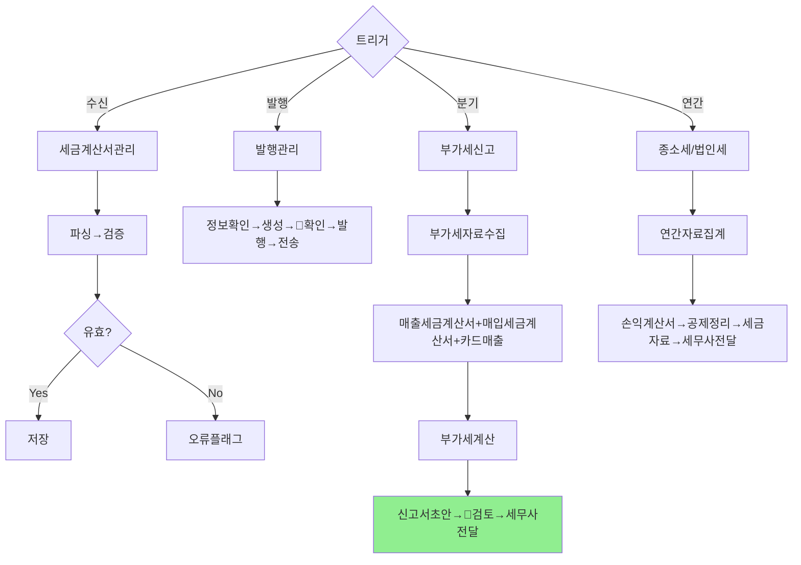
```mermaid
graph TB
    A{트리거} -->|수신| B[세금계산서관리]
    A -->|발행| C[발행관리]
    A -->|분기| D[부가세신고]
    A -->|연간| E[종소세/법인세]

    B --> F[파싱→검증]
    F --> G{유효?}
    G -->|Yes| H[저장]
    G -->|No| I[오류플래그]

    C --> J[정보확인→생성→👤확인→발행→전송]

    D --> K[부가세자료수집]
    K --> L[매출세금계산서+매입세금계산서+카드매출]
    L --> M[부가세계산]
    M --> N[신고서초안→👤검토→세무사전달]

    E --> O[연간자료집계]
    O --> P[손익계산서→공제정리→세금자료→세무사전달]

    style N fill:#90EE90
```

-----

## 2.7 📋 지원사업 에이전트

**서브에이전트**: 모니터링(🔍), 신청지원(📝), 사후관리(📊)

### 지원사업 플로우

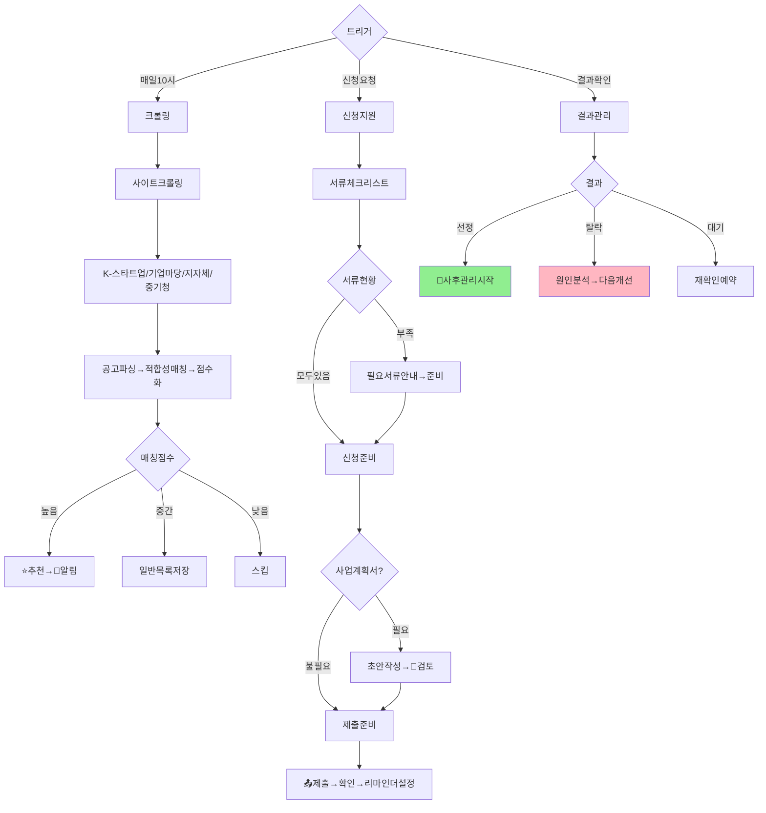
```mermaid
graph TB
    A{트리거} -->|매일10시| B[크롤링]
    A -->|신청요청| C[신청지원]
    A -->|결과확인| D[결과관리]

    B --> E[사이트크롤링]
    E --> F[K-스타트업/기업마당/지자체/중기청]
    F --> G[공고파싱→적합성매칭→점수화]

    G --> H{매칭점수}
    H -->|높음| I[⭐추천→👤알림]
    H -->|중간| J[일반목록저장]
    H -->|낮음| K[스킵]

    C --> L[서류체크리스트]
    L --> M{서류현황}
    M -->|모두있음| N[신청준비]
    M -->|부족| O[필요서류안내→준비]
    O --> N

    N --> P{사업계획서?}
    P -->|필요| Q[초안작성→👤검토]
    P -->|불필요| R[제출준비]
    Q --> R

    R --> S[📤제출→확인→리마인더설정]

    D --> T{결과}
    T -->|선정| U[🎉사후관리시작]
    T -->|탈락| V[원인분석→다음개선]
    T -->|대기| W[재확인예약]

    style U fill:#90EE90
    style V fill:#FFB6C1
```

-----

## 2.8 🎁 제품기획 에이전트

**서브에이전트**: 리서치(🔍), 기획(📋), 피드백분석(📊)

### 제품기획 플로우

```mermaid
graph TB
    A{트리거} -->|신제품| B[리서치]
    A -->|개선요청| C[피드백분석]
    A -->|정기| D[경쟁사모니터링]

    B --> E[시장조사]
    E --> F[트렌드검색/경쟁사분석/시장규모]
    F --> G[기회도출]

    C --> H[VOC데이터수집]
    H --> I[리뷰마이닝→불만분류→개선우선순위]

    D --> J[경쟁사신제품/가격변동/리뷰분석]

    G --> K[컨셉기획]
    I --> K
    J --> K

    K --> L[스펙정의→원가추정]
    L --> M[기획서작성]
    M --> N[👤대표검토]

    N -->|승인| O[개발진행]
    N -->|보류| P[재검토예약]
    N -->|거절| Q[종료]

    style O fill:#90EE90
```

-----

## 2.9 ⚖️ 법률 에이전트

**서브에이전트**: 인증관리(📋), 광고심의(📢), 규정준수(⚖️)

### 법률/규정 플로우

```mermaid
graph TB
    A{트리거} -->|매일| B[인증만료체크]
    A -->|광고요청| C[광고심의]
    A -->|규정체크| D[규정준수]

    B --> E[인증목록조회:KC/어린이안전/전기용품]
    E --> F{만료임박?}
    F -->|30일내| G[🚨긴급갱신]
    F -->|90일내| H[⚠️갱신예정]
    F -->|여유| I[정상]

    G --> J[갱신프로세스→서류→신청→추적→완료→DB업데이트]

    C --> K[광고문구수신→표현체크]
    K --> L{위반?}
    L -->|Yes| M[🚨위반표시→수정제안]
    L -->|No| N[✅승인]
    M --> O[수정본수신]
    O --> K

    D --> P{체크유형}
    P -->|전자상거래법| Q[청약철회/배송/환불체크]
    P -->|개인정보보호| R[수집동의/이용목적/파기체크]
    P -->|표시광고법| S[원산지/인증/주의사항체크]

    Q --> T{준수?}
    R --> T
    S --> T
    T -->|Yes| U[✅준수]
    T -->|No| V[🚨미준수→개선안내]

    style G fill:#FFB6C1
    style N fill:#90EE90
    style U fill:#90EE90
```

-----

## 2.10 🛡️ 지재권 에이전트

**서브에이전트**: 권리관리(📋), 침해감시(🔍), 대응(⚔️)

### 지식재산권 플로우

```mermaid
graph TB
    A{트리거} -->|월간| B[권리관리]
    A -->|일간| C[침해감시]
    A -->|침해발견| D[대응]

    B --> E[보유권리조회:상표/디자인/특허]
    E --> F{상태}
    F -->|갱신필요| G[⚠️갱신알림→프로세스]
    F -->|출원가능| H[💡출원제안→대표판단]
    F -->|정상| I[유지]

    C --> J[마켓플레이스스캔]
    J --> K[쿠팡/네이버/알리테무]
    K --> L[유사상품비교]

    L --> M{유사도}
    M -->|높음| N[🚨침해의심]
    M -->|중간| O[👀관찰]
    M -->|낮음| P[정상]

    N --> Q[증거수집→👤보고]

    D --> R{심각도}
    Q --> R
    R -->|경미| S[경고장]
    R -->|중간| T[플랫폼신고]
    R -->|심각| U[법적조치검토]

    S --> V{반응?}
    V -->|삭제| W[✅해결]
    V -->|무시| T

    T --> X{결과}
    X -->|삭제| W
    X -->|거부| U

    U --> Y[변호사상담→👤최종결정]

    style N fill:#FFB6C1
    style W fill:#90EE90
```

-----

## 2.11 📊 분석 에이전트

**서브에이전트**: 대시보드(📊), 리포트(📝), 예측(🔮)

### 데이터분석 플로우

```mermaid
graph TB
    A{트리거} -->|실시간| B[대시보드]
    A -->|정기| C[리포트]
    A -->|예측| D[예측분석]

    B --> E[지표수집:매출/주문/방문/전환/재고]
    E --> F[대시보드업데이트]
    F --> G{이상?}
    G -->|급격변화| H[🚨이상알림]
    G -->|정상| I[계속모니터링]

    C --> J{유형}
    J -->|일간| K[일일요약]
    J -->|주간| L[채널별/상품별/전주비교]
    J -->|월간| M[손익/고객/트렌드심층분석]

    K --> N[리포트생성→대표발송]
    L --> N
    M --> N

    D --> O{예측유형}
    O -->|매출| P[다음달예상매출]
    O -->|수요| Q[상품별예상판매량]
    O -->|재고| R[재고소진예상일]

    P --> S[인사이트→액션제안]
    Q --> S
    R --> S

    S --> T[발주추천/프로모션제안/재고조정]

    style H fill:#FFB6C1
```

-----

## 2.12 🚨 위기관리 에이전트

**서브에이전트**: 모니터링(🔍), 대응(⚔️), 복구(🔄)

### 위기관리 플로우

```mermaid
graph TB
    A{트리거} -->|실시간| B[모니터링]
    A -->|위기발생| C[대응]
    A -->|사후| D[복구분석]

    B --> E[소스스캔:1점리뷰/소셜/커뮤니티/뉴스]
    E --> F[신호종합]
    F --> G{위험수준}
    G -->|🔴심각| H[🚨위기알림]
    G -->|🟡주의| I[⚠️주의알림]
    G -->|🟢정상| J[정상]

    C --> K[상황평가]
    H --> K

    K --> L{위기유형}
    L -->|제품안전| M[판매중단/리콜검토]
    L -->|서비스불만| N[사과+보상]
    L -->|악성루머| O[팩트체크+해명]
    L -->|법적이슈| P[법률자문연결]

    M --> Q[👤긴급보고]
    N --> Q
    O --> Q
    P --> Q

    Q --> R[SOP실행]
    R --> S[내부+외부커뮤니케이션]
    S --> T[진행모니터링]

    T --> U{해결?}
    U -->|Yes| V[위기종료]
    U -->|No| T

    D --> W[데이터수집]
    V --> W
    W --> X[원인분석→영향평가→교훈→SOP업데이트→재발방지]

    style H fill:#FFB6C1
    style V fill:#90EE90
```

-----

## 2.13 🚚 물류 에이전트

**서브에이전트**: 3PL관리(📊), 배송최적화(💰), 품질관리(🔍)

### 물류관리 플로우

```mermaid
graph TB
    A{트리거} -->|일간| B[3PL성과]
    A -->|주간| C[배송비분석]
    A -->|이슈| D[품질관리]

    B --> E[지표수집:출고율/정확도/정시율/파손율]
    E --> F[성과평가]
    F --> G{SLA충족?}
    G -->|Yes| H[✅양호]
    G -->|No| I[⚠️이슈→원인분석→개선요청]

    C --> J[배송비데이터수집]
    J --> K[택배사별/지역별/중량별분석]
    K --> L[최적화제안→절감액계산→👤보고]

    D --> M{이슈유형}
    M -->|지연| N[고객알림]
    M -->|파손| O[클레임처리]
    M -->|분실| O
    M -->|오배송| P[재배송]

    O --> Q[택배사클레임→보상]

    N --> R[이슈로그]
    Q --> R
    P --> R

    R --> S[패턴분석]
    S --> T{체계적문제?}
    T -->|Yes| U[👤보고+개선요청]
    T -->|No| V[이슈종료]

    style H fill:#90EE90
    style I fill:#FFB6C1
```

-----

## 2.14 📸 미디어 에이전트

**서브에이전트**: 촬영관리(📷), 에셋관리(📁), 편집(✂️)

### 미디어관리 플로우

```mermaid
graph TB
    A{트리거} -->|촬영요청| B[촬영관리]
    A -->|에셋요청| C[에셋관리]
    A -->|편집요청| D[편집처리]

    B --> E{유형}
    E -->|제품| F[내부가능?]
    E -->|모델| G[외주]
    E -->|영상| G

    F -->|Yes| H[내부일정]
    F -->|No| G

    G --> I[업체검색→견적→비교→👤승인→예약]

    H --> J[촬영진행]
    I --> J

    J --> K[결과물수령→품질확인→정리/태깅]
    K --> L[에셋업로드→라이브러리저장]

    C --> M[에셋검색]
    M --> N{결과}
    N -->|있음| O[에셋반환]
    N -->|없음| P[신규촬영필요]

    D --> Q{편집유형}
    Q -->|리사이즈| R[크기조정]
    Q -->|썸네일| S[썸네일생성]
    Q -->|워터마크| T[워터마크추가]
    Q -->|배경제거| U[배경제거]

    R --> V[결과물전달]
    S --> V
    T --> V
    U --> V

    style L fill:#90EE90
```

-----

## 2.15 🤝 제휴 에이전트

**서브에이전트**: B2B(🏢), 도매(📦), 공동구매(👥)

### 제휴관리 플로우

```mermaid
graph TB
    A{트리거} -->|B2B문의| B[B2B처리]
    A -->|도매문의| C[도매처리]
    A -->|공구제안| D[공동구매]

    B --> E[문의접수→업체평가]
    E --> F{적합?}
    F -->|Yes| G[견적작성→👤검토→발송]
    F -->|No| H[정중히거절]

    G --> I{응답}
    I -->|수락| J[계약진행]
    I -->|협상| K[조건협의]
    I -->|거절| L[종료]
    K --> G

    J --> M[계약서→체결→첫주문]

    C --> N[자격확인:사업자/통신판매업]
    N --> O{자격?}
    O -->|Yes| P[회원등록→도매가→MOQ→주문]
    O -->|No| Q[자격취득안내]

    D --> R[제안평가:규모/판매량/적합성]
    R --> S{진행?}
    S -->|Yes| T[조건협의→👤승인]
    S -->|No| U[거절안내]

    T --> V[공구세팅:전용페이지/쿠폰]
    V --> W[🚀공구진행→모니터링→종료→정산→리포트]

    style M fill:#90EE90
    style W fill:#90EE90
```

-----

## 2.16 ⭐ 로열티 에이전트

**서브에이전트**: 멤버십(🏆), 포인트(💎), VIP관리(👑)

### 로열티프로그램 플로우

```mermaid
graph TB
    A{트리거} -->|구매완료| B[포인트관리]
    A -->|월간| C[등급재산정]
    A -->|이탈감지| D[이탈방지]

    B --> E[포인트계산]
    E --> F{등급보너스}
    F -->|VIP| G[+50%추가]
    F -->|일반| H[기본적립]

    G --> I[포인트적립→알림]
    H --> I

    I --> J[소멸예정체크]
    J --> K{30일내소멸?}
    K -->|Yes| L[⚠️소멸알림]
    K -->|No| M[정상]

    C --> N[6개월구매이력]
    N --> O[등급기준계산]
    O --> P{등급결정}
    P --> Q[VIP/골드/실버/일반]

    Q --> R[이전등급비교]
    R --> S{변동?}
    S -->|승급| T[🎉승급축하+혜택안내]
    S -->|유지| U[유지안내]
    S -->|강등| V[변경안내+재승급가이드]

    T --> W[등급업데이트]
    U --> W
    V --> W

    D --> X[위험고객식별:90일미구매/구매감소]
    X --> Y{위험수준}
    Y -->|높음| Z[윈백:특별할인/전용쿠폰]
    Y -->|중간| AA[리마인드:신상품/재구매쿠폰]
    Y -->|낮음| AB[모니터링]

    Z --> AC[반응추적]
    AA --> AC

    AC --> AD{복귀?}
    AD -->|Yes| AE[웰컴백처리]
    AD -->|No| AF{VIP?}
    AF -->|Yes| AG[👤대표직접컨택]
    AF -->|No| AH[휴면처리]

    style T fill:#90EE90
    style Z fill:#FFB6C1
    style AE fill:#90EE90
```

-----

# PART 3: 에이전트 간 상호작용

## 3.1 데이터 흐름 (혈액순환)

```mermaid
graph LR
    subgraph 생성["데이터 생성"]
        ORD[주문]
        CS[CS]
        INV[재고]
        MKT[마케팅]
    end

    subgraph 저장["💾 중앙저장소"]
        DB[(Supabase)]
    end

    subgraph 소비["데이터 소비"]
        ANA[분석]
        ACC[회계]
        PRD[제품기획]
    end

    ORD --> DB
    CS --> DB
    INV --> DB
    MKT --> DB

    DB --> ANA
    DB --> ACC
    DB --> PRD

    ANA -.->|인사이트| ORD
    ANA -.->|인사이트| MKT
```

## 3.2 에스컬레이션 흐름

```mermaid
graph TB
    subgraph 자동["🟢 자동처리"]
        A1[FAQ응답]
        A2[주문처리]
        A3[재고동기화]
    end

    subgraph 반자동["🟡 초안→승인"]
        B1[콘텐츠]
        B2[리뷰답변]
        B3[발주]
    end

    subgraph 수동["🔴 대표판단"]
        C1[위기대응]
        C2[계약체결]
        C3[가격결정]
    end

    A1 -->|복잡| B2
    A2 -->|이상| C3

    B1 --> CEO[👤 대표]
    B2 --> CEO
    B3 --> CEO
    C1 --> CEO
    C2 --> CEO
    C3 --> CEO
```

## 3.3 자동화 레벨 매트릭스

|에이전트 |완전자동      |반자동     |수동   |
|-----|----------|--------|-----|
|💰주문  |수집, 송장, 알림|대량취소    |-    |
|💬CS  |FAQ, 배송조회 |리뷰답변, 환불|클레임  |
|📢마케팅 |데이터수집, 리포트|콘텐츠, 예산 |신규캠페인|
|📦재고  |동기화, 알림   |발주      |신규거래처|
|💵회계  |수집, 분류    |세금계산서   |세무신고 |
|📊분석  |대시보드, 리포트 |-       |전략제안 |
|🚨위기관리|모니터링      |초기대응    |최종대응 |
|⚖️법률  |만료체크      |광고심의    |법적조치 |
|🛡️지재권 |감시        |경고장     |법적대응 |
|🚚물류  |성과추적      |클레임     |업체변경 |
|📸미디어 |검색, 편집    |외주      |대규모촬영|
|🤝제휴  |문의접수      |견적      |계약   |
|⭐로열티 |적립, 등급    |윈백      |VIP케어|

-----

# 끝

이 문서는 썬데이허그 AI 에이전트 시스템의 전체 워크플로우를 정의합니다.
Claude Code에서 시스템 구현 시 참조용으로 사용됩니다.

**총 구성:**

- 17개 메인 에이전트
- 53개 서브 에이전트
- 21개 워크플로우
