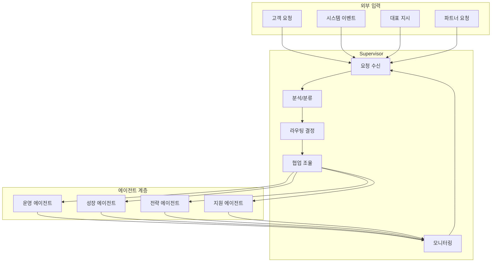
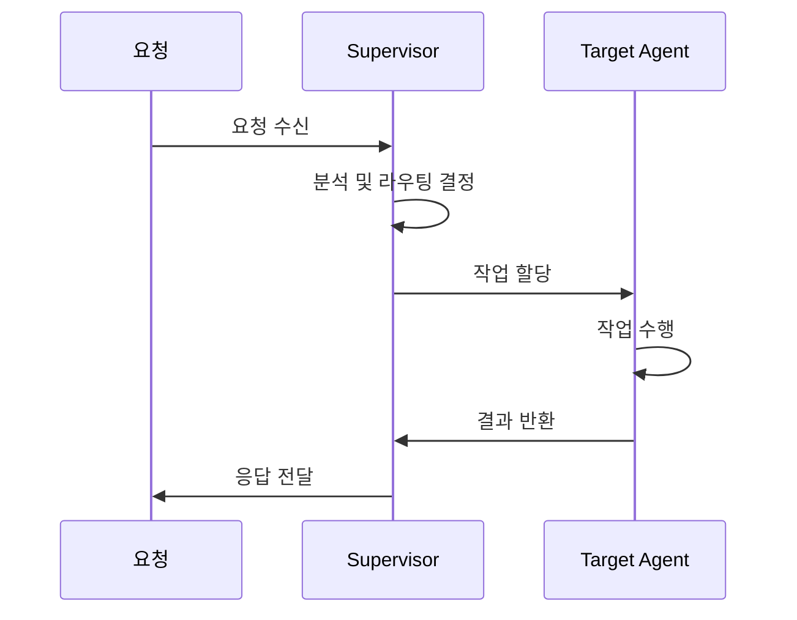
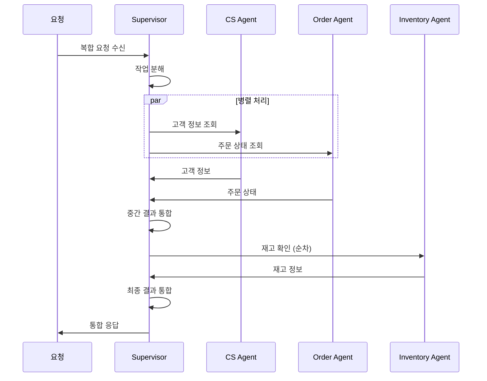
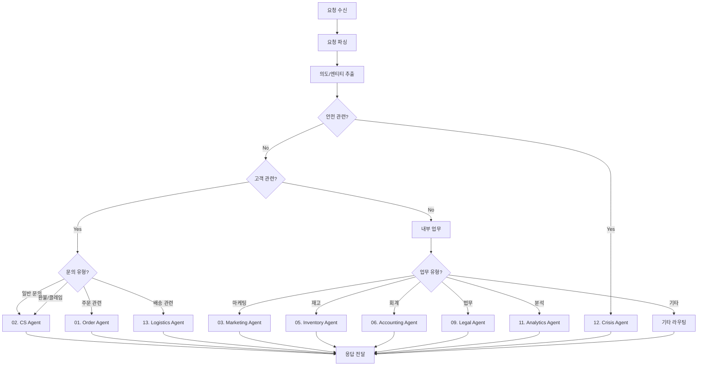
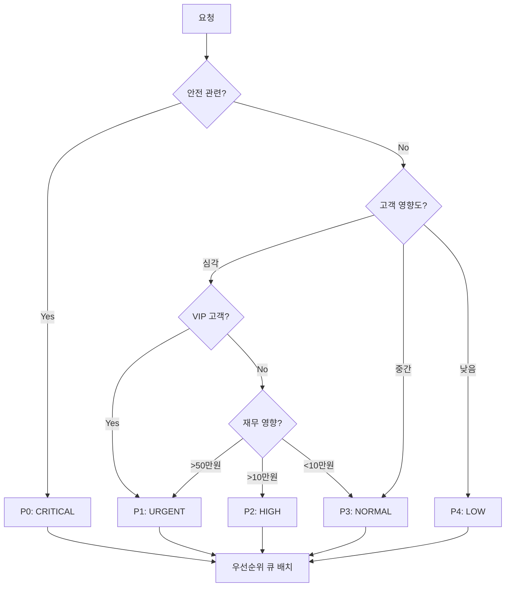
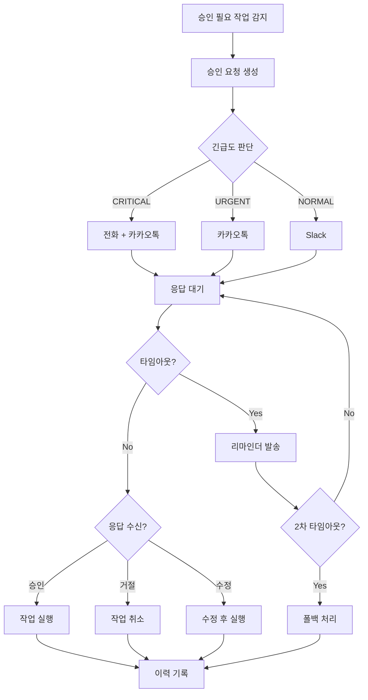

# Supervisor 에이전트

> 썬데이허그 AI 에이전트 시스템의 중앙 오케스트레이터로서, 모든 요청의 라우팅과 에이전트 간 협업을 조율합니다.

---

## 1. 기본 정보

### 1.1 에이전트 식별 정보

| 항목 | 값 |
|------|-----|
| **Agent ID** | `00` |
| **Agent Name** | `Supervisor` |
| **한글명** | 슈퍼바이저 에이전트 |
| **유형** | `main` |
| **상위 에이전트** | `none` (최상위) |
| **버전** | `1.0.0` |
| **최종 수정일** | `2025-01-26` |

### 1.2 에이전트 분류

```yaml
classification:
  domain: "core"
  layer: "core"
  automation_level: "L1-L2"  # 기본 라우팅은 완전 자동
  criticality: "critical"     # 시스템 핵심 에이전트
```

---

## 2. 역할과 책임

### 2.1 핵심 역할

Supervisor는 썬데이허그 AI 에이전트 시스템의 **중앙 오케스트레이터**입니다. 외부에서 들어오는 모든 요청을 분석하여 적절한 에이전트로 라우팅하고, 에이전트 간 협업을 조율하며, 시스템 전체 상태를 모니터링합니다. 1인 기업 대표와 AI 시스템 사이의 핵심 인터페이스 역할을 수행합니다.

### 2.2 주요 책임 (Responsibilities)

| 책임 | 설명 | 자동화 레벨 |
|------|------|------------|
| 요청 라우팅 | 들어오는 요청을 분석하여 적합한 에이전트로 전달 | L1 |
| 오케스트레이션 | 복잡한 작업의 에이전트 간 협업 조율 | L1 |
| 우선순위 관리 | 작업 우선순위 결정 및 큐 관리 | L1 |
| 에스컬레이션 관리 | 에스컬레이션 요청 수집 및 대표에게 전달 | L2 |
| 시스템 모니터링 | 전체 에이전트 상태 및 성능 모니터링 | L1 |
| 대표 커뮤니케이션 | 대표에게 상황 보고 및 승인 요청 | L2 |
| 장애 대응 | 에이전트 장애 감지 및 대체 조치 | L2 |

### 2.3 경계 (Boundaries)

#### 이 에이전트가 하는 것 (In Scope)

- 모든 외부 요청의 1차 수신 및 분류
- 에이전트 간 메시지 중계 및 조율
- 시스템 전체 상태 대시보드 제공
- 에스컬레이션 수집 및 대표 알림
- 우선순위 기반 작업 스케줄링
- 에이전트 장애 시 대체 라우팅

#### 이 에이전트가 하지 않는 것 (Out of Scope)

- 실제 고객 응대 -> CS Agent
- 주문 처리 실행 -> Order Agent
- 마케팅 캠페인 실행 -> Marketing Agent
- 재고 관리 -> Inventory Agent
- 회계 처리 -> Accounting Agent
- 법적 판단 -> Legal Agent

---

## 3. 오케스트레이션 역할

### 3.1 오케스트레이션 범위



### 3.2 멀티 에이전트 협업 조율

#### 단일 에이전트 작업



#### 멀티 에이전트 협업 작업



### 3.3 오케스트레이션 패턴

| 패턴 | 설명 | 사용 사례 |
|------|------|----------|
| **Sequential** | 순차적 에이전트 호출 | 환불 처리 (CS -> Order -> Accounting) |
| **Parallel** | 병렬 에이전트 호출 | 주문 조회 (Order + Inventory + Logistics) |
| **Scatter-Gather** | 여러 에이전트에 요청 후 결과 수집 | 일간 리포트 (모든 에이전트 상태) |
| **Saga** | 트랜잭션성 작업 조율 | 주문 취소 (여러 시스템 롤백 필요) |
| **Event-Driven** | 이벤트 기반 비동기 조율 | 재고 부족 알림 (여러 에이전트에 브로드캐스트) |

---

## 4. 라우팅 로직

### 4.1 라우팅 결정 플로우차트



### 4.2 라우팅 규칙 정의

```yaml
routing_rules:
  # 키워드 기반 라우팅
  keyword_routing:
    order_agent:
      keywords: ["주문", "결제", "구매", "취소", "order", "purchase"]
      priority: 2

    cs_agent:
      keywords: ["문의", "질문", "도움", "help", "support", "문제"]
      priority: 1

    logistics_agent:
      keywords: ["배송", "택배", "운송", "delivery", "shipping"]
      priority: 2

    inventory_agent:
      keywords: ["재고", "입고", "품절", "stock", "inventory"]
      priority: 3

    marketing_agent:
      keywords: ["마케팅", "광고", "프로모션", "campaign", "marketing"]
      priority: 3

    accounting_agent:
      keywords: ["매출", "비용", "정산", "세금", "revenue", "expense"]
      priority: 3

    crisis_agent:
      keywords: ["위험", "사고", "안전", "긴급", "emergency", "recall"]
      priority: 0  # 최우선

  # 엔티티 기반 라우팅
  entity_routing:
    order_id:
      pattern: "^ORD-\\d{8}-\\d{4}$"
      target: "order_agent"

    customer_id:
      pattern: "^CUS-\\d{6}$"
      target: "cs_agent"

    product_id:
      pattern: "^PRD-\\d{5}$"
      target: "product_agent"

  # 소스 기반 라우팅
  source_routing:
    naver_smartstore:
      primary: "order_agent"
      fallback: "cs_agent"

    coupang:
      primary: "order_agent"
      fallback: "cs_agent"

    instagram:
      primary: "marketing_agent"
      fallback: "media_agent"

    email:
      primary: "cs_agent"
      fallback: "supervisor"
```

### 4.3 라우팅 의사결정 로직

```typescript
interface RoutingDecision {
  targetAgent: string;
  confidence: number;      // 0-1
  alternativeAgents: string[];
  requiresMultiAgent: boolean;
  involvedAgents?: string[];
}

function decideRouting(request: Request): RoutingDecision {
  // 1. 안전 이슈 최우선 체크
  if (containsSafetyKeywords(request)) {
    return {
      targetAgent: 'crisis_agent',
      confidence: 1.0,
      alternativeAgents: [],
      requiresMultiAgent: false
    };
  }

  // 2. 명시적 엔티티 확인
  const entity = extractEntity(request);
  if (entity && entityRouting[entity.type]) {
    return {
      targetAgent: entityRouting[entity.type].target,
      confidence: 0.95,
      alternativeAgents: [],
      requiresMultiAgent: false
    };
  }

  // 3. 키워드 매칭
  const keywordMatches = matchKeywords(request);
  if (keywordMatches.length > 0) {
    const sorted = keywordMatches.sort((a, b) => a.priority - b.priority);

    // 멀티 에이전트 필요 여부 판단
    if (sorted.length > 1 && isComplexRequest(request)) {
      return {
        targetAgent: sorted[0].agent,
        confidence: 0.8,
        alternativeAgents: sorted.slice(1).map(m => m.agent),
        requiresMultiAgent: true,
        involvedAgents: sorted.map(m => m.agent)
      };
    }

    return {
      targetAgent: sorted[0].agent,
      confidence: 0.85,
      alternativeAgents: sorted.slice(1).map(m => m.agent),
      requiresMultiAgent: false
    };
  }

  // 4. 소스 기반 라우팅
  if (request.source && sourceRouting[request.source]) {
    return {
      targetAgent: sourceRouting[request.source].primary,
      confidence: 0.7,
      alternativeAgents: [sourceRouting[request.source].fallback],
      requiresMultiAgent: false
    };
  }

  // 5. 기본 라우팅 (CS Agent)
  return {
    targetAgent: 'cs_agent',
    confidence: 0.5,
    alternativeAgents: ['supervisor'],
    requiresMultiAgent: false
  };
}
```

---

## 5. 우선순위 관리

### 5.1 우선순위 레벨 정의

| 레벨 | 명칭 | 설명 | SLA | 예시 |
|------|------|------|-----|------|
| **P0** | CRITICAL | 즉시 처리 필요 | 5분 | 안전 이슈, 시스템 장애 |
| **P1** | URGENT | 긴급 처리 | 30분 | VIP 불만, 법적 문제 |
| **P2** | HIGH | 우선 처리 | 2시간 | 환불 요청, 배송 문제 |
| **P3** | NORMAL | 일반 처리 | 24시간 | 일반 문의, 정보 요청 |
| **P4** | LOW | 낮은 우선순위 | 48시간 | 제안, 피드백 |
| **P5** | BATCH | 배치 처리 | 주간 | 리포트, 분석 |

### 5.2 우선순위 결정 매트릭스



### 5.3 우선순위 큐 관리

```yaml
priority_queue:
  queues:
    critical:
      level: P0
      max_wait_time: 300  # 5분 (초)
      concurrent_processing: 무제한
      escalation_on_breach: true
      escalation_target: "ceo_direct"

    urgent:
      level: P1
      max_wait_time: 1800  # 30분
      concurrent_processing: 10
      escalation_on_breach: true
      escalation_target: "ceo_notification"

    high:
      level: P2
      max_wait_time: 7200  # 2시간
      concurrent_processing: 20
      escalation_on_breach: true
      escalation_target: "supervisor"

    normal:
      level: P3
      max_wait_time: 86400  # 24시간
      concurrent_processing: 50
      escalation_on_breach: false

    low:
      level: P4-P5
      max_wait_time: 172800  # 48시간
      concurrent_processing: 100
      escalation_on_breach: false

  rebalancing:
    enabled: true
    interval: 300  # 5분마다 재조정
    upgrade_on_wait: true  # 대기 시간 초과 시 우선순위 상향
```

### 5.4 동적 우선순위 조정

```typescript
interface PriorityAdjustment {
  requestId: string;
  originalPriority: Priority;
  adjustedPriority: Priority;
  reason: string;
}

function adjustPriority(request: Request): PriorityAdjustment | null {
  const factors = {
    waitTime: calculateWaitTime(request),
    customerValue: getCustomerLifetimeValue(request.customerId),
    repeatComplaint: isRepeatComplaint(request),
    sentimentScore: analyzeSentiment(request.content),
    businessHours: isBusinessHours()
  };

  // 대기 시간 기반 상향
  if (factors.waitTime > getMaxWaitTime(request.priority) * 0.8) {
    return upgradePriority(request, 'wait_time_threshold');
  }

  // VIP 고객 상향
  if (factors.customerValue > 500000) {  // 50만원 이상
    return upgradePriority(request, 'vip_customer');
  }

  // 반복 불만 상향
  if (factors.repeatComplaint) {
    return upgradePriority(request, 'repeat_complaint');
  }

  // 부정적 감정 상향
  if (factors.sentimentScore < -0.7) {
    return upgradePriority(request, 'negative_sentiment');
  }

  return null;
}
```

---

## 6. 대표와의 소통 방식

### 6.1 소통 채널 및 용도

| 채널 | 용도 | 긴급도 | 응답 기대 시간 |
|------|------|--------|--------------|
| **전화** | 긴급 에스컬레이션 | CRITICAL | 즉시 |
| **카카오톡** | 긴급/중요 알림 | URGENT/HIGH | 30분 이내 |
| **Slack** | 일반 보고/승인 요청 | NORMAL | 2시간 이내 |
| **이메일** | 일간/주간 리포트 | LOW | 당일 |
| **대시보드** | 상시 모니터링 | - | - |

### 6.2 대표 알림 트리거

```yaml
ceo_notification_triggers:
  immediate_call:  # 즉시 전화
    - type: "safety_issue"
      description: "아기 안전 관련 제품 이슈"
    - type: "system_down"
      description: "핵심 시스템 장애"
    - type: "legal_emergency"
      description: "소송/법적 통보 수신"

  urgent_message:  # 카카오톡 즉시
    - type: "vip_complaint"
      description: "VIP 고객 심각한 불만"
      condition: "sentiment_score < -0.8"
    - type: "reputation_crisis"
      description: "SNS/언론 부정적 언급 급증"
    - type: "security_breach"
      description: "보안 이상 감지"

  priority_notification:  # Slack 우선 알림
    - type: "refund_approval"
      description: "3만원 이상 환불 승인 요청"
    - type: "campaign_approval"
      description: "마케팅 캠페인 승인 요청"
    - type: "inventory_critical"
      description: "주력 상품 재고 부족"

  daily_digest:  # 일간 이메일 리포트
    - type: "daily_summary"
      description: "일간 운영 요약"
      time: "09:00"
    - type: "pending_approvals"
      description: "미처리 승인 건 리스트"
      time: "18:00"
```

### 6.3 대표 보고 템플릿

#### 긴급 에스컬레이션 템플릿

```markdown
## [긴급] {이슈 유형}

### 상황
- **발생 시각**: {timestamp}
- **관련 대상**: {고객/주문/제품 ID}
- **심각도**: {CRITICAL/URGENT/HIGH}

### 요약
{2-3문장으로 상황 요약}

### 현재 조치
{AI가 이미 취한 조치}

### 필요 결정
{대표가 결정해야 할 사항}

### 옵션
1. {옵션 A}: {장점/단점}
2. {옵션 B}: {장점/단점}
3. {옵션 C}: {장점/단점}

### AI 추천
{추천 옵션} - {추천 이유}

### 의사결정 기한
{deadline}
```

#### 일간 리포트 템플릿

```markdown
# 썬데이허그 일간 운영 리포트
**날짜**: {date}

## 핵심 지표
| 지표 | 오늘 | 전일 | 증감 |
|------|------|------|------|
| 주문 수 | {n} | {n} | {+/-n%} |
| 매출 | {금액} | {금액} | {+/-n%} |
| CS 문의 | {n} | {n} | {+/-n%} |
| 평균 응답 시간 | {시간} | {시간} | {+/-n%} |

## 주요 이슈
1. {이슈 1 요약}
2. {이슈 2 요약}

## 승인 대기 건
| 건 | 유형 | 금액 | 기한 |
|----|------|------|------|
| {건1} | {유형} | {금액} | {기한} |

## 내일 예정
- {예정 1}
- {예정 2}

## AI 제안
- {제안 1}
- {제안 2}
```

### 6.4 승인 워크플로우



---

## 7. 전체 시스템 상태 모니터링

### 7.1 모니터링 대시보드

```
+==============================================================+
|            썬데이허그 AI 시스템 상태 대시보드                    |
+==============================================================+

[시스템 상태] ● 정상 운영 중                    최종 업데이트: {timestamp}

+-------------------+-------------------+-------------------+
| 에이전트 상태      | 작업 큐 상태       | 알림             |
+-------------------+-------------------+-------------------+
| ● 00-Supervisor   | P0: 0건           | ⚠ 승인대기 3건   |
| ● 01-Order        | P1: 2건           |                  |
| ● 02-CS           | P2: 5건           |                  |
| ● 03-Marketing    | P3: 23건          |                  |
| ● 05-Inventory    | P4: 12건          |                  |
| ⚠ 06-Accounting   |                   |                  |
| ● 11-Analytics    |                   |                  |
| ...               |                   |                  |
+-------------------+-------------------+-------------------+

[실시간 메트릭]
├─ 요청 처리율: 142 req/hour
├─ 평균 응답 시간: 2.3초
├─ 에러율: 0.3%
└─ 에스컬레이션: 2건/오늘

[최근 이벤트]
├─ 14:32 주문 ORD-20250126-1234 환불 승인 대기
├─ 14:28 재고 부족 알림 - 아기침대 A형 (잔여 5개)
└─ 14:15 VIP 고객 문의 우선 처리 완료
```

### 7.2 에이전트 상태 모니터링

```yaml
agent_monitoring:
  health_check:
    interval: 30  # 30초마다
    timeout: 5    # 5초 응답 없으면 이상
    metrics:
      - response_time
      - error_rate
      - queue_depth
      - memory_usage

  status_definitions:
    healthy:
      response_time: "< 1000ms"
      error_rate: "< 1%"
      queue_depth: "< 100"

    degraded:
      response_time: "< 5000ms"
      error_rate: "< 5%"
      queue_depth: "< 500"

    unhealthy:
      response_time: ">= 5000ms"
      error_rate: ">= 5%"
      queue_depth: ">= 500"

  alerting:
    degraded:
      notify: ["supervisor_log"]
      action: "monitor_closely"

    unhealthy:
      notify: ["supervisor_log", "ceo_slack"]
      action: "activate_fallback"

    down:
      notify: ["supervisor_log", "ceo_kakao", "ceo_call"]
      action: "emergency_mode"
```

### 7.3 KPI 모니터링

| KPI | 정의 | 목표 | 알림 임계값 |
|-----|------|------|------------|
| 시스템 가용성 | 정상 운영 시간 비율 | 99.5% | < 99% |
| 평균 라우팅 시간 | 요청 수신~에이전트 할당 | < 500ms | > 1000ms |
| 라우팅 정확도 | 올바른 에이전트 할당 비율 | > 95% | < 90% |
| 에스컬레이션 비율 | 전체 요청 대비 에스컬레이션 | < 5% | > 10% |
| 승인 요청 처리 시간 | 요청~승인 완료 | < 2시간 | > 4시간 |
| 큐 대기 시간 | 평균 작업 대기 시간 | SLA 내 | SLA 80% 초과 |

### 7.4 이상 감지

```yaml
anomaly_detection:
  traffic_anomaly:
    description: "비정상적인 트래픽 패턴"
    detection:
      method: "statistical"
      threshold: "mean + 3*std"
      window: "1hour"
    action:
      - "alert_supervisor"
      - "increase_capacity"

  error_spike:
    description: "에러율 급증"
    detection:
      method: "threshold"
      threshold: "5% in 5min"
    action:
      - "alert_ceo"
      - "activate_fallback"
      - "create_incident"

  latency_degradation:
    description: "응답 시간 저하"
    detection:
      method: "percentile"
      threshold: "p95 > 5000ms"
    action:
      - "alert_supervisor"
      - "analyze_bottleneck"

  queue_buildup:
    description: "큐 적체"
    detection:
      method: "threshold"
      threshold: "depth > max_normal * 2"
    action:
      - "alert_supervisor"
      - "scale_processing"
```

---

## 8. 서브 에이전트

### 8.1 서브 에이전트 목록

| Sub ID | 에이전트명 | 역할 | 자동화 레벨 |
|--------|-----------|------|------------|
| 00-01 | Router | 요청 분류 및 라우팅 결정 | L1 |
| 00-02 | Monitor | 시스템 상태 모니터링 및 알림 | L1 |

### 8.2 Router 서브 에이전트

```yaml
sub_agent:
  id: "00-01"
  name: "Router"
  role: "요청 분류 및 적절한 에이전트로 라우팅"

  responsibilities:
    - "요청 내용 분석 및 의도 파악"
    - "키워드/엔티티 기반 라우팅"
    - "멀티 에이전트 협업 판단"
    - "라우팅 결과 로깅"

  decision_factors:
    - "키워드 매칭"
    - "엔티티 추출"
    - "소스 채널"
    - "고객 이력"
    - "시간대"
```

### 8.3 Monitor 서브 에이전트

```yaml
sub_agent:
  id: "00-02"
  name: "Monitor"
  role: "전체 시스템 상태 모니터링 및 알림"

  responsibilities:
    - "에이전트 헬스체크 실행"
    - "KPI 수집 및 계산"
    - "이상 감지 및 알림"
    - "대시보드 데이터 갱신"
    - "리포트 생성"

  monitoring_targets:
    - "모든 메인 에이전트 상태"
    - "작업 큐 상태"
    - "시스템 리소스"
    - "외부 API 상태"
```

---

## 9. 권한 (Permissions)

### 9.1 데이터 접근 권한

| 데이터 유형 | 조회 | 생성 | 수정 | 삭제 |
|------------|:----:|:----:|:----:|:----:|
| 모든 에이전트 상태 | O | - | - | - |
| 작업 큐 | O | O | O | O |
| 시스템 로그 | O | O | - | - |
| 에이전트 설정 | O | - | O (제한적) | - |
| 에스컬레이션 이력 | O | O | O | - |
| 승인 요청/결과 | O | O | O | - |

### 9.2 실행 권한

```yaml
execution_permissions:
  autonomous:
    - "요청 라우팅"
    - "우선순위 결정"
    - "에이전트 헬스체크"
    - "일반 알림 발송"
    - "작업 큐 관리"

  requires_approval:
    - action: "에이전트 비활성화"
      approver: "ceo"
      condition: "장애 대응 시 예외"

    - action: "시스템 설정 변경"
      approver: "ceo"
      condition: "항상"

  prohibited:
    - "에이전트 삭제"
    - "데이터베이스 직접 수정"
    - "보안 설정 변경"
```

---

## 10. 에러 핸들링

### 10.1 에러 유형 및 대응

| 에러 코드 | 에러 유형 | 원인 | 대응 방법 |
|----------|----------|------|----------|
| `SUP-001` | 라우팅 실패 | 적합한 에이전트 찾기 실패 | CS Agent로 폴백 |
| `SUP-002` | 에이전트 타임아웃 | 타겟 에이전트 응답 없음 | 재시도 후 대체 에이전트 |
| `SUP-003` | 큐 오버플로우 | 작업 큐 용량 초과 | 우선순위 재조정, 배치 처리 |
| `SUP-004` | 순환 참조 | 에이전트 간 무한 루프 | 호출 체인 차단, 로깅 |
| `SUP-005` | 인증 실패 | 외부 API 인증 오류 | 토큰 갱신, 대표 알림 |

### 10.2 폴백 전략

```yaml
fallback_strategy:
  agent_unavailable:
    order_agent:
      fallback_1: "supervisor_manual"
      fallback_2: "queue_for_later"
      notify: "ceo_slack"

    cs_agent:
      fallback_1: "auto_reply_template"
      fallback_2: "supervisor_manual"
      notify: "ceo_slack"

    default:
      fallback_1: "supervisor_manual"
      fallback_2: "queue_for_later"
      notify: "ceo_slack"

  system_overload:
    action: "priority_mode"
    process_only: ["P0", "P1", "P2"]
    queue_others: true
    notify: "ceo_urgent"
```

---

## 11. KPI (핵심 성과 지표)

### 11.1 주요 KPI

| KPI | 정의 | 목표 | 측정 주기 |
|-----|------|------|----------|
| 시스템 가용성 | 정상 운영 시간 / 전체 시간 | >= 99.5% | 일간 |
| 라우팅 정확도 | 올바른 라우팅 / 전체 라우팅 | >= 95% | 주간 |
| 평균 라우팅 시간 | 요청 수신~에이전트 할당 | < 500ms | 일간 |
| P0 처리율 | SLA 내 처리된 P0 / 전체 P0 | 100% | 일간 |
| 에스컬레이션 해결율 | 해결된 에스컬레이션 / 전체 | >= 95% | 주간 |
| 대표 응답 대기 시간 | 승인 요청~응답 | < 2시간 | 일간 |

### 11.2 KPI 계산 공식

```yaml
kpi_definitions:
  system_availability:
    name: "시스템 가용성"
    formula: "(total_time - downtime) / total_time * 100"
    data_source: "health_check_logs"
    threshold:
      excellent: ">= 99.9%"
      good: ">= 99.5%"
      acceptable: ">= 99%"
      poor: "< 99%"

  routing_accuracy:
    name: "라우팅 정확도"
    formula: "correct_routings / total_routings * 100"
    data_source: "routing_feedback"
    threshold:
      excellent: ">= 98%"
      good: ">= 95%"
      acceptable: ">= 90%"
      poor: "< 90%"

  avg_routing_time:
    name: "평균 라우팅 시간"
    formula: "sum(routing_time) / count(requests)"
    data_source: "request_logs"
    threshold:
      excellent: "<= 200ms"
      good: "<= 500ms"
      acceptable: "<= 1000ms"
      poor: "> 1000ms"
```

---

## 12. 변경 이력

| 버전 | 날짜 | 작성자 | 변경 내용 |
|------|------|--------|----------|
| 1.0.0 | 2025-01-26 | AI System | 최초 작성 |

---

## 13. 관련 문서

- [에이전트 시스템 개요](../README.md)
- [에이전트 문서 템플릿](../_agent-template.md)
- [미션/비전/핵심가치](../../ontology/mission-vision.md)
- [브랜드 보이스 가이드](../../ontology/brand-voice.md)

---

*Supervisor는 썬데이허그 AI 시스템의 두뇌입니다. 모든 요청은 Supervisor를 통해 적절한 에이전트로 전달되며, 시스템 전체의 조화로운 운영을 책임집니다.*
