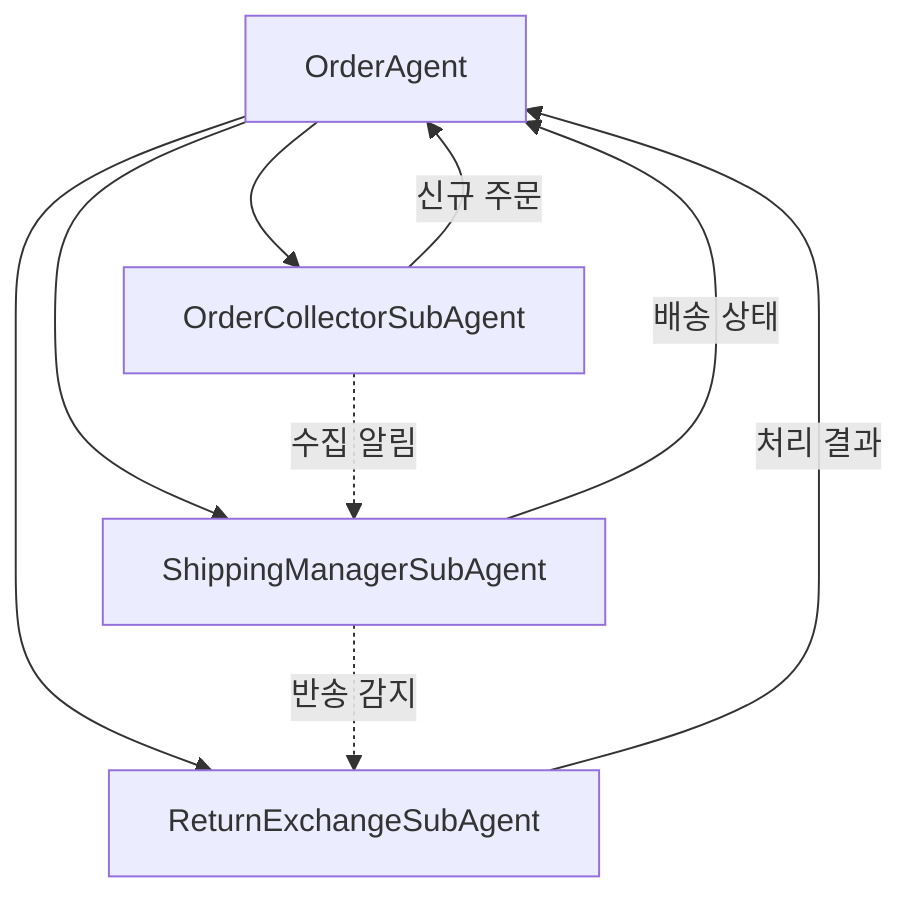
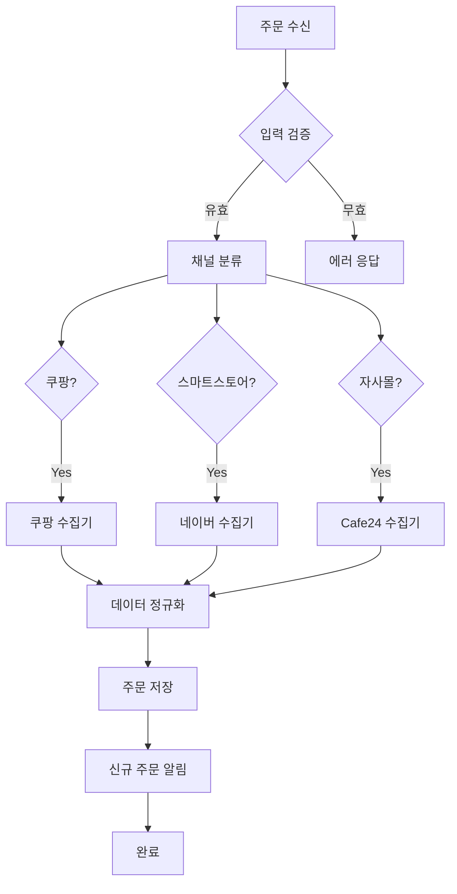
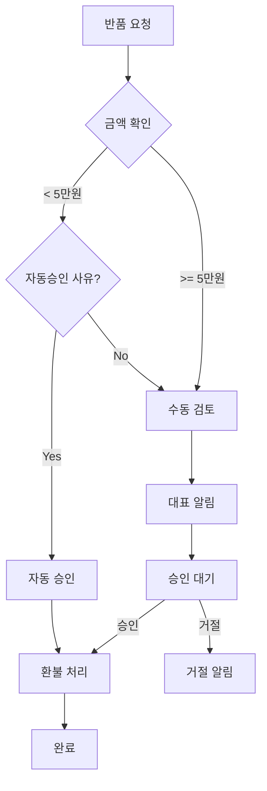

# Order Agent (주문 에이전트)

> 쿠팡/스마트스토어/자사몰 주문 수집, 배송 관리, 반품/교환 처리를 총괄하는 메인 에이전트

---

## 1. 기본 정보

### 1.1 에이전트 식별 정보

| 항목 | 값 |
|------|-----|
| **Agent ID** | `01` |
| **Agent Name** | `OrderAgent` |
| **한글명** | 주문 에이전트 |
| **유형** | `main` |
| **상위 에이전트** | `00-Supervisor` |
| **버전** | `1.0.0` |
| **최종 수정일** | `2025-01-26` |

### 1.2 에이전트 분류

```yaml
classification:
  domain: "operations"
  layer: "core"
  automation_level: "L1-L2"
  criticality: "critical"
```

---

## 2. 역할과 책임

### 2.1 핵심 역할

OrderAgent는 이커머스 비즈니스의 핵심인 **주문 라이프사이클 전체**를 관리합니다. 쿠팡, 네이버 스마트스토어, 자사몰(Cafe24) 등 다중 판매 채널에서 주문을 수집하고, 송장 등록부터 배송 완료까지 추적하며, 반품/교환 요청을 처리합니다.

### 2.2 주요 책임 (Responsibilities)

| 책임 | 설명 | 자동화 레벨 |
|------|------|------------|
| 주문 수집 | 채널별 API를 통해 신규 주문 자동 수집 | L1 |
| 송장 등록 | 배송사 송장번호 등록 및 채널 동기화 | L1 |
| 배송 추적 | 배송 상태 모니터링 및 고객 알림 | L1 |
| 반품/교환 처리 | 반품 접수, 수거 요청, 환불 처리 | L2 |
| 채널 API 관리 | 판매 채널 API 연결 상태 모니터링 | L1 |

### 2.3 경계 (Boundaries)

#### 이 에이전트가 하는 것 (In Scope)

- 다중 채널 주문 데이터 수집 및 통합
- 송장번호 등록 및 배송사 연동
- 배송 상태 추적 및 고객 알림
- 반품/교환 요청 접수 및 처리
- 주문 관련 통계 및 리포트

#### 이 에이전트가 하지 않는 것 (Out of Scope)

- 재고 관리 -> Inventory Agent
- 결제 처리 -> 외부 결제 게이트웨이
- 고객 문의 응대 -> CS Agent
- 물류센터 관리 -> Logistics Agent
- 마케팅/프로모션 -> Marketing Agent

---

## 3. 권한 (Permissions)

### 3.1 데이터 접근 권한

| 데이터 유형 | 조회 | 생성 | 수정 | 삭제 |
|------------|:----:|:----:|:----:|:----:|
| 주문 데이터 | O | O | O | X |
| 배송 정보 | O | O | O | X |
| 반품/교환 요청 | O | O | O | X |
| 고객 정보 | O | X | X | X |
| 상품 정보 | O | X | X | X |

### 3.2 시스템 접근 권한

| 시스템/API | 권한 레벨 | 설명 |
|-----------|----------|------|
| 쿠팡 Open API | `read/write` | 주문 조회, 송장 등록 |
| 네이버 커머스 API | `read/write` | 주문 조회, 송장 등록 |
| Cafe24 API | `read/write` | 주문 조회, 송장 등록 |
| 배송사 API | `read/write` | 송장 등록, 배송 추적 |

### 3.3 실행 권한

```yaml
execution_permissions:
  autonomous:
    - "주문 데이터 수집"
    - "송장번호 등록"
    - "배송 상태 업데이트"
    - "소액 환불 자동 승인 (5만원 미만)"

  requires_approval:
    - action: "고액 환불 처리"
      approver: "supervisor"
      condition: "금액 >= 50,000원"

    - action: "일괄 주문 취소"
      approver: "ceo"
      condition: "10건 이상"

  prohibited:
    - "주문 데이터 삭제"
    - "고객 정보 수정"
```

---

## 4. 서브 에이전트

### 4.1 서브 에이전트 목록

| Sub ID | 에이전트명 | 역할 | 자동화 레벨 |
|--------|-----------|------|------------|
| 01-01 | OrderCollectorSubAgent | 채널별 주문 데이터 수집 | L1 |
| 01-02 | ShippingManagerSubAgent | 송장등록, 배송추적, 배송완료 처리 | L1 |
| 01-03 | ReturnExchangeSubAgent | 반품접수, 수거요청, 환불처리 | L2 |

### 4.2 서브 에이전트 협업 구조



---

## 5. 서브 에이전트 상세

### 5.1 OrderCollectorSubAgent (주문수집)

```yaml
sub_agent:
  id: "01-01"
  name: "OrderCollectorSubAgent"
  role: "채널별 주문 데이터 자동 수집"

  responsibilities:
    - "쿠팡 주문 수집"
    - "스마트스토어 주문 수집"
    - "Cafe24 주문 수집"
    - "주문 데이터 정규화 및 저장"
    - "중복 주문 감지"

  supported_channels:
    - COUPANG
    - NAVER
    - CAFE24
    - ELEVEN_ST
    - GMARKET

  task_types:
    - collect_orders
    - sync_channel

  schedule: "*/5 * * * *"  # 5분마다 실행
```

### 5.2 ShippingManagerSubAgent (배송관리)

```yaml
sub_agent:
  id: "01-02"
  name: "ShippingManagerSubAgent"
  role: "송장 등록 및 배송 상태 추적"

  responsibilities:
    - "송장번호 등록"
    - "채널별 송장 동기화"
    - "배송 상태 추적"
    - "배송 완료 처리"
    - "배송 지연 알림"

  task_types:
    - register_tracking
    - update_shipping_status
    - sync_tracking_to_channel
    - check_delivery_delays

  supported_carriers:
    - CJ대한통운
    - 한진택배
    - 롯데택배
    - 우체국택배
```

### 5.3 ReturnExchangeSubAgent (반품/교환)

```yaml
sub_agent:
  id: "01-03"
  name: "ReturnExchangeSubAgent"
  role: "반품 및 교환 요청 처리"

  responsibilities:
    - "반품 요청 접수"
    - "교환 요청 처리"
    - "수거 요청"
    - "환불 금액 계산"
    - "자동 승인 처리"

  task_types:
    - process_return_request
    - process_exchange_request
    - process_pending_returns
    - calculate_refund

  auto_approve_conditions:
    enabled: true
    max_amount: 50000
    allowed_reasons:
      - "단순 변심"
      - "사이즈 교환"
```

---

## 6. 의사결정 로직

### 6.1 주문 처리 플로우



### 6.2 반품 승인 로직



---

## 7. KPI (핵심 성과 지표)

### 7.1 주요 KPI

| KPI | 정의 | 목표 | 측정 주기 |
|-----|------|------|----------|
| 주문 수집 성공률 | 성공 수집 / 전체 수집 시도 | >= 99% | 일간 |
| 송장 등록 자동화율 | 자동 등록 / 전체 등록 | >= 95% | 일간 |
| 평균 수집 지연 시간 | 주문 생성 ~ 수집 완료 | < 10분 | 일간 |
| 반품 처리 시간 | 요청 ~ 완료 | < 24시간 | 주간 |
| 채널 API 가용성 | 정상 연결 시간 비율 | >= 99.5% | 일간 |

### 7.2 KPI 계산 공식

```yaml
kpi_definitions:
  collection_success_rate:
    name: "주문 수집 성공률"
    formula: "successful_collections / total_collection_attempts * 100"
    threshold:
      excellent: ">= 99.5%"
      good: ">= 99%"
      acceptable: ">= 95%"
      poor: "< 95%"

  tracking_automation_rate:
    name: "송장 등록 자동화율"
    formula: "auto_registered / total_registered * 100"
    threshold:
      excellent: ">= 98%"
      good: ">= 95%"
      acceptable: ">= 90%"
      poor: "< 90%"
```

---

## 8. 에러 핸들링

### 8.1 에러 유형 및 대응

| 에러 코드 | 에러 유형 | 원인 | 대응 방법 |
|----------|----------|------|----------|
| `ORD-001` | ChannelAPIError | 채널 API 연결 실패 | 재시도 후 대표 알림 |
| `ORD-002` | DuplicateOrder | 중복 주문 감지 | 자동 스킵, 로그 기록 |
| `ORD-003` | TrackingRegisterFailed | 송장 등록 실패 | 재시도 후 수동 처리 큐 |
| `ORD-004` | RefundCalculationError | 환불 금액 계산 오류 | 수동 검토 에스컬레이션 |
| `ORD-005` | InvalidOrderData | 주문 데이터 형식 오류 | 데이터 정합성 체크 후 재수집 |

### 8.2 재시도 정책

```yaml
retry_policy:
  default:
    max_attempts: 3
    backoff_type: "exponential"
    initial_delay: 3000
    max_delay: 30000

  channel_api:
    max_attempts: 5
    backoff_type: "exponential"
    initial_delay: 5000
```

---

## 9. 변경 이력

| 버전 | 날짜 | 작성자 | 변경 내용 |
|------|------|--------|----------|
| 1.0.0 | 2025-01-26 | AI System | LANE 1 최초 작성 |

---

## 10. 관련 문서

- [에이전트 시스템 개요](../README.md)
- [Supervisor 에이전트](../00-supervisor/main.md)
- [주문 처리 워크플로우](../../topology/workflows/order-flow.md)
- [반품/교환 워크플로우](../../topology/workflows/order-return-flow.md)
- [Inventory Agent](../05-inventory/main.md)
- [Logistics Agent](../13-logistics/main.md)

---

*Order Agent는 썬데이허그 이커머스 운영의 핵심입니다. 다중 채널 주문을 통합 관리하여 효율적인 주문 처리와 고객 만족을 실현합니다.*
