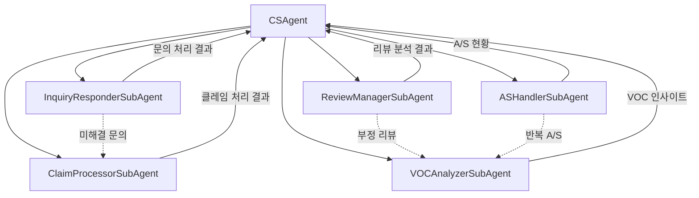
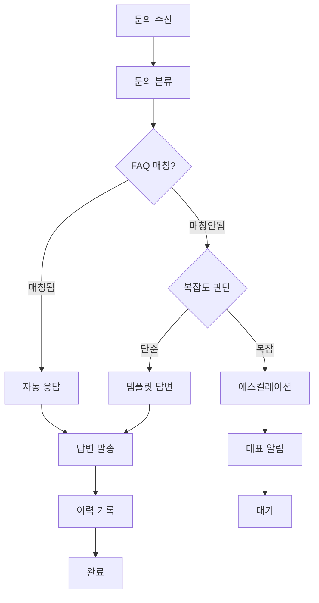
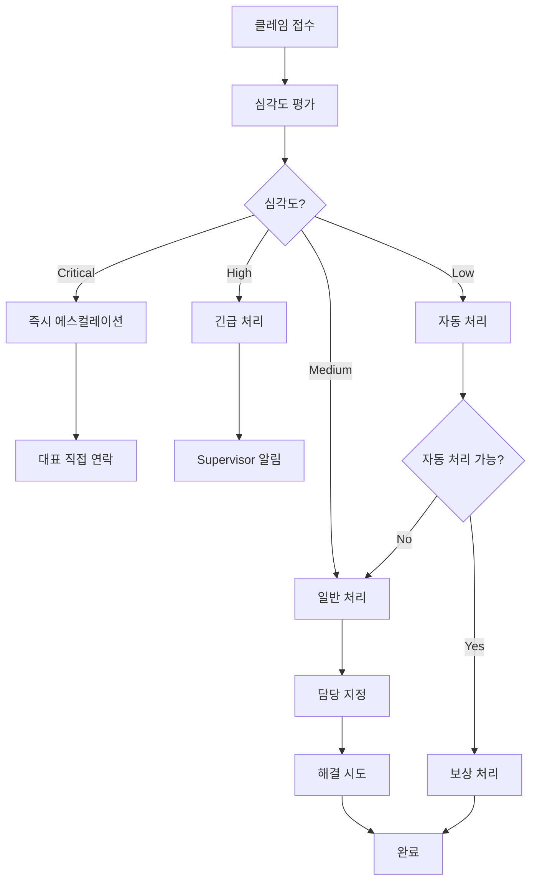
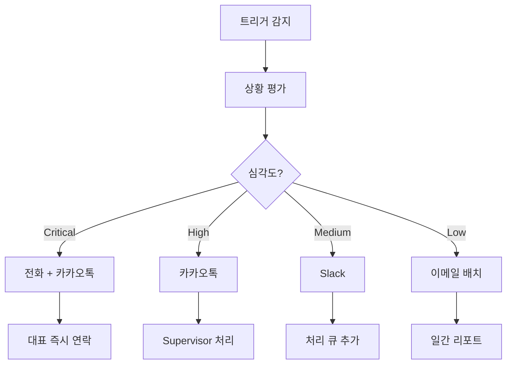

# CS Agent (고객서비스 에이전트)

> 문의 응대, 리뷰 관리, A/S 처리, VOC 분석, 클레임 처리를 총괄하는 고객서비스 메인 에이전트

---

## 1. 기본 정보

### 1.1 에이전트 식별 정보

| 항목 | 값 |
|------|-----|
| **Agent ID** | `02` |
| **Agent Name** | `CSAgent` |
| **한글명** | 고객서비스 에이전트 |
| **유형** | `main` |
| **상위 에이전트** | `00-Supervisor` |
| **버전** | `1.0.0` |
| **최종 수정일** | `2025-01-26` |

### 1.2 에이전트 분류

```yaml
classification:
  domain: "customer_service"
  layer: "core"
  automation_level: "L1-L3"
  criticality: "critical"
```

---

## 2. 역할과 책임

### 2.1 핵심 역할

CSAgent는 썬데이허그의 **고객 경험 전반**을 관리합니다. 고객 문의에 대한 자동 응답, 리뷰 모니터링 및 관리, A/S 처리, VOC(Voice of Customer) 분석, 클레임 처리까지 고객과의 모든 접점을 담당합니다. 1인 기업에서 24시간 고객 응대를 가능하게 하는 핵심 에이전트입니다.

### 2.2 주요 책임 (Responsibilities)

| 책임 | 설명 | 자동화 레벨 |
|------|------|------------|
| 문의 응대 | FAQ 기반 자동 응답 및 템플릿 답변 | L1-L2 |
| 리뷰 관리 | 리뷰 수집, 감성 분석, 답변 생성 | L2 |
| A/S 처리 | A/S 접수, 처리 현황 관리 | L2 |
| VOC 분석 | 고객 피드백 분석 및 인사이트 도출 | L1 |
| 클레임 처리 | 클레임 접수, 분류, 해결 지원 | L2-L3 |

### 2.3 경계 (Boundaries)

#### 이 에이전트가 하는 것 (In Scope)

- 고객 문의 자동 분류 및 응답
- FAQ 매칭 및 답변 제공
- 리뷰 모니터링 및 자동 답변
- A/S 요청 접수 및 추적
- VOC 데이터 수집 및 분석
- 클레임 처리 워크플로우 관리

#### 이 에이전트가 하지 않는 것 (Out of Scope)

- 환불/결제 처리 -> Order Agent
- 배송 관련 처리 -> Logistics Agent
- 법적 대응 -> Legal Agent
- 마케팅 캠페인 -> Marketing Agent
- 재고 관리 -> Inventory Agent

---

## 3. 권한 (Permissions)

### 3.1 데이터 접근 권한

| 데이터 유형 | 조회 | 생성 | 수정 | 삭제 |
|------------|:----:|:----:|:----:|:----:|
| 문의 내역 | O | O | O | X |
| 리뷰 데이터 | O | O | O | X |
| A/S 요청 | O | O | O | X |
| VOC 분석 결과 | O | O | O | X |
| 클레임 이력 | O | O | O | X |
| 고객 정보 | O | X | X | X |
| 주문 정보 | O | X | X | X |

### 3.2 실행 권한

```yaml
execution_permissions:
  autonomous:
    - "FAQ 기반 자동 응답"
    - "리뷰 자동 답변 (긍정 리뷰)"
    - "A/S 접수"
    - "VOC 데이터 수집 및 분석"

  requires_approval:
    - action: "부정 리뷰 답변"
      approver: "supervisor"
      condition: "감성 점수 < -0.5"

    - action: "고액 보상 클레임 처리"
      approver: "ceo"
      condition: "보상 금액 >= 50,000원"

    - action: "VIP 고객 클레임"
      approver: "supervisor"
      condition: "항상"

  prohibited:
    - "고객 정보 수정"
    - "환불 직접 처리"
    - "법적 합의"
```

---

## 4. 서브 에이전트

### 4.1 서브 에이전트 목록

| Sub ID | 에이전트명 | 역할 | 자동화 레벨 |
|--------|-----------|------|------------|
| 02-01 | InquiryResponderSubAgent | FAQ 매칭 및 자동 응답 | L1-L2 |
| 02-02 | ReviewManagerSubAgent | 리뷰 수집, 분석, 답변 | L2 |
| 02-03 | ASHandlerSubAgent | A/S 접수 및 처리 | L2 |
| 02-04 | VOCAnalyzerSubAgent | VOC 데이터 분석 | L1 |
| 02-05 | ClaimProcessorSubAgent | 클레임 처리 | L2-L3 |

### 4.2 서브 에이전트 협업 구조



---

## 5. 서브 에이전트 상세

### 5.1 InquiryResponderSubAgent (문의응대)

```yaml
sub_agent:
  id: "02-01"
  name: "InquiryResponderSubAgent"
  role: "고객 문의 자동 응답"

  responsibilities:
    - "문의 내용 분류"
    - "FAQ 매칭"
    - "자동 응답 생성"
    - "템플릿 기반 답변"
    - "에스컬레이션 판단"

  task_types:
    - respond_to_inquiry
    - classify_inquiry
    - search_faq

  auto_response_categories:
    - 배송 문의
    - 교환/반품 안내
    - 상품 문의
    - 결제 문의

  escalation_triggers:
    - "법적 언급"
    - "언론/SNS 위협"
    - "반복 민원 (3회 이상)"
```

### 5.2 ReviewManagerSubAgent (리뷰관리)

```yaml
sub_agent:
  id: "02-02"
  name: "ReviewManagerSubAgent"
  role: "리뷰 수집 및 관리"

  responsibilities:
    - "채널별 리뷰 수집"
    - "감성 분석"
    - "자동 답변 생성"
    - "리뷰 통계 집계"
    - "악성 리뷰 감지"

  task_types:
    - collect_reviews
    - analyze_sentiment
    - generate_reply
    - get_review_stats

  sentiment_thresholds:
    positive: ">= 0.3"
    neutral: "-0.3 ~ 0.3"
    negative: "< -0.3"

  auto_reply_policy:
    positive: "자동 감사 답변"
    neutral: "템플릿 답변"
    negative: "검토 후 답변"
```

### 5.3 ASHandlerSubAgent (AS처리)

```yaml
sub_agent:
  id: "02-03"
  name: "ASHandlerSubAgent"
  role: "A/S 요청 처리"

  responsibilities:
    - "A/S 요청 접수"
    - "처리 상태 추적"
    - "예상 처리 시간 계산"
    - "완료 알림 발송"
    - "반복 A/S 감지"

  task_types:
    - receive_as_request
    - update_as_status
    - estimate_completion
    - get_as_summary

  as_types:
    - REPAIR: "수리"
    - EXCHANGE: "교환"
    - RETURN: "반품"
    - WARRANTY: "보증"
```

### 5.4 VOCAnalyzerSubAgent (VOC분석)

```yaml
sub_agent:
  id: "02-04"
  name: "VOCAnalyzerSubAgent"
  role: "고객 피드백 분석"

  responsibilities:
    - "VOC 데이터 수집"
    - "키워드 추출"
    - "트렌드 분석"
    - "인사이트 리포트 생성"
    - "개선 제안"

  task_types:
    - collect_voc
    - analyze_voc
    - generate_insights
    - get_voc_summary

  data_sources:
    - "고객 문의"
    - "리뷰"
    - "A/S 요청"
    - "클레임"
    - "SNS 멘션"

  analysis_period:
    daily: "일간 트렌드"
    weekly: "주간 심층 분석"
    monthly: "월간 종합 리포트"
```

### 5.5 ClaimProcessorSubAgent (클레임처리)

```yaml
sub_agent:
  id: "02-05"
  name: "ClaimProcessorSubAgent"
  role: "클레임 접수 및 처리"

  responsibilities:
    - "클레임 접수"
    - "심각도 분류"
    - "처리 방안 제시"
    - "보상 계산"
    - "해결 추적"

  task_types:
    - receive_claim
    - assess_claim
    - process_claim
    - get_claim_status

  severity_levels:
    low: "단순 불만"
    medium: "제품 하자"
    high: "안전 관련"
    critical: "법적 위험"

  auto_process_conditions:
    enabled: true
    max_compensation: 30000
    allowed_types:
      - "배송 지연 보상"
      - "포장 파손 보상"
```

---

## 6. 의사결정 로직

### 6.1 문의 처리 플로우



### 6.2 클레임 처리 플로우



---

## 7. KPI (핵심 성과 지표)

### 7.1 주요 KPI

| KPI | 정의 | 목표 | 측정 주기 |
|-----|------|------|----------|
| 문의 자동 응답률 | 자동 응답 / 전체 문의 | >= 70% | 일간 |
| 평균 응답 시간 | 문의 접수 ~ 첫 응답 | < 30분 | 일간 |
| 문의 해결률 | 해결된 문의 / 전체 문의 | >= 90% | 주간 |
| 리뷰 답변율 | 답변 리뷰 / 전체 리뷰 | >= 95% | 일간 |
| 고객 만족도 | CSAT 점수 | >= 4.0/5.0 | 주간 |
| 클레임 해결 시간 | 접수 ~ 해결 완료 | < 48시간 | 주간 |

### 7.2 KPI 계산 공식

```yaml
kpi_definitions:
  auto_response_rate:
    name: "문의 자동 응답률"
    formula: "auto_responses / total_inquiries * 100"
    threshold:
      excellent: ">= 80%"
      good: ">= 70%"
      acceptable: ">= 60%"
      poor: "< 60%"

  avg_response_time:
    name: "평균 응답 시간"
    formula: "sum(response_time) / count(inquiries)"
    threshold:
      excellent: "<= 15분"
      good: "<= 30분"
      acceptable: "<= 1시간"
      poor: "> 1시간"

  csat_score:
    name: "고객 만족도"
    formula: "sum(satisfaction_ratings) / count(ratings)"
    threshold:
      excellent: ">= 4.5"
      good: ">= 4.0"
      acceptable: ">= 3.5"
      poor: "< 3.5"
```

---

## 8. 에스컬레이션 규칙

### 8.1 에스컬레이션 트리거

| 트리거 | 조건 | 대상 | 긴급도 |
|--------|------|------|--------|
| 법적 위협 | 소송/신고 언급 | CEO | 즉시 |
| VIP 불만 | VIP 고객 부정적 문의 | Supervisor | 높음 |
| 반복 민원 | 동일 건 3회 이상 | Supervisor | 높음 |
| SNS 위협 | 언론/SNS 노출 언급 | CEO | 즉시 |
| 고액 보상 | 5만원 이상 보상 요청 | CEO | 보통 |
| 안전 관련 | 아기 안전 관련 | CEO | 즉시 |

### 8.2 에스컬레이션 흐름



---

## 9. 에러 핸들링

### 9.1 에러 유형 및 대응

| 에러 코드 | 에러 유형 | 원인 | 대응 방법 |
|----------|----------|------|----------|
| `CS-001` | FAQMatchFailed | FAQ 매칭 실패 | 범용 템플릿 사용 |
| `CS-002` | SentimentAnalysisError | 감성 분석 오류 | 중립으로 처리, 재분석 |
| `CS-003` | ReviewCollectionFailed | 리뷰 수집 실패 | 재시도 후 스킵 |
| `CS-004` | ClaimAssessmentError | 클레임 평가 오류 | 수동 검토 에스컬레이션 |
| `CS-005` | NotificationFailed | 알림 발송 실패 | 대체 채널 시도 |

### 9.2 재시도 정책

```yaml
retry_policy:
  default:
    max_attempts: 3
    backoff_type: "exponential"
    initial_delay: 2000
    max_delay: 30000

  external_api:
    max_attempts: 5
    backoff_type: "exponential"
    initial_delay: 5000
```

---

## 10. 변경 이력

| 버전 | 날짜 | 작성자 | 변경 내용 |
|------|------|--------|----------|
| 1.0.0 | 2025-01-26 | AI System | LANE 1 최초 작성 |

---

## 11. 관련 문서

- [에이전트 시스템 개요](../README.md)
- [Supervisor 에이전트](../00-supervisor/main.md)
- [CS 문의 처리 워크플로우](../../topology/workflows/cs-inquiry-flow.md)
- [Order Agent](../01-order/main.md)
- [Legal Agent](../09-legal/main.md)

---

*CS Agent는 썬데이허그의 고객 접점을 지키는 파수꾼입니다. 24시간 고객 응대를 통해 아기와 부모님께 최고의 서비스 경험을 제공합니다.*
