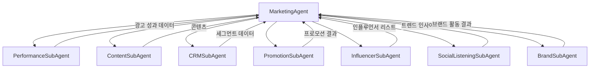

# Marketing Agent (마케팅 에이전트)

> 통합 마케팅 활동을 총괄하는 메인 에이전트

---

## 1. 기본 정보

### 1.1 에이전트 식별 정보

| 항목 | 값 |
|------|-----|
| **Agent ID** | `03-00` |
| **Agent Name** | `MarketingAgent` |
| **한글명** | 마케팅 에이전트 |
| **유형** | `main` |
| **상위 에이전트** | `Supervisor` |
| **버전** | `1.0.0` |
| **최종 수정일** | `2025-01-26` |

### 1.2 에이전트 분류

```yaml
classification:
  domain: "growth"
  layer: "growth"
  automation_level: "L2-L3"
  criticality: "high"
```

---

## 2. 역할과 책임

### 2.1 핵심 역할

마케팅 에이전트는 썬데이허그의 전체 마케팅 활동을 통합 관리하며, 광고 성과 분석, 콘텐츠 제작, CRM, 프로모션, 인플루언서 마케팅, 소셜리스닝, 브랜드 관리를 조율합니다.

### 2.2 주요 책임 (Responsibilities)

| 책임 | 설명 | 자동화 레벨 |
|------|------|------------|
| 퍼포먼스 마케팅 | 광고 캠페인 성과 분석 및 최적화 | L3 |
| 콘텐츠 마케팅 | SNS, 블로그 콘텐츠 기획 및 제작 | L2 |
| CRM | 고객 세그먼트 관리 및 타겟 마케팅 | L3 |
| 프로모션 | 할인/쿠폰/이벤트 기획 및 운영 | L2 |
| 인플루언서 | 인플루언서 발굴 및 협업 관리 | L2 |
| 소셜리스닝 | 브랜드 멘션 모니터링 및 트렌드 분석 | L3 |
| 브랜드 관리 | PR, 콜라보레이션, 브랜드 스토리 | L2 |

### 2.3 경계 (Boundaries)

#### 이 에이전트가 하는 것 (In Scope)

- 광고 플랫폼 데이터 수집 및 분석
- 마케팅 콘텐츠 기획 및 초안 작성
- 고객 세그먼트 분석 및 캠페인 실행
- 프로모션 기획 및 쿠폰 관리
- 인플루언서 발굴 및 협업 조율
- 소셜 미디어 트렌드 분석
- 브랜드 가이드라인 준수 검토

#### 이 에이전트가 하지 않는 것 (Out of Scope)

- 상세페이지 제작 → DetailPage Agent
- 미디어 에셋 촬영/편집 → Media Agent
- 고객 문의 응대 → CustomerService Agent
- 재고 관리 → Inventory Agent

---

## 3. 서브 에이전트

### 3.1 서브 에이전트 목록

| Sub ID | 에이전트명 | 역할 | 파일 |
|--------|-----------|------|------|
| 03-01 | PerformanceSubAgent | 광고 성과 분석, ROAS 최적화, 예산 관리 | `PerformanceSubAgent.ts` |
| 03-02 | ContentSubAgent | 카드뉴스, 블로그, SNS 콘텐츠 제작 | `ContentSubAgent.ts` |
| 03-03 | CRMSubAgent | 고객 세그먼트 관리, 카카오 알림톡 | `CRMSubAgent.ts` |
| 03-04 | PromotionSubAgent | 프로모션 기획, 쿠폰 관리 | `PromotionSubAgent.ts` |
| 03-05 | InfluencerSubAgent | 인플루언서 발굴, 시딩 캠페인 | `InfluencerSubAgent.ts` |
| 03-06 | SocialListeningSubAgent | 멘션 모니터링, 트렌드 분석 | `SocialListeningSubAgent.ts` |
| 03-07 | BrandSubAgent | PR, 콜라보레이션, 브랜드 스토리 | `BrandSubAgent.ts` |

### 3.2 서브 에이전트 협업 구조



---

## 4. 주요 기능

### 4.1 일일 마케팅 리포트 생성

```typescript
// 사용 예시
const report = await marketingAgent.generateDailyReport();
// 반환: 광고 성과, 콘텐츠 퍼포먼스, CRM 지표, 트렌드 요약
```

### 4.2 광고 캠페인 분석

```typescript
const analysis = await marketingAgent.analyzePerformance({
  platform: AdPlatform.NAVER,
  dateRange: { start: '2025-01-01', end: '2025-01-31' }
});
```

### 4.3 콘텐츠 생성

```typescript
const content = await marketingAgent.createContent({
  contentType: ContentType.CARD_NEWS,
  productId: 'product-123',
  theme: '신생아 수면 케어'
});
```

### 4.4 CRM 캠페인 실행

```typescript
const result = await marketingAgent.executeCRMCampaign({
  campaignType: 'reactivation',
  segment: 'dormant_30days'
});
```

---

## 5. 데이터 모델

### 5.1 주요 타입

```typescript
// 광고 플랫폼
enum AdPlatform {
  NAVER = 'naver',
  GOOGLE = 'google',
  META = 'meta',
  KAKAO = 'kakao',
  COUPANG = 'coupang',
}

// 캠페인 상태
enum CampaignStatus {
  DRAFT = 'draft',
  ACTIVE = 'active',
  PAUSED = 'paused',
  COMPLETED = 'completed',
}

// 콘텐츠 유형
enum ContentType {
  CARD_NEWS = 'card_news',
  BLOG = 'blog',
  SNS_POST = 'sns_post',
  VIDEO_SHORT = 'video_short',
}

// 인플루언서 등급
enum InfluencerTier {
  MEGA = 'mega',      // 100만+
  MACRO = 'macro',    // 10만-100만
  MICRO = 'micro',    // 1만-10만
  NANO = 'nano',      // 1천-1만
}
```

### 5.2 주요 인터페이스

```typescript
interface AdCampaign {
  id: string;
  name: string;
  platform: AdPlatform;
  status: CampaignStatus;
  budget: { daily: number; total: number };
  targetROAS: number;
  startDate: Date;
  endDate?: Date;
}

interface MarketingContent {
  id: string;
  type: ContentType;
  title: string;
  body: string;
  images: string[];
  hashtags: string[];
  targetAudience: string;
  platform: string;
  status: ContentStatus;
}
```

---

## 6. KPI

| KPI | 정의 | 목표 | 측정 주기 |
|-----|------|------|----------|
| ROAS | 광고 수익 / 광고 비용 | >= 400% | 일간 |
| 콘텐츠 참여율 | 좋아요+댓글+공유 / 도달 수 | >= 5% | 주간 |
| 이메일 오픈율 | 오픈 수 / 발송 수 | >= 25% | 캠페인별 |
| 인플루언서 협업 만족도 | 평균 평점 | >= 4.0/5.0 | 월간 |
| 브랜드 멘션 감성 점수 | 긍정 멘션 비율 | >= 80% | 주간 |

---

## 7. 권한

### 7.1 데이터 접근 권한

| 데이터 유형 | 조회 | 생성 | 수정 | 삭제 |
|------------|:----:|:----:|:----:|:----:|
| 광고 캠페인 | ✓ | ✓ | ✓ | ✗ |
| 마케팅 콘텐츠 | ✓ | ✓ | ✓ | ✗ |
| 고객 세그먼트 | ✓ | ✓ | ✓ | ✗ |
| 프로모션 | ✓ | ✓ | ✓ | ✗ |
| 인플루언서 DB | ✓ | ✓ | ✓ | ✗ |
| 소셜 멘션 | ✓ | ✓ | ✗ | ✗ |

### 7.2 실행 권한

```yaml
execution_permissions:
  autonomous:
    - 일일 성과 리포트 생성
    - 콘텐츠 초안 작성
    - 트렌드 분석
    - 세그먼트 분석

  requires_approval:
    - action: "예산 조정 (10% 이상)"
      approver: "supervisor"
    - action: "프로모션 생성 (20% 이상 할인)"
      approver: "supervisor"
    - action: "인플루언서 협업 비용 (100만원 이상)"
      approver: "ceo"

  prohibited:
    - 광고 캠페인 삭제
    - 고객 개인정보 외부 공유
```

---

## 8. 연관 에이전트

| 관계 유형 | 에이전트 | 설명 |
|----------|---------|------|
| 상위 | Supervisor | 승인 요청 및 에스컬레이션 |
| 협업 | DetailPage Agent | 상세페이지 콘텐츠 연계 |
| 협업 | Media Agent | 마케팅용 이미지/영상 요청 |
| 참조 | Inventory Agent | 재고 기반 프로모션 기획 |

---

## 9. 파일 구조

```
src/agents/marketing/
├── MarketingAgent.ts          # 메인 에이전트
├── types.ts                   # 타입 정의
├── index.ts                   # 모듈 내보내기
└── sub-agents/
    ├── PerformanceSubAgent.ts
    ├── ContentSubAgent.ts
    ├── CRMSubAgent.ts
    ├── PromotionSubAgent.ts
    ├── InfluencerSubAgent.ts
    ├── SocialListeningSubAgent.ts
    └── BrandSubAgent.ts
```

---

## 10. 변경 이력

| 버전 | 날짜 | 작성자 | 변경 내용 |
|------|------|--------|----------|
| 1.0.0 | 2025-01-26 | AI Agent | LANE 2 최초 구현 |

---

*이 문서는 Marketing Agent의 상세 스펙을 정의합니다.*
