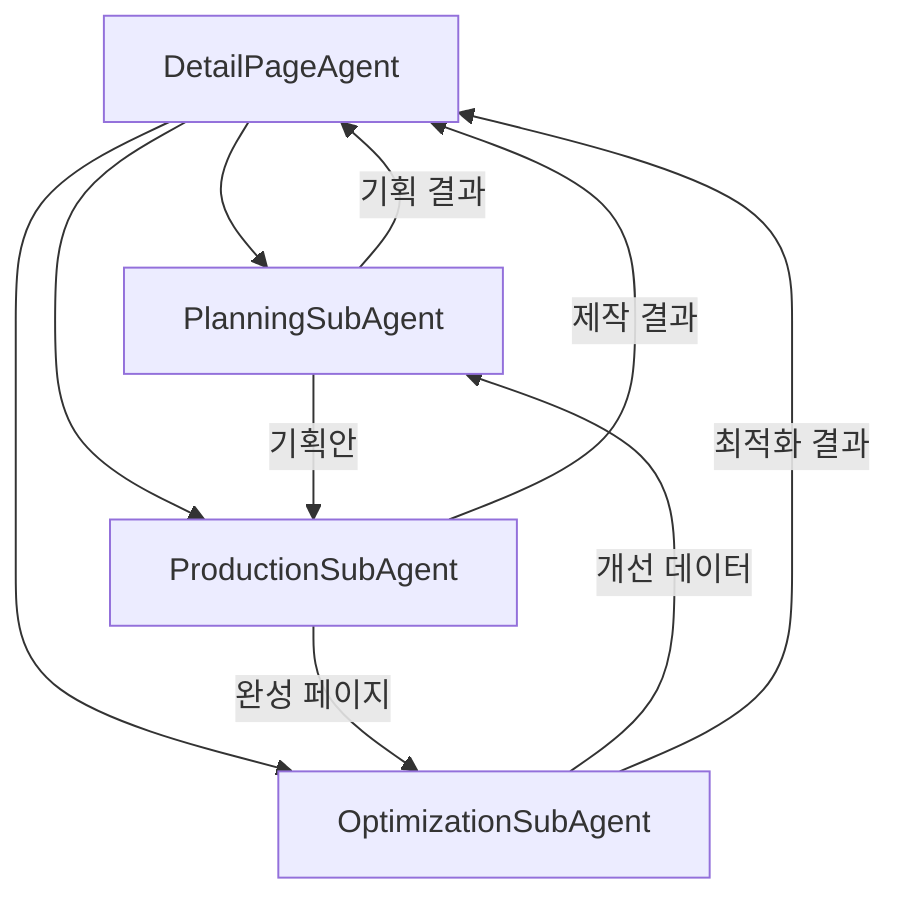
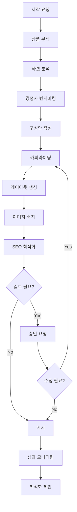
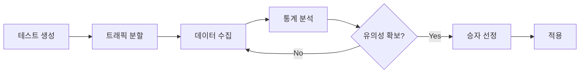

# DetailPage Agent (상세페이지 에이전트)

> 상품 상세페이지의 기획, 제작, 최적화를 담당하는 메인 에이전트

---

## 1. 기본 정보

### 1.1 에이전트 식별 정보

| 항목 | 값 |
|------|-----|
| **Agent ID** | `04-00` |
| **Agent Name** | `DetailPageAgent` |
| **한글명** | 상세페이지 에이전트 |
| **유형** | `main` |
| **상위 에이전트** | `Supervisor` |
| **버전** | `1.0.0` |
| **최종 수정일** | `2025-01-26` |

### 1.2 에이전트 분류

```yaml
classification:
  domain: "operations"
  layer: "operations"
  automation_level: "L2-L3"
  criticality: "high"
```

---

## 2. 역할과 책임

### 2.1 핵심 역할

상세페이지 에이전트는 썬데이허그 상품의 상세페이지 전체 라이프사이클을 관리합니다. 상품 분석부터 페이지 기획, 카피라이팅, 레이아웃 생성, A/B 테스트, 전환율 최적화까지 담당합니다.

### 2.2 주요 책임 (Responsibilities)

| 책임 | 설명 | 자동화 레벨 |
|------|------|------------|
| 상세페이지 기획 | 상품 분석, USP 도출, 구성안 작성 | L2 |
| 카피라이팅 | 섹션별 설득력 있는 카피 작성 | L2 |
| 레이아웃 생성 | 채널별 최적화된 레이아웃 설계 | L3 |
| SEO 최적화 | 메타태그, 키워드 최적화 | L3 |
| A/B 테스트 | 변형 페이지 생성 및 테스트 | L3 |
| 전환율 분석 | 성과 분석 및 개선 제안 | L3 |

### 2.3 경계 (Boundaries)

#### 이 에이전트가 하는 것 (In Scope)

- 상품 정보 분석 및 USP 도출
- 타겟 고객 분석
- 경쟁사 상세페이지 벤치마킹
- 섹션별 카피 및 구성 기획
- 채널별 레이아웃 최적화
- A/B 테스트 설계 및 분석
- 전환율 개선 제안

#### 이 에이전트가 하지 않는 것 (Out of Scope)

- 실제 이미지 촬영/편집 → Media Agent
- 광고 캠페인 운영 → Marketing Agent
- 가격 책정 → Pricing Agent
- 재고 관리 → Inventory Agent

---

## 3. 서브 에이전트

### 3.1 서브 에이전트 목록

| Sub ID | 에이전트명 | 역할 | 파일 |
|--------|-----------|------|------|
| 04-01 | PlanningSubAgent | 상품 분석, 타겟 분석, 구성안 기획 | `PlanningSubAgent.ts` |
| 04-02 | ProductionSubAgent | 카피 작성, 레이아웃, SEO | `ProductionSubAgent.ts` |
| 04-03 | OptimizationSubAgent | A/B 테스트, 전환율 분석, 개선 제안 | `OptimizationSubAgent.ts` |

### 3.2 서브 에이전트 협업 구조



---

## 4. 주요 기능

### 4.1 상세페이지 생성

```typescript
// 전체 워크플로우 실행
const page = await detailPageAgent.createDetailPage({
  productId: 'product-123',
  productName: '아기 슬리핑백',
  channels: [SalesChannel.NAVER, SalesChannel.COUPANG],
  includeABTest: true,
});
```

### 4.2 상세페이지 기획

```typescript
const plan = await detailPageAgent.planDetailPage({
  productId: 'product-123',
  productName: '아기 슬리핑백',
  includeCompetitorAnalysis: true,
});
// 반환: 상품 분석, 타겟 분석, 권장 구성, 핵심 메시지
```

### 4.3 A/B 테스트 실행

```typescript
const test = await detailPageAgent.runABTest({
  pageId: 'page-123',
  testElement: 'headline',
  variantBContent: { headline: '새로운 헤드라인' },
});
```

### 4.4 전환율 분석

```typescript
const metrics = await detailPageAgent.analyzePerformance('page-123');
// 반환: 페이지뷰, 이탈률, 장바구니 담기율, 전환율
```

---

## 5. 데이터 모델

### 5.1 주요 타입

```typescript
// 페이지 상태
enum DetailPageStatus {
  DRAFT = 'draft',
  REVIEW = 'review',
  APPROVED = 'approved',
  PUBLISHED = 'published',
  ARCHIVED = 'archived',
}

// 섹션 유형
enum SectionType {
  HERO = 'hero',
  PRODUCT_INFO = 'product_info',
  FEATURES = 'features',
  USAGE = 'usage',
  SPECIFICATIONS = 'specifications',
  REVIEWS = 'reviews',
  FAQ = 'faq',
  WARRANTY = 'warranty',
  SHIPPING = 'shipping',
  CTA = 'cta',
}

// A/B 테스트 목표 지표
type GoalMetric =
  | 'conversion_rate'
  | 'add_to_cart'
  | 'bounce_rate'
  | 'time_on_page';
```

### 5.2 주요 인터페이스

```typescript
interface DetailPage {
  id: string;
  productId: string;
  productName: string;
  status: DetailPageStatus;
  type: DetailPageType;
  version: number;
  sections: PageSection[];
  channels: SalesChannel[];
  seo?: SEOInfo;
  metrics?: DetailPageMetrics;
  abTestGroup?: 'A' | 'B';
  publishedAt?: Date;
  createdAt: Date;
  updatedAt: Date;
}

interface PageSection {
  id: string;
  type: SectionType;
  title?: string;
  content: SectionContent;
  order: number;
  visible: boolean;
}

interface DetailPageMetrics {
  pageViews: number;
  uniqueVisitors: number;
  avgTimeOnPage: number;
  avgScrollDepth: number;
  bounceRate: number;
  addToCartCount: number;
  addToCartRate: number;
  purchaseCount: number;
  conversionRate: number;
  period: { start: Date; end: Date };
}
```

---

## 6. 워크플로우

### 6.1 상세페이지 제작 플로우



### 6.2 A/B 테스트 플로우



---

## 7. KPI

| KPI | 정의 | 목표 | 측정 주기 |
|-----|------|------|----------|
| 전환율 | 구매 / 페이지뷰 | >= 3% | 일간 |
| 장바구니 담기율 | 장바구니 / 페이지뷰 | >= 8% | 일간 |
| 이탈률 | 즉시 이탈 / 방문 | <= 40% | 일간 |
| 평균 체류시간 | 페이지 체류 시간 | >= 90초 | 일간 |
| 스크롤 깊이 | 평균 스크롤 비율 | >= 70% | 주간 |
| A/B 테스트 성공률 | 유의미한 개선 비율 | >= 30% | 월간 |

---

## 8. 권한

### 8.1 데이터 접근 권한

| 데이터 유형 | 조회 | 생성 | 수정 | 삭제 |
|------------|:----:|:----:|:----:|:----:|
| 상세페이지 | ✓ | ✓ | ✓ | ✗ |
| 기획안 | ✓ | ✓ | ✓ | ✗ |
| A/B 테스트 | ✓ | ✓ | ✓ | ✗ |
| 레이아웃 템플릿 | ✓ | ✓ | ✗ | ✗ |
| 개선 제안 | ✓ | ✓ | ✓ | ✓ |

### 8.2 실행 권한

```yaml
execution_permissions:
  autonomous:
    - 상세페이지 기획 및 초안 생성
    - A/B 테스트 생성 및 분석
    - 개선 제안 생성
    - SEO 최적화

  requires_approval:
    - action: "상세페이지 게시"
      approver: "supervisor"
    - action: "A/B 테스트 승자 적용"
      approver: "supervisor"

  prohibited:
    - 게시된 페이지 삭제
    - 다른 상품 페이지 수정
```

---

## 9. 연관 에이전트

| 관계 유형 | 에이전트 | 설명 |
|----------|---------|------|
| 상위 | Supervisor | 게시 승인 요청 |
| 협업 | Media Agent | 이미지/영상 에셋 요청 |
| 협업 | Marketing Agent | 마케팅 콘텐츠 연계 |
| 참조 | Inventory Agent | 재고 정보 확인 |

---

## 10. 파일 구조

```
src/agents/detail-page/
├── DetailPageAgent.ts         # 메인 에이전트
├── types.ts                   # 타입 정의
├── index.ts                   # 모듈 내보내기
└── sub-agents/
    ├── PlanningSubAgent.ts
    ├── ProductionSubAgent.ts
    └── OptimizationSubAgent.ts
```

---

## 11. 변경 이력

| 버전 | 날짜 | 작성자 | 변경 내용 |
|------|------|--------|----------|
| 1.0.0 | 2025-01-26 | AI Agent | LANE 2 최초 구현 |

---

*이 문서는 DetailPage Agent의 상세 스펙을 정의합니다.*
