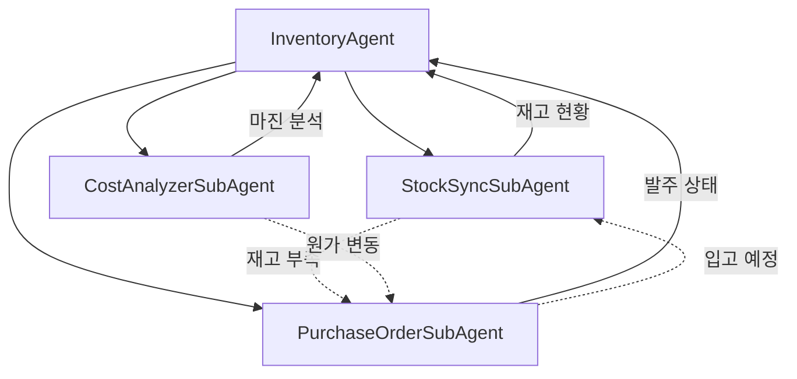
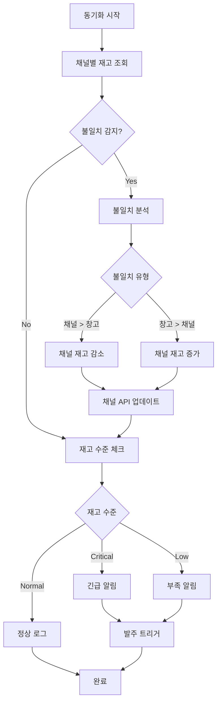
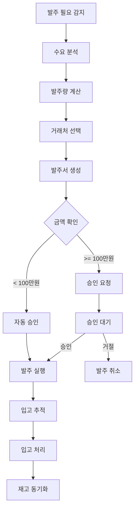

# Inventory Agent (재고 에이전트)

> 다중 채널 재고 동기화, 발주 관리, 원가 분석을 총괄하는 재고 관리 메인 에이전트

---

## 1. 기본 정보

### 1.1 에이전트 식별 정보

| 항목 | 값 |
|------|-----|
| **Agent ID** | `05` |
| **Agent Name** | `InventoryAgent` |
| **한글명** | 재고 에이전트 |
| **유형** | `main` |
| **상위 에이전트** | `00-Supervisor` |
| **버전** | `1.0.0` |
| **최종 수정일** | `2025-01-26` |

### 1.2 에이전트 분류

```yaml
classification:
  domain: "operations"
  layer: "core"
  automation_level: "L1-L2"
  criticality: "high"
```

---

## 2. 역할과 책임

### 2.1 핵심 역할

InventoryAgent는 썬데이허그의 **재고 자산 전체**를 관리합니다. 쿠팡, 네이버, 자사몰 등 다중 채널의 재고를 동기화하고, 적정 재고 유지를 위한 발주 관리, 원가 분석 및 마진 최적화까지 재고 관련 모든 업무를 자동화합니다.

### 2.2 주요 책임 (Responsibilities)

| 책임 | 설명 | 자동화 레벨 |
|------|------|------------|
| 재고 동기화 | 다중 채널 간 재고 수량 실시간 동기화 | L1 |
| 재고 모니터링 | 재고 수준 모니터링 및 부족 알림 | L1 |
| 발주 관리 | 발주 필요 상품 식별 및 발주서 생성 | L2 |
| 원가 분석 | 상품별 원가, 마진율 분석 | L1 |
| 가격 제안 | 마진 목표 기반 판매가 제안 | L2 |

### 2.3 경계 (Boundaries)

#### 이 에이전트가 하는 것 (In Scope)

- 다중 채널 재고 동기화
- 재고 부족/과잉 알림
- 발주 필요 상품 분석
- 발주서 생성 및 관리
- 원가/마진 분석
- 적정 판매가 제안

#### 이 에이전트가 하지 않는 것 (Out of Scope)

- 실제 결제 처리 -> 외부 시스템
- 배송 처리 -> Logistics Agent
- 판매 채널 관리 -> Order Agent
- 마케팅 가격 전략 -> Marketing Agent
- 회계 정산 -> Accounting Agent

---

## 3. 권한 (Permissions)

### 3.1 데이터 접근 권한

| 데이터 유형 | 조회 | 생성 | 수정 | 삭제 |
|------------|:----:|:----:|:----:|:----:|
| 재고 정보 | O | O | O | X |
| 발주 정보 | O | O | O | X |
| 원가 정보 | O | O | O | X |
| 상품 정보 | O | X | X | X |
| 거래처 정보 | O | O | O | X |

### 3.2 실행 권한

```yaml
execution_permissions:
  autonomous:
    - "재고 동기화"
    - "재고 부족 알림"
    - "발주 제안 생성"
    - "원가/마진 분석"

  requires_approval:
    - action: "발주서 확정"
      approver: "supervisor"
      condition: "금액 >= 100만원"

    - action: "대량 재고 조정"
      approver: "ceo"
      condition: "10개 이상 SKU"

  prohibited:
    - "재고 데이터 삭제"
    - "원가 정보 외부 노출"
```

---

## 4. 서브 에이전트

### 4.1 서브 에이전트 목록

| Sub ID | 에이전트명 | 역할 | 자동화 레벨 |
|--------|-----------|------|------------|
| 05-01 | StockSyncSubAgent | 다중 채널 재고 동기화 | L1 |
| 05-02 | PurchaseOrderSubAgent | 발주 관리 | L2 |
| 05-03 | CostAnalyzerSubAgent | 원가 및 마진 분석 | L1 |

### 4.2 서브 에이전트 협업 구조



---

## 5. 서브 에이전트 상세

### 5.1 StockSyncSubAgent (재고동기화)

```yaml
sub_agent:
  id: "05-01"
  name: "StockSyncSubAgent"
  role: "다중 채널 재고 동기화"

  responsibilities:
    - "채널별 재고 조회"
    - "재고 수량 동기화"
    - "재고 수준 모니터링"
    - "부족 재고 알림"
    - "재고 불일치 감지"

  task_types:
    - sync_all_channels
    - sync_specific_product
    - check_stock_levels
    - get_low_stock_items

  sync_channels:
    - COUPANG
    - NAVER
    - CAFE24
    - WAREHOUSE

  thresholds:
    low_stock: 10
    critical_stock: 5
    overstock: 100

  schedule: "*/10 * * * *"  # 10분마다 동기화
```

### 5.2 PurchaseOrderSubAgent (발주관리)

```yaml
sub_agent:
  id: "05-02"
  name: "PurchaseOrderSubAgent"
  role: "발주 관리 및 자동 발주"

  responsibilities:
    - "발주 필요 상품 분석"
    - "발주서 생성"
    - "발주 상태 추적"
    - "입고 예정 관리"
    - "리드타임 분석"

  task_types:
    - suggest_purchase_orders
    - create_purchase_order
    - get_pending_orders
    - update_order_status

  order_status:
    - DRAFT: "초안"
    - PENDING: "승인 대기"
    - APPROVED: "승인됨"
    - ORDERED: "발주됨"
    - SHIPPED: "배송중"
    - RECEIVED: "입고완료"
    - CANCELLED: "취소됨"

  auto_order_threshold:
    enabled: true
    min_days_of_stock: 14
    lead_time_buffer: 1.5
```

### 5.3 CostAnalyzerSubAgent (원가분석)

```yaml
sub_agent:
  id: "05-03"
  name: "CostAnalyzerSubAgent"
  role: "원가 및 마진 분석"

  responsibilities:
    - "상품별 원가 관리"
    - "마진율 분석"
    - "가격 제안"
    - "원가 트렌드 분석"
    - "저마진 상품 알림"

  task_types:
    - analyze_margins
    - suggest_price
    - get_low_margin_products
    - analyze_cost_trends

  margin_thresholds:
    target: 30
    warning: 20
    critical: 10

  cost_components:
    - 상품 원가
    - 배송비
    - 포장비
    - 플랫폼 수수료
    - 결제 수수료
```

---

## 6. 의사결정 로직

### 6.1 재고 동기화 플로우



### 6.2 발주 의사결정 플로우



---

## 7. KPI (핵심 성과 지표)

### 7.1 주요 KPI

| KPI | 정의 | 목표 | 측정 주기 |
|-----|------|------|----------|
| 재고 동기화 정확도 | 일치 SKU / 전체 SKU | >= 99% | 일간 |
| 품절률 | 품절 SKU / 전체 SKU | < 2% | 일간 |
| 재고 회전율 | 판매량 / 평균 재고 | >= 6회/년 | 월간 |
| 평균 마진율 | 총 마진 / 총 매출 | >= 30% | 주간 |
| 발주 리드타임 | 발주 ~ 입고 | < 7일 | 월간 |
| 과재고율 | 과재고 SKU / 전체 SKU | < 5% | 주간 |

### 7.2 KPI 계산 공식

```yaml
kpi_definitions:
  sync_accuracy:
    name: "재고 동기화 정확도"
    formula: "matched_skus / total_skus * 100"
    threshold:
      excellent: ">= 99.5%"
      good: ">= 99%"
      acceptable: ">= 97%"
      poor: "< 97%"

  stockout_rate:
    name: "품절률"
    formula: "stockout_skus / total_skus * 100"
    threshold:
      excellent: "<= 1%"
      good: "<= 2%"
      acceptable: "<= 5%"
      poor: "> 5%"

  inventory_turnover:
    name: "재고 회전율"
    formula: "total_sales_qty / avg_inventory_qty"
    threshold:
      excellent: ">= 8"
      good: ">= 6"
      acceptable: ">= 4"
      poor: "< 4"

  avg_margin_rate:
    name: "평균 마진율"
    formula: "(revenue - cost) / revenue * 100"
    threshold:
      excellent: ">= 35%"
      good: ">= 30%"
      acceptable: ">= 25%"
      poor: "< 25%"
```

---

## 8. 에스컬레이션 규칙

### 8.1 에스컬레이션 트리거

| 트리거 | 조건 | 대상 | 긴급도 |
|--------|------|------|--------|
| 주력 상품 품절 | 베스트셀러 재고 0 | CEO | 즉시 |
| 대량 불일치 | 10개 이상 SKU 불일치 | Supervisor | 높음 |
| 저마진 경고 | 마진율 10% 미만 상품 증가 | Supervisor | 보통 |
| 발주 지연 | 예상 입고일 초과 | Supervisor | 높음 |
| 과재고 알림 | 90일 이상 미판매 재고 | Supervisor | 보통 |

---

## 9. 에러 핸들링

### 9.1 에러 유형 및 대응

| 에러 코드 | 에러 유형 | 원인 | 대응 방법 |
|----------|----------|------|----------|
| `INV-001` | SyncFailure | 채널 API 동기화 실패 | 재시도 후 수동 동기화 |
| `INV-002` | StockMismatch | 재고 불일치 감지 | 조사 후 조정 |
| `INV-003` | POCreateFailed | 발주서 생성 실패 | 재시도 후 수동 생성 |
| `INV-004` | CostDataError | 원가 데이터 오류 | 데이터 검증 후 재계산 |
| `INV-005` | ChannelAPIError | 채널 API 오류 | 재시도 후 알림 |

### 9.2 재시도 정책

```yaml
retry_policy:
  default:
    max_attempts: 3
    backoff_type: "exponential"
    initial_delay: 5000
    max_delay: 60000

  channel_sync:
    max_attempts: 5
    backoff_type: "exponential"
    initial_delay: 10000
```

---

## 10. 변경 이력

| 버전 | 날짜 | 작성자 | 변경 내용 |
|------|------|--------|----------|
| 1.0.0 | 2025-01-26 | AI System | LANE 1 최초 작성 |

---

## 11. 관련 문서

- [에이전트 시스템 개요](../README.md)
- [Supervisor 에이전트](../00-supervisor/main.md)
- [재고 관리 워크플로우](../../topology/workflows/inventory-sync-flow.md)
- [Order Agent](../01-order/main.md)
- [Logistics Agent](../13-logistics/main.md)
- [Accounting Agent](../06-accounting/main.md)

---

*Inventory Agent는 썬데이허그의 재고 자산을 지키는 수호자입니다. 품절 없는 운영과 최적의 재고 수준을 유지하여 고객 만족과 비즈니스 효율성을 동시에 실현합니다.*
