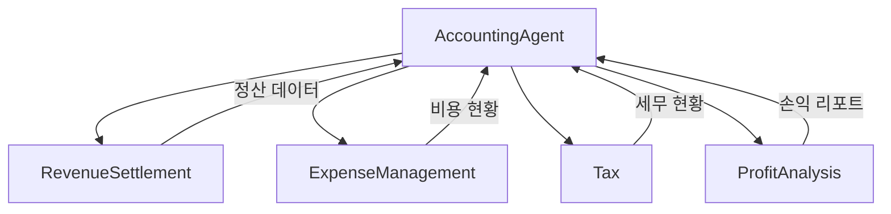
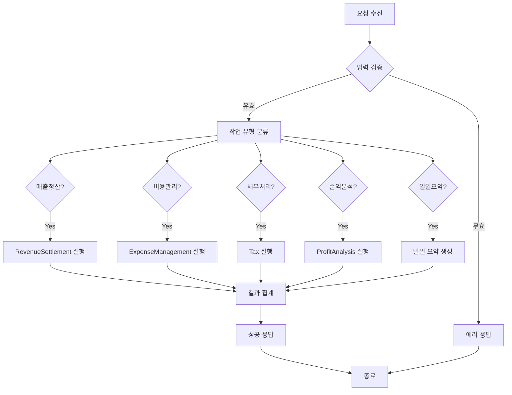

# Accounting Agent - 회계 에이전트

> 매출정산, 비용관리, 세무, 손익분석을 총괄하는 LANE 3 회계 에이전트

---

## 1. 기본 정보

### 1.1 에이전트 식별 정보

| 항목 | 값 |
|------|-----|
| **Agent ID** | `06-00` |
| **Agent Name** | `AccountingAgent` |
| **한글명** | 회계 에이전트 |
| **유형** | `main` |
| **상위 에이전트** | `none` |
| **LANE** | `LANE 3 - Management & Compliance` |
| **버전** | `1.0.0` |
| **최종 수정일** | `2025-01-26` |

### 1.2 에이전트 분류

```yaml
classification:
  domain: "finance"
  layer: "management"
  automation_level: "L3"
  criticality: "high"
```

---

## 2. 역할과 책임

### 2.1 핵심 역할

회계 에이전트는 썬데이허그의 모든 재무 데이터를 관리하고, 채널별 매출 정산, 비용 분류, 세무 처리, 손익 분석을 자동화합니다. 대표에게 정확한 재무 현황과 인사이트를 제공합니다.

### 2.2 주요 책임 (Responsibilities)

| 책임 | 설명 | 자동화 레벨 |
|------|------|------------|
| 매출 정산 | 쿠팡, 네이버, 카페24 등 채널별 매출 수집 및 정산 | L3 |
| 비용 관리 | 사업자카드 지출 분류 및 예산 추적 | L3 |
| 세무 처리 | 세금계산서 발행/수취, 부가세 신고 준비 | L2 |
| 손익 분석 | 월간/분기 손익계산서 및 수익성 분석 | L3 |

### 2.3 경계 (Boundaries)

#### 이 에이전트가 하는 것 (In Scope)

- 채널별 매출 데이터 수집 및 대사
- 비용 항목 자동 분류 및 예산 모니터링
- 세금계산서 관리 및 VAT 신고 자료 준비
- 손익계산서 및 재무 리포트 생성

#### 이 에이전트가 하지 않는 것 (Out of Scope)

- 자금 이체 실행 -> 대표 승인 필요
- 세무 신고 제출 -> 세무사 확인 필요
- 급여 지급 -> 별도 시스템

---

## 3. 권한 (Permissions)

### 3.1 데이터 접근 권한

| 데이터 유형 | 조회 | 생성 | 수정 | 삭제 |
|------------|:----:|:----:|:----:|:----:|
| 채널 정산 데이터 | O | O | O | X |
| 비용 내역 | O | O | O | X |
| 세금계산서 | O | O | O | X |
| 손익 리포트 | O | O | O | X |

### 3.2 실행 권한

```yaml
execution_permissions:
  autonomous:
    - "매출 데이터 수집"
    - "비용 자동 분류"
    - "리포트 생성"

  requires_approval:
    - action: "세금계산서 발행"
      approver: "supervisor"
      condition: "금액 100만원 초과"

    - action: "예산 초과 지출 처리"
      approver: "ceo"
      condition: "월 예산 대비 120% 초과"

  prohibited:
    - "자금 이체 실행"
    - "세무 신고 제출"
```

---

## 4. 서브 에이전트

### 4.1 서브 에이전트 목록

| Sub ID | 에이전트명 | 역할 |
|--------|-----------|------|
| 06-01 | RevenueSettlementSubAgent | 채널별 매출 수집, 정산 대사 |
| 06-02 | ExpenseManagementSubAgent | 지출 분류, 예산 추적 |
| 06-03 | TaxSubAgent | 세금계산서, 부가세, 장부기장 |
| 06-04 | ProfitAnalysisSubAgent | 손익계산서, 수익성 분석 |

### 4.2 서브 에이전트 협업 구조



---

## 5. 의사결정 로직

### 5.1 메인 플로우차트



---

## 6. KPI (핵심 성과 지표)

### 6.1 주요 KPI

| KPI | 정의 | 목표 | 측정 주기 |
|-----|------|------|----------|
| 정산 정확도 | 정산 데이터 일치율 | 99.5% | 일간 |
| 비용 분류 자동화율 | 자동 분류된 비용 비율 | 95% | 월간 |
| 세금계산서 처리율 | 기한 내 처리 완료율 | 100% | 월간 |
| 리포트 적시성 | 마감일 준수율 | 100% | 월간 |

---

## 7. 에러 핸들링

### 7.1 에러 유형 및 대응

| 에러 코드 | 에러 유형 | 원인 | 대응 방법 |
|----------|----------|------|----------|
| `ACC-E001` | 정산 데이터 불일치 | 채널 API 오류 | 재조회 및 수동 확인 |
| `ACC-E002` | 분류 실패 | 미정의 카테고리 | 기타비용 처리 후 알림 |
| `ACC-E003` | 세금계산서 오류 | 필수 정보 누락 | 입력 요청 알림 |

---

## 8. 변경 이력

| 버전 | 날짜 | 작성자 | 변경 내용 |
|------|------|--------|----------|
| 1.0.0 | 2025-01-26 | AI Agent | 최초 작성 |

---

## 9. 관련 문서

- [에이전트 시스템 개요](../README.md)
- [LANE 3 개요](../../topology/lane3-overview.md)
- [회계 일일 워크플로우](../../topology/accounting-daily-flow.md)
- [세무 워크플로우](../../topology/accounting-tax-flow.md)

---

*이 문서는 Accounting Agent의 상세 스펙을 정의합니다. 문의사항은 시스템 관리자에게 연락하세요.*
