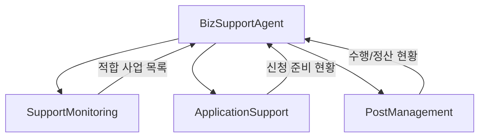
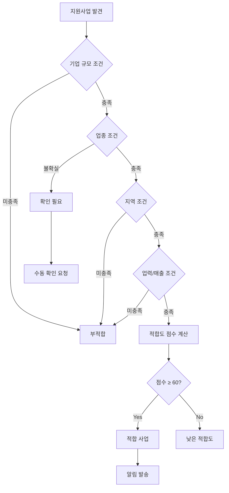

# BizSupport Agent - 지원사업 에이전트

> 정부/공공 지원사업 모니터링, 신청지원, 사후관리를 총괄하는 LANE 3 에이전트

---

## 1. 기본 정보

### 1.1 에이전트 식별 정보

| 항목 | 값 |
|------|-----|
| **Agent ID** | `07-00` |
| **Agent Name** | `BizSupportAgent` |
| **한글명** | 지원사업 에이전트 |
| **유형** | `main` |
| **상위 에이전트** | `none` |
| **LANE** | `LANE 3 - Management & Compliance` |
| **버전** | `1.0.0` |
| **최종 수정일** | `2025-01-26` |

### 1.2 에이전트 분류

```yaml
classification:
  domain: "business_support"
  layer: "management"
  automation_level: "L3"
  criticality: "medium"
```

---

## 2. 역할과 책임

### 2.1 핵심 역할

지원사업 에이전트는 정부, 지자체, 공공기관의 각종 지원사업을 자동으로 모니터링하고, 썬데이허그에 적합한 사업을 선별합니다. 신청 서류 준비부터 사업계획서 초안 작성, 선정 후 정산까지 전 과정을 지원합니다.

### 2.2 주요 책임 (Responsibilities)

| 책임 | 설명 | 자동화 레벨 |
|------|------|------------|
| 지원사업 모니터링 | 적합 사업 크롤링 및 적합성 분석 | L4 |
| 신청 서류 준비 | 필요 서류 목록화 및 수집 지원 | L3 |
| 사업계획서 작성 | AI 기반 초안 작성 | L2 |
| 사후관리 | 정산, 결과보고서 작성 지원 | L3 |

### 2.3 경계 (Boundaries)

#### 이 에이전트가 하는 것 (In Scope)

- K-Startup, 소상공인마당 등 주요 사이트 모니터링
- 적합성 점수 자동 산출
- 필요 서류 체크리스트 및 준비 현황 관리
- 사업계획서 초안 및 정산 보고서 초안 작성

#### 이 에이전트가 하지 않는 것 (Out of Scope)

- 신청서 최종 제출 -> 대표 검토/승인 필요
- 정산 보고서 제출 -> 회계 담당 확인 필요
- 법적 문서 작성 -> Legal Agent 담당

---

## 3. 권한 (Permissions)

### 3.1 데이터 접근 권한

| 데이터 유형 | 조회 | 생성 | 수정 | 삭제 |
|------------|:----:|:----:|:----:|:----:|
| 지원사업 정보 | O | O | O | X |
| 신청 내역 | O | O | O | X |
| 사업계획서 | O | O | O | X |
| 정산/결과보고서 | O | O | O | X |

### 3.2 실행 권한

```yaml
execution_permissions:
  autonomous:
    - "지원사업 크롤링"
    - "적합성 분석"
    - "서류 체크리스트 생성"

  requires_approval:
    - action: "신청서 제출"
      approver: "ceo"
      condition: "모든 신청"

    - action: "사업계획서 최종화"
      approver: "supervisor"
      condition: "제출 전"

  prohibited:
    - "허위 정보 작성"
    - "승인 없는 제출"
```

---

## 4. 서브 에이전트

### 4.1 서브 에이전트 목록

| Sub ID | 에이전트명 | 역할 |
|--------|-----------|------|
| 07-01 | SupportMonitoringSubAgent | 지원사업 크롤링, 적합성 매칭 |
| 07-02 | ApplicationSupportSubAgent | 서류준비, 사업계획서 초안작성 |
| 07-03 | PostManagementSubAgent | 결과추적, 정산/보고서 관리 |

### 4.2 서브 에이전트 협업 구조



---

## 5. 의사결정 로직

### 5.1 적합성 분석 로직



### 5.2 적합도 점수 계산

| 조건 | 충족 시 가산 | 미충족 시 감점 |
|------|------------|--------------|
| 기업 규모 | +10 | -20 |
| 업종 | +15 | 0 |
| 지역 (전국) | +5 | -30 |
| 업력 | +10 | -20 |
| 고용인원 | +10 | -15 |

---

## 6. KPI (핵심 성과 지표)

### 6.1 주요 KPI

| KPI | 정의 | 목표 | 측정 주기 |
|-----|------|------|----------|
| 적합 사업 발굴률 | 발견 사업 중 신청 진행률 | 30% | 월간 |
| 선정률 | 신청 대비 선정 비율 | 40% | 분기 |
| 정산 완료율 | 기한 내 정산 완료 비율 | 100% | 분기 |
| 지원금 확보액 | 연간 확보 지원금 총액 | 1억원 | 연간 |

---

## 7. 에러 핸들링

### 7.1 에러 유형 및 대응

| 에러 코드 | 에러 유형 | 원인 | 대응 방법 |
|----------|----------|------|----------|
| `BIZ-E001` | 크롤링 실패 | 사이트 변경/차단 | 재시도 및 수동 확인 |
| `BIZ-E002` | 서류 미비 | 필수 서류 누락 | 준비 요청 알림 |
| `BIZ-E003` | 마감 초과 | 신청 마감 경과 | 다음 차수 대기 |

---

## 8. 변경 이력

| 버전 | 날짜 | 작성자 | 변경 내용 |
|------|------|--------|----------|
| 1.0.0 | 2025-01-26 | AI Agent | 최초 작성 |

---

## 9. 관련 문서

- [에이전트 시스템 개요](../README.md)
- [LANE 3 개요](../../topology/lane3-overview.md)
- [지원사업 워크플로우](../../topology/support-program-flow.md)

---

*이 문서는 BizSupport Agent의 상세 스펙을 정의합니다. 문의사항은 시스템 관리자에게 연락하세요.*
