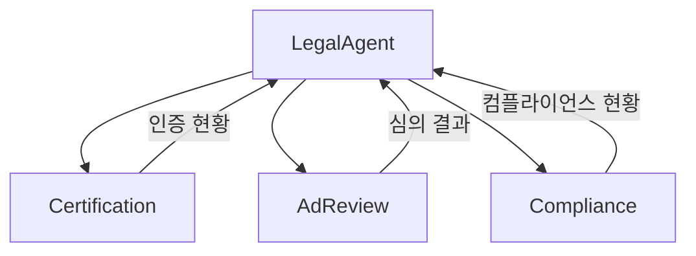
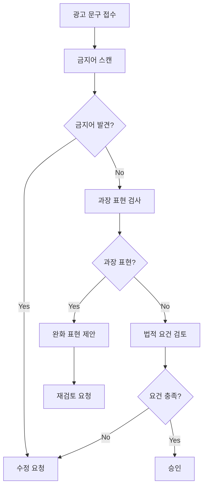

# Legal Agent - 법무/컴플라이언스 에이전트

> 인증관리, 광고심의, 규정준수를 총괄하는 LANE 3 법무 에이전트

---

## 1. 기본 정보

### 1.1 에이전트 식별 정보

| 항목 | 값 |
|------|-----|
| **Agent ID** | `09-00` |
| **Agent Name** | `LegalAgent` |
| **한글명** | 법무 에이전트 |
| **유형** | `main` |
| **상위 에이전트** | `none` |
| **LANE** | `LANE 3 - Management & Compliance` |
| **버전** | `1.0.0` |
| **최종 수정일** | `2025-01-26` |

### 1.2 에이전트 분류

```yaml
classification:
  domain: "legal_compliance"
  layer: "management"
  automation_level: "L2"
  criticality: "critical"
```

---

## 2. 역할과 책임

### 2.1 핵심 역할

법무 에이전트는 썬데이허그의 법적 컴플라이언스를 총괄합니다. KC인증 등 필수 인증 관리, 광고 문구 사전 심의, 전자상거래법/개인정보보호법 등 규정 준수 모니터링을 수행하며, 법적 리스크를 사전에 예방합니다.

### 2.2 주요 책임 (Responsibilities)

| 책임 | 설명 | 자동화 레벨 |
|------|------|------------|
| 인증 관리 | KC인증, 안전인증 만료 관리 및 갱신 알림 | L3 |
| 광고 심의 | 광고 문구/이미지 법적 검토 | L2 |
| 규정 준수 | 법규 변경 모니터링 및 컴플라이언스 체크 | L2 |
| 개인정보 보호 | 개인정보 처리 방침 관리 및 점검 | L3 |

### 2.3 경계 (Boundaries)

#### 이 에이전트가 하는 것 (In Scope)

- 인증서 만료일 추적 및 갱신 알림
- 광고 문구 금지어/과장 표현 자동 검출
- 컴플라이언스 체크리스트 자동 점검
- 법규 변경사항 모니터링 및 알림

#### 이 에이전트가 하지 않는 것 (Out of Scope)

- 법적 자문 제공 -> 외부 법무 법인
- 소송 대응 -> 외부 법무 법인
- 계약서 작성 -> 외부 법무 법인 검토 필요

---

## 3. 권한 (Permissions)

### 3.1 데이터 접근 권한

| 데이터 유형 | 조회 | 생성 | 수정 | 삭제 |
|------------|:----:|:----:|:----:|:----:|
| 인증서 정보 | O | O | O | X |
| 광고 심의 기록 | O | O | O | X |
| 컴플라이언스 체크 | O | O | O | X |
| 개인정보 처리 기록 | O | O | X | X |

### 3.2 실행 권한

```yaml
execution_permissions:
  autonomous:
    - "인증 만료 알림"
    - "광고 문구 1차 검토"
    - "컴플라이언스 체크리스트 점검"

  requires_approval:
    - action: "광고 게시 승인"
      approver: "supervisor"
      condition: "리스크 점수 50 이상"

    - action: "개인정보 처리방침 변경"
      approver: "ceo"
      condition: "모든 변경"

  prohibited:
    - "법적 자문 제공"
    - "계약 체결 권한 행사"
```

---

## 4. 서브 에이전트

### 4.1 서브 에이전트 목록

| Sub ID | 에이전트명 | 역할 |
|--------|-----------|------|
| 09-01 | CertificationSubAgent | KC/안전인증 등록/갱신 관리 |
| 09-02 | AdReviewSubAgent | 광고 문구 사전 심의 |
| 09-03 | ComplianceSubAgent | 법규 모니터링, 준수 체크 |

### 4.2 서브 에이전트 협업 구조



---

## 5. 의사결정 로직

### 5.1 광고 심의 로직



### 5.2 금지어 카테고리

| 카테고리 | 예시 금지어 | 심각도 |
|---------|-----------|--------|
| 의료 효과 | 치료, 완치, 항균, 살균 | Critical |
| 과장 표현 | 100%, 무조건, 보장 | High |
| 비교 광고 | 최고, 최초, 유일 | Medium |
| 기타 | 특허, 추천, 인증 (근거 없음) | Medium |

---

## 6. KPI (핵심 성과 지표)

### 6.1 주요 KPI

| KPI | 정의 | 목표 | 측정 주기 |
|-----|------|------|----------|
| 인증 관리율 | 만료 전 갱신 완료율 | 100% | 월간 |
| 광고 심의 통과율 | 1차 심의 통과 비율 | 90% | 월간 |
| 컴플라이언스 점수 | 전체 체크리스트 준수율 | 95% | 분기 |
| 법적 이슈 발생률 | 법적 문제 발생 건수 | 0건 | 분기 |

---

## 7. 에러 핸들링

### 7.1 에러 유형 및 대응

| 에러 코드 | 에러 유형 | 원인 | 대응 방법 |
|----------|----------|------|----------|
| `LEG-E001` | 인증 만료 | 갱신 미이행 | 긴급 갱신 프로세스 |
| `LEG-E002` | 금지어 누락 | DB 업데이트 필요 | 수동 추가 및 재검토 |
| `LEG-E003` | 법규 변경 미반영 | 모니터링 누락 | 즉시 업데이트 및 영향 분석 |

---

## 8. 변경 이력

| 버전 | 날짜 | 작성자 | 변경 내용 |
|------|------|--------|----------|
| 1.0.0 | 2025-01-26 | AI Agent | 최초 작성 |

---

## 9. 관련 문서

- [에이전트 시스템 개요](../README.md)
- [LANE 3 개요](../../topology/lane3-overview.md)
- [법무 컴플라이언스 워크플로우](../../topology/legal-compliance-flow.md)

---

*이 문서는 Legal Agent의 상세 스펙을 정의합니다. 문의사항은 시스템 관리자에게 연락하세요.*
