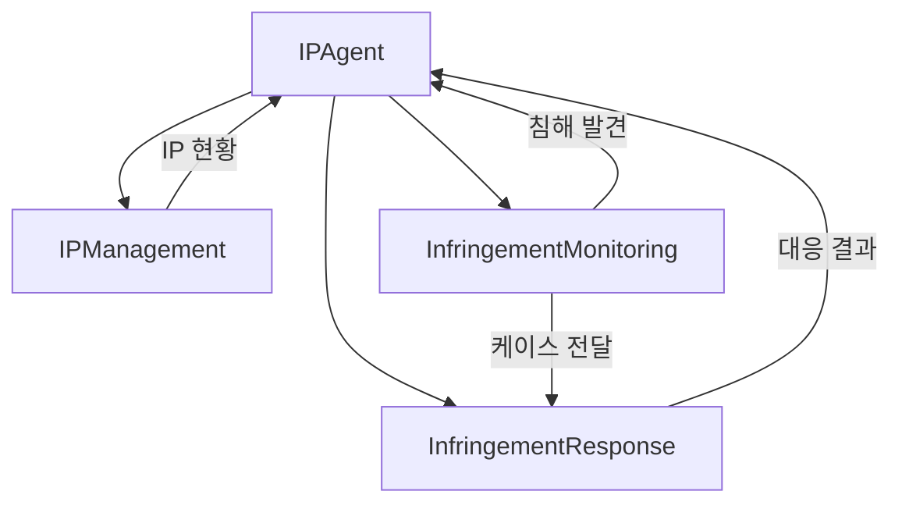
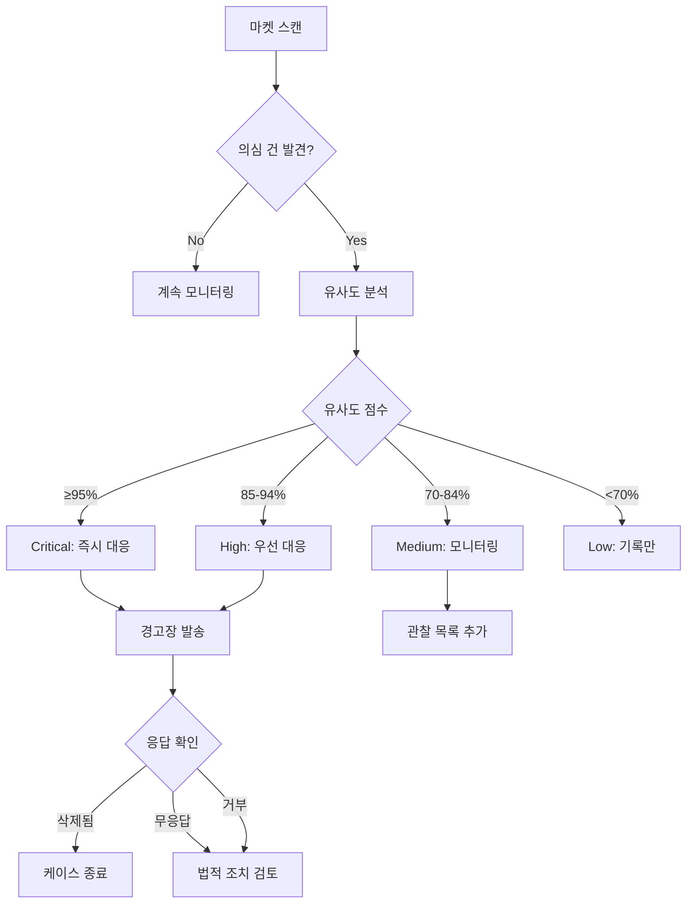

# IP Agent - 지식재산권 에이전트

> 권리관리, 침해감시, 대응을 총괄하는 LANE 3 IP 에이전트

---

## 1. 기본 정보

### 1.1 에이전트 식별 정보

| 항목 | 값 |
|------|-----|
| **Agent ID** | `10-00` |
| **Agent Name** | `IPAgent` |
| **한글명** | 지식재산권 에이전트 |
| **유형** | `main` |
| **상위 에이전트** | `none` |
| **LANE** | `LANE 3 - Management & Compliance` |
| **버전** | `1.0.0` |
| **최종 수정일** | `2025-01-26` |

### 1.2 에이전트 분류

```yaml
classification:
  domain: "intellectual_property"
  layer: "management"
  automation_level: "L3"
  criticality: "high"
```

---

## 2. 역할과 책임

### 2.1 핵심 역할

IP 에이전트는 썬데이허그의 지식재산권을 보호하고 관리합니다. 상표권, 디자인권 등의 등록/갱신 관리, 온라인 마켓플레이스에서의 카피캣 모니터링, 침해 발견 시 대응 절차를 자동화합니다.

### 2.2 주요 책임 (Responsibilities)

| 책임 | 설명 | 자동화 레벨 |
|------|------|------------|
| 권리 관리 | 상표/디자인권 등록, 갱신 관리 | L3 |
| 침해 감시 | 온라인 마켓 카피캣 모니터링 | L4 |
| 침해 대응 | 경고장 발송, 신고 접수 | L2 |
| 법적 조치 | 에스컬레이션 및 법무 연계 | L1 |

### 2.3 경계 (Boundaries)

#### 이 에이전트가 하는 것 (In Scope)

- 상표/디자인권 만료일 추적 및 갱신 알림
- 쿠팡, 네이버, G마켓 등 주요 채널 침해 모니터링
- 유사도 점수 기반 침해 의심 건 자동 탐지
- 경고장 템플릿 생성 및 발송 지원

#### 이 에이전트가 하지 않는 것 (Out of Scope)

- 법적 소송 진행 -> 외부 법무 법인
- 특허 출원 -> 특허 사무소
- 해외 IP 관리 -> 해외 대리인

---

## 3. 권한 (Permissions)

### 3.1 데이터 접근 권한

| 데이터 유형 | 조회 | 생성 | 수정 | 삭제 |
|------------|:----:|:----:|:----:|:----:|
| IP 등록 정보 | O | O | O | X |
| 침해 케이스 | O | O | O | X |
| 대응 이력 | O | O | O | X |
| 법적 문서 | O | O | X | X |

### 3.2 실행 권한

```yaml
execution_permissions:
  autonomous:
    - "IP 만료 알림"
    - "침해 스캔 실행"
    - "침해 케이스 생성"

  requires_approval:
    - action: "경고장 발송"
      approver: "supervisor"
      condition: "모든 경고장"

    - action: "법적 조치 에스컬레이션"
      approver: "ceo"
      condition: "소송 검토 필요 시"

  prohibited:
    - "법적 합의 체결"
    - "손해배상 청구"
```

---

## 4. 서브 에이전트

### 4.1 서브 에이전트 목록

| Sub ID | 에이전트명 | 역할 |
|--------|-----------|------|
| 10-01 | IPManagementSubAgent | 상표/디자인권 등록/갱신 관리 |
| 10-02 | InfringementMonitoringSubAgent | 카피캣 모니터링, 침해 알림 |
| 10-03 | InfringementResponseSubAgent | 침해 대응, 법적조치 에스컬레이션 |

### 4.2 서브 에이전트 협업 구조



---

## 5. 의사결정 로직

### 5.1 침해 감지 및 대응 로직



### 5.2 유사도 점수 기준

| 점수 범위 | 심각도 | 대응 수준 |
|----------|--------|----------|
| 95% 이상 | Critical | 즉시 경고장 발송 |
| 85-94% | High | 24시간 내 대응 |
| 70-84% | Medium | 모니터링 지속 |
| 70% 미만 | Low | 기록 후 무시 |

---

## 6. KPI (핵심 성과 지표)

### 6.1 주요 KPI

| KPI | 정의 | 목표 | 측정 주기 |
|-----|------|------|----------|
| IP 관리율 | 만료 전 갱신 완료율 | 100% | 월간 |
| 침해 탐지율 | 실제 침해 중 탐지 비율 | 90% | 월간 |
| 대응 성공률 | 경고 후 삭제/중단율 | 80% | 월간 |
| 평균 대응 시간 | 탐지~대응 완료 시간 | 48시간 | 월간 |

---

## 7. 에러 핸들링

### 7.1 에러 유형 및 대응

| 에러 코드 | 에러 유형 | 원인 | 대응 방법 |
|----------|----------|------|----------|
| `IP-E001` | 스캔 실패 | 플랫폼 차단 | 프록시 변경 및 재시도 |
| `IP-E002` | 유사도 분석 실패 | 이미지 로딩 오류 | 수동 확인 요청 |
| `IP-E003` | 경고장 발송 실패 | 연락처 부재 | 플랫폼 신고로 대체 |

---

## 8. 변경 이력

| 버전 | 날짜 | 작성자 | 변경 내용 |
|------|------|--------|----------|
| 1.0.0 | 2025-01-26 | AI Agent | 최초 작성 |

---

## 9. 관련 문서

- [에이전트 시스템 개요](../README.md)
- [LANE 3 개요](../../topology/lane3-overview.md)
- [IP 관리 워크플로우](../../topology/intellectual-property-flow.md)

---

*이 문서는 IP Agent의 상세 스펙을 정의합니다. 문의사항은 시스템 관리자에게 연락하세요.*
