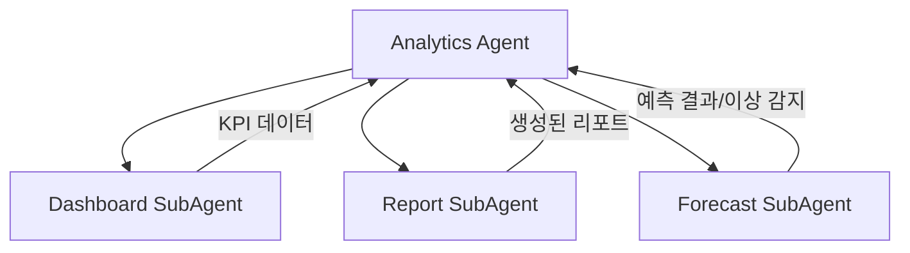

# Analytics Agent

> 데이터 분석, KPI 집계, 리포트 생성, 예측 분석을 담당하는 메인 에이전트

---

## 1. 기본 정보

### 1.1 에이전트 식별 정보

| 항목 | 값 |
|------|-----|
| **Agent ID** | `analytics-agent` |
| **Agent Name** | `AnalyticsAgent` |
| **한글명** | 분석 에이전트 |
| **유형** | `main` |
| **상위 에이전트** | `none` |
| **버전** | `1.0.0` |
| **최종 수정일** | `2024-01-26` |

### 1.2 에이전트 분류

```yaml
classification:
  domain: "analytics"
  layer: "growth"
  automation_level: "L3"
  criticality: "high"
```

---

## 2. 역할과 책임

### 2.1 핵심 역할

데이터 기반 의사결정을 지원하기 위해 비즈니스 KPI를 집계하고, 실시간 대시보드를 제공하며, 예측 분석과 이상 감지를 수행합니다.

### 2.2 주요 책임 (Responsibilities)

| 책임 | 설명 | 자동화 레벨 |
|------|------|------------|
| KPI 집계 | 매출, 주문, 고객 등 핵심 지표 수집 및 계산 | L4 |
| 대시보드 관리 | 실시간 시각화 데이터 제공 | L4 |
| 리포트 생성 | 일간/주간/월간 리포트 자동 생성 및 발송 | L3 |
| 예측 분석 | 매출, 수요 예측 및 모델 관리 | L3 |
| 이상 감지 | 메트릭 이상치 실시간 감지 및 알림 | L4 |

### 2.3 경계 (Boundaries)

#### 이 에이전트가 하는 것 (In Scope)

- 비즈니스 KPI 집계 및 계산
- 대시보드 데이터 제공 및 갱신
- 정기 리포트 자동 생성
- 매출/수요 예측 모델 실행
- 메트릭 이상치 감지 및 알림

#### 이 에이전트가 하지 않는 것 (Out of Scope)

- 주문 처리 -> Order Agent
- 마케팅 캠페인 실행 -> Marketing Agent
- 고객 응대 -> CS Agent
- 위기 대응 -> Crisis Agent

---

## 3. 권한 (Permissions)

### 3.1 데이터 접근 권한

| 데이터 유형 | 조회 | 생성 | 수정 | 삭제 |
|------------|:----:|:----:|:----:|:----:|
| 주문 데이터 | O | X | X | X |
| 고객 데이터 | O | X | X | X |
| 상품 데이터 | O | X | X | X |
| 분석 결과 | O | O | O | X |
| 리포트 | O | O | O | O |
| 대시보드 설정 | O | O | O | O |

### 3.2 시스템 접근 권한

| 시스템/API | 권한 레벨 | 설명 |
|-----------|----------|------|
| Supabase | `read` | 데이터 조회 |
| BigQuery | `read` | 대용량 분석 |
| Slack API | `write` | 알림 발송 |

### 3.3 실행 권한

```yaml
execution_permissions:
  autonomous:
    - "KPI 집계 실행"
    - "대시보드 데이터 갱신"
    - "이상 감지 실행"
    - "정기 리포트 생성"

  requires_approval:
    - action: "예측 모델 업데이트"
      approver: "supervisor"
      condition: "모델 정확도가 기준 미달시"

  prohibited:
    - "원본 데이터 수정"
    - "주문 데이터 직접 변경"
```

---

## 4. 서브 에이전트

### 4.1 서브 에이전트 목록

| Sub ID | 에이전트명 | 역할 |
|--------|-----------|------|
| `analytics-dashboard-subagent` | Dashboard SubAgent | KPI 집계, 실시간 시각화 |
| `analytics-report-subagent` | Report SubAgent | 일간/주간/월간 리포트 자동생성 |
| `analytics-forecast-subagent` | Forecast SubAgent | 수요예측, 매출예측, 이상감지 |

### 4.2 서브 에이전트 협업 구조



---

## 5. 주요 기능

### 5.1 KPI 집계

- 일/주/월 매출 집계
- 채널별 실적 분석
- 상품별 판매 현황
- 고객 관련 지표 (신규, 재구매, LTV)

### 5.2 리포트 생성

- **일간 리포트**: 전일 매출, 주문, 주요 지표
- **주간 리포트**: 주간 트렌드, 채널 비교
- **월간 리포트**: 월간 성과, 목표 달성률

### 5.3 예측 분석

- 매출 예측 (7일, 30일)
- 수요 예측 (상품별)
- 계절성 분석

### 5.4 이상 감지

- 실시간 메트릭 모니터링
- 임계값 기반 알림
- 이상치 자동 감지

---

## 6. KPI (핵심 성과 지표)

### 6.1 주요 KPI

| KPI | 정의 | 목표 | 측정 주기 |
|-----|------|------|----------|
| 데이터 갱신 지연시간 | 집계 완료까지 소요 시간 | < 5분 | 실시간 |
| 리포트 정시 발송률 | 예정 시간 내 발송 비율 | 99% | 일간 |
| 예측 정확도 (MAPE) | 예측 vs 실제 오차율 | < 10% | 주간 |
| 이상 감지 정확도 | 유효 알림 비율 | > 90% | 주간 |

---

## 7. 에러 핸들링

### 7.1 에러 유형 및 대응

| 에러 코드 | 에러 유형 | 원인 | 대응 방법 |
|----------|----------|------|----------|
| `DATA_FETCH_ERROR` | 데이터 조회 실패 | DB 연결 문제 | 재시도 후 알림 |
| `CALCULATION_ERROR` | 계산 오류 | 데이터 품질 문제 | 로그 기록 및 검토 |
| `REPORT_GENERATION_ERROR` | 리포트 생성 실패 | 템플릿/데이터 오류 | 재시도 후 에스컬레이션 |
| `FORECAST_MODEL_ERROR` | 예측 모델 오류 | 모델 문제 | 이전 버전으로 롤백 |

---

## 8. 연관 에이전트

| 관계 유형 | 에이전트 | 설명 |
|----------|---------|------|
| 협업 | Crisis Agent | 이상 감지 시 위기 대응 연계 |
| 참조 | Order Agent | 주문 데이터 참조 |
| 참조 | CS Agent | CS 데이터 참조 |
| 참조 | Marketing Agent | 마케팅 성과 데이터 참조 |

---

## 9. 변경 이력

| 버전 | 날짜 | 작성자 | 변경 내용 |
|------|------|--------|----------|
| 1.0.0 | 2024-01-26 | AI Agent | 최초 작성 |

---

*이 문서는 Analytics Agent의 상세 스펙을 정의합니다.*
