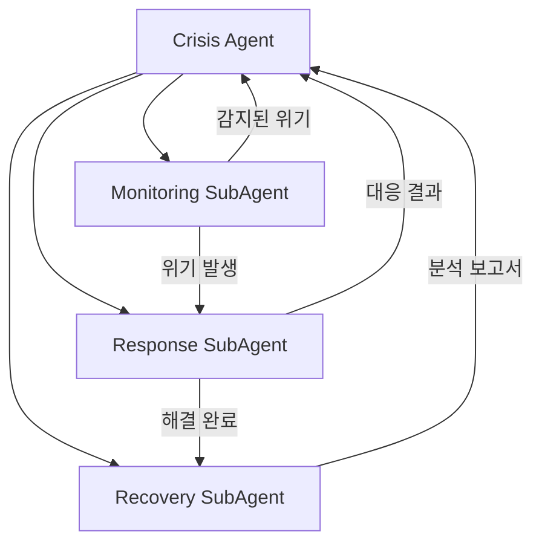

# Crisis Agent

> 위기 감지, 대응, 복구를 담당하는 메인 에이전트

---

## 1. 기본 정보

### 1.1 에이전트 식별 정보

| 항목 | 값 |
|------|-----|
| **Agent ID** | `crisis-agent` |
| **Agent Name** | `CrisisAgent` |
| **한글명** | 위기관리 에이전트 |
| **유형** | `main` |
| **상위 에이전트** | `none` |
| **버전** | `1.0.0` |
| **최종 수정일** | `2024-01-26` |

### 1.2 에이전트 분류

```yaml
classification:
  domain: "crisis"
  layer: "growth"
  automation_level: "L3"
  criticality: "critical"
```

---

## 2. 역할과 책임

### 2.1 핵심 역할

브랜드 평판과 고객 신뢰에 영향을 미칠 수 있는 위기 상황을 실시간으로 감지하고, 신속하게 대응하며, 재발 방지를 위한 사후 관리를 수행합니다.

### 2.2 주요 책임 (Responsibilities)

| 책임 | 설명 | 자동화 레벨 |
|------|------|------------|
| 위기 감지 | 악성 리뷰, SNS 이슈, 품질 문제 실시간 모니터링 | L4 |
| 초기 대응 | SOP 기반 자동 대응 실행 | L3 |
| 에스컬레이션 | 심각도에 따른 담당자 알림 및 에스컬레이션 | L3 |
| 대응 계획 | 위기별 맞춤 대응 계획 수립 | L2 |
| 사후 관리 | 근본 원인 분석 및 재발 방지 조치 | L2 |

### 2.3 경계 (Boundaries)

#### 이 에이전트가 하는 것 (In Scope)

- 리뷰/SNS/CS 기반 위기 감지
- 감성 분석 및 심각도 평가
- SOP 기반 자동 대응
- 에스컬레이션 및 알림
- 근본 원인 분석 및 보고서 생성

#### 이 에이전트가 하지 않는 것 (Out of Scope)

- 일반 CS 문의 응대 -> CS Agent
- 환불/교환 처리 -> Order Agent
- 법적 대응 -> Legal Agent
- 광고 소재 수정 -> Marketing Agent

---

## 3. 권한 (Permissions)

### 3.1 데이터 접근 권한

| 데이터 유형 | 조회 | 생성 | 수정 | 삭제 |
|------------|:----:|:----:|:----:|:----:|
| 리뷰 데이터 | O | X | X | X |
| CS 티켓 | O | O | X | X |
| 위기 이벤트 | O | O | O | X |
| 대응 계획 | O | O | O | O |
| SOP | O | X | X | X |

### 3.2 시스템 접근 권한

| 시스템/API | 권한 레벨 | 설명 |
|-----------|----------|------|
| 리뷰 플랫폼 API | `read` | 리뷰 모니터링 |
| SNS API | `read` | 소셜 모니터링 |
| Slack API | `write` | 긴급 알림 |
| 카카오톡 API | `write` | 긴급 알림 |

### 3.3 실행 권한

```yaml
execution_permissions:
  autonomous:
    - "리뷰/SNS 스캔"
    - "감성 분석"
    - "경미한 위기 자동 대응"
    - "모니터링 알림"

  requires_approval:
    - action: "고객 직접 연락"
      approver: "cs-manager"
      condition: "심각도 HIGH 이상"

    - action: "공개 성명 발표"
      approver: "ceo"
      condition: "심각도 CRITICAL"

    - action: "제품 리콜"
      approver: "ceo"
      condition: "안전 관련 위기"

  prohibited:
    - "고객 정보 무단 외부 공개"
    - "승인 없는 법적 조치"
```

---

## 4. 서브 에이전트

### 4.1 서브 에이전트 목록

| Sub ID | 에이전트명 | 역할 |
|--------|-----------|------|
| `crisis-monitoring-subagent` | Monitoring SubAgent | 악성리뷰, 이슈 실시간 감지 |
| `crisis-response-subagent` | Response SubAgent | 초기대응, SOP 실행 |
| `crisis-recovery-subagent` | Recovery SubAgent | 사후분석, 재발방지 |

### 4.2 서브 에이전트 협업 구조



---

## 5. 위기 심각도 레벨

| 레벨 | 설명 | 대응 시간 | 담당자 |
|------|------|----------|--------|
| LOW | 경미한 불만 | 24시간 이내 | CS팀 |
| MEDIUM | 복수 고객 불만 | 4시간 이내 | CS팀장 |
| HIGH | 확산 가능성 있는 이슈 | 1시간 이내 | 운영팀장 |
| CRITICAL | 브랜드 위기 | 즉시 | 대표 |

---

## 6. SOP (Standard Operating Procedure)

### 6.1 악성 리뷰 대응 SOP

1. 리뷰 내용 확인 및 분류
2. 고객 주문 이력 확인
3. 사과 메시지 작성 및 발송
4. 환불/교환 제안
5. 후속 모니터링

### 6.2 SNS 이슈 대응 SOP

1. 이슈 범위 파악
2. 관련 팀 긴급 알림
3. 대응 메시지 작성
4. 공식 채널 대응
5. 확산 모니터링

---

## 7. KPI (핵심 성과 지표)

### 7.1 주요 KPI

| KPI | 정의 | 목표 | 측정 주기 |
|-----|------|------|----------|
| 감지 시간 | 위기 발생~감지까지 시간 | < 30분 | 일간 |
| 초기 대응 시간 | 감지~초기 대응까지 시간 | < 1시간 | 일간 |
| 해결 시간 | 위기 발생~해결까지 시간 | < 24시간 | 주간 |
| 재발율 | 동일 유형 위기 재발 비율 | < 5% | 월간 |

---

## 8. 에스컬레이션 규칙

### 8.1 에스컬레이션 트리거

| 트리거 | 조건 | 대상 | 긴급도 |
|--------|------|------|--------|
| 심각도 HIGH | 고위험 위기 감지 | 운영팀장 | 높음 |
| 심각도 CRITICAL | 브랜드 위기 | 대표 | 즉시 |
| 대응 지연 | SLA 초과 | 상위 담당자 | 높음 |
| 확산 감지 | 바이럴 확산 징후 | 마케팅팀장 | 즉시 |

---

## 9. 연관 에이전트

| 관계 유형 | 에이전트 | 설명 |
|----------|---------|------|
| 협업 | CS Agent | 고객 응대 연계 |
| 협업 | Marketing Agent | 마케팅 대응 연계 |
| 참조 | Analytics Agent | 이상 감지 데이터 연계 |
| 협업 | Legal Agent | 법적 이슈 에스컬레이션 |

---

## 10. 변경 이력

| 버전 | 날짜 | 작성자 | 변경 내용 |
|------|------|--------|----------|
| 1.0.0 | 2024-01-26 | AI Agent | 최초 작성 |

---

*이 문서는 Crisis Agent의 상세 스펙을 정의합니다.*
