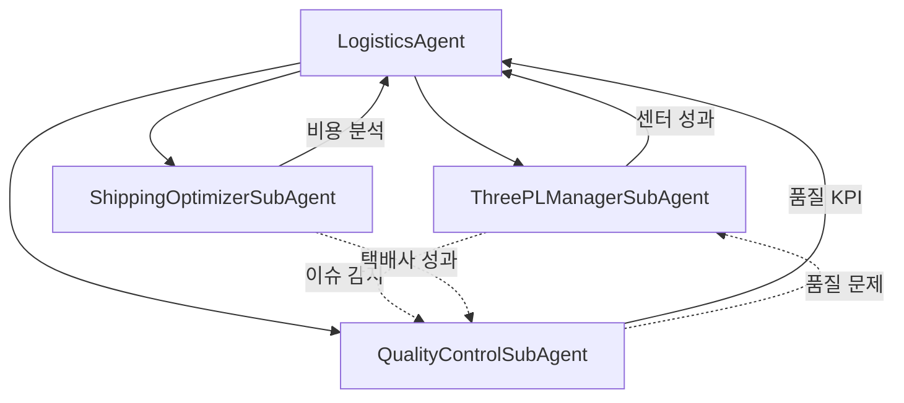
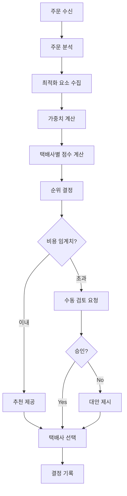
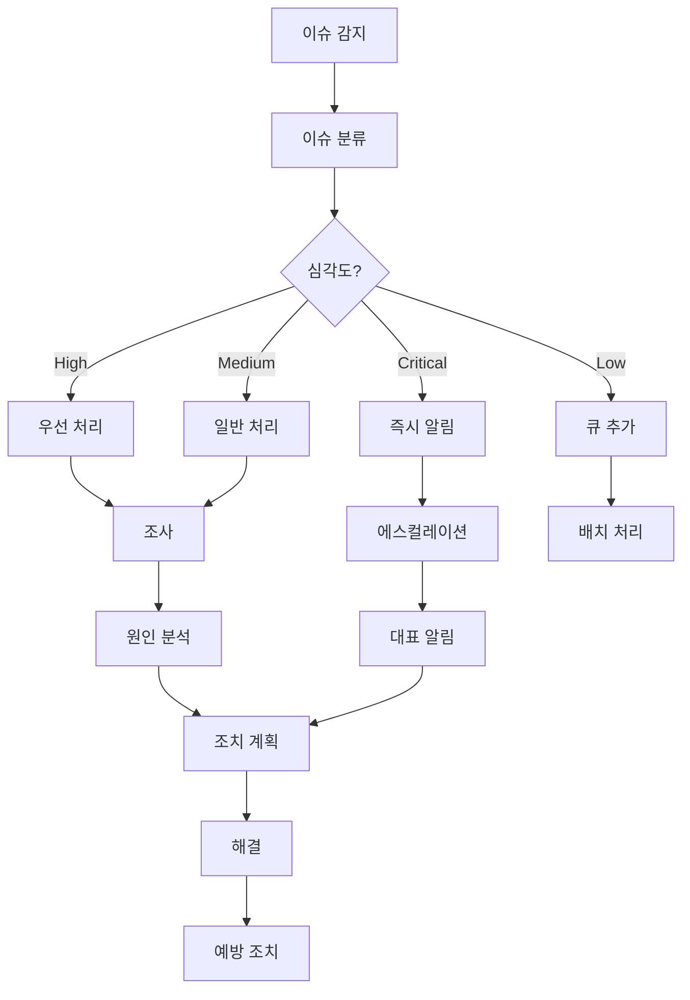
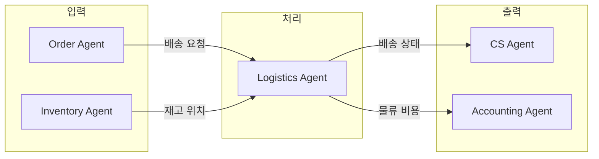

# Logistics Agent (물류 에이전트)

> 3PL 풀필먼트 관리, 배송 최적화, 품질 관리를 총괄하는 물류 운영 메인 에이전트

---

## 1. 기본 정보

### 1.1 에이전트 식별 정보

| 항목 | 값 |
|------|-----|
| **Agent ID** | `13` |
| **Agent Name** | `LogisticsAgent` |
| **한글명** | 물류 에이전트 |
| **유형** | `main` |
| **상위 에이전트** | `00-Supervisor` |
| **버전** | `1.0.0` |
| **최종 수정일** | `2025-01-26` |

### 1.2 에이전트 분류

```yaml
classification:
  domain: "operations"
  layer: "core"
  automation_level: "L1-L2"
  criticality: "high"
```

---

## 2. 역할과 책임

### 2.1 핵심 역할

LogisticsAgent는 썬데이허그의 **물류 운영 전체**를 관리합니다. 3PL 풀필먼트 센터의 성과를 추적하고, 택배사별 배송 비용과 성과를 분석하여 최적의 배송 전략을 수립하며, 배송 품질(지연/파손)을 모니터링하여 고객 만족도를 높입니다.

### 2.2 주요 책임 (Responsibilities)

| 책임 | 설명 | 자동화 레벨 |
|------|------|------------|
| 3PL 관리 | 풀필먼트 센터 성과 추적 및 비교 | L1 |
| 배송 최적화 | 택배사 비용 분석 및 최적 선택 | L1-L2 |
| 품질 관리 | 지연/파손 모니터링 및 KPI 관리 | L1 |
| 택배사 비교 | 택배사별 성과 비교 분석 | L1 |
| 이슈 대응 | 물류 이슈 감지 및 대응 | L2 |

### 2.3 경계 (Boundaries)

#### 이 에이전트가 하는 것 (In Scope)

- 풀필먼트 센터 성과 모니터링
- 택배사 비용/성과 분석
- 배송 품질 KPI 관리
- 물류 이슈 감지 및 알림
- 배송 최적화 제안

#### 이 에이전트가 하지 않는 것 (Out of Scope)

- 송장 등록 -> Order Agent
- 주문 처리 -> Order Agent
- 재고 관리 -> Inventory Agent
- 고객 응대 -> CS Agent
- 비용 정산 -> Accounting Agent

---

## 3. 권한 (Permissions)

### 3.1 데이터 접근 권한

| 데이터 유형 | 조회 | 생성 | 수정 | 삭제 |
|------------|:----:|:----:|:----:|:----:|
| 풀필먼트 센터 정보 | O | X | X | X |
| 배송 데이터 | O | O | O | X |
| 품질 이슈 | O | O | O | X |
| 택배사 정보 | O | X | X | X |
| 배송 비용 | O | O | O | X |

### 3.2 실행 권한

```yaml
execution_permissions:
  autonomous:
    - "성과 데이터 수집"
    - "품질 모니터링"
    - "배송 비용 분석"
    - "이슈 기록"

  requires_approval:
    - action: "택배사 변경 권고"
      approver: "supervisor"
      condition: "주요 물량 영향"

    - action: "풀필먼트 센터 SLA 경고"
      approver: "supervisor"
      condition: "SLA 미달 시"

  prohibited:
    - "택배사 계약 변경"
    - "물류 비용 직접 결제"
```

---

## 4. 서브 에이전트

### 4.1 서브 에이전트 목록

| Sub ID | 에이전트명 | 역할 | 자동화 레벨 |
|--------|-----------|------|------------|
| 13-01 | ThreePLManagerSubAgent | 풀필먼트 센터 성과 추적 | L1 |
| 13-02 | ShippingOptimizerSubAgent | 배송 비용 분석 및 최적화 | L1-L2 |
| 13-03 | QualityControlSubAgent | 지연/파손 모니터링 | L1 |

### 4.2 서브 에이전트 협업 구조



---

## 5. 서브 에이전트 상세

### 5.1 ThreePLManagerSubAgent (3PL관리)

```yaml
sub_agent:
  id: "13-01"
  name: "ThreePLManagerSubAgent"
  role: "풀필먼트 센터 성과 추적"

  responsibilities:
    - "센터별 성과 모니터링"
    - "SLA 준수 여부 확인"
    - "센터 비교 분석"
    - "이슈 보고"
    - "가용성 확인"

  task_types:
    - track_performance
    - compare_centers
    - get_center_details
    - report_issue

  performance_metrics:
    - 주문 처리량
    - 정시 출고율
    - 정확도
    - 반품율
    - 처리 시간

  sla_targets:
    on_time_delivery: 95%
    accuracy: 99%
    processing_time: 24시간
```

### 5.2 ShippingOptimizerSubAgent (배송최적화)

```yaml
sub_agent:
  id: "13-02"
  name: "ShippingOptimizerSubAgent"
  role: "배송 비용 분석 및 최적화"

  responsibilities:
    - "배송 비용 분석"
    - "택배사 추천"
    - "택배사 성과 비교"
    - "비용 절감 기회 식별"
    - "배송 비용 계산"

  task_types:
    - analyze_costs
    - recommend_courier
    - compare_couriers
    - calculate_shipping_cost

  cost_analysis_dimensions:
    - 택배사별
    - 지역별
    - 서비스별 (일반/특급/새벽)

  optimization_factors:
    - 비용
    - 배송 속도
    - 정시 배송율
    - 파손율
```

### 5.3 QualityControlSubAgent (품질관리)

```yaml
sub_agent:
  id: "13-03"
  name: "QualityControlSubAgent"
  role: "지연/파손 모니터링"

  responsibilities:
    - "품질 모니터링"
    - "KPI 추적"
    - "이슈 보고"
    - "이슈 해결"
    - "트렌드 분석"

  task_types:
    - monitor_quality
    - get_quality_kpi
    - report_quality_issue
    - resolve_issue

  issue_types:
    - DELAY: "배송 지연"
    - DAMAGE: "파손"
    - LOST: "분실"
    - WRONG_ADDRESS: "오배송"
    - WRONG_ITEM: "오상품"
    - INCOMPLETE: "수량 부족"
    - CUSTOMER_ABSENCE: "고객 부재"
    - RETURN_ISSUE: "반송 문제"

  kpi_targets:
    on_time_delivery_rate: 95%
    damage_rate: "< 1%"
    lost_rate: "< 0.5%"
    accuracy_rate: 99%
```

---

## 6. 의사결정 로직

### 6.1 배송 최적화 플로우



### 6.2 품질 이슈 처리 플로우



---

## 7. KPI (핵심 성과 지표)

### 7.1 주요 KPI

| KPI | 정의 | 목표 | 측정 주기 |
|-----|------|------|----------|
| 정시 배송율 | 정시 배송 / 전체 배송 | >= 95% | 일간 |
| 파손율 | 파손 건수 / 전체 배송 | < 1% | 주간 |
| 분실율 | 분실 건수 / 전체 배송 | < 0.5% | 주간 |
| 평균 배송 비용 | 총 배송비 / 배송 건수 | 최적화 | 주간 |
| 풀필먼트 SLA 준수율 | SLA 충족 / 전체 | >= 95% | 주간 |
| 배송 정확도 | 정확 배송 / 전체 배송 | >= 99% | 주간 |

### 7.2 KPI 계산 공식

```yaml
kpi_definitions:
  on_time_delivery_rate:
    name: "정시 배송율"
    formula: "on_time_deliveries / total_deliveries * 100"
    threshold:
      excellent: ">= 98%"
      good: ">= 95%"
      acceptable: ">= 90%"
      poor: "< 90%"

  damage_rate:
    name: "파손율"
    formula: "damaged_shipments / total_shipments * 100"
    threshold:
      excellent: "<= 0.5%"
      good: "<= 1%"
      acceptable: "<= 2%"
      poor: "> 2%"

  avg_shipping_cost:
    name: "평균 배송 비용"
    formula: "total_shipping_cost / total_shipments"
    threshold:
      excellent: "<= 2,500원"
      good: "<= 3,000원"
      acceptable: "<= 3,500원"
      poor: "> 3,500원"
```

---

## 8. 에스컬레이션 규칙

### 8.1 에스컬레이션 트리거

| 트리거 | 조건 | 대상 | 긴급도 |
|--------|------|------|--------|
| 대량 지연 | 지연율 10% 초과 | CEO | 즉시 |
| 파손 급증 | 파손율 2% 초과 | Supervisor | 높음 |
| 분실 발생 | 분실 1건 이상 | Supervisor | 높음 |
| SLA 미달 | 풀필먼트 SLA 미충족 | Supervisor | 보통 |
| 비용 급증 | 배송비 20% 이상 증가 | Supervisor | 보통 |

---

## 9. 에러 핸들링

### 9.1 에러 유형 및 대응

| 에러 코드 | 에러 유형 | 원인 | 대응 방법 |
|----------|----------|------|----------|
| `LOG-001` | TrackingFailed | 배송 추적 실패 | 재시도 후 수동 확인 |
| `LOG-002` | CenterAPIError | 풀필먼트 API 오류 | 재시도 후 알림 |
| `LOG-003` | CostCalculationError | 비용 계산 오류 | 데이터 검증 후 재계산 |
| `LOG-004` | QualityDataError | 품질 데이터 오류 | 원본 데이터 확인 |
| `LOG-005` | CourierAPIError | 택배사 API 오류 | 재시도 후 대체 조회 |

### 9.2 재시도 정책

```yaml
retry_policy:
  default:
    max_attempts: 3
    backoff_type: "exponential"
    initial_delay: 5000
    max_delay: 60000

  tracking_api:
    max_attempts: 5
    backoff_type: "linear"
    initial_delay: 10000
```

---

## 10. 연관 에이전트

### 10.1 데이터 흐름



---

## 11. 변경 이력

| 버전 | 날짜 | 작성자 | 변경 내용 |
|------|------|--------|----------|
| 1.0.0 | 2025-01-26 | AI System | LANE 1 최초 작성 |

---

## 12. 관련 문서

- [에이전트 시스템 개요](../README.md)
- [Supervisor 에이전트](../00-supervisor/main.md)
- [물류 워크플로우](../../topology/workflows/logistics-flow.md)
- [Order Agent](../01-order/main.md)
- [Inventory Agent](../05-inventory/main.md)
- [Accounting Agent](../06-accounting/main.md)

---

*Logistics Agent는 썬데이허그의 물류 품질을 책임집니다. 최적의 배송 비용으로 빠르고 안전한 배송을 실현하여 고객에게 최고의 경험을 제공합니다.*
