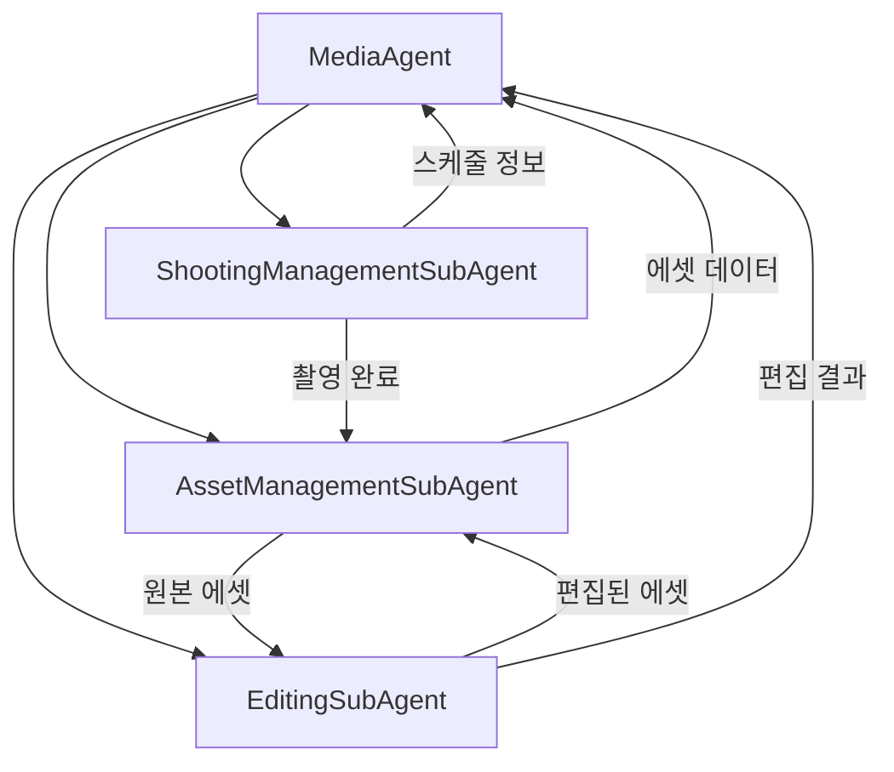

# Media Agent (미디어 에이전트)

> 미디어 에셋의 촬영, 관리, 편집을 담당하는 메인 에이전트

---

## 1. 기본 정보

### 1.1 에이전트 식별 정보

| 항목 | 값 |
|------|-----|
| **Agent ID** | `14-00` |
| **Agent Name** | `MediaAgent` |
| **한글명** | 미디어 에이전트 |
| **유형** | `main` |
| **상위 에이전트** | `Supervisor` |
| **버전** | `1.0.0` |
| **최종 수정일** | `2025-01-26` |

### 1.2 에이전트 분류

```yaml
classification:
  domain: "operations"
  layer: "support"
  automation_level: "L2-L3"
  criticality: "medium"
```

---

## 2. 역할과 책임

### 2.1 핵심 역할

미디어 에이전트는 썬데이허그의 모든 시각적 콘텐츠 자산을 관리합니다. 촬영 스케줄 조율, 외주업체 관리, 에셋 라이브러리 운영, 이미지/영상 편집을 통합적으로 처리합니다.

### 2.2 주요 책임 (Responsibilities)

| 책임 | 설명 | 자동화 레벨 |
|------|------|------------|
| 촬영 관리 | 촬영 스케줄, 외주업체 조율 | L2 |
| 에셋 라이브러리 | 이미지/영상 업로드, 분류, 검색 | L3 |
| 이미지 편집 | 리사이징, 크롭, 색보정, 워터마크 | L4 |
| 영상 편집 | 트리밍, 자막, 썸네일 생성 | L3 |
| 채널 최적화 | 채널별 규격에 맞는 에셋 생성 | L4 |

### 2.3 경계 (Boundaries)

#### 이 에이전트가 하는 것 (In Scope)

- 촬영 스케줄 생성 및 관리
- 외주 사진작가/스튜디오 협업 관리
- 이미지/영상 에셋 업로드 및 분류
- 기본 이미지 편집 (리사이징, 크롭, 워터마크)
- 채널별 이미지 규격 변환
- 에셋 태그 및 검색
- 썸네일 자동 생성

#### 이 에이전트가 하지 않는 것 (Out of Scope)

- 상세페이지 기획 → DetailPage Agent
- 마케팅 콘텐츠 기획 → Marketing Agent
- 고급 그래픽 디자인 → 외부 디자이너
- 복잡한 영상 편집 → 외부 편집자

---

## 3. 서브 에이전트

### 3.1 서브 에이전트 목록

| Sub ID | 에이전트명 | 역할 | 파일 |
|--------|-----------|------|------|
| 14-01 | ShootingManagementSubAgent | 촬영 스케줄, 외주 관리 | `ShootingManagementSubAgent.ts` |
| 14-02 | AssetManagementSubAgent | 에셋 라이브러리 관리 | `AssetManagementSubAgent.ts` |
| 14-03 | EditingSubAgent | 이미지/영상 편집 | `EditingSubAgent.ts` |

### 3.2 서브 에이전트 협업 구조



---

## 4. 주요 기능

### 4.1 촬영 스케줄 생성

```typescript
const schedule = await mediaAgent.scheduleShootingSession({
  title: '신제품 슬리핑백 촬영',
  type: ShootingType.PRODUCT,
  productIds: ['product-123'],
  concept: '아늑한 수면 환경',
  scheduledDate: '2025-02-01',
});
```

### 4.2 에셋 업로드

```typescript
const asset = await mediaAgent.uploadAsset({
  filePath: '/uploads/product-123.jpg',
  productIds: ['product-123'],
  tags: ['슬리핑백', '신생아', '수면'],
});
```

### 4.3 이미지 리사이징

```typescript
const job = await mediaAgent.resizeImage(
  'asset-123',
  860,  // width
  860   // height
);
```

### 4.4 채널별 에셋 생성

```typescript
const variants = await mediaAgent.generateChannelAssets({
  sourceAssetId: 'asset-123',
  channels: ['naver', 'coupang', 'instagram'],
});
// 각 채널 규격에 맞게 자동 변환
```

### 4.5 상품 이미지 준비

```typescript
const images = await mediaAgent.prepareProductImages({
  productId: 'product-123',
});
// 반환: mainImage, detailImages[], thumbnails[]
```

---

## 5. 데이터 모델

### 5.1 주요 타입

```typescript
// 촬영 유형
enum ShootingType {
  STUDIO = 'studio',
  LOCATION = 'location',
  MODEL = 'model',
  PRODUCT = 'product',
  VIDEO = 'video',
}

// 에셋 유형
enum AssetType {
  IMAGE = 'image',
  VIDEO = 'video',
  GIF = 'gif',
  VECTOR = 'vector',
  DOCUMENT = 'document',
}

// 에셋 상태
enum AssetStatus {
  RAW = 'raw',
  EDITING = 'editing',
  REVIEW = 'review',
  APPROVED = 'approved',
  PUBLISHED = 'published',
  ARCHIVED = 'archived',
}

// 편집 유형
enum EditType {
  RESIZE = 'resize',
  CROP = 'crop',
  COLOR_CORRECTION = 'color_correction',
  RETOUCH = 'retouch',
  BACKGROUND_REMOVAL = 'background_removal',
  WATERMARK = 'watermark',
  SUBTITLE = 'subtitle',
  TRIM = 'trim',
  THUMBNAIL = 'thumbnail',
}

// 이미지 용도
enum ImagePurpose {
  DETAIL_MAIN = 'detail_main',
  DETAIL_SUB = 'detail_sub',
  THUMBNAIL = 'thumbnail',
  SNS_FEED = 'sns_feed',
  SNS_STORY = 'sns_story',
  AD = 'ad',
  BANNER = 'banner',
  CARD_NEWS = 'card_news',
}
```

### 5.2 주요 인터페이스

```typescript
interface ShootingSchedule {
  id: string;
  title: string;
  type: ShootingType;
  status: ShootingStatus;
  scheduledDate: Date;
  location: string;
  productIds: string[];
  vendorId?: string;
  concept: string;
  expectedShots: number;
  budget?: number;
  createdAt: Date;
}

interface MediaAsset {
  id: string;
  filename: string;
  type: AssetType;
  status: AssetStatus;
  url: string;
  thumbnailUrl?: string;
  fileSize: number;
  width?: number;
  height?: number;
  duration?: number;
  mimeType: string;
  productIds?: string[];
  tags: string[];
  purposes?: ImagePurpose[];
  version: number;
  createdAt: Date;
}

interface EditJob {
  id: string;
  sourceAssetId: string;
  resultAssetId?: string;
  editType: EditType;
  parameters: EditParameters;
  status: 'pending' | 'processing' | 'completed' | 'failed';
  createdAt: Date;
  completedAt?: Date;
}
```

---

## 6. 채널별 이미지 규격

| 채널 | 용도 | 너비 | 높이 | 최대 용량 |
|------|------|------|------|----------|
| 네이버 스토어 | 상세 메인 | 860px | 860px | 10MB |
| 쿠팡 | 썸네일 | 500px | 500px | 5MB |
| 인스타그램 피드 | SNS | 1080px | 1080px | 8MB |
| 인스타그램 스토리 | SNS | 1080px | 1920px | 8MB |
| 카카오 | 광고 | 400px | 400px | 2MB |

---

## 7. KPI

| KPI | 정의 | 목표 | 측정 주기 |
|-----|------|------|----------|
| 촬영 완료율 | 완료 촬영 / 예정 촬영 | >= 95% | 월간 |
| 에셋 활용률 | 사용 에셋 / 전체 에셋 | >= 60% | 월간 |
| 편집 처리 시간 | 평균 편집 완료 시간 | <= 5초 | 일간 |
| 라이브러리 정리율 | 태그 있는 에셋 비율 | >= 90% | 주간 |
| 외주 만족도 | 평균 협업 평점 | >= 4.0/5.0 | 분기 |

---

## 8. 권한

### 8.1 데이터 접근 권한

| 데이터 유형 | 조회 | 생성 | 수정 | 삭제 |
|------------|:----:|:----:|:----:|:----:|
| 촬영 스케줄 | ✓ | ✓ | ✓ | ✗ |
| 미디어 에셋 | ✓ | ✓ | ✓ | ✓ |
| 외주업체 | ✓ | ✓ | ✓ | ✗ |
| 편집 작업 | ✓ | ✓ | ✗ | ✗ |

### 8.2 실행 권한

```yaml
execution_permissions:
  autonomous:
    - 촬영 스케줄 생성
    - 에셋 업로드 및 분류
    - 이미지 편집 (리사이징, 크롭, 워터마크)
    - 썸네일 자동 생성
    - 채널별 이미지 변환

  requires_approval:
    - action: "외주 비용 100만원 이상"
      approver: "supervisor"
    - action: "에셋 영구 삭제"
      approver: "supervisor"

  prohibited:
    - 외주업체 계약 종료
    - 프로덕션 서버 파일 직접 수정
```

---

## 9. 연관 에이전트

| 관계 유형 | 에이전트 | 설명 |
|----------|---------|------|
| 상위 | Supervisor | 비용 승인 요청 |
| 협업 | DetailPage Agent | 상세페이지용 이미지 제공 |
| 협업 | Marketing Agent | 마케팅용 이미지 제공 |
| 참조 | Inventory Agent | 촬영 대상 상품 확인 |

---

## 10. 파일 구조

```
src/agents/media/
├── MediaAgent.ts              # 메인 에이전트
├── types.ts                   # 타입 정의
├── index.ts                   # 모듈 내보내기
└── sub-agents/
    ├── ShootingManagementSubAgent.ts
    ├── AssetManagementSubAgent.ts
    └── EditingSubAgent.ts
```

---

## 11. 변경 이력

| 버전 | 날짜 | 작성자 | 변경 내용 |
|------|------|--------|----------|
| 1.0.0 | 2025-01-26 | AI Agent | LANE 2 최초 구현 |

---

*이 문서는 Media Agent의 상세 스펙을 정의합니다.*
