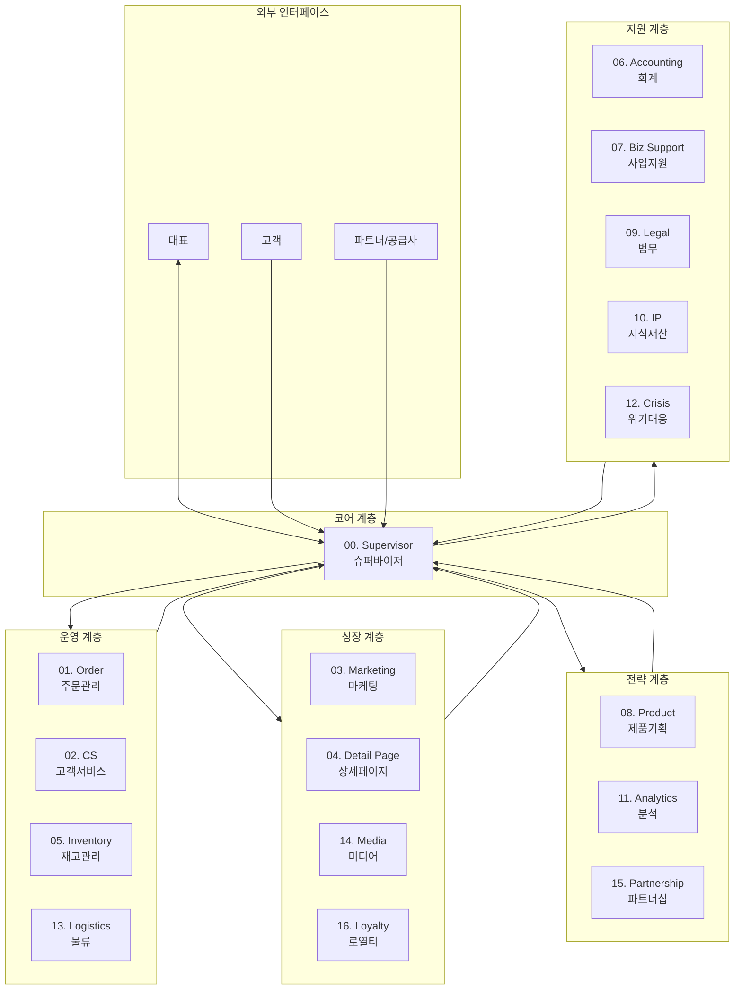
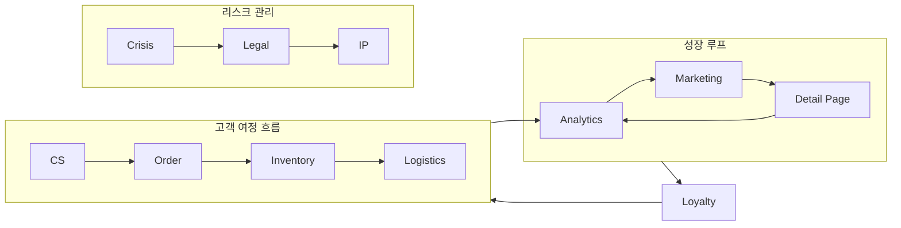
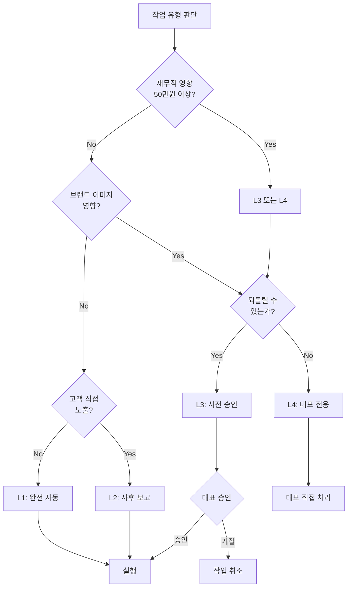
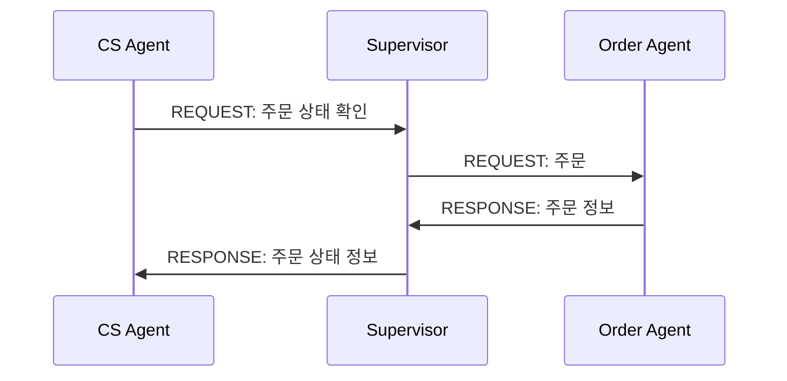
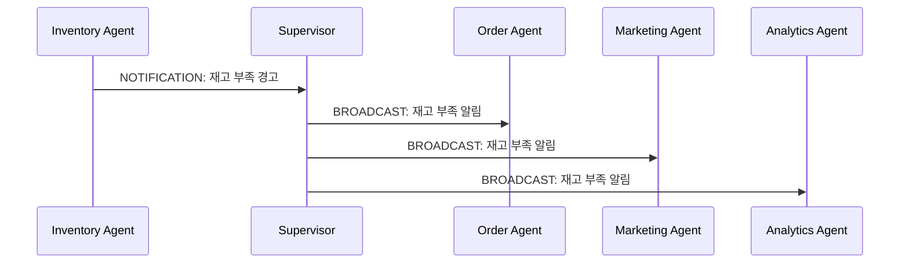
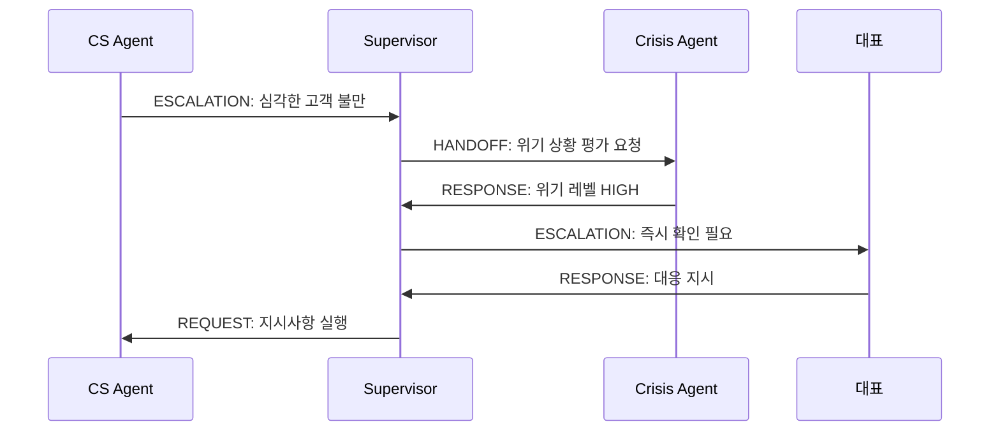
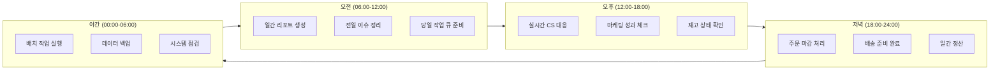

# 썬데이허그 AI 에이전트 시스템

> 1인 육아용품 이커머스 브랜드를 위한 멀티 에이전트 AI 운영 시스템

---

## 1. 시스템 개요

### 1.1 시스템 목적

썬데이허그 AI 에이전트 시스템은 1인 기업 대표가 효율적으로 이커머스 비즈니스를 운영할 수 있도록 지원하는 멀티 에이전트 시스템입니다. 고객 서비스부터 재고 관리, 마케팅, 법무까지 비즈니스 전 영역을 자동화하고 최적화합니다.

### 1.2 핵심 설계 원칙

| 원칙 | 설명 |
|------|------|
| **안전 최우선** | 아기 안전 관련 이슈는 최우선으로 처리하고 즉시 에스컬레이션 |
| **1인 기업 최적화** | 대표의 시간을 최대한 절약하면서 품질은 유지 |
| **점진적 자동화** | 검증된 영역부터 단계적으로 자동화 확대 |
| **투명한 의사결정** | 모든 결정의 근거와 과정을 기록하고 추적 가능 |
| **유연한 확장** | 비즈니스 성장에 따라 에이전트 추가 및 조정 가능 |

---

## 2. 에이전트 목록

### 2.1 전체 구조 (17개 메인 + 53개 서브)

```
총 에이전트: 70개
├── 메인 에이전트: 17개
└── 서브 에이전트: 53개
```

### 2.2 메인 에이전트 목록

| ID | 에이전트명 | 영문명 | 역할 | 서브 에이전트 수 |
|----|-----------|--------|------|-----------------|
| 00 | 슈퍼바이저 | Supervisor | 전체 오케스트레이션 및 라우팅 | 2 |
| 01 | 주문관리 | Order | 주문 처리 및 배송 관리 | 4 |
| 02 | 고객서비스 | CS | 고객 문의 응대 및 불만 처리 | 5 |
| 03 | 마케팅 | Marketing | 마케팅 전략 및 캠페인 실행 | 5 |
| 04 | 상세페이지 | Detail Page | 제품 상세페이지 최적화 | 3 |
| 05 | 재고관리 | Inventory | 재고 추적 및 발주 관리 | 3 |
| 06 | 회계 | Accounting | 매출/비용 관리 및 세무 | 4 |
| 07 | 사업지원 | Biz Support | 사업자 행정 및 인허가 | 3 |
| 08 | 제품기획 | Product | 신제품 기획 및 소싱 | 3 |
| 09 | 법무 | Legal | 계약 검토 및 법적 리스크 관리 | 3 |
| 10 | 지식재산 | IP | 상표/특허 관리 | 2 |
| 11 | 분석 | Analytics | 데이터 분석 및 인사이트 | 4 |
| 12 | 위기대응 | Crisis | 위기 상황 감지 및 대응 | 3 |
| 13 | 물류 | Logistics | 배송/물류 파트너 관리 | 3 |
| 14 | 미디어 | Media | 콘텐츠 제작 및 채널 관리 | 3 |
| 15 | 파트너십 | Partnership | 협업 및 제휴 관리 | 2 |
| 16 | 로열티 | Loyalty | 고객 충성도 및 CRM | 3 |

---

### 2.3 서브 에이전트 상세 목록

#### 00. Supervisor (슈퍼바이저)

| 서브 ID | 에이전트명 | 역할 |
|---------|-----------|------|
| 00-01 | Router | 요청 분류 및 적절한 에이전트로 라우팅 |
| 00-02 | Monitor | 전체 시스템 상태 모니터링 및 알림 |

#### 01. Order (주문관리)

| 서브 ID | 에이전트명 | 역할 |
|---------|-----------|------|
| 01-01 | OrderProcessor | 신규 주문 처리 및 검증 |
| 01-02 | ShippingTracker | 배송 상태 추적 및 고객 안내 |
| 01-03 | ReturnHandler | 반품/교환 접수 및 처리 |
| 01-04 | OrderAnalyzer | 주문 패턴 분석 및 이상 감지 |

#### 02. CS (고객서비스)

| 서브 ID | 에이전트명 | 역할 |
|---------|-----------|------|
| 02-01 | InquiryResponder | 일반 문의 응대 |
| 02-02 | ComplaintHandler | 불만/클레임 처리 |
| 02-03 | ReviewManager | 리뷰 모니터링 및 답글 작성 |
| 02-04 | FAQManager | FAQ 관리 및 자동 응답 |
| 02-05 | VIPSupport | VIP 고객 전담 지원 |

#### 03. Marketing (마케팅)

| 서브 ID | 에이전트명 | 역할 |
|---------|-----------|------|
| 03-01 | CampaignManager | 마케팅 캠페인 기획 및 실행 |
| 03-02 | AdOptimizer | 광고 성과 최적화 |
| 03-03 | SEOManager | 검색엔진 최적화 |
| 03-04 | SocialManager | SNS 채널 관리 |
| 03-05 | PromotionPlanner | 프로모션/할인 기획 |

#### 04. Detail Page (상세페이지)

| 서브 ID | 에이전트명 | 역할 |
|---------|-----------|------|
| 04-01 | ContentOptimizer | 상세페이지 콘텐츠 최적화 |
| 04-02 | ImageManager | 제품 이미지 관리 |
| 04-03 | ABTester | A/B 테스트 설계 및 분석 |

#### 05. Inventory (재고관리)

| 서브 ID | 에이전트명 | 역할 |
|---------|-----------|------|
| 05-01 | StockTracker | 실시간 재고 추적 |
| 05-02 | ReorderPlanner | 발주 시점 예측 및 제안 |
| 05-03 | SupplierManager | 공급사 관리 및 커뮤니케이션 |

#### 06. Accounting (회계)

| 서브 ID | 에이전트명 | 역할 |
|---------|-----------|------|
| 06-01 | RevenueTracker | 매출 추적 및 리포팅 |
| 06-02 | ExpenseManager | 비용 관리 및 분석 |
| 06-03 | TaxAssistant | 세금 계산 및 신고 지원 |
| 06-04 | InvoiceProcessor | 세금계산서 발행/관리 |

#### 07. Biz Support (사업지원)

| 서브 ID | 에이전트명 | 역할 |
|---------|-----------|------|
| 07-01 | AdminAssistant | 사업자 행정 업무 지원 |
| 07-02 | LicenseManager | 인허가/자격 관리 |
| 07-03 | DocumentManager | 사업 문서 관리 |

#### 08. Product (제품기획)

| 서브 ID | 에이전트명 | 역할 |
|---------|-----------|------|
| 08-01 | MarketResearcher | 시장 조사 및 트렌드 분석 |
| 08-02 | SourcingAssistant | 제품 소싱 지원 |
| 08-03 | QualityChecker | 품질 기준 관리 |

#### 09. Legal (법무)

| 서브 ID | 에이전트명 | 역할 |
|---------|-----------|------|
| 09-01 | ContractReviewer | 계약서 검토 및 분석 |
| 09-02 | ComplianceChecker | 법규 준수 확인 |
| 09-03 | DisputeManager | 분쟁 대응 지원 |

#### 10. IP (지식재산)

| 서브 ID | 에이전트명 | 역할 |
|---------|-----------|------|
| 10-01 | TrademarkManager | 상표 등록 및 관리 |
| 10-02 | IPMonitor | 지식재산 침해 모니터링 |

#### 11. Analytics (분석)

| 서브 ID | 에이전트명 | 역할 |
|---------|-----------|------|
| 11-01 | SalesAnalyzer | 판매 데이터 분석 |
| 11-02 | CustomerAnalyzer | 고객 행동 분석 |
| 11-03 | CompetitorAnalyzer | 경쟁사 모니터링 |
| 11-04 | ReportGenerator | 정기 리포트 생성 |

#### 12. Crisis (위기대응)

| 서브 ID | 에이전트명 | 역할 |
|---------|-----------|------|
| 12-01 | RiskDetector | 리스크 조기 감지 |
| 12-02 | CrisisResponder | 위기 상황 초기 대응 |
| 12-03 | ReputationManager | 평판 모니터링 및 관리 |

#### 13. Logistics (물류)

| 서브 ID | 에이전트명 | 역할 |
|---------|-----------|------|
| 13-01 | CarrierManager | 배송사 관리 및 선택 |
| 13-02 | WarehouseManager | 창고 운영 최적화 |
| 13-03 | DeliveryOptimizer | 배송 효율화 |

#### 14. Media (미디어)

| 서브 ID | 에이전트명 | 역할 |
|---------|-----------|------|
| 14-01 | ContentCreator | 콘텐츠 기획 및 제작 |
| 14-02 | ChannelManager | 미디어 채널 관리 |
| 14-03 | InfluencerManager | 인플루언서 협업 관리 |

#### 15. Partnership (파트너십)

| 서브 ID | 에이전트명 | 역할 |
|---------|-----------|------|
| 15-01 | PartnerFinder | 잠재 파트너 발굴 |
| 15-02 | CollaborationManager | 협업 프로젝트 관리 |

#### 16. Loyalty (로열티)

| 서브 ID | 에이전트명 | 역할 |
|---------|-----------|------|
| 16-01 | PointManager | 포인트/적립금 관리 |
| 16-02 | SegmentManager | 고객 세그먼트 관리 |
| 16-03 | RetentionManager | 이탈 방지 및 재구매 유도 |

---

## 3. 계층 구조 다이어그램

### 3.1 전체 시스템 아키텍처



### 3.2 에이전트 협업 구조



---

## 4. 자동화 레벨

### 4.1 자동화 레벨 정의

| 레벨 | 명칭 | 설명 | 대표 개입 |
|------|------|------|----------|
| **L1** | 완전 자동 | 승인 없이 즉시 실행 | 없음 |
| **L2** | 사후 보고 | 실행 후 일간/주간 리포트 | 사후 검토 |
| **L3** | 사전 승인 | 실행 전 대표 승인 필요 | 건별 승인 |
| **L4** | 대표 전용 | AI는 분석/제안만, 실행은 대표 | 직접 실행 |

### 4.2 에이전트별 기본 자동화 레벨

```yaml
automation_levels:
  # 운영 계층 - 높은 자동화
  order:
    order_confirmation: L1
    shipping_notification: L1
    delivery_tracking: L1
    return_request: L2
    refund_processing: L3

  cs:
    faq_response: L1
    inquiry_response: L1
    complaint_initial: L2
    refund_decision: L3
    legal_escalation: L4

  inventory:
    stock_alert: L1
    low_stock_warning: L1
    reorder_suggestion: L2
    reorder_execution: L3

  # 성장 계층 - 중간 자동화
  marketing:
    performance_report: L1
    sns_scheduling: L2
    ad_optimization: L2
    campaign_launch: L3
    budget_increase: L3

  detail_page:
    seo_suggestion: L2
    content_update: L3
    price_change: L3

  # 전략 계층 - 낮은 자동화
  product:
    market_research: L1
    trend_report: L2
    sourcing_suggestion: L3
    new_product_decision: L4

  analytics:
    data_collection: L1
    report_generation: L1
    insight_delivery: L2
    strategy_recommendation: L3

  # 지원 계층 - 상황별 자동화
  accounting:
    transaction_logging: L1
    expense_categorization: L1
    tax_calculation: L2
    payment_execution: L3

  legal:
    contract_review: L2
    compliance_check: L2
    legal_response: L4

  crisis:
    risk_detection: L1
    alert_notification: L1
    crisis_response: L3
    public_statement: L4
```

### 4.3 자동화 레벨 결정 기준



---

## 5. 에이전트 간 통신 방식

### 5.1 통신 프로토콜

#### 메시지 구조

```typescript
interface AgentMessage {
  // 메시지 식별
  messageId: string;           // 고유 메시지 ID
  conversationId: string;      // 대화 스레드 ID
  timestamp: string;           // ISO 8601 형식

  // 발신/수신
  from: {
    agentId: string;           // 발신 에이전트 ID
    agentType: 'main' | 'sub'; // 에이전트 유형
  };
  to: {
    agentId: string;           // 수신 에이전트 ID
    agentType: 'main' | 'sub';
  };

  // 메시지 내용
  type: MessageType;           // 메시지 유형
  priority: Priority;          // 우선순위
  payload: object;             // 실제 데이터
  context: object;             // 컨텍스트 정보

  // 메타데이터
  requiresResponse: boolean;   // 응답 필요 여부
  timeout: number;             // 타임아웃 (ms)
  retryCount: number;          // 재시도 횟수
}

type MessageType =
  | 'REQUEST'      // 작업 요청
  | 'RESPONSE'     // 응답
  | 'NOTIFICATION' // 알림 (응답 불필요)
  | 'ESCALATION'   // 에스컬레이션
  | 'HANDOFF'      // 작업 인계
  | 'BROADCAST';   // 전체 공지

type Priority =
  | 'CRITICAL'     // 즉시 처리 (안전 이슈)
  | 'HIGH'         // 1시간 내 처리
  | 'NORMAL'       // 당일 처리
  | 'LOW';         // 배치 처리 가능
```

### 5.2 통신 패턴

#### 1) 요청-응답 (Request-Response)



#### 2) 이벤트 브로드캐스트 (Event Broadcast)



#### 3) 에스컬레이션 (Escalation)



### 5.3 상태 공유 방식

#### 공유 컨텍스트 (Shared Context)

```yaml
shared_context:
  customer_context:
    description: "고객 관련 정보 공유"
    participants: [cs, order, loyalty, marketing]
    data:
      - customer_id
      - customer_tier
      - purchase_history
      - interaction_history
      - sentiment_score

  order_context:
    description: "주문 관련 정보 공유"
    participants: [order, inventory, logistics, accounting]
    data:
      - order_id
      - order_status
      - items
      - shipping_info
      - payment_info

  campaign_context:
    description: "마케팅 캠페인 정보 공유"
    participants: [marketing, detail_page, analytics, media]
    data:
      - campaign_id
      - target_segment
      - budget
      - performance_metrics
```

### 5.4 오류 처리 및 복구

```yaml
error_handling:
  timeout:
    action: "재시도 후 에스컬레이션"
    max_retries: 3
    backoff: "exponential"
    escalation_after: "3회 실패"

  agent_unavailable:
    action: "대체 에이전트 또는 큐잉"
    fallback:
      cs: "supervisor"
      order: "supervisor"
      default: "supervisor"

  invalid_response:
    action: "검증 후 재요청"
    validation: "schema_check"
    log_level: "warning"

  critical_failure:
    action: "즉시 에스컬레이션"
    notify: ["supervisor", "ceo"]
    log_level: "error"
```

---

## 6. 시스템 운영 가이드

### 6.1 에이전트 상태 모니터링

| 상태 | 설명 | 대응 |
|------|------|------|
| `ACTIVE` | 정상 운영 중 | - |
| `BUSY` | 작업 처리 중 | 큐잉 |
| `IDLE` | 대기 상태 | - |
| `DEGRADED` | 성능 저하 | 모니터링 강화 |
| `ERROR` | 오류 발생 | 자동 복구 시도 |
| `OFFLINE` | 비활성화 | 대체 에이전트 활성화 |

### 6.2 일간 운영 사이클



### 6.3 주간 점검 항목

| 영역 | 점검 항목 | 담당 에이전트 |
|------|----------|--------------|
| 고객 | CS 응답 시간 평균 | CS, Supervisor |
| 고객 | 고객 만족도 점수 | CS, Analytics |
| 운영 | 재고 회전율 | Inventory |
| 운영 | 배송 정시율 | Logistics |
| 성장 | 마케팅 ROI | Marketing, Analytics |
| 성장 | 전환율 변화 | Detail Page, Analytics |
| 재무 | 매출/비용 추이 | Accounting |
| 리스크 | 부정 리뷰 현황 | CS, Crisis |

---

## 7. 문서 네비게이션

### 7.1 에이전트 상세 문서

각 에이전트의 상세 문서는 해당 디렉토리의 `main.md` 파일을 참조하세요:

- [00. Supervisor](./00-supervisor/main.md)
- [01. Order](./01-order/main.md)
- [02. CS](./02-cs/main.md)
- [03. Marketing](./03-marketing/main.md)
- [04. Detail Page](./04-detail-page/main.md)
- [05. Inventory](./05-inventory/main.md)
- [06. Accounting](./06-accounting/main.md)
- [07. Biz Support](./07-biz-support/main.md)
- [08. Product](./08-product/main.md)
- [09. Legal](./09-legal/main.md)
- [10. IP](./10-ip/main.md)
- [11. Analytics](./11-analytics/main.md)
- [12. Crisis](./12-crisis/main.md)
- [13. Logistics](./13-logistics/main.md)
- [14. Media](./14-media/main.md)
- [15. Partnership](./15-partnership/main.md)
- [16. Loyalty](./16-loyalty/main.md)

### 7.2 관련 문서

- [에이전트 문서 템플릿](./_agent-template.md)
- [미션/비전/핵심가치](../ontology/mission-vision.md)
- [브랜드 보이스 가이드](../ontology/brand-voice.md)
- [타겟 고객 정의](../ontology/target-customer.md)
- [제품 분류 체계](../ontology/product-taxonomy.md)

---

## 8. 버전 이력

| 버전 | 날짜 | 작성자 | 변경 내용 |
|------|------|--------|----------|
| 1.0 | 2025-01-26 | AI System | 최초 작성 |

---

*이 문서는 썬데이허그 AI 에이전트 시스템의 전체 구조를 설명합니다. 각 에이전트의 상세 동작은 개별 문서를 참조하세요.*
