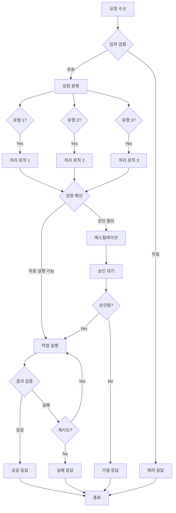
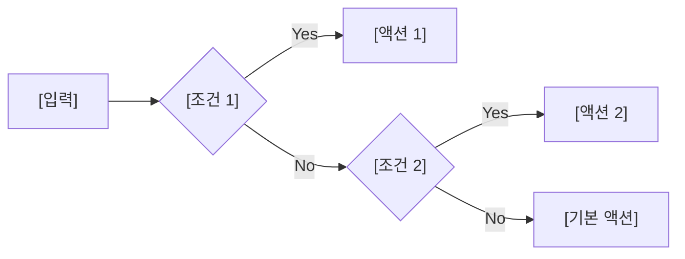
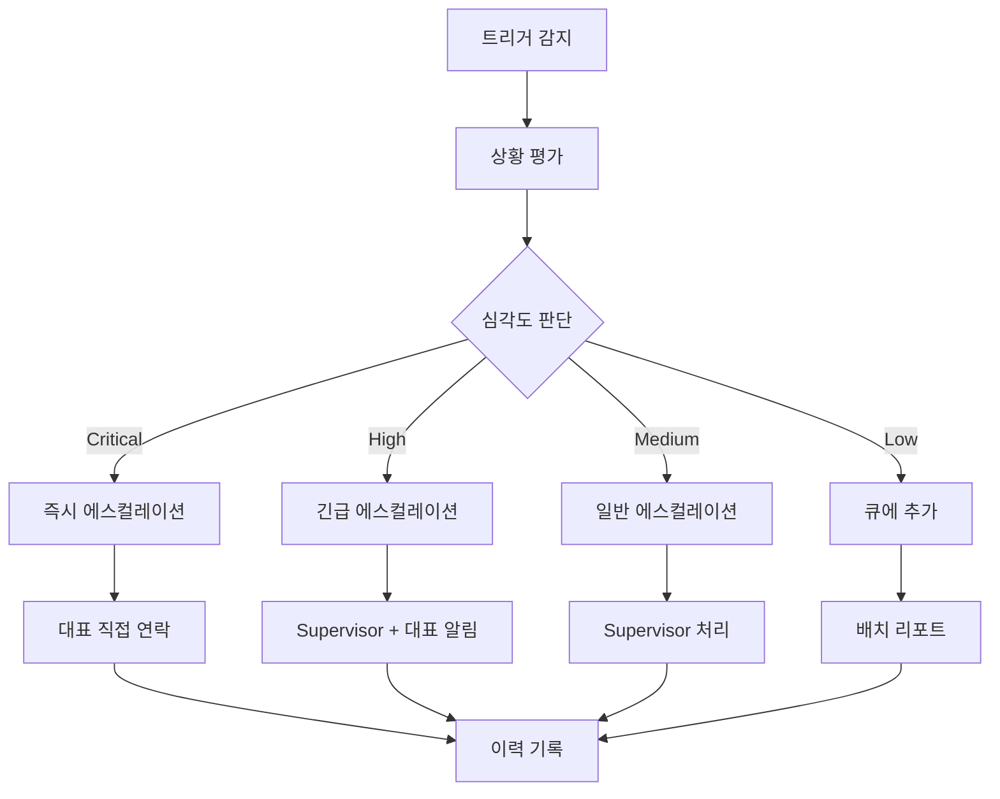
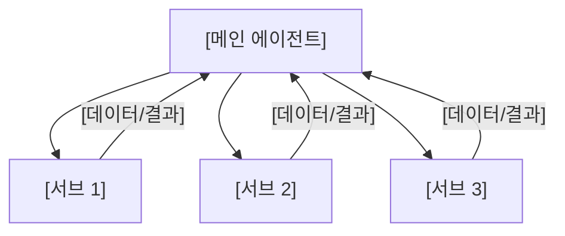
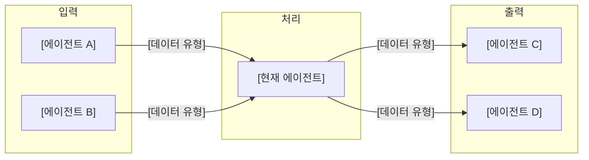

# 에이전트 문서 템플릿

> 이 문서는 썬데이허그 AI 에이전트 시스템의 모든 에이전트 문서 작성을 위한 표준 템플릿입니다.
> 새로운 에이전트 문서 작성 시 이 템플릿을 복사하여 사용하세요.

---

# [에이전트 이름] 에이전트

> [한 줄 설명: 이 에이전트의 핵심 역할]

---

## 1. 기본 정보

### 1.1 에이전트 식별 정보

| 항목 | 값 |
|------|-----|
| **Agent ID** | `[XX-YY]` (예: `02-01`) |
| **Agent Name** | `[영문명]` (예: `InquiryResponder`) |
| **한글명** | [한글명] (예: 문의응대 에이전트) |
| **유형** | `main` / `sub` |
| **상위 에이전트** | `[상위 에이전트 ID]` 또는 `none` (메인 에이전트의 경우) |
| **버전** | `1.0.0` |
| **최종 수정일** | `YYYY-MM-DD` |

### 1.2 에이전트 분류

```yaml
classification:
  domain: "[도메인]"           # customer_service, operations, growth, strategy, support
  layer: "[계층]"              # core, operations, growth, strategy, support
  automation_level: "L[1-4]"   # 기본 자동화 레벨
  criticality: "[등급]"        # critical, high, medium, low
```

---

## 2. 역할과 책임

### 2.1 핵심 역할

[에이전트의 핵심 역할을 2-3문장으로 설명]

### 2.2 주요 책임 (Responsibilities)

| 책임 | 설명 | 자동화 레벨 |
|------|------|------------|
| [책임 1] | [설명] | L[1-4] |
| [책임 2] | [설명] | L[1-4] |
| [책임 3] | [설명] | L[1-4] |

### 2.3 경계 (Boundaries)

#### 이 에이전트가 하는 것 (In Scope)

- [범위 내 업무 1]
- [범위 내 업무 2]
- [범위 내 업무 3]

#### 이 에이전트가 하지 않는 것 (Out of Scope)

- [범위 외 업무 1] -> [담당 에이전트]
- [범위 외 업무 2] -> [담당 에이전트]
- [범위 외 업무 3] -> [담당 에이전트]

---

## 3. 권한 (Permissions)

### 3.1 데이터 접근 권한

| 데이터 유형 | 조회 | 생성 | 수정 | 삭제 |
|------------|:----:|:----:|:----:|:----:|
| [데이터 유형 1] | O | O | O | X |
| [데이터 유형 2] | O | O | X | X |
| [데이터 유형 3] | O | X | X | X |

### 3.2 시스템 접근 권한

| 시스템/API | 권한 레벨 | 설명 |
|-----------|----------|------|
| [시스템 1] | `read` / `write` / `admin` | [설명] |
| [시스템 2] | `read` / `write` / `admin` | [설명] |

### 3.3 실행 권한

```yaml
execution_permissions:
  autonomous:  # 승인 없이 실행 가능
    - "[작업 1]"
    - "[작업 2]"

  requires_approval:  # 승인 필요
    - action: "[작업 3]"
      approver: "supervisor"
      condition: "[조건]"

    - action: "[작업 4]"
      approver: "ceo"
      condition: "[조건]"

  prohibited:  # 금지된 작업
    - "[작업 5]"
    - "[작업 6]"
```

---

## 4. 도구 목록 (Tools)

### 4.1 사용 가능한 도구

| Tool ID | Tool Name | 용도 | 사용 빈도 |
|---------|-----------|------|----------|
| `tool-001` | [도구명] | [용도 설명] | 높음/중간/낮음 |
| `tool-002` | [도구명] | [용도 설명] | 높음/중간/낮음 |

### 4.2 도구 상세 스펙

#### Tool: [도구명]

```yaml
tool_id: "tool-001"
name: "[도구명]"
description: "[도구 설명]"

input:
  required:
    - name: "[파라미터명]"
      type: "string | number | boolean | object"
      description: "[설명]"
  optional:
    - name: "[파라미터명]"
      type: "string"
      default: "[기본값]"
      description: "[설명]"

output:
  type: "object"
  schema:
    status: "string"
    data: "object"
    error: "string | null"

example:
  input:
    param1: "value1"
    param2: 123
  output:
    status: "success"
    data:
      result: "..."
    error: null

rate_limit:
  requests_per_minute: 60
  daily_quota: 10000
```

---

## 5. 입력/출력 정의

### 5.1 입력 (Input)

#### 트리거 이벤트

| 이벤트 | 소스 | 설명 |
|--------|------|------|
| `[event_name]` | [소스 에이전트/시스템] | [설명] |

#### 입력 스키마

```typescript
interface AgentInput {
  // 필수 필드
  requestId: string;
  requestType: RequestType;
  payload: {
    // 요청 유형별 페이로드
  };

  // 선택 필드
  context?: {
    customerId?: string;
    orderId?: string;
    sessionId?: string;
  };

  // 메타데이터
  metadata: {
    timestamp: string;
    source: string;
    priority: Priority;
  };
}

type RequestType =
  | '[요청유형1]'
  | '[요청유형2]'
  | '[요청유형3]';
```

### 5.2 출력 (Output)

#### 출력 이벤트

| 이벤트 | 대상 | 설명 |
|--------|------|------|
| `[event_name]` | [대상 에이전트/시스템] | [설명] |

#### 출력 스키마

```typescript
interface AgentOutput {
  // 응답 식별
  responseId: string;
  requestId: string;  // 원본 요청 참조

  // 결과
  status: 'success' | 'failure' | 'pending' | 'escalated';
  result: {
    // 결과 데이터
  };

  // 에러 정보 (실패 시)
  error?: {
    code: string;
    message: string;
    details?: object;
  };

  // 후속 작업
  nextActions?: {
    action: string;
    target: string;
    payload: object;
  }[];

  // 메타데이터
  metadata: {
    processingTime: number;  // ms
    timestamp: string;
  };
}
```

---

## 6. 의사결정 로직

### 6.1 메인 플로우차트



### 6.2 세부 결정 로직

#### [결정 포인트 1]: [결정 설명]



**결정 기준:**

| 조건 | 판단 기준 | 결과 액션 |
|------|----------|----------|
| [조건 1] | [구체적 기준] | [액션] |
| [조건 2] | [구체적 기준] | [액션] |
| 기본 | - | [기본 액션] |

### 6.3 우선순위 규칙

```yaml
priority_rules:
  1:
    condition: "[조건: 예) 안전 관련 이슈]"
    action: "즉시 처리"
    sla: "5분 이내"

  2:
    condition: "[조건: 예) VIP 고객 요청]"
    action: "우선 처리"
    sla: "30분 이내"

  3:
    condition: "[조건: 예) 일반 요청]"
    action: "순서대로 처리"
    sla: "24시간 이내"
```

---

## 7. 에스컬레이션 규칙

### 7.1 에스컬레이션 트리거

| 트리거 | 조건 | 대상 | 긴급도 |
|--------|------|------|--------|
| [트리거 1] | [구체적 조건] | [대상 에이전트/대표] | 즉시/높음/보통 |
| [트리거 2] | [구체적 조건] | [대상 에이전트/대표] | 즉시/높음/보통 |

### 7.2 에스컬레이션 흐름



### 7.3 에스컬레이션 메시지 템플릿

```yaml
escalation_template:
  subject: "[{긴급도}] {에이전트명} - {요약}"

  body:
    situation: |
      ## 상황
      - 발생 시각: {timestamp}
      - 관련 고객/주문: {reference_id}
      - 요약: {summary}

    context: |
      ## 맥락
      {detailed_context}

    attempted_actions: |
      ## 시도한 조치
      {actions_taken}

    options: |
      ## 선택지
      1. {option_1} - {pros_cons}
      2. {option_2} - {pros_cons}
      3. {option_3} - {pros_cons}

    recommendation: |
      ## AI 추천
      {recommendation}
      이유: {reasoning}

    deadline: |
      ## 의사결정 필요 시점
      {deadline}
```

---

## 8. KPI (핵심 성과 지표)

### 8.1 주요 KPI

| KPI | 정의 | 목표 | 측정 주기 |
|-----|------|------|----------|
| [KPI 1] | [정의] | [목표값] | 일간/주간/월간 |
| [KPI 2] | [정의] | [목표값] | 일간/주간/월간 |
| [KPI 3] | [정의] | [목표값] | 일간/주간/월간 |

### 8.2 KPI 계산 공식

```yaml
kpi_definitions:
  kpi_1:
    name: "[KPI명]"
    formula: "[계산 공식]"
    data_source: "[데이터 소스]"
    threshold:
      excellent: ">= [값]"
      good: ">= [값]"
      acceptable: ">= [값]"
      poor: "< [값]"

  kpi_2:
    name: "[KPI명]"
    formula: "[계산 공식]"
    data_source: "[데이터 소스]"
    threshold:
      excellent: "<= [값]"
      good: "<= [값]"
      acceptable: "<= [값]"
      poor: "> [값]"
```

### 8.3 KPI 대시보드

```
+------------------------------------------+
|         [에이전트명] KPI 대시보드         |
+------------------------------------------+
| [KPI 1]: ████████░░ 80% (목표: 90%)      |
| [KPI 2]: ██████████ 100% (목표: 95%)     |
| [KPI 3]: ██████░░░░ 60% (목표: 80%)      |
+------------------------------------------+
| 최근 7일 추이:                            |
| [KPI 1]: ↑ 5% 상승                       |
| [KPI 2]: → 유지                          |
| [KPI 3]: ↓ 10% 하락                      |
+------------------------------------------+
```

---

## 9. 서브 에이전트 (메인 에이전트인 경우)

### 9.1 서브 에이전트 목록

| Sub ID | 에이전트명 | 역할 | 문서 링크 |
|--------|-----------|------|----------|
| [XX-01] | [이름] | [역할] | [링크] |
| [XX-02] | [이름] | [역할] | [링크] |

### 9.2 서브 에이전트 협업 구조



---

## 10. 연관 에이전트

### 10.1 의존 관계

| 관계 유형 | 에이전트 | 설명 |
|----------|---------|------|
| 상위 | [에이전트명] | [관계 설명] |
| 하위 | [에이전트명] | [관계 설명] |
| 협업 | [에이전트명] | [관계 설명] |
| 참조 | [에이전트명] | [관계 설명] |

### 10.2 데이터 흐름



---

## 11. 에러 핸들링

### 11.1 에러 유형 및 대응

| 에러 코드 | 에러 유형 | 원인 | 대응 방법 |
|----------|----------|------|----------|
| `E001` | [에러 유형] | [원인] | [대응] |
| `E002` | [에러 유형] | [원인] | [대응] |
| `E003` | [에러 유형] | [원인] | [대응] |

### 11.2 재시도 정책

```yaml
retry_policy:
  default:
    max_attempts: 3
    backoff_type: "exponential"  # linear, exponential, fixed
    initial_delay: 1000  # ms
    max_delay: 30000  # ms
    jitter: true

  by_error_type:
    transient:  # 일시적 오류 (네트워크 등)
      max_attempts: 5
      backoff_type: "exponential"

    rate_limit:  # 속도 제한
      max_attempts: 3
      backoff_type: "fixed"
      initial_delay: 60000

    permanent:  # 영구적 오류
      max_attempts: 1  # 재시도 없음
```

### 11.3 폴백 전략

```yaml
fallback_strategy:
  primary_failure:
    action: "[대체 액션]"
    notify: "[알림 대상]"

  complete_failure:
    action: "escalate_to_supervisor"
    message: "[에스컬레이션 메시지]"
```

---

## 12. 로깅 및 모니터링

### 12.1 로깅 정책

```yaml
logging:
  levels:
    DEBUG: "개발 환경에서만"
    INFO: "모든 정상 작업"
    WARN: "잠재적 문제"
    ERROR: "오류 발생"
    CRITICAL: "시스템 장애"

  required_fields:
    - timestamp
    - agent_id
    - request_id
    - action
    - status
    - duration_ms

  sensitive_data:
    mask:
      - customer_phone
      - customer_email
      - payment_info
    exclude:
      - password
      - api_key
```

### 12.2 알림 규칙

| 조건 | 알림 채널 | 수신자 |
|------|----------|--------|
| [조건 1] | Slack / 카카오톡 / Email | [수신자] |
| [조건 2] | Slack / 카카오톡 / Email | [수신자] |

---

## 13. 변경 이력

| 버전 | 날짜 | 작성자 | 변경 내용 |
|------|------|--------|----------|
| 1.0.0 | YYYY-MM-DD | [작성자] | 최초 작성 |
| 1.0.1 | YYYY-MM-DD | [작성자] | [변경 내용] |

---

## 14. 관련 문서

- [에이전트 시스템 개요](../README.md)
- [미션/비전/핵심가치](../../ontology/mission-vision.md)
- [브랜드 보이스 가이드](../../ontology/brand-voice.md)
- [관련 에이전트 문서 링크]

---

*이 문서는 [에이전트명] 에이전트의 상세 스펙을 정의합니다. 문의사항은 시스템 관리자에게 연락하세요.*
