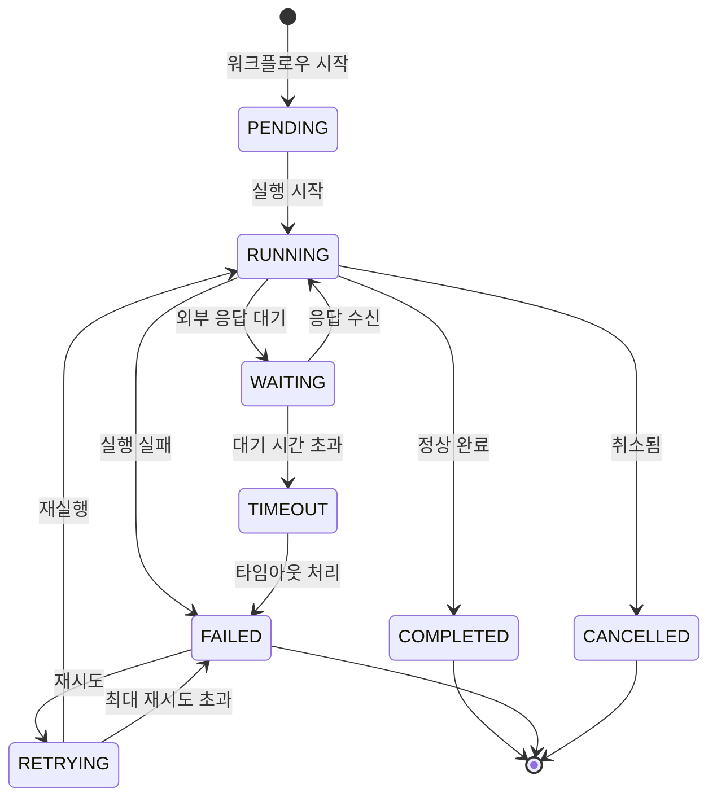
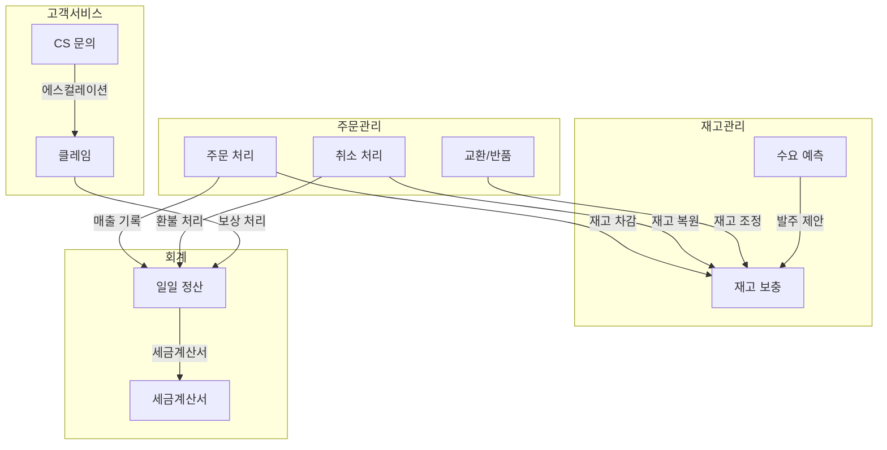

# 썬데이허그 AI 에이전트 토폴로지 시스템

## 개요

썬데이허그 AI 에이전트 시스템은 이커머스 운영의 모든 업무 영역을 자동화하는 **21개의 핵심 워크플로우**로 구성됩니다. 각 워크플로우는 특정 비즈니스 프로세스를 담당하며, 복수의 AI 에이전트가 협업하여 작업을 수행합니다.

---

## 워크플로우 카테고리

### 1. 주문 관리 (Order Management)
| ID | 워크플로우명 | 설명 | 트리거 |
|----|-------------|------|--------|
| `WF-ORD-001` | [주문 처리](./workflows/order-flow.md) | 주문 접수부터 배송 완료까지 전체 프로세스 | Event |
| `WF-ORD-002` | 주문 취소 처리 | 고객/판매자 취소 요청 처리 | Event |
| `WF-ORD-003` | 교환/반품 처리 | 교환 및 반품 요청 처리 | Event |
| `WF-ORD-004` | 부분 출고 처리 | 재고 부족 시 분할 배송 처리 | Event |

### 2. 고객 서비스 (Customer Service)
| ID | 워크플로우명 | 설명 | 트리거 |
|----|-------------|------|--------|
| `WF-CS-001` | [CS 문의 처리](./workflows/cs-inquiry-flow.md) | 고객 문의 접수 및 응대 | Event |
| `WF-CS-002` | 클레임 처리 | 고객 불만/클레임 에스컬레이션 | Event |
| `WF-CS-003` | 리뷰 관리 | 상품 리뷰 모니터링 및 응대 | Schedule |
| `WF-CS-004` | VOC 분석 | 고객 피드백 수집 및 인사이트 도출 | Schedule |

### 3. 마케팅 (Marketing)
| ID | 워크플로우명 | 설명 | 트리거 |
|----|-------------|------|--------|
| `WF-MKT-001` | 프로모션 실행 | 할인/이벤트 캠페인 자동 실행 | Schedule |
| `WF-MKT-002` | 타겟 마케팅 | 고객 세그먼트별 맞춤 마케팅 | Schedule |
| `WF-MKT-003` | 콘텐츠 발행 | SNS/블로그 콘텐츠 자동 발행 | Schedule |
| `WF-MKT-004` | 리마케팅 | 장바구니 이탈/재구매 유도 | Event |

### 4. 재고 관리 (Inventory Management)
| ID | 워크플로우명 | 설명 | 트리거 |
|----|-------------|------|--------|
| `WF-INV-001` | 재고 보충 | 안전재고 도달 시 자동 발주 | Event |
| `WF-INV-002` | 재고 실사 | 정기 재고 조사 및 보정 | Schedule |
| `WF-INV-003` | 수요 예측 | AI 기반 판매량 예측 | Schedule |

### 5. 회계/정산 (Accounting)
| ID | 워크플로우명 | 설명 | 트리거 |
|----|-------------|------|--------|
| `WF-ACC-001` | 일일 정산 | 매출/비용 일일 마감 | Schedule |
| `WF-ACC-002` | 정산 리포트 | 주간/월간 정산 보고서 생성 | Schedule |
| `WF-ACC-003` | 세금계산서 발행 | 전자세금계산서 자동 발행 | Event |

### 6. 운영 관리 (Operations)
| ID | 워크플로우명 | 설명 | 트리거 |
|----|-------------|------|--------|
| `WF-OPS-001` | 시스템 모니터링 | 서비스 상태 및 이상 감지 | Schedule |
| `WF-OPS-002` | 데이터 백업 | 정기 데이터 백업 및 검증 | Schedule |
| `WF-OPS-003` | 성과 리포트 | KPI 대시보드 자동 갱신 | Schedule |

---

## 워크플로우 실행 방식

### 1. 이벤트 트리거 (Event-Driven)
실시간으로 발생하는 비즈니스 이벤트에 반응하여 즉시 실행됩니다.

```yaml
trigger_type: event
event_source:
  - webhook      # 외부 API 호출
  - message_queue  # 메시지 큐 (Kafka, SQS)
  - database_change  # DB 변경 감지 (CDC)
  - user_action    # 사용자 액션
```

**예시 이벤트:**
- `order.created` - 신규 주문 생성
- `inquiry.received` - CS 문의 접수
- `inventory.low_stock` - 재고 부족 알림
- `payment.failed` - 결제 실패

### 2. 스케줄 트리거 (Scheduled)
정해진 시간에 주기적으로 실행됩니다.

```yaml
trigger_type: schedule
schedule_type:
  - cron: "0 9 * * *"    # 매일 오전 9시
  - interval: "1h"       # 1시간마다
  - daily: "09:00"       # 매일 특정 시각
  - weekly: "MON 10:00"  # 매주 특정 요일
```

**예시 스케줄:**
- 일일 정산: 매일 23:55
- 재고 실사: 매주 월요일 09:00
- 리뷰 모니터링: 매 4시간

### 3. 수동 트리거 (Manual)
관리자가 필요에 따라 직접 실행합니다.

```yaml
trigger_type: manual
authorization:
  - role: admin
  - role: operation_manager
  - specific_permission: workflow.execute
```

---

## 상태 머신 (State Machine)

모든 워크플로우는 다음 상태를 기반으로 동작합니다.

### 워크플로우 인스턴스 상태



### 상태 정의

| 상태 | 코드 | 설명 |
|------|------|------|
| 대기 | `PENDING` | 실행 전 대기 상태 |
| 실행 중 | `RUNNING` | 워크플로우 실행 중 |
| 대기 | `WAITING` | 외부 응답/승인 대기 |
| 재시도 | `RETRYING` | 실패 후 재시도 중 |
| 완료 | `COMPLETED` | 정상 완료 |
| 실패 | `FAILED` | 실행 실패 |
| 취소 | `CANCELLED` | 사용자/시스템 취소 |
| 타임아웃 | `TIMEOUT` | 대기 시간 초과 |

### 재시도 정책

```yaml
retry_policy:
  max_attempts: 3
  backoff_type: exponential  # linear, exponential, fixed
  initial_delay: 1000ms
  max_delay: 30000ms
  retryable_errors:
    - NETWORK_ERROR
    - TIMEOUT
    - RATE_LIMIT
  non_retryable_errors:
    - VALIDATION_ERROR
    - AUTHORIZATION_ERROR
    - BUSINESS_RULE_VIOLATION
```

---

## 워크플로우 간 의존성



---

## 에이전트-워크플로우 매핑

각 워크플로우에서 활성화되는 주요 에이전트:

| 워크플로우 | Primary Agent | Supporting Agents |
|-----------|---------------|-------------------|
| 주문 처리 | `order-agent` | `inventory-agent`, `payment-agent`, `shipping-agent` |
| CS 문의 | `cs-agent` | `knowledge-agent`, `sentiment-agent` |
| 프로모션 | `marketing-agent` | `segment-agent`, `content-agent` |
| 재고 보충 | `inventory-agent` | `forecast-agent`, `supplier-agent` |
| 정산 | `accounting-agent` | `report-agent` |

---

## 모니터링 및 알림

### 모니터링 메트릭

```yaml
metrics:
  - workflow_execution_count
  - workflow_success_rate
  - workflow_duration_seconds
  - workflow_error_count
  - step_execution_time
  - agent_response_time
```

### 알림 조건

| 조건 | 심각도 | 채널 |
|------|--------|------|
| 워크플로우 실패 | HIGH | Slack, Email |
| 실행 시간 SLA 초과 | MEDIUM | Slack |
| 에러율 임계치 초과 | HIGH | Slack, PagerDuty |
| 대기 상태 장기화 | MEDIUM | Slack |

---

## 관련 문서

- [워크플로우 템플릿](./_workflow-template.md) - 워크플로우 문서 작성 표준
- [에이전트 명세](../agents/) - 개별 에이전트 상세 스펙
- [온톨로지](../ontology/) - 비즈니스 도메인 정의
- [스케줄 설정](../../schedules/cron-jobs.md) - 크론잡 설정

---

## 버전 이력

| 버전 | 날짜 | 작성자 | 변경 내용 |
|------|------|--------|----------|
| 1.0.0 | 2025-01-26 | AI Agent | 초기 문서 작성 |
