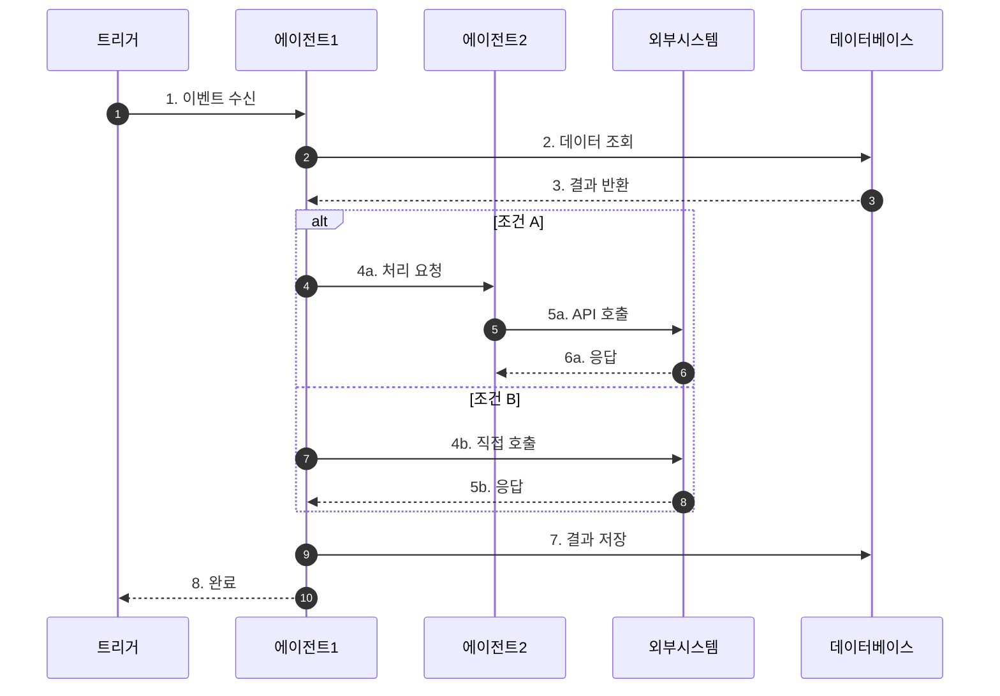
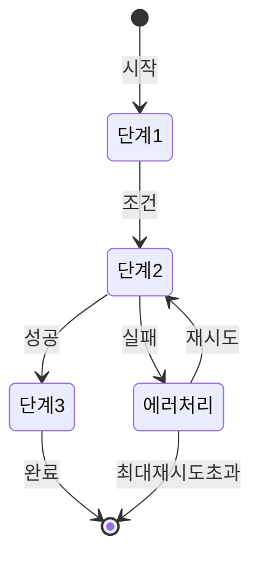
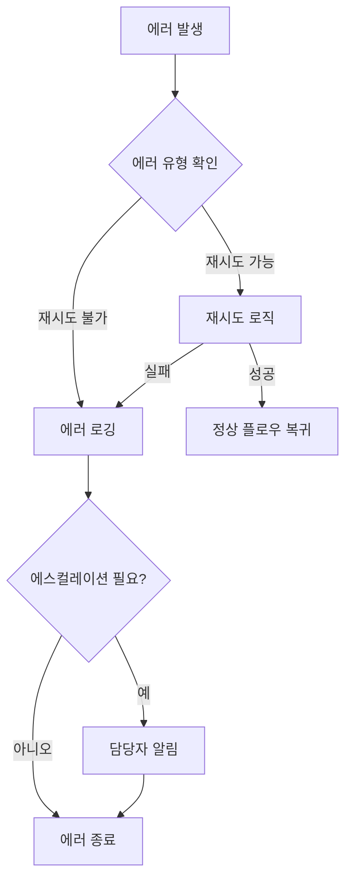

# 워크플로우 문서 템플릿

> 이 문서는 썬데이허그 AI 에이전트 시스템의 워크플로우 문서 작성을 위한 표준 템플릿입니다.
> 새로운 워크플로우 문서 작성 시 이 템플릿을 복사하여 사용하세요.

---

# [워크플로우명] (Workflow Name)

## 기본 정보

| 항목 | 값 |
|------|-----|
| **워크플로우 ID** | `WF-XXX-000` |
| **버전** | 1.0.0 |
| **카테고리** | 주문관리 / CS / 마케팅 / 재고 / 회계 / 운영 |
| **트리거 유형** | Event / Schedule / Manual |
| **SLA** | 응답: 5초 / 완료: 30분 |
| **자동화 수준** | Full-Auto / Semi-Auto / Human-in-the-Loop |
| **우선순위** | Critical / High / Medium / Low |
| **담당 팀** | Operations |
| **최종 수정** | YYYY-MM-DD |

---

## 트리거 조건

### 이벤트 트리거 (Event Trigger)

| 이벤트명 | 소스 | 조건 | 설명 |
|----------|------|------|------|
| `event.name` | webhook / mq / db | 조건식 | 상세 설명 |
| `order.created` | webhook | `status == 'pending'` | 신규 주문 생성 시 |

### 스케줄 트리거 (Schedule Trigger)

```yaml
schedule:
  cron: "0 9 * * *"  # 매일 오전 9시
  timezone: "Asia/Seoul"
  enabled: true
```

### 수동 트리거 (Manual Trigger)

```yaml
manual:
  allowed_roles:
    - admin
    - operation_manager
  required_params:
    - order_id: string
    - reason: string
  confirmation_required: true
```

---

## 프로세스 흐름

### 전체 흐름도



### 상태 전이도



---

## 단계별 상세

### Step 1: [단계명]

| 항목 | 내용 |
|------|------|
| **Step ID** | `STEP-001` |
| **담당 에이전트** | `agent-name` |
| **설명** | 이 단계에서 수행하는 작업 설명 |
| **SLA** | 5초 |
| **재시도** | 3회, exponential backoff |

**입력 (Input)**

```json
{
  "param1": "string - 필수 - 설명",
  "param2": "number - 선택 - 설명",
  "context": {
    "workflow_id": "string",
    "timestamp": "ISO8601"
  }
}
```

**처리 로직 (Processing)**

```python
# 의사 코드로 처리 로직 설명
def process_step_1(input):
    # 1. 입력 검증
    validate(input)

    # 2. 비즈니스 로직 수행
    result = do_something(input)

    # 3. 결과 반환
    return result
```

**출력 (Output)**

```json
{
  "success": true,
  "data": {
    "result_field": "value"
  },
  "next_step": "STEP-002",
  "metadata": {
    "processing_time_ms": 150
  }
}
```

**분기 조건 (Branching)**

| 조건 | 다음 단계 | 설명 |
|------|----------|------|
| `result.status == 'success'` | STEP-002 | 정상 처리 |
| `result.status == 'pending'` | STEP-001-WAIT | 대기 상태로 전환 |
| `result.status == 'error'` | ERROR-HANDLER | 에러 처리 |

---

### Step 2: [단계명]

> Step 1과 동일한 형식으로 작성

---

## 분기 조건 테이블

전체 워크플로우의 분기 조건을 한눈에 파악할 수 있는 테이블:

| 단계 | 조건 | True 분기 | False 분기 | 비고 |
|------|------|-----------|------------|------|
| STEP-001 | `input.valid == true` | STEP-002 | ERROR-001 | 입력 검증 |
| STEP-002 | `amount > 50000` | STEP-003A | STEP-003B | 금액 기준 분기 |
| STEP-003A | `inventory.available == true` | STEP-004 | WAIT-001 | 재고 확인 |
| STEP-003B | - | STEP-004 | - | 단일 경로 |

---

## 예외 처리

### 예외 유형 및 처리 방법

| 예외 코드 | 예외 유형 | 원인 | 처리 방법 | 에스컬레이션 |
|----------|----------|------|----------|-------------|
| `ERR-001` | ValidationError | 입력값 오류 | 오류 메시지 반환, 재입력 요청 | N/A |
| `ERR-002` | TimeoutError | 외부 API 응답 지연 | 3회 재시도 후 대기 | 5분 후 담당자 알림 |
| `ERR-003` | BusinessRuleViolation | 비즈니스 규칙 위반 | 트랜잭션 롤백 | 즉시 담당자 알림 |
| `ERR-004` | SystemError | 시스템 오류 | 자동 복구 시도 | 즉시 개발팀 알림 |

### 에러 핸들링 플로우



### 보상 트랜잭션 (Compensation)

| 단계 | 보상 액션 | 조건 |
|------|----------|------|
| STEP-002 | `rollback_payment()` | 결제 후 재고 없음 |
| STEP-003 | `restore_inventory()` | 출고 후 배송 실패 |
| STEP-004 | `cancel_shipment()` | 배송 중 취소 요청 |

---

## 관련 데이터

### 읽기 데이터 (Read)

| 데이터 | 소스 | 용도 | 접근 빈도 |
|--------|------|------|----------|
| 주문 정보 | `orders` 테이블 | 주문 상세 확인 | 매 실행 |
| 고객 정보 | `customers` 테이블 | 배송지/연락처 확인 | 매 실행 |
| 상품 정보 | `products` 테이블 | 상품 상세 확인 | 매 실행 |
| 재고 정보 | `inventory` 테이블 | 가용 재고 확인 | 매 실행 |
| 설정 정보 | `config` 캐시 | 비즈니스 규칙 | 시작 시 1회 |

### 쓰기 데이터 (Write)

| 데이터 | 대상 | 용도 | 타이밍 |
|--------|------|------|--------|
| 주문 상태 | `orders` 테이블 | 상태 업데이트 | 각 단계 완료 시 |
| 재고 수량 | `inventory` 테이블 | 재고 차감/복원 | 출고 확정/취소 시 |
| 이력 로그 | `workflow_logs` 테이블 | 처리 이력 기록 | 매 단계 |
| 이벤트 | 메시지 큐 | 다운스트림 알림 | 완료 시 |

### 외부 API 연동

| API | 용도 | 메서드 | 엔드포인트 |
|-----|------|--------|-----------|
| 결제 게이트웨이 | 결제 확인 | GET | `/api/v1/payments/{id}` |
| 배송사 API | 배송 요청 | POST | `/api/v1/shipments` |
| 알림 서비스 | 고객 알림 | POST | `/api/v1/notifications` |

---

## 알림 설정

### 고객 알림

| 시점 | 채널 | 템플릿 ID | 조건 |
|------|------|----------|------|
| 단계1 완료 | SMS, Push | `TPL-001` | 항상 |
| 단계3 완료 | Email | `TPL-002` | 이메일 수신 동의 시 |
| 에러 발생 | Push | `TPL-ERR-001` | 고객 영향 있을 때 |

### 내부 알림

| 시점 | 채널 | 대상 | 심각도 |
|------|------|------|--------|
| 워크플로우 실패 | Slack | #ops-alert | HIGH |
| SLA 초과 | Slack | #ops-monitor | MEDIUM |
| 수동 개입 필요 | Slack, Email | 담당자 | HIGH |

### 알림 템플릿 예시

```yaml
notification:
  template_id: "TPL-001"
  channel: ["sms", "push"]
  variables:
    - order_id
    - customer_name
    - expected_date
  content:
    sms: "[썬데이허그] {customer_name}님, 주문이 접수되었습니다. (주문번호: {order_id})"
    push:
      title: "주문 접수 완료"
      body: "주문번호 {order_id}가 정상 접수되었습니다."
```

---

## KPI (핵심 성과 지표)

### 성과 지표

| 지표명 | 측정 방법 | 목표치 | 현재치 |
|--------|----------|--------|--------|
| 처리 성공률 | 성공/전체 | 99.5% | - |
| 평균 처리 시간 | 완료-시작 시간 | < 5분 | - |
| SLA 준수율 | SLA내 완료/전체 | 99% | - |
| 자동화율 | 자동처리/전체 | 95% | - |
| 에러율 | 에러/전체 | < 0.5% | - |

### 모니터링 쿼리

```sql
-- 일별 처리 현황
SELECT
    DATE(created_at) as date,
    COUNT(*) as total,
    SUM(CASE WHEN status = 'COMPLETED' THEN 1 ELSE 0 END) as success,
    AVG(TIMESTAMPDIFF(SECOND, created_at, completed_at)) as avg_duration
FROM workflow_executions
WHERE workflow_id = 'WF-XXX-000'
GROUP BY DATE(created_at)
ORDER BY date DESC;
```

### 대시보드 위젯

```yaml
dashboard:
  widgets:
    - type: gauge
      metric: success_rate
      thresholds: [95, 99]
    - type: timeseries
      metric: execution_count
      interval: 1h
    - type: heatmap
      metric: execution_time
      dimensions: [hour, day_of_week]
```

---

## 테스트 케이스

### 정상 케이스

| TC ID | 시나리오 | 입력 | 예상 결과 |
|-------|----------|------|----------|
| TC-001 | 정상 처리 | 유효한 입력 | COMPLETED |
| TC-002 | 조건 분기 A | 조건 A 충족 | 경로 A 실행 |
| TC-003 | 조건 분기 B | 조건 B 충족 | 경로 B 실행 |

### 예외 케이스

| TC ID | 시나리오 | 입력 | 예상 결과 |
|-------|----------|------|----------|
| TC-ERR-001 | 입력 검증 실패 | 잘못된 입력 | ValidationError |
| TC-ERR-002 | 외부 API 타임아웃 | 지연 응답 | 재시도 후 성공/실패 |
| TC-ERR-003 | 비즈니스 규칙 위반 | 제약 조건 위반 | BusinessRuleViolation |

---

## 변경 이력

| 버전 | 날짜 | 작성자 | 변경 내용 |
|------|------|--------|----------|
| 1.0.0 | YYYY-MM-DD | 작성자명 | 초기 문서 작성 |
| 1.1.0 | YYYY-MM-DD | 작성자명 | 단계 X 추가 |

---

## 참고 문서

- [토폴로지 개요](../README.md)
- [관련 에이전트 명세](../../agents/agent-name.md)
- [비즈니스 규칙](../../ontology/business-rules.md)
