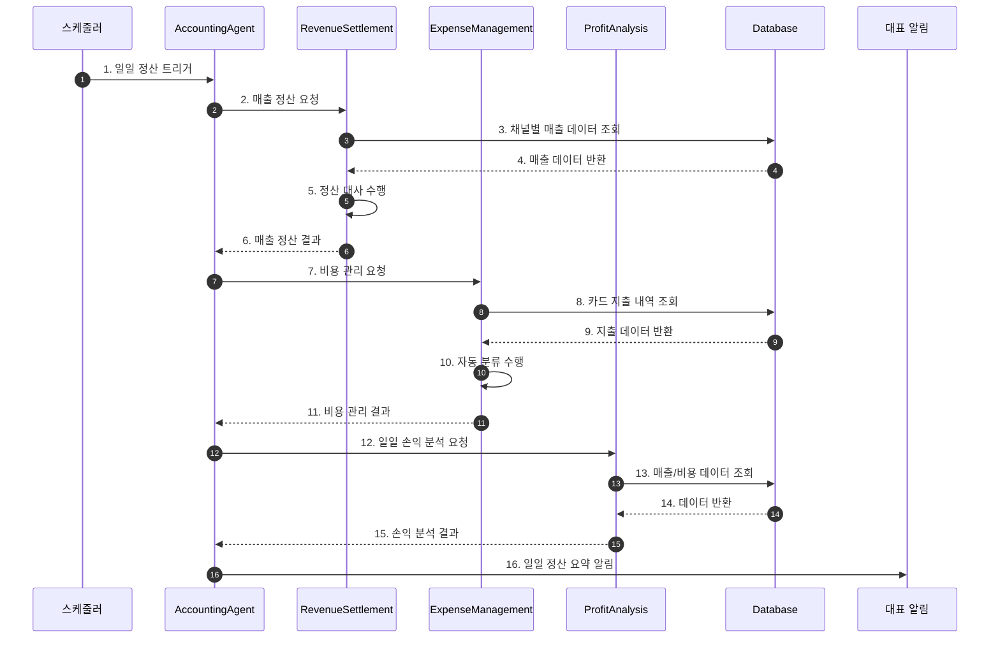
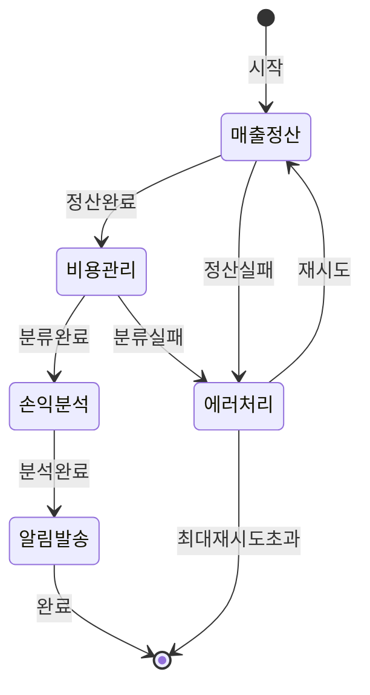

# 회계 일일 정산 워크플로우 (Accounting Daily Flow)

## 기본 정보

| 항목 | 값 |
|------|-----|
| **워크플로우 ID** | `WF-ACC-001` |
| **버전** | 1.0.0 |
| **카테고리** | 회계 |
| **트리거 유형** | Schedule |
| **SLA** | 완료: 2시간 |
| **자동화 수준** | Full-Auto |
| **우선순위** | High |
| **담당 에이전트** | AccountingAgent |
| **최종 수정** | 2025-01-26 |

---

## 트리거 조건

### 스케줄 트리거 (Schedule Trigger)

```yaml
schedule:
  cron: "0 10 * * *"  # 매일 오전 10시
  timezone: "Asia/Seoul"
  enabled: true
  skip_holidays: false
```

---

## 프로세스 흐름

### 전체 흐름도



### 상태 전이도



---

## 단계별 상세

### Step 1: 매출 정산 (Revenue Settlement)

| 항목 | 내용 |
|------|------|
| **Step ID** | `ACC-STEP-001` |
| **담당 에이전트** | `RevenueSettlementSubAgent` |
| **설명** | 채널별 매출 데이터를 수집하고 정산 대사를 수행 |
| **SLA** | 30분 |
| **재시도** | 3회, exponential backoff |

**처리 채널**

| 채널 | 데이터 소스 | 정산 주기 |
|------|-----------|----------|
| 쿠팡 | API / 정산 리포트 | 익일 정산 |
| 네이버 스마트스토어 | API | 익일 정산 |
| 카페24 | API | 실시간 |
| 자사몰 | DB 직접 조회 | 실시간 |

**대사 항목**

- 주문 건수
- 결제 금액
- 정산 예정 금액
- 수수료
- 환불/취소 금액

### Step 2: 비용 관리 (Expense Management)

| 항목 | 내용 |
|------|------|
| **Step ID** | `ACC-STEP-002` |
| **담당 에이전트** | `ExpenseManagementSubAgent` |
| **설명** | 사업자 카드 지출 내역 수집 및 자동 분류 |
| **SLA** | 20분 |
| **재시도** | 3회, exponential backoff |

**자동 분류 카테고리**

| 카테고리 | 세부 항목 | 예산 비율 |
|---------|---------|---------|
| 원가 | 원자재, 포장재, 제조비 | 40% |
| 물류비 | 배송비, 창고비, 물류대행비 | 15% |
| 마케팅비 | 광고비, 프로모션비 | 20% |
| 인건비 | 급여, 4대보험, 복리후생 | 15% |
| 운영비 | 임차료, 통신비, 소모품 | 10% |

### Step 3: 손익 분석 (Profit Analysis)

| 항목 | 내용 |
|------|------|
| **Step ID** | `ACC-STEP-003` |
| **담당 에이전트** | `ProfitAnalysisSubAgent` |
| **설명** | 일일 매출, 비용 데이터 기반 손익 계산 |
| **SLA** | 10분 |
| **재시도** | 2회 |

**분석 항목**

- 일일 총 매출
- 일일 총 비용
- 영업이익
- 영업이익률
- 전일/전주/전월 대비

### Step 4: 알림 발송

| 항목 | 내용 |
|------|------|
| **Step ID** | `ACC-STEP-004` |
| **담당 에이전트** | `AccountingAgent` |
| **설명** | 대표에게 일일 정산 요약 발송 |
| **채널** | 슬랙, 이메일 |

**알림 템플릿**

```
📊 일일 정산 요약 ({날짜})

[매출]
- 총 매출: {총매출}원
- 쿠팡: {쿠팡매출}원 ({쿠팡비율}%)
- 네이버: {네이버매출}원 ({네이버비율}%)
- 자사몰: {자사몰매출}원 ({자사몰비율}%)

[비용]
- 총 비용: {총비용}원
- 예산 대비: {예산대비}%

[손익]
- 영업이익: {영업이익}원
- 영업이익률: {영업이익률}%
- 전일 대비: {전일대비}%

{특이사항}
```

---

## 예외 처리

### 예외 유형 및 처리 방법

| 예외 코드 | 예외 유형 | 원인 | 처리 방법 | 에스컬레이션 |
|----------|----------|------|----------|-------------|
| `ACC-E001` | 채널 API 오류 | API 장애/인증 만료 | 재시도 후 수동 조회 알림 | 3회 실패 시 |
| `ACC-E002` | 정산 불일치 | 금액 차이 발생 | 불일치 내역 리포트 생성 | 즉시 알림 |
| `ACC-E003` | 분류 실패 | 미정의 가맹점 | 기타 비용 처리 후 확인 요청 | 일괄 리포트 |

---

## KPI (핵심 성과 지표)

| 지표명 | 측정 방법 | 목표치 |
|--------|----------|--------|
| 정산 정확도 | 일치 건수 / 전체 건수 | 99.5% |
| 처리 완료 시간 | 시작 ~ 완료 | < 2시간 |
| 자동 분류율 | 자동 분류 / 전체 지출 | 95% |

---

## 변경 이력

| 버전 | 날짜 | 작성자 | 변경 내용 |
|------|------|--------|----------|
| 1.0.0 | 2025-01-26 | AI Agent | 초기 문서 작성 |

---

## 참고 문서

- [Accounting Agent 문서](../agents/06-accounting/index.md)
- [세무 워크플로우](./accounting-tax-flow.md)
