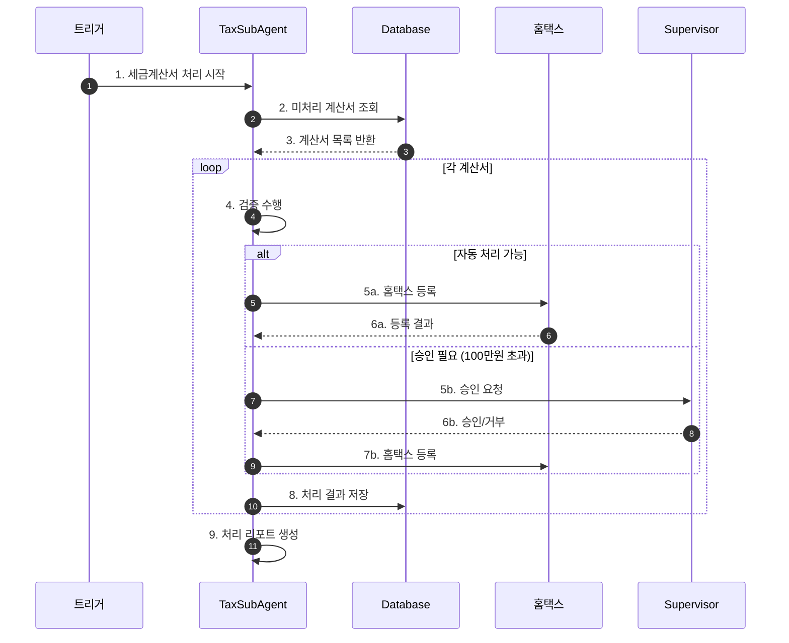
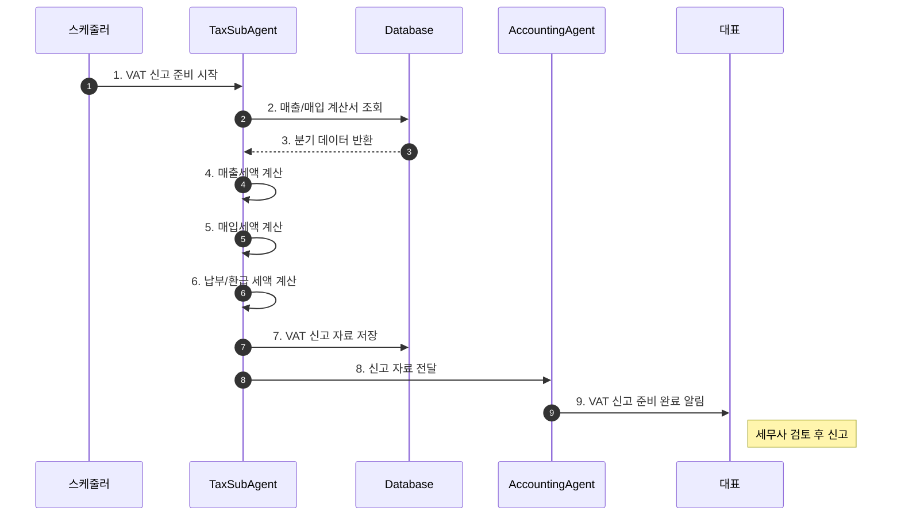

# 세무 처리 워크플로우 (Accounting Tax Flow)

## 기본 정보

| 항목 | 값 |
|------|-----|
| **워크플로우 ID** | `WF-ACC-002` |
| **버전** | 1.0.0 |
| **카테고리** | 회계/세무 |
| **트리거 유형** | Schedule + Event |
| **SLA** | 세금계산서: 24시간, VAT신고: 마감일 5일 전 |
| **자동화 수준** | Semi-Auto |
| **우선순위** | Critical |
| **담당 에이전트** | AccountingAgent > TaxSubAgent |
| **최종 수정** | 2025-01-26 |

---

## 트리거 조건

### 스케줄 트리거 (Schedule Trigger)

```yaml
# 세금계산서 일일 처리
tax_invoice_daily:
  cron: "0 11 * * *"  # 매일 오전 11시
  timezone: "Asia/Seoul"
  enabled: true

# VAT 신고 준비 (분기별)
vat_preparation:
  cron: "0 9 1 1,4,7,10 *"  # 매 분기 첫째날 오전 9시
  timezone: "Asia/Seoul"
  enabled: true
```

### 이벤트 트리거 (Event Trigger)

| 이벤트명 | 소스 | 조건 | 설명 |
|----------|------|------|------|
| `invoice.received` | 이메일/ERP | 세금계산서 수신 | 매입 세금계산서 처리 |
| `order.completed` | 주문시스템 | B2B 주문 완료 | 매출 세금계산서 발행 |

---

## 프로세스 흐름

### 세금계산서 처리 흐름



### VAT 신고 준비 흐름



---

## 단계별 상세

### 세금계산서 처리

#### Step 1: 세금계산서 수집

| 항목 | 내용 |
|------|------|
| **Step ID** | `TAX-STEP-001` |
| **설명** | 이메일, 홈택스에서 세금계산서 수집 |
| **소스** | 이메일, 홈택스 API, 수동 업로드 |

**수집 정보**

- 공급자 사업자번호
- 공급받는자 사업자번호
- 작성일자
- 공급가액
- 세액
- 품목 정보

#### Step 2: 세금계산서 검증

| 항목 | 내용 |
|------|------|
| **Step ID** | `TAX-STEP-002` |
| **설명** | 세금계산서 유효성 검증 |

**검증 항목**

| 항목 | 검증 내용 | 실패 시 처리 |
|------|----------|-------------|
| 사업자번호 | 유효한 형식 | 수정 요청 |
| 금액 | 계산 정합성 | 재확인 요청 |
| 필수 항목 | 누락 여부 | 보완 요청 |
| 중복 | 기등록 여부 | 스킵 |

#### Step 3: 장부 기장

| 항목 | 내용 |
|------|------|
| **Step ID** | `TAX-STEP-003` |
| **설명** | 세금계산서 기반 장부 자동 기장 |

**계정 매핑**

| 유형 | 차변 계정 | 대변 계정 |
|------|----------|----------|
| 매출 | 외상매출금 | 매출 + 부가세예수금 |
| 매입 | 재고/비용 + 부가세대급금 | 외상매입금 |

### VAT 신고 준비

#### Step 4: 매출세액 집계

| 항목 | 내용 |
|------|------|
| **Step ID** | `TAX-STEP-004` |
| **설명** | 분기 매출 세금계산서 기반 매출세액 계산 |

**집계 항목**

- 과세 매출 (세금계산서 발행분)
- 과세 매출 (영수증 발행분)
- 영세율 매출
- 면세 매출

#### Step 5: 매입세액 집계

| 항목 | 내용 |
|------|------|
| **Step ID** | `TAX-STEP-005` |
| **설명** | 분기 매입 세금계산서 기반 매입세액 계산 |

**불공제 항목 체크**

- 접대비 관련
- 비영업용 승용차 관련
- 면세 관련 매입

#### Step 6: 신고서 생성

| 항목 | 내용 |
|------|------|
| **Step ID** | `TAX-STEP-006` |
| **설명** | VAT 신고서 초안 생성 |

**신고서 내용**

```
[부가가치세 신고 준비 ({기간})]

1. 매출세액
   - 과세: {과세매출}원 → 세액: {매출세액}원
   - 영세율: {영세율매출}원
   - 면세: {면세매출}원

2. 매입세액
   - 공제 대상: {공제매입}원 → 세액: {매입세액}원
   - 불공제: {불공제매입}원

3. 납부(환급) 세액
   - {매출세액} - {매입세액} = {납부세액}원

※ 세무사 검토 후 최종 신고 진행
```

---

## 분기 조건 테이블

| 단계 | 조건 | True 분기 | False 분기 |
|------|------|-----------|------------|
| 세금계산서 처리 | 금액 ≤ 100만원 | 자동 처리 | 승인 요청 |
| VAT 신고 | 환급 대상 | 환급 신청 절차 | 납부 절차 |

---

## 예외 처리

### 예외 유형 및 처리 방법

| 예외 코드 | 예외 유형 | 원인 | 처리 방법 |
|----------|----------|------|----------|
| `TAX-E001` | 홈택스 연동 실패 | API 오류 | 수동 처리 안내 |
| `TAX-E002` | 세금계산서 오류 | 필수 정보 누락 | 발행자에게 재발행 요청 |
| `TAX-E003` | 신고 마감 임박 | 마감 3일 전 미완료 | 긴급 알림 발송 |

---

## 알림 설정

### 내부 알림

| 시점 | 채널 | 대상 | 내용 |
|------|------|------|------|
| 세금계산서 수신 | 슬랙 | 회계 담당 | 신규 계산서 알림 |
| VAT 마감 7일 전 | 슬랙, 이메일 | 대표, 세무사 | 마감 임박 알림 |
| 신고 준비 완료 | 이메일 | 대표, 세무사 | 검토 요청 |

---

## KPI (핵심 성과 지표)

| 지표명 | 측정 방법 | 목표치 |
|--------|----------|--------|
| 세금계산서 처리율 | 기한 내 처리 / 전체 | 100% |
| 신고 적시성 | 마감 5일 전 준비 완료 | 100% |
| 오류율 | 수정 발생 건수 | 0건 |

---

## 변경 이력

| 버전 | 날짜 | 작성자 | 변경 내용 |
|------|------|--------|----------|
| 1.0.0 | 2025-01-26 | AI Agent | 초기 문서 작성 |

---

## 참고 문서

- [Accounting Agent 문서](../agents/06-accounting/index.md)
- [일일 정산 워크플로우](./accounting-daily-flow.md)
