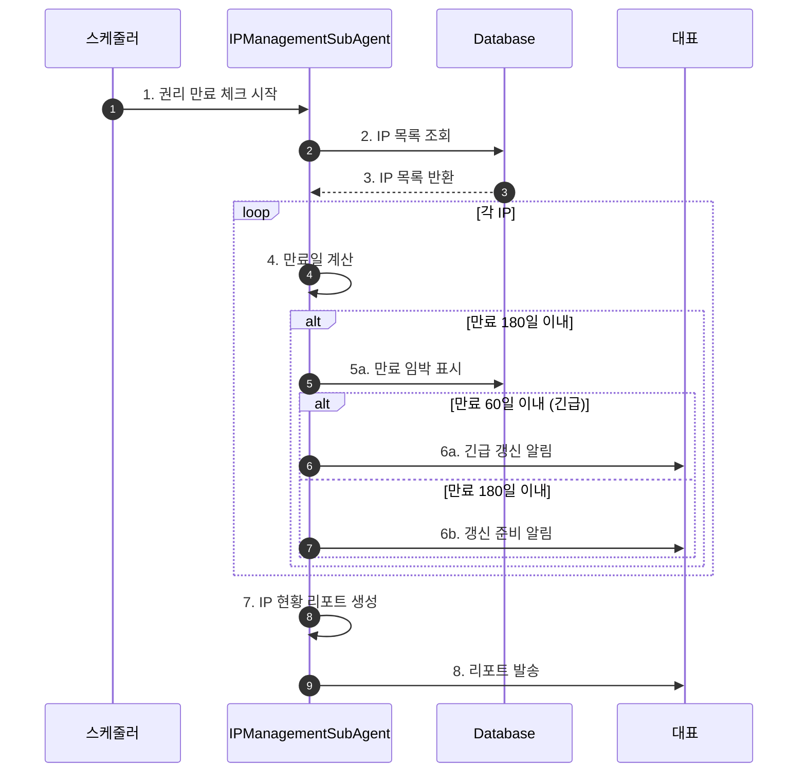
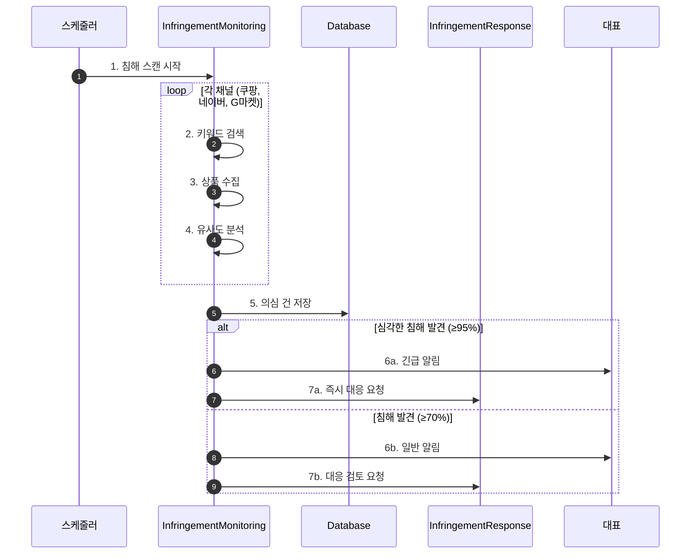
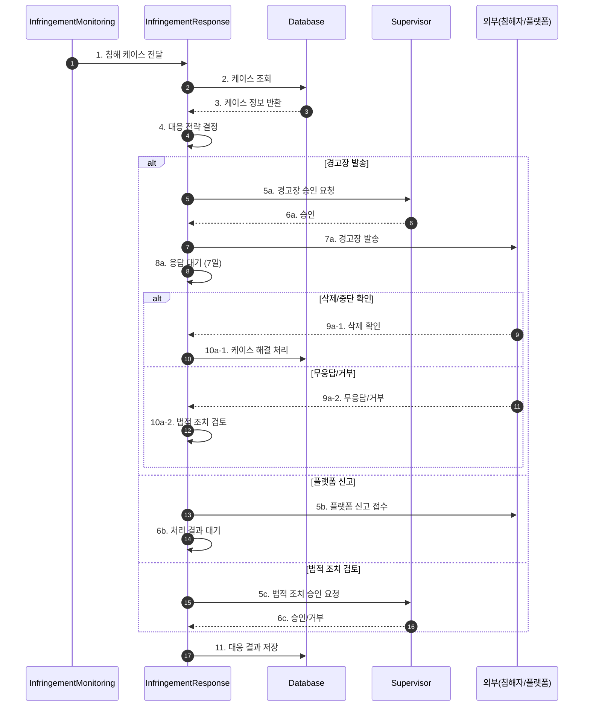

# 지식재산권 관리 워크플로우 (Intellectual Property Flow)

## 기본 정보

| 항목 | 값 |
|------|-----|
| **워크플로우 ID** | `WF-IP-001` |
| **버전** | 1.0.0 |
| **카테고리** | 지식재산권 |
| **트리거 유형** | Schedule + Event |
| **SLA** | 모니터링: 24시간, 침해대응: 48시간 |
| **자동화 수준** | Semi-Auto |
| **우선순위** | High |
| **담당 에이전트** | IPAgent |
| **최종 수정** | 2025-01-26 |

---

## 트리거 조건

### 스케줄 트리거 (Schedule Trigger)

```yaml
# 일일 침해 모니터링
infringement_scan:
  cron: "0 10 * * *"  # 매일 오전 10시
  timezone: "Asia/Seoul"
  enabled: true

# IP 권리 만료 체크
ip_expiry_check:
  cron: "0 9 * * 1"  # 매주 월요일 오전 9시
  timezone: "Asia/Seoul"
  enabled: true
```

### 이벤트 트리거 (Event Trigger)

| 이벤트명 | 소스 | 조건 | 설명 |
|----------|------|------|------|
| `infringement.detected` | 모니터링 | 유사도 ≥ 70% | 침해 의심 건 발견 |
| `infringement.critical` | 모니터링 | 유사도 ≥ 95% | 심각한 침해 발견 |
| `ip.expiring` | 권리관리 | 만료 180일 이내 | 권리 만료 임박 |

---

## 프로세스 흐름

### IP 권리 관리 플로우



### 침해 모니터링 플로우



### 침해 대응 플로우



---

## 단계별 상세

### IP 권리 관리

#### Step 1: IP 등록 및 관리

| 항목 | 내용 |
|------|------|
| **Step ID** | `IP-STEP-001` |
| **담당 에이전트** | `IPManagementSubAgent` |
| **설명** | 상표권, 디자인권 등록 및 갱신 관리 |

**관리 IP 유형**

| IP 유형 | 갱신 주기 | 예상 비용 |
|--------|---------|---------|
| 상표권 | 10년 | 35만원 |
| 디자인권 | 5년 | 25만원 |
| 특허권 | 연차료 | 50만원 |
| 실용신안 | 연차료 | 20만원 |

**갱신 알림 기준**

| 잔여 기간 | 긴급도 | 권장 조치 |
|---------|--------|---------|
| 30일 이내 | 긴급 | 즉시 갱신 신청 |
| 90일 이내 | 높음 | 갱신 절차 시작 |
| 180일 이내 | 보통 | 갱신 준비 |

### 침해 모니터링

#### Step 2: 온라인 마켓 스캔

| 항목 | 내용 |
|------|------|
| **Step ID** | `IP-STEP-002` |
| **담당 에이전트** | `InfringementMonitoringSubAgent` |
| **설명** | 주요 온라인 마켓에서 카피캣 상품 탐지 |

**모니터링 채널**

| 채널 | 스캔 방식 | 우선순위 |
|------|---------|---------|
| 쿠팡 | 키워드 검색 | 1 |
| 네이버 스마트스토어 | 키워드 검색 | 1 |
| G마켓 | 키워드 검색 | 2 |
| 옥션 | 키워드 검색 | 2 |
| 11번가 | 키워드 검색 | 2 |
| 알리익스프레스 | 키워드 검색 | 3 |

**검색 키워드**

- 브랜드명: 썬데이허그, SUNDAYHUG, 선데이허그
- 제품명: 주요 제품 키워드
- 변형어: 오타, 유사 표기

**유사도 분석 항목**

| 항목 | 가중치 | 분석 방법 |
|------|--------|----------|
| 상품명 | 30% | 텍스트 유사도 |
| 이미지 | 40% | 이미지 유사도 |
| 가격대 | 15% | 가격 범위 비교 |
| 설명 | 15% | 텍스트 유사도 |

### 침해 대응

#### Step 3: 대응 조치

| 항목 | 내용 |
|------|------|
| **Step ID** | `IP-STEP-003` |
| **담당 에이전트** | `InfringementResponseSubAgent` |
| **설명** | 침해 건에 대한 단계적 대응 |

**대응 단계**

| 단계 | 조치 | 소요 기간 | 승인 필요 |
|------|------|---------|----------|
| 1단계 | 경고장 발송 | 7일 | Supervisor |
| 2단계 | 2차 경고 | 7일 | Supervisor |
| 3단계 | 플랫폼 신고 | 14일 | 자동 |
| 4단계 | 법적 조치 검토 | - | 대표 |

**경고장 템플릿**

```
제목: 지식재산권 침해에 대한 경고

귀하가 판매 중인 상품 [{상품명}]이
당사의 {IP유형} ({등록번호})을 침해하고 있습니다.

침해 내용:
- 상품 URL: {URL}
- 침해 유형: {침해유형}
- 발견일: {발견일}

본 경고장 수신 후 7일 이내 해당 상품의
판매를 중단해 주시기 바랍니다.

조치가 이루어지지 않을 경우,
플랫폼 신고 및 법적 조치를 진행할 예정입니다.

썬데이허그
```

---

## 분기 조건 테이블

| 단계 | 조건 | True 분기 | False 분기 |
|------|------|-----------|------------|
| 유사도 분석 | ≥ 95% | 즉시 대응 | 일반 처리 |
| 유사도 분석 | ≥ 70% | 케이스 생성 | 모니터링만 |
| 경고 응답 | 삭제됨 | 케이스 종료 | 다음 단계 |
| 2차 경고 | 무응답 | 법적 검토 | - |

---

## 예외 처리

### 예외 유형 및 처리 방법

| 예외 코드 | 예외 유형 | 원인 | 처리 방법 |
|----------|----------|------|----------|
| `IP-E001` | 스캔 실패 | 플랫폼 차단 | 프록시 변경/수동 확인 |
| `IP-E002` | 이미지 분석 실패 | 이미지 로딩 오류 | 수동 확인 요청 |
| `IP-E003` | 연락처 미확인 | 판매자 정보 부재 | 플랫폼 신고로 대체 |

---

## 알림 설정

| 시점 | 채널 | 대상 | 조건 |
|------|------|------|------|
| IP 만료 60일 전 | 슬랙, 이메일 | 대표 | 필수 IP |
| 심각한 침해 발견 | 슬랙 (긴급) | 대표 | 유사도 ≥ 95% |
| 일반 침해 발견 | 슬랙 | 대표 | 유사도 ≥ 70% |
| 경고장 발송 | 슬랙 | 대표 | 발송 시 |
| 대응 결과 | 이메일 | 대표 | 케이스 종료 시 |

---

## KPI (핵심 성과 지표)

| 지표명 | 측정 방법 | 목표치 |
|--------|----------|--------|
| IP 관리율 | 만료 전 갱신 / 전체 | 100% |
| 침해 탐지율 | 탐지 건 / 실제 침해 | 90% |
| 대응 성공률 | 삭제/중단 / 경고 발송 | 80% |
| 평균 대응 시간 | 탐지 ~ 대응 완료 | 48시간 |

---

## 변경 이력

| 버전 | 날짜 | 작성자 | 변경 내용 |
|------|------|--------|----------|
| 1.0.0 | 2025-01-26 | AI Agent | 초기 문서 작성 |

---

## 참고 문서

- [IP Agent 문서](../agents/10-ip/index.md)
- [법무 컴플라이언스 워크플로우](./legal-compliance-flow.md)
