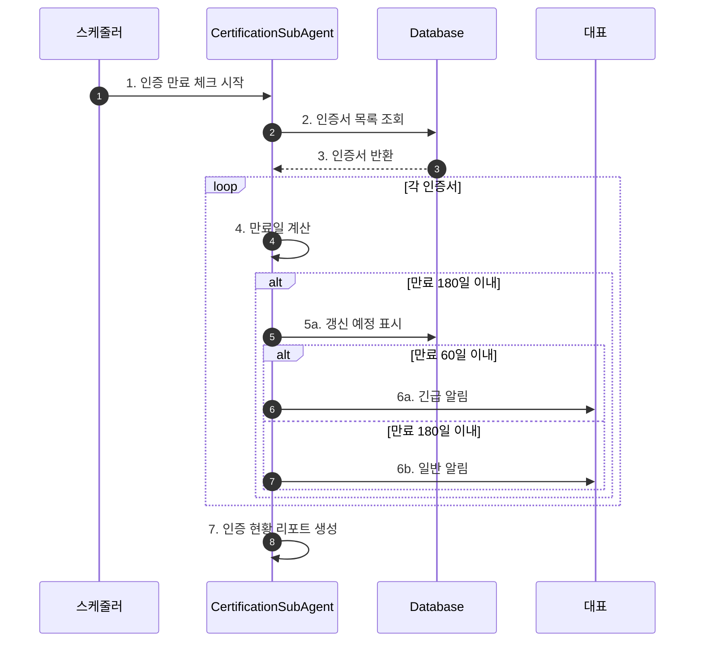
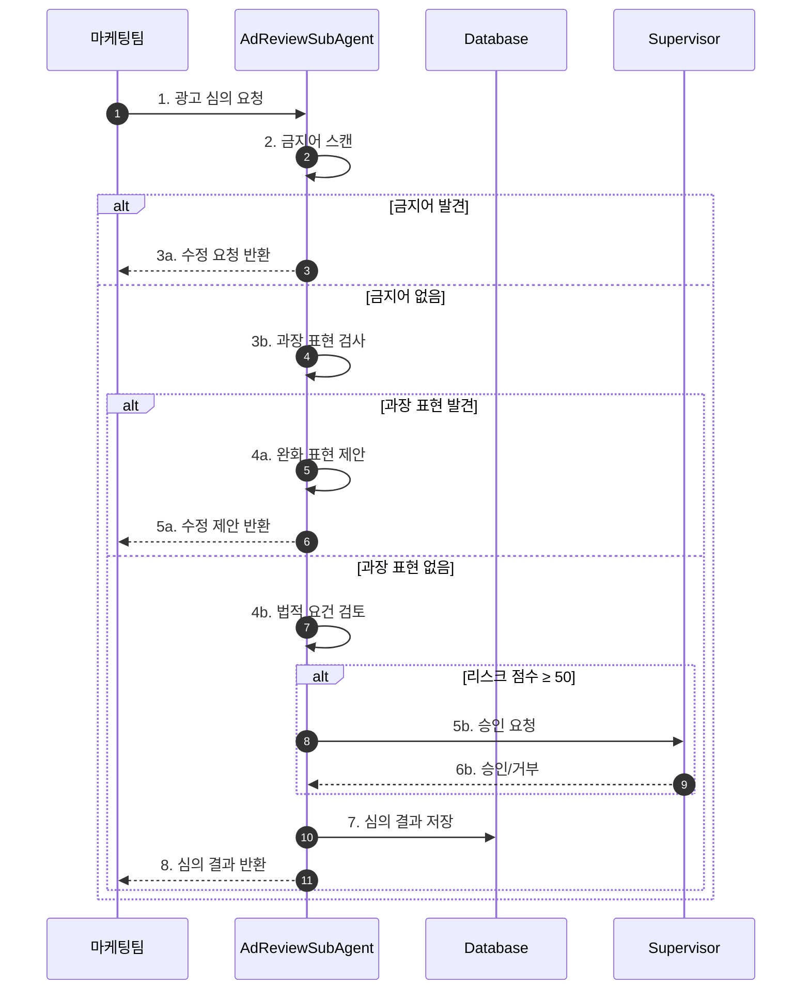
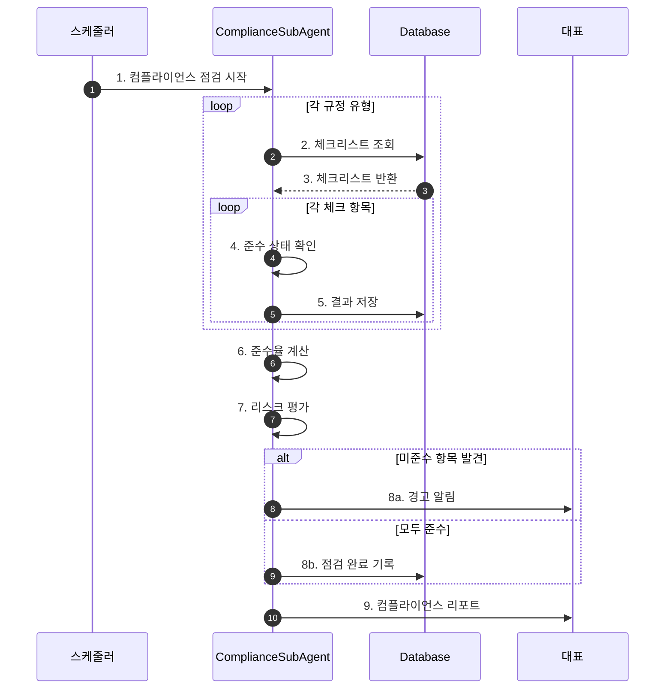

# 법무 컴플라이언스 워크플로우 (Legal Compliance Flow)

## 기본 정보

| 항목 | 값 |
|------|-----|
| **워크플로우 ID** | `WF-LEG-001` |
| **버전** | 1.0.0 |
| **카테고리** | 법무/컴플라이언스 |
| **트리거 유형** | Schedule + Event |
| **SLA** | 인증갱신: 만료 30일 전, 광고심의: 2시간 |
| **자동화 수준** | Semi-Auto |
| **우선순위** | Critical |
| **담당 에이전트** | LegalAgent |
| **최종 수정** | 2025-01-26 |

---

## 트리거 조건

### 스케줄 트리거 (Schedule Trigger)

```yaml
# 인증 만료 체크
certification_check:
  cron: "0 9 * * 1"  # 매주 월요일 오전 9시
  timezone: "Asia/Seoul"
  enabled: true

# 컴플라이언스 점검
compliance_audit:
  cron: "0 10 1 * *"  # 매월 1일 오전 10시
  timezone: "Asia/Seoul"
  enabled: true
```

### 이벤트 트리거 (Event Trigger)

| 이벤트명 | 소스 | 조건 | 설명 |
|----------|------|------|------|
| `ad.review_request` | 마케팅팀 | 신규 광고 | 광고 심의 요청 |
| `product.launch` | 상품팀 | 신제품 등록 | 인증 확인 |
| `regulation.changed` | 법규 모니터링 | 관련 법규 변경 | 영향 분석 |

---

## 프로세스 흐름

### 인증 관리 플로우



### 광고 심의 플로우



### 컴플라이언스 점검 플로우



---

## 단계별 상세

### 인증 관리

#### Step 1: 인증서 등록 및 관리

| 항목 | 내용 |
|------|------|
| **Step ID** | `LEG-STEP-001` |
| **담당 에이전트** | `CertificationSubAgent` |
| **설명** | KC인증, 안전인증 등 필수 인증 관리 |

**관리 인증 유형**

| 인증 유형 | 유효기간 | 갱신 알림 |
|---------|---------|---------|
| KC인증 (생활용품) | 3년 | 180일 전 |
| KC인증 (전기용품) | 3년 | 180일 전 |
| 안전확인대상 | 무기한 | N/A |
| 공급자적합성확인 | 무기한 | N/A |
| 어린이제품안전인증 | 3년 | 180일 전 |

**알림 기준**

| 잔여 기간 | 긴급도 | 알림 주기 |
|---------|--------|---------|
| 60일 이내 | 긴급 | 매일 |
| 120일 이내 | 높음 | 주 2회 |
| 180일 이내 | 보통 | 주 1회 |

### 광고 심의

#### Step 2: 광고 문구 검토

| 항목 | 내용 |
|------|------|
| **Step ID** | `LEG-STEP-002` |
| **담당 에이전트** | `AdReviewSubAgent` |
| **설명** | 광고 문구의 법적 적합성 검토 |

**금지어 카테고리**

| 카테고리 | 예시 | 심각도 |
|---------|------|--------|
| 의료 효과 | 치료, 완치, 항균, 살균, 면역력 | Critical |
| 과장 표현 | 100%, 무조건, 보장, 절대 | High |
| 비교 광고 | 최고, 최초, 유일, 업계 1위 | Medium |
| 미인증 표현 | 특허, 추천, 인증 (근거 없음) | Medium |

**검토 프로세스**

1. 금지어 DB 매칭 (자동)
2. 과장 표현 패턴 검출 (자동)
3. 법적 요건 체크 (자동)
4. 리스크 점수 산출 (자동)
5. 고위험 건 수동 검토 (승인 필요)

### 컴플라이언스 점검

#### Step 3: 규정 준수 점검

| 항목 | 내용 |
|------|------|
| **Step ID** | `LEG-STEP-003` |
| **담당 에이전트** | `ComplianceSubAgent` |
| **설명** | 전자상거래법, 개인정보보호법 등 규정 준수 점검 |

**점검 규정 유형**

| 규정 | 점검 주기 | 체크 항목 수 |
|------|---------|------------|
| 전자상거래법 | 월 1회 | 15개 |
| 개인정보보호법 | 월 1회 | 20개 |
| 표시광고법 | 월 1회 | 12개 |
| 어린이제품안전특별법 | 분기 1회 | 10개 |

**전자상거래법 체크리스트 (예시)**

- [ ] 사업자 정보 표시
- [ ] 청약철회 안내
- [ ] 반품/환불 정책 명시
- [ ] 배송비 정보 표시
- [ ] 결제 정보 보호

**개인정보보호법 체크리스트 (예시)**

- [ ] 개인정보처리방침 게시
- [ ] 수집 항목 최소화
- [ ] 동의 절차 준수
- [ ] 보관 기간 명시
- [ ] 제3자 제공 동의

---

## 예외 처리

### 예외 유형 및 처리 방법

| 예외 코드 | 예외 유형 | 원인 | 처리 방법 | 에스컬레이션 |
|----------|----------|------|----------|-------------|
| `LEG-E001` | 인증 만료 | 갱신 미이행 | 긴급 갱신 절차 | 즉시 대표 알림 |
| `LEG-E002` | 광고 법규 위반 | 금지 표현 사용 | 게시 중단 요청 | 즉시 마케팅팀 알림 |
| `LEG-E003` | 컴플라이언스 위반 | 규정 미준수 | 시정 조치 계획 수립 | 즉시 대표 알림 |

---

## 알림 설정

| 시점 | 채널 | 대상 | 조건 |
|------|------|------|------|
| 인증 만료 60일 전 | 슬랙, 이메일 | 대표 | 필수 인증 |
| 광고 심의 완료 | 슬랙 | 마케팅팀 | 모든 요청 |
| 광고 심의 거부 | 슬랙, 이메일 | 마케팅팀, Supervisor | 거부 건 |
| 컴플라이언스 점검 완료 | 이메일 | 대표 | 월간 리포트 |
| 컴플라이언스 위반 발견 | 슬랙 | 대표 | 위반 건 |

---

## KPI (핵심 성과 지표)

| 지표명 | 측정 방법 | 목표치 |
|--------|----------|--------|
| 인증 관리율 | 만료 전 갱신 / 전체 | 100% |
| 광고 1차 통과율 | 1차 승인 / 전체 요청 | 90% |
| 컴플라이언스 준수율 | 준수 항목 / 전체 항목 | 95% |
| 법적 이슈 발생률 | 법적 문제 건수 | 0건 |

---

## 변경 이력

| 버전 | 날짜 | 작성자 | 변경 내용 |
|------|------|--------|----------|
| 1.0.0 | 2025-01-26 | AI Agent | 초기 문서 작성 |

---

## 참고 문서

- [Legal Agent 문서](../agents/09-legal/index.md)
- [IP 관리 워크플로우](./intellectual-property-flow.md)
