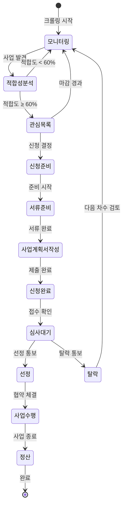
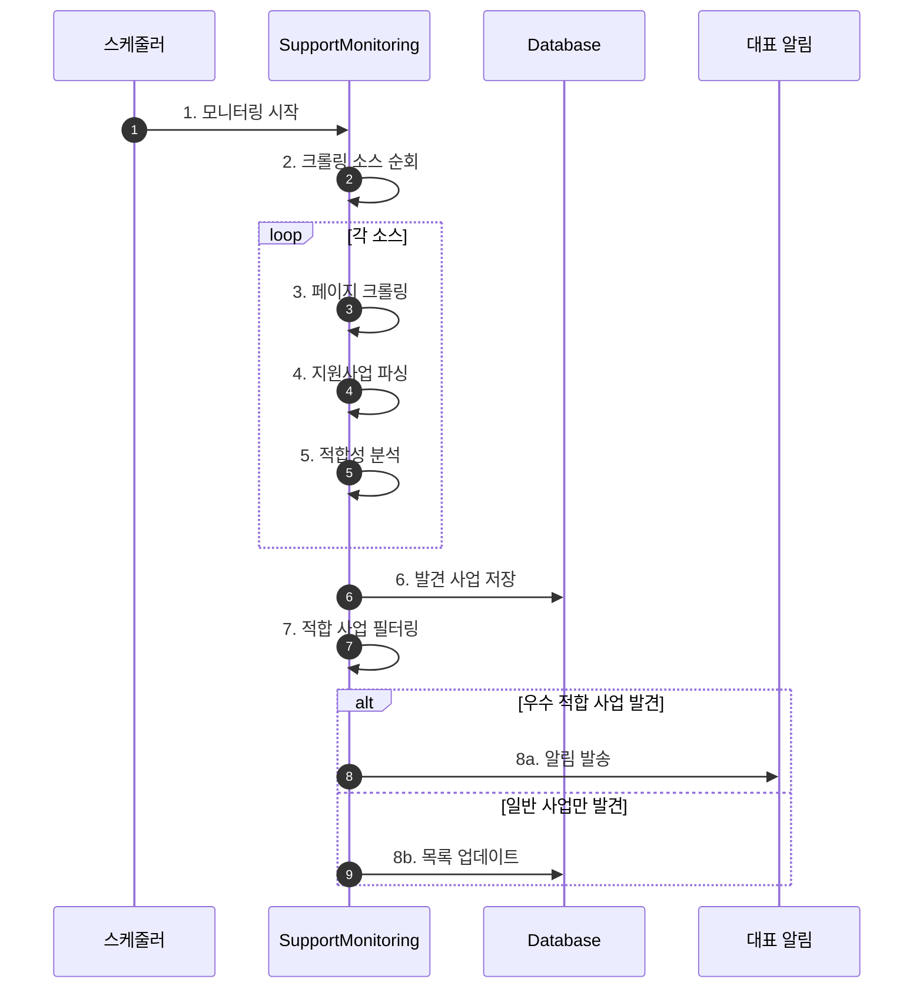
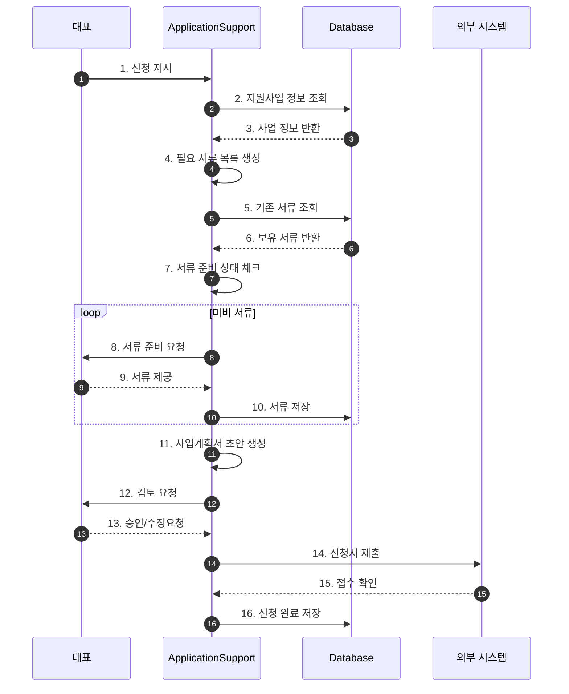

# 지원사업 관리 워크플로우 (Support Program Flow)

## 기본 정보

| 항목 | 값 |
|------|-----|
| **워크플로우 ID** | `WF-BIZ-001` |
| **버전** | 1.0.0 |
| **카테고리** | 지원사업 |
| **트리거 유형** | Schedule + Event |
| **SLA** | 모니터링: 24시간, 신청준비: 마감 7일 전 |
| **자동화 수준** | Semi-Auto |
| **우선순위** | Medium |
| **담당 에이전트** | BizSupportAgent |
| **최종 수정** | 2025-01-26 |

---

## 트리거 조건

### 스케줄 트리거 (Schedule Trigger)

```yaml
# 지원사업 모니터링
program_monitoring:
  cron: "0 9 * * 1,3,5"  # 월,수,금 오전 9시
  timezone: "Asia/Seoul"
  enabled: true

# 마감 체크
deadline_check:
  cron: "0 10 * * *"  # 매일 오전 10시
  timezone: "Asia/Seoul"
  enabled: true

# 주간 요약
weekly_summary:
  cron: "0 9 * * 1"  # 매주 월요일 오전 9시
  timezone: "Asia/Seoul"
  enabled: true
```

### 이벤트 트리거 (Event Trigger)

| 이벤트명 | 소스 | 조건 | 설명 |
|----------|------|------|------|
| `program.found` | 크롤러 | 적합도 ≥ 80% | 우수 적합 사업 발견 |
| `application.approved` | 수동 입력 | 선정 통보 | 사후관리 시작 |

---

## 프로세스 흐름

### 전체 라이프사이클



### 모니터링 플로우



### 신청 준비 플로우



---

## 단계별 상세

### Step 1: 지원사업 모니터링

| 항목 | 내용 |
|------|------|
| **Step ID** | `BIZ-STEP-001` |
| **담당 에이전트** | `SupportMonitoringSubAgent` |
| **설명** | 주요 지원사업 사이트 크롤링 및 적합성 분석 |
| **SLA** | 30분 |

**크롤링 소스**

| 소스 | URL | 우선순위 |
|------|-----|----------|
| K-Startup | k-startup.go.kr | 1 |
| 소상공인마당 | sbiz.or.kr | 2 |
| 소상공인시장진흥공단 | semas.or.kr | 3 |
| 중소벤처기업부 | mss.go.kr | 4 |
| 서울산업진흥원 | sba.seoul.kr | 5 |

**적합성 분석 기준**

| 조건 | 가중치 | 평가 방법 |
|------|--------|----------|
| 기업 규모 | 20% | 중소기업 해당 여부 |
| 업종 | 25% | 유아용품/이커머스 해당 |
| 지역 | 15% | 전국/서울 해당 |
| 업력 | 20% | 요건 충족 여부 |
| 매출/인원 | 20% | 요건 충족 여부 |

### Step 2: 서류 준비

| 항목 | 내용 |
|------|------|
| **Step ID** | `BIZ-STEP-002` |
| **담당 에이전트** | `ApplicationSupportSubAgent` |
| **설명** | 신청 필요 서류 목록화 및 준비 현황 관리 |

**공통 필요 서류**

| 서류 | 필수 | 유효기간 |
|------|:----:|---------|
| 사업자등록증 | O | - |
| 법인등기부등본 | O | 3개월 |
| 중소기업확인서 | O | 1년 |
| 재무제표 (3개년) | O | - |
| 국세/지방세 납세증명서 | O | 1개월 |
| 4대보험 가입증명서 | △ | 1개월 |

### Step 3: 사업계획서 작성

| 항목 | 내용 |
|------|------|
| **Step ID** | `BIZ-STEP-003` |
| **담당 에이전트** | `ApplicationSupportSubAgent` |
| **설명** | AI 기반 사업계획서 초안 작성 |

**사업계획서 구성**

1. 회사 개요
2. 사업 개요 및 목표
3. 추진 전략 및 방법
4. 추진 일정
5. 예산 계획
6. 기대 효과

### Step 4: 사후관리

| 항목 | 내용 |
|------|------|
| **Step ID** | `BIZ-STEP-004` |
| **담당 에이전트** | `PostManagementSubAgent` |
| **설명** | 선정 후 수행 관리, 정산, 결과보고 |

**관리 항목**

| 항목 | 주기 | 담당 |
|------|------|------|
| 마일스톤 점검 | 월 1회 | 자동 알림 |
| 예산 집행 현황 | 실시간 | 자동 집계 |
| 중간 보고서 | 사업 중간 | 초안 생성 |
| 정산 보고서 | 사업 종료 | 초안 생성 |
| 결과 보고서 | 사업 종료 | 초안 생성 |

---

## 예외 처리

### 예외 유형 및 처리 방법

| 예외 코드 | 예외 유형 | 원인 | 처리 방법 |
|----------|----------|------|----------|
| `BIZ-E001` | 크롤링 실패 | 사이트 변경/차단 | 수동 확인 요청 |
| `BIZ-E002` | 서류 미비 | 준비 지연 | 마감 알림 강화 |
| `BIZ-E003` | 정산 오류 | 증빙 불일치 | 수정 요청 |

---

## 알림 설정

| 시점 | 채널 | 대상 | 조건 |
|------|------|------|------|
| 우수 적합 사업 발견 | 슬랙 | 대표 | 적합도 ≥ 80% |
| 신청 마감 7일 전 | 슬랙, 이메일 | 대표 | 관심 목록 사업 |
| 서류 마감 3일 전 | 슬랙 | 대표 | 미비 서류 존재 |
| 정산 마감 7일 전 | 슬랙, 이메일 | 대표 | 수행중 사업 |

---

## KPI (핵심 성과 지표)

| 지표명 | 측정 방법 | 목표치 |
|--------|----------|--------|
| 적합 사업 발굴률 | 발견/신청 비율 | 30% |
| 선정률 | 선정/신청 비율 | 40% |
| 정산 완료율 | 기한 내 완료 | 100% |
| 연간 지원금 확보 | 총 확보 금액 | 1억원 |

---

## 변경 이력

| 버전 | 날짜 | 작성자 | 변경 내용 |
|------|------|--------|----------|
| 1.0.0 | 2025-01-26 | AI Agent | 초기 문서 작성 |

---

## 참고 문서

- [BizSupport Agent 문서](../agents/07-biz-support/index.md)
