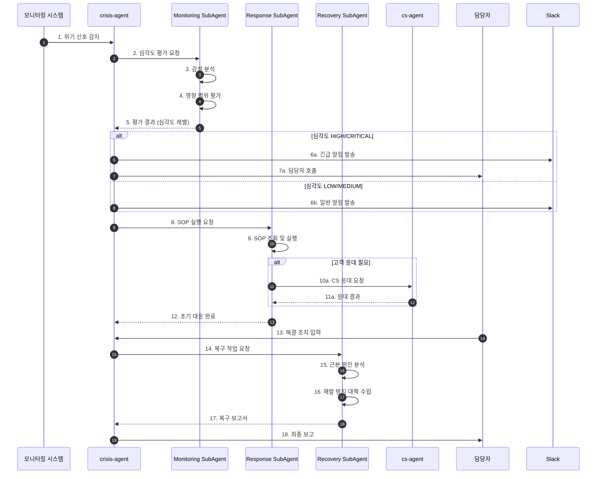
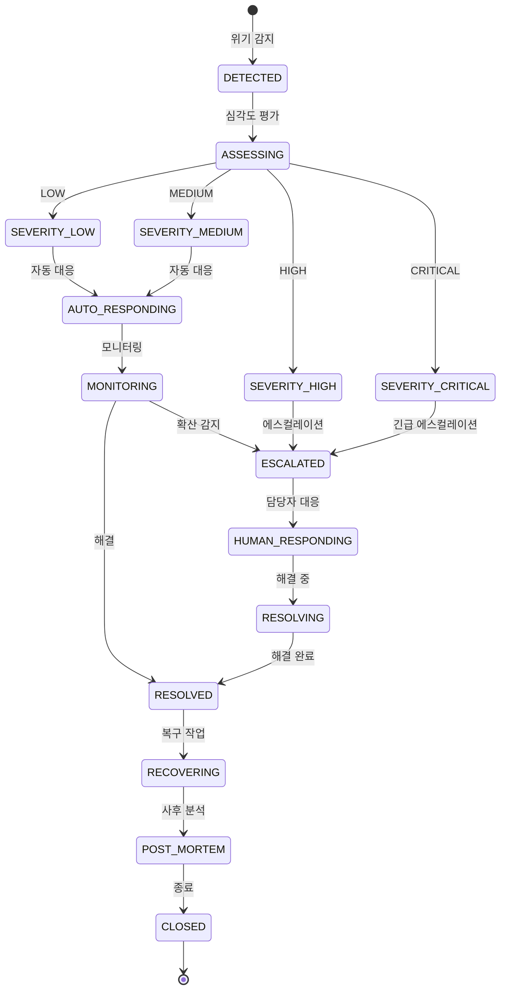

# 위기 관리 워크플로우 (Crisis Management Flow)

## 기본 정보

| 항목 | 값 |
|------|-----|
| **워크플로우 ID** | `WF-CRS-001` |
| **버전** | 1.0.0 |
| **카테고리** | 위기관리 (Crisis Management) |
| **트리거 유형** | Event |
| **SLA** | 감지: 30분 / 초기대응: 1시간 / 해결: 24시간 |
| **자동화 수준** | Human-in-the-Loop (L3) |
| **우선순위** | Critical |
| **담당 팀** | Operations, CS |
| **최종 수정** | 2024-01-26 |

---

## 워크플로우 개요

위기 관리 워크플로우는 브랜드 평판과 고객 신뢰에 영향을 미칠 수 있는 위기 상황을 실시간으로 감지하고, 신속하게 대응하며, 재발 방지를 위한 사후 관리를 수행합니다.

### 핵심 단계
1. **위기 감지** - 악성 리뷰, SNS 이슈, 품질 문제 모니터링
2. **심각도 평가** - 위기 수준 및 영향 범위 평가
3. **에스컬레이션** - 심각도에 따른 담당자 알림
4. **초기 대응** - SOP 기반 즉각 대응
5. **위기 해결** - 근본 원인 해결
6. **사후 관리** - 재발 방지 및 복구

---

## 트리거 조건

### 이벤트 트리거

| 이벤트명 | 소스 | 조건 | 설명 |
|----------|------|------|------|
| `review.negative` | review-monitor | `rating <= 2 && sentiment < -0.5` | 악성 리뷰 감지 |
| `sns.mention` | sns-monitor | `sentiment < -0.7 && reach > 1000` | 부정적 SNS 언급 |
| `cs.escalation` | cs-agent | `complaint_type == 'quality'` | 품질 관련 CS 에스컬레이션 |
| `anomaly.detected` | analytics-agent | `metric == 'return_rate' && z_score > 3` | 반품률 이상 감지 |
| `media.mention` | media-monitor | `sentiment == 'negative'` | 미디어 부정 기사 |

### 이벤트 페이로드 예시

```json
{
  "event_type": "review.negative",
  "timestamp": "2024-01-26T14:30:00+09:00",
  "data": {
    "crisis_id": "CRS-2024012600001",
    "source": "naver_review",
    "content": "제품에서 이물질이 발견되었습니다. 절대 구매하지 마세요!",
    "rating": 1,
    "sentiment_score": -0.9,
    "product_id": "PRD-001",
    "customer_id": "CUST-12345",
    "reach_estimate": 5000,
    "attachments": ["image1.jpg", "image2.jpg"],
    "metadata": {
      "platform": "naver_smartstore",
      "review_id": "REV-123456",
      "helpful_count": 15
    }
  }
}
```

---

## 프로세스 흐름

### 전체 흐름도



### 상태 전이도



---

## 단계별 상세

### Step 1: 위기 감지 (Crisis Detection)

| 항목 | 내용 |
|------|------|
| **Step ID** | `STEP-CRS-001` |
| **담당 에이전트** | `crisis-agent` → `Monitoring SubAgent` |
| **설명** | 다양한 채널에서 위기 신호 실시간 감지 |
| **SLA** | 30분 이내 감지 |
| **재시도** | N/A (상시 모니터링) |

**모니터링 소스**

| 소스 | 모니터링 대상 | 감지 방식 | 주기 |
|------|-------------|----------|------|
| 리뷰 플랫폼 | 1-2점 리뷰, 키워드 | 키워드 + 감성 분석 | 5분 |
| SNS | 브랜드 멘션 | 감성 분석 + 확산도 | 실시간 |
| CS 시스템 | 클레임, 불만 | 카테고리 분류 | 실시간 |
| 뉴스/미디어 | 브랜드 기사 | 감성 분석 | 1시간 |
| 커뮤니티 | 브랜드 언급 | 키워드 + 감성 분석 | 30분 |

**감지 로직**

```python
def monitor_crisis_signals():
    while True:
        # 1. 각 소스에서 데이터 수집
        reviews = collect_reviews(since=last_check)
        sns_mentions = collect_sns_mentions(since=last_check)
        cs_tickets = collect_cs_tickets(since=last_check)

        # 2. 감성 분석
        for item in reviews + sns_mentions:
            sentiment = analyze_sentiment(item.content)

            # 3. 위기 신호 판단
            if is_crisis_signal(item, sentiment):
                crisis = create_crisis_event(
                    source=item.source,
                    content=item.content,
                    sentiment=sentiment,
                    reach=estimate_reach(item)
                )

                # 4. 위기 이벤트 발행
                publish_crisis_event(crisis)

        # 5. CS 에스컬레이션 확인
        for ticket in cs_tickets:
            if ticket.type in ['quality', 'safety', 'legal']:
                create_crisis_from_cs(ticket)

        sleep(CHECK_INTERVAL)
```

---

### Step 2: 심각도 평가 (Severity Assessment)

| 항목 | 내용 |
|------|------|
| **Step ID** | `STEP-CRS-002` |
| **담당 에이전트** | `crisis-agent` → `Monitoring SubAgent` |
| **설명** | 위기의 심각도 및 영향 범위 평가 |
| **SLA** | 5분 |
| **재시도** | 1회 |

**심각도 레벨**

| 레벨 | 조건 | 예시 | 대응 시간 |
|------|------|------|----------|
| LOW | 단일 불만, 낮은 확산 | 일반 1점 리뷰 | 24시간 |
| MEDIUM | 복수 불만, 중간 확산 | 동일 이슈 3건 이상 | 4시간 |
| HIGH | 품질 이슈, 높은 확산 | 바이럴 위험 | 1시간 |
| CRITICAL | 안전 이슈, 대규모 확산 | 건강 피해, 미디어 보도 | 즉시 |

**평가 기준**

```python
def assess_severity(crisis_event):
    score = 0

    # 1. 이슈 유형 (40%)
    type_weights = {
        'safety': 10,
        'quality': 7,
        'service': 4,
        'delivery': 3,
        'other': 1
    }
    score += type_weights.get(crisis_event.type, 1) * 4

    # 2. 감성 강도 (20%)
    sentiment_score = abs(crisis_event.sentiment) * 20
    score += sentiment_score

    # 3. 확산 범위 (20%)
    reach_score = min(crisis_event.reach / 10000 * 20, 20)
    score += reach_score

    # 4. 반복 발생 (10%)
    repeat_count = get_similar_incidents(crisis_event, days=7)
    score += min(repeat_count * 2, 10)

    # 5. 고객 등급 (10%)
    if crisis_event.customer_tier == 'VIP':
        score += 10
    elif crisis_event.customer_tier == 'VVIP':
        score += 15

    # 심각도 결정
    if score >= 80:
        return 'CRITICAL'
    elif score >= 60:
        return 'HIGH'
    elif score >= 40:
        return 'MEDIUM'
    else:
        return 'LOW'
```

---

### Step 3: 에스컬레이션 (Escalation)

| 항목 | 내용 |
|------|------|
| **Step ID** | `STEP-CRS-003` |
| **담당 에이전트** | `crisis-agent` |
| **설명** | 심각도에 따른 담당자 알림 및 에스컬레이션 |
| **SLA** | 즉시 |
| **재시도** | 3회 (알림 실패 시) |

**에스컬레이션 매트릭스**

| 심각도 | 1차 알림 | 2차 알림 (미대응 시) | 3차 알림 |
|--------|---------|-------------------|---------|
| LOW | CS팀 | CS팀장 (4시간) | 운영팀장 (8시간) |
| MEDIUM | CS팀장 | 운영팀장 (2시간) | 이사 (4시간) |
| HIGH | 운영팀장 | 이사 (30분) | 대표 (1시간) |
| CRITICAL | 대표 + 관련 팀장 | - | - |

**알림 채널**

```yaml
notification_channels:
  LOW:
    - channel: slack
      target: "#cs-team"
    - channel: email
      target: "cs-team@company.com"

  MEDIUM:
    - channel: slack
      target: "#cs-escalation"
    - channel: sms
      target: "cs-manager"

  HIGH:
    - channel: slack
      target: "#crisis-response"
    - channel: sms
      target: ["ops-manager", "cs-manager"]
    - channel: phone
      target: "ops-manager"

  CRITICAL:
    - channel: phone
      target: ["ceo", "ops-manager", "cs-manager"]
    - channel: slack
      target: "#executive-alert"
    - channel: sms
      target: "all-managers"
```

---

### Step 4: 초기 대응 (Initial Response)

| 항목 | 내용 |
|------|------|
| **Step ID** | `STEP-CRS-004` |
| **담당 에이전트** | `crisis-agent` → `Response SubAgent` |
| **설명** | SOP 기반 즉각적인 초기 대응 실행 |
| **SLA** | LOW: 24시간 / MEDIUM: 4시간 / HIGH: 1시간 / CRITICAL: 30분 |
| **재시도** | 1회 |

**SOP (Standard Operating Procedure)**

| 위기 유형 | SOP | 자동 실행 |
|----------|-----|----------|
| 악성 리뷰 | 사과 메시지 + 해결 제안 | Yes (LOW) |
| 품질 이슈 | 사과 + 교환/환불 제안 + 원인 조사 | Partial |
| 배송 지연 | 현황 안내 + 보상 쿠폰 | Yes |
| SNS 확산 | 공식 성명 준비 + 모니터링 강화 | No |
| 안전 이슈 | 판매 중지 + 리콜 검토 | No |

**악성 리뷰 대응 SOP**

```python
def execute_negative_review_sop(crisis):
    # 1. 고객 정보 확인
    customer = get_customer_info(crisis.customer_id)
    order = get_related_order(crisis)

    # 2. 사과 메시지 작성
    apology_message = generate_apology_message(
        customer_name=customer.name,
        issue_summary=crisis.content,
        tone='sincere'
    )

    # 3. 해결책 제안
    resolution = determine_resolution(
        issue_type=crisis.type,
        order_status=order.status,
        customer_tier=customer.tier
    )

    # 4. 응대 메시지 발송
    response_message = combine_message(
        apology=apology_message,
        resolution=resolution.offer,
        contact_info=resolution.contact
    )

    send_review_response(
        platform=crisis.platform,
        review_id=crisis.review_id,
        message=response_message
    )

    # 5. 추가 보상 (필요시)
    if resolution.compensation:
        issue_compensation(
            customer_id=customer.id,
            type=resolution.compensation.type,
            value=resolution.compensation.value
        )

    # 6. CS 티켓 생성
    create_cs_ticket(
        customer_id=customer.id,
        crisis_id=crisis.id,
        priority=crisis.severity
    )

    return {'status': 'responded', 'next_action': 'monitor'}
```

---

### Step 5: 위기 해결 (Crisis Resolution)

| 항목 | 내용 |
|------|------|
| **Step ID** | `STEP-CRS-005` |
| **담당 에이전트** | `crisis-agent` (Human 협업) |
| **설명** | 근본 원인 파악 및 해결 조치 실행 |
| **SLA** | 24시간 |
| **재시도** | N/A |

**해결 조치 유형**

| 조치 | 설명 | 승인 필요 |
|------|------|----------|
| 환불 | 전액 또는 부분 환불 | 금액에 따라 |
| 교환 | 제품 교환 | No |
| 보상 | 쿠폰/포인트 지급 | 금액에 따라 |
| 공식 사과 | 공개 사과문 발표 | Yes |
| 리콜 | 제품 회수 | Yes (CEO) |
| 판매 중지 | 해당 제품 판매 중지 | Yes |

---

### Step 6: 사후 관리 (Post-Crisis Recovery)

| 항목 | 내용 |
|------|------|
| **Step ID** | `STEP-CRS-006` |
| **담당 에이전트** | `crisis-agent` → `Recovery SubAgent` |
| **설명** | 근본 원인 분석 및 재발 방지 대책 수립 |
| **SLA** | 위기 종료 후 7일 |
| **재시도** | N/A |

**사후 분석 항목**

```yaml
post_mortem:
  incident_summary:
    - timeline: "타임라인 기록"
    - impact: "영향 범위 (고객 수, 매출 손실 등)"
    - resolution: "해결 방법"

  root_cause_analysis:
    - primary_cause: "1차 원인"
    - contributing_factors: "기여 요인"
    - detection_delay: "감지 지연 원인"

  lessons_learned:
    - what_worked: "잘된 점"
    - what_failed: "개선 필요점"
    - recommendations: "권고사항"

  preventive_measures:
    - immediate: "즉시 조치 사항"
    - short_term: "단기 개선 사항"
    - long_term: "장기 개선 사항"
```

---

## 예외 처리

### 예외 유형 및 처리 방법

| 예외 코드 | 예외 유형 | 원인 | 처리 방법 | 에스컬레이션 |
|----------|----------|------|----------|-------------|
| `ERR-CRS-001` | DetectionFailure | 모니터링 시스템 장애 | 수동 모니터링 전환 | Ops 긴급 알림 |
| `ERR-CRS-002` | EscalationFailure | 알림 발송 실패 | 대체 채널 사용 | 수동 연락 |
| `ERR-CRS-003` | ResponseTimeout | SLA 초과 | 자동 에스컬레이션 | 상위 담당자 |
| `ERR-CRS-004` | CrisisSpread | 위기 확산 | 심각도 재평가 | 즉시 재알림 |

---

## KPI (핵심 성과 지표)

| 지표명 | 측정 방법 | 목표치 | 알림 임계치 |
|--------|----------|--------|------------|
| 감지 시간 | 발생 ~ 감지 | < 30분 | > 1시간 |
| 초기 대응 시간 | 감지 ~ 초기 대응 | < 1시간 | > 2시간 |
| 해결 시간 | 발생 ~ 해결 | < 24시간 | > 48시간 |
| 재발률 | 동일 유형 재발 | < 5% | > 10% |
| 고객 회복률 | 위기 후 재구매 | > 60% | < 40% |

---

## 연관 에이전트

| 에이전트 | 역할 | 상호작용 |
|----------|------|----------|
| `cs-agent` | 고객 응대 실행 | 협업 |
| `analytics-agent` | 이상 감지 데이터 | 트리거 |
| `marketing-agent` | 브랜드 커뮤니케이션 | 협업 |
| `legal-agent` | 법적 이슈 자문 | 에스컬레이션 |

---

## 변경 이력

| 버전 | 날짜 | 작성자 | 변경 내용 |
|------|------|--------|----------|
| 1.0.0 | 2024-01-26 | AI Agent | 초기 문서 작성 |

---

*이 문서는 위기 관리 워크플로우의 상세 스펙을 정의합니다.*
