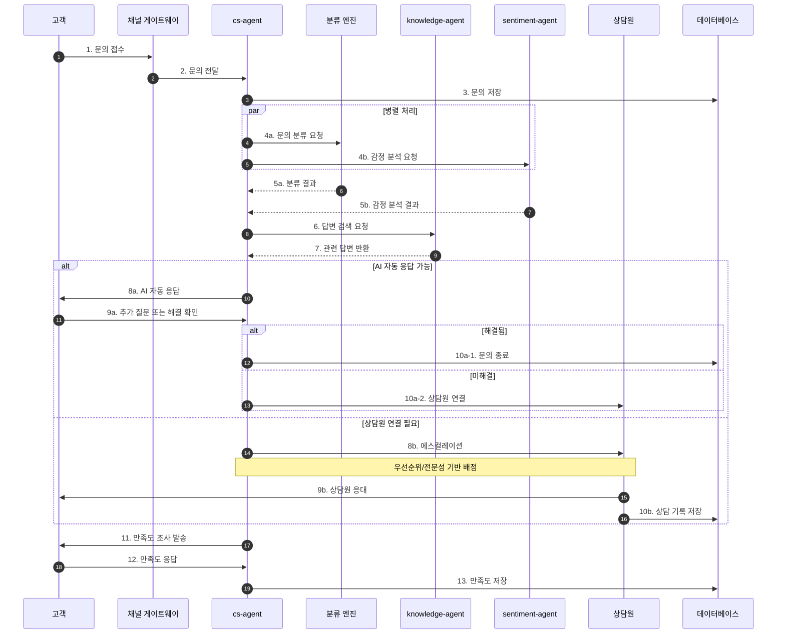
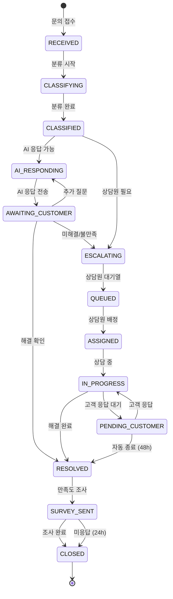
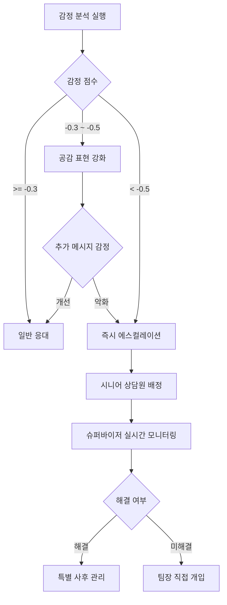

# CS 문의 처리 워크플로우 (Customer Service Inquiry Flow)

## 기본 정보

| 항목 | 값 |
|------|-----|
| **워크플로우 ID** | `WF-CS-001` |
| **버전** | 1.0.0 |
| **카테고리** | 고객서비스 (Customer Service) |
| **트리거 유형** | Event |
| **SLA** | 초기 응답: 30초 (AI) / 최종 해결: 4시간 |
| **자동화 수준** | Human-in-the-Loop (복잡 문의 시 인간 개입) |
| **우선순위** | High |
| **담당 팀** | Customer Service |
| **최종 수정** | 2025-01-26 |

---

## 워크플로우 개요

CS 문의 처리 워크플로우는 고객의 모든 문의를 접수하고, AI 기반 자동 응답 또는 상담원 연결을 통해 문의를 해결합니다. 문의 유형에 따라 적절한 처리 경로를 자동으로 결정하며, 해결 후 만족도 조사까지 진행합니다.

### 핵심 단계
1. **문의 접수** - 다양한 채널에서 문의 수신
2. **문의 분류** - AI 기반 문의 유형 자동 분류
3. **자동 응답 시도** - FAQ/정책 기반 AI 자동 응답
4. **에스컬레이션** - 복잡 문의 시 상담원 연결
5. **문의 처리** - 상담원 또는 AI 응대
6. **만족도 조사** - 서비스 만족도 수집

---

## 트리거 조건

### 이벤트 트리거

| 이벤트명 | 소스 | 조건 | 설명 |
|----------|------|------|------|
| `inquiry.created` | chat-widget | `channel == 'chat'` | 실시간 채팅 문의 |
| `inquiry.created` | email-parser | `channel == 'email'` | 이메일 문의 |
| `inquiry.created` | kakao-api | `channel == 'kakao'` | 카카오톡 문의 |
| `inquiry.created` | phone-ivr | `channel == 'phone'` | 전화 문의 (IVR 후) |
| `inquiry.created` | web-form | `channel == 'form'` | 문의 게시판 |

### 이벤트 페이로드 예시

```json
{
  "event_type": "inquiry.created",
  "timestamp": "2025-01-26T14:30:00+09:00",
  "data": {
    "inquiry_id": "INQ-2025012600001",
    "customer_id": "CUST-001234",
    "channel": "chat",
    "session_id": "SESS-XXXXX",
    "message": "주문한 상품이 아직 안 왔어요. 언제 배송되나요?",
    "context": {
      "recent_orders": ["ORD-2025012500001"],
      "customer_tier": "VIP",
      "previous_inquiries": 2
    },
    "attachments": [],
    "metadata": {
      "device": "mobile",
      "os": "iOS",
      "app_version": "2.1.0"
    }
  }
}
```

---

## 프로세스 흐름

### 전체 흐름도



### 상태 전이도



---

## 단계별 상세

### Step 1: 문의 접수 (Inquiry Reception)

| 항목 | 내용 |
|------|------|
| **Step ID** | `STEP-CS-001` |
| **담당 에이전트** | `cs-agent` |
| **설명** | 다양한 채널에서 문의를 수신하고 통합 처리 |
| **SLA** | 3초 |
| **재시도** | N/A |

**입력 (Input)**

```json
{
  "inquiry_id": "string - 자동생성",
  "customer_id": "string - 필수 (비회원 시 세션 ID)",
  "channel": "enum - chat/email/kakao/phone/form",
  "message": "string - 필수 - 문의 내용",
  "attachments": "array - 선택 - 첨부 파일",
  "context": {
    "page_url": "string - 문의 발생 페이지",
    "recent_orders": "array - 최근 주문 목록",
    "previous_inquiries": "number - 이전 문의 횟수"
  }
}
```

**처리 로직**

```python
def receive_inquiry(inquiry_data):
    # 1. 문의 ID 생성
    inquiry_id = generate_inquiry_id()

    # 2. 고객 정보 조회
    customer = get_customer_context(inquiry_data.customer_id)

    # 3. 문의 저장
    inquiry = Inquiry.create(
        inquiry_id=inquiry_id,
        customer_id=inquiry_data.customer_id,
        channel=inquiry_data.channel,
        message=inquiry_data.message,
        status='RECEIVED',
        priority=calculate_initial_priority(customer)
    )

    # 4. 실시간 채널이면 즉시 응답
    if inquiry_data.channel in ['chat', 'kakao']:
        send_immediate_ack(inquiry_data.session_id, "문의가 접수되었습니다. 잠시만 기다려주세요.")

    return inquiry
```

---

### Step 2: 문의 분류 (Inquiry Classification)

| 항목 | 내용 |
|------|------|
| **Step ID** | `STEP-CS-002` |
| **담당 에이전트** | `cs-agent` (분류 엔진 호출) |
| **설명** | AI 기반 문의 유형 및 의도 자동 분류 |
| **SLA** | 2초 |
| **재시도** | 1회 |

**분류 카테고리**

| 대분류 | 중분류 | 코드 | AI 자동응답 가능 |
|--------|--------|------|-----------------|
| 주문 | 주문 조회 | `ORD-STATUS` | Yes |
| 주문 | 주문 취소 | `ORD-CANCEL` | Partial |
| 주문 | 주문 변경 | `ORD-MODIFY` | Partial |
| 배송 | 배송 조회 | `SHP-STATUS` | Yes |
| 배송 | 배송지 변경 | `SHP-MODIFY` | Partial |
| 배송 | 배송 지연 | `SHP-DELAY` | Yes |
| 반품/교환 | 반품 요청 | `RTN-REQUEST` | Partial |
| 반품/교환 | 교환 요청 | `EXC-REQUEST` | Partial |
| 반품/교환 | 환불 문의 | `RFD-INQUIRY` | Yes |
| 상품 | 상품 문의 | `PRD-INQUIRY` | Yes |
| 상품 | 재입고 문의 | `PRD-RESTOCK` | Yes |
| 결제 | 결제 오류 | `PAY-ERROR` | Partial |
| 결제 | 결제 수단 변경 | `PAY-MODIFY` | No |
| 계정 | 회원 정보 | `ACC-INFO` | Yes |
| 계정 | 비밀번호 | `ACC-PASSWORD` | Yes |
| 기타 | 프로모션/쿠폰 | `PRM-INQUIRY` | Yes |
| 기타 | 불만/클레임 | `CMP-COMPLAINT` | No |
| 기타 | 칭찬/제안 | `CMP-FEEDBACK` | Yes |

**처리 로직**

```python
def classify_inquiry(inquiry):
    # 1. NLU 엔진으로 의도 분류
    classification = NLUEngine.classify(
        text=inquiry.message,
        context=inquiry.context
    )

    # 2. 감정 분석
    sentiment = SentimentAnalyzer.analyze(inquiry.message)

    # 3. 우선순위 재계산
    priority = calculate_priority(
        category=classification.category,
        sentiment=sentiment,
        customer_tier=inquiry.customer.tier,
        wait_time=0
    )

    # 4. 분류 결과 저장
    inquiry.update(
        category=classification.category,
        sub_category=classification.sub_category,
        intent=classification.intent,
        confidence=classification.confidence,
        sentiment=sentiment.score,
        priority=priority
    )

    return {
        'category': classification.category,
        'confidence': classification.confidence,
        'sentiment': sentiment,
        'ai_capable': is_ai_capable(classification.category),
        'priority': priority
    }
```

**분기 조건**

| 조건 | 다음 단계 | 설명 |
|------|----------|------|
| `ai_capable == True && confidence >= 0.85` | STEP-CS-003 | AI 자동 응답 |
| `ai_capable == True && confidence < 0.85` | STEP-CS-003 | AI 시도 후 확인 |
| `ai_capable == False` | STEP-CS-004 | 즉시 에스컬레이션 |
| `sentiment.score < -0.5` | STEP-CS-004 | 부정 감정 → 상담원 |
| `category == 'CMP-COMPLAINT'` | STEP-CS-004 | 클레임 → 즉시 상담원 |

---

### Step 3: AI 자동 응답 (AI Auto-Response)

| 항목 | 내용 |
|------|------|
| **Step ID** | `STEP-CS-003` |
| **담당 에이전트** | `cs-agent`, `knowledge-agent` |
| **설명** | FAQ, 정책, 실시간 데이터 기반 AI 자동 응답 |
| **SLA** | 5초 |
| **재시도** | 1회 |

**AI 자동 응답 가능 케이스**

| 문의 유형 | 자동 응답 내용 | 데이터 소스 |
|----------|---------------|-------------|
| 주문 조회 | 주문 상태, 결제 정보, 예상 배송일 | `orders` DB |
| 배송 조회 | 현재 배송 상태, 송장번호, 배송사 연락처 | `shipments` DB + 배송사 API |
| 배송 지연 | 지연 사유 설명, 새로운 예상 도착일 | `shipments` DB |
| 반품/교환 정책 | 반품 조건, 기간, 절차 안내 | `policies` KB |
| 환불 문의 | 환불 상태, 예상 환불일, 환불 금액 | `refunds` DB |
| 상품 문의 | 상품 상세, 사이즈, 소재, 사용법 | `products` DB + `faq` KB |
| 재입고 문의 | 재입고 예정일, 알림 신청 안내 | `inventory` DB |
| 프로모션 | 진행 중인 프로모션, 쿠폰 사용법 | `promotions` DB |
| 회원 정보 | 등급, 포인트, 쿠폰 현황 | `customers` DB |

**처리 로직**

```python
def generate_ai_response(inquiry, classification):
    # 1. 관련 지식 검색
    knowledge = KnowledgeAgent.search(
        query=inquiry.message,
        category=classification.category,
        filters={'active': True}
    )

    # 2. 실시간 데이터 조회 (필요시)
    live_data = None
    if classification.category in ['ORD-STATUS', 'SHP-STATUS', 'RFD-INQUIRY']:
        live_data = fetch_live_data(
            customer_id=inquiry.customer_id,
            data_type=classification.category
        )

    # 3. 응답 생성
    response = ResponseGenerator.generate(
        template=knowledge.best_match.template,
        context={
            'customer_name': inquiry.customer.name,
            'inquiry_content': inquiry.message,
            'live_data': live_data,
            'knowledge': knowledge.relevant_articles
        },
        tone=get_brand_tone()
    )

    # 4. 응답 전송
    send_response(
        channel=inquiry.channel,
        session_id=inquiry.session_id,
        message=response.text,
        quick_replies=response.suggested_actions
    )

    # 5. 해결 여부 확인 질문
    send_follow_up(
        session_id=inquiry.session_id,
        message="도움이 되셨나요? 추가로 궁금한 점이 있으시면 말씀해주세요.",
        options=['해결되었어요', '추가 질문이 있어요', '상담원 연결']
    )

    return {'response_sent': True, 'awaiting_feedback': True}
```

**Quick Reply 예시**

```json
{
  "type": "quick_reply",
  "options": [
    {"label": "해결되었어요", "action": "resolve"},
    {"label": "추가 질문이 있어요", "action": "continue"},
    {"label": "상담원과 대화하기", "action": "escalate"}
  ]
}
```

---

### Step 4: 에스컬레이션 (Escalation to Human Agent)

| 항목 | 내용 |
|------|------|
| **Step ID** | `STEP-CS-004` |
| **담당 에이전트** | `cs-agent` |
| **설명** | 복잡한 문의를 적절한 상담원에게 배정 |
| **SLA** | 배정: 10초 / 상담원 응답: 60초 |
| **재시도** | N/A |

**인간 개입 필요 케이스**

| 케이스 | 트리거 조건 | 우선순위 | 전문 상담원 |
|--------|------------|---------|------------|
| 클레임/불만 | `category == 'CMP-COMPLAINT'` | HIGH | 클레임 전담 |
| 부정적 감정 | `sentiment < -0.5` | HIGH | 시니어 상담원 |
| VIP 고객 | `customer.tier == 'VIP'` | HIGH | VIP 전담 |
| 결제 오류 | `category == 'PAY-ERROR'` | HIGH | 결제 전담 |
| 복잡한 교환/반품 | `complexity_score > 0.7` | MEDIUM | 반품 전담 |
| AI 응답 불만족 | `customer_feedback == 'escalate'` | MEDIUM | 일반 상담원 |
| AI 저신뢰도 | `ai_confidence < 0.7` | MEDIUM | 일반 상담원 |
| 개인정보 관련 | `contains_pii_request == True` | HIGH | 보안 전담 |

**처리 로직**

```python
def escalate_to_human(inquiry, reason):
    # 1. 적합한 상담원 찾기
    agent = find_best_agent(
        category=inquiry.category,
        priority=inquiry.priority,
        customer_tier=inquiry.customer.tier,
        required_skills=get_required_skills(inquiry.category),
        language=inquiry.customer.language
    )

    # 2. 대기열에 추가
    queue_position = AgentQueue.add(
        inquiry_id=inquiry.inquiry_id,
        agent_id=agent.id if agent else None,
        priority=inquiry.priority,
        estimated_wait=calculate_wait_time()
    )

    # 3. 상담 컨텍스트 준비 (상담원용 요약)
    context_summary = prepare_agent_context(
        inquiry=inquiry,
        ai_conversation=get_ai_conversation(inquiry.inquiry_id),
        customer_history=get_customer_history(inquiry.customer_id)
    )

    # 4. 고객에게 대기 안내
    send_response(
        session_id=inquiry.session_id,
        message=f"전문 상담원에게 연결해드리겠습니다. 예상 대기 시간은 약 {queue_position.estimated_wait}분입니다.",
        show_position=queue_position.position
    )

    # 5. 상담원에게 알림
    notify_agent(agent.id, {
        'inquiry_id': inquiry.inquiry_id,
        'customer_name': inquiry.customer.name,
        'summary': context_summary,
        'priority': inquiry.priority
    })

    return {'escalated': True, 'agent_id': agent.id, 'queue_position': queue_position}
```

---

### Step 5: 상담원 처리 (Human Agent Processing)

| 항목 | 내용 |
|------|------|
| **Step ID** | `STEP-CS-005` |
| **담당** | Human Agent (상담원) |
| **설명** | 상담원이 직접 고객 응대 및 문제 해결 |
| **SLA** | 첫 응답: 60초 / 해결: 4시간 |

**상담원 지원 도구**

```yaml
agent_tools:
  - customer_360:
      description: "고객 전체 정보 조회"
      data: [profile, orders, inquiries, loyalty]

  - order_management:
      description: "주문 조회/수정/취소"
      actions: [view, modify, cancel, refund]

  - knowledge_search:
      description: "정책/FAQ 검색"
      features: [full_text_search, category_filter]

  - response_templates:
      description: "응답 템플릿"
      categories: [apology, explanation, solution, closing]

  - ai_suggestion:
      description: "AI 응답 추천"
      features: [auto_complete, sentiment_check]

  - escalation:
      description: "상위 에스컬레이션"
      targets: [supervisor, specialist, external]
```

---

### Step 6: 만족도 조사 (Satisfaction Survey)

| 항목 | 내용 |
|------|------|
| **Step ID** | `STEP-CS-006` |
| **담당 에이전트** | `cs-agent` |
| **설명** | 문의 해결 후 고객 만족도 수집 |
| **SLA** | 발송: 즉시 / 응답 대기: 24시간 |

**처리 로직**

```python
def send_satisfaction_survey(inquiry):
    # 1. 문의 종료 후 적절한 시점에 발송
    delay = calculate_survey_delay(inquiry.channel)

    # 2. 만족도 조사 발송
    survey = SurveyService.send(
        customer_id=inquiry.customer_id,
        inquiry_id=inquiry.inquiry_id,
        channel=inquiry.channel,
        survey_type='CSAT',
        questions=[
            {
                'id': 'satisfaction',
                'type': 'rating',
                'question': '상담 서비스에 만족하셨나요?',
                'scale': [1, 2, 3, 4, 5],
                'labels': ['매우 불만족', '불만족', '보통', '만족', '매우 만족']
            },
            {
                'id': 'resolution',
                'type': 'boolean',
                'question': '문의가 해결되셨나요?'
            },
            {
                'id': 'feedback',
                'type': 'text',
                'question': '추가로 의견이 있으시면 남겨주세요.',
                'optional': True
            }
        ]
    )

    return {'survey_sent': True, 'survey_id': survey.id}
```

---

## 예외 처리

### 예외 유형 및 처리 방법

| 예외 코드 | 예외 유형 | 원인 | 처리 방법 | 에스컬레이션 |
|----------|----------|------|----------|-------------|
| `ERR-CS-001` | ClassificationFailed | AI 분류 실패 | 기본 카테고리로 분류 후 상담원 배정 | 분류 정확도 리포트 |
| `ERR-CS-002` | NoAgentAvailable | 가용 상담원 없음 | 콜백 예약 또는 이메일 전환 안내 | 관리자 알림 |
| `ERR-CS-003` | ResponseTimeout | 상담원 응답 지연 | 자동 재배정 | 1분 초과 시 슈퍼바이저 알림 |
| `ERR-CS-004` | CustomerAbandoned | 고객 이탈 | 후속 연락 스케줄링 | N/A |
| `ERR-CS-005` | SentimentAlert | 극도의 부정 감정 | 즉시 시니어 상담원 배정 | 실시간 슈퍼바이저 알림 |
| `ERR-CS-006` | EscalationRequired | 상담원 권한 초과 | 상위 단계 에스컬레이션 | 자동 전달 |

### 감정 악화 시 대응 플로우



---

## 관련 데이터

### 읽기 데이터 (Read)

| 데이터 | 소스 | 용도 | 접근 빈도 |
|--------|------|------|----------|
| 고객 정보 | `customers` 테이블 | 고객 식별, 등급 확인 | 매 문의 |
| 주문 정보 | `orders` 테이블 | 주문 관련 문의 처리 | 필요시 |
| 배송 정보 | `shipments` 테이블 | 배송 문의 처리 | 필요시 |
| 상품 정보 | `products` 테이블 | 상품 문의 처리 | 필요시 |
| FAQ/정책 | `knowledge_base` | AI 응답 생성 | 매 문의 |
| 문의 이력 | `inquiries` 테이블 | 이전 문의 컨텍스트 | 매 문의 |

### 쓰기 데이터 (Write)

| 데이터 | 대상 | 용도 | 타이밍 |
|--------|------|------|--------|
| 문의 기록 | `inquiries` 테이블 | 문의 저장/상태 업데이트 | 매 단계 |
| 대화 로그 | `conversation_logs` | 전체 대화 기록 | 실시간 |
| 상담원 메트릭 | `agent_metrics` | 상담원 성과 기록 | 문의 종료 시 |
| 만족도 결과 | `survey_responses` | CSAT 저장 | 조사 응답 시 |
| 분류 피드백 | `classification_feedback` | AI 학습 데이터 | 상담원 수정 시 |

---

## 알림 설정

### 고객 알림

| 시점 | 채널 | 템플릿 ID | 내용 |
|------|------|----------|------|
| 문의 접수 | In-app | `TPL-CS-001` | 문의가 접수되었습니다 |
| 상담원 연결 | In-app | `TPL-CS-002` | 상담원과 연결되었습니다 |
| 대기 시간 안내 | In-app | `TPL-CS-003` | 예상 대기 시간: X분 |
| 문의 해결 | Push, Email | `TPL-CS-004` | 문의가 해결되었습니다 |
| 만족도 조사 | Push | `TPL-CS-005` | 서비스 평가를 남겨주세요 |

### 내부 알림

| 시점 | 채널 | 대상 | 심각도 |
|------|------|------|--------|
| 클레임 접수 | Slack | #cs-escalation | HIGH |
| VIP 문의 | Slack | #cs-vip | MEDIUM |
| 대기열 과부하 | Slack | #cs-ops | HIGH |
| CSAT 1점 | Slack | #cs-quality | HIGH |
| 응답 SLA 임박 | Slack | 담당 상담원 | MEDIUM |

---

## KPI (핵심 성과 지표)

| 지표명 | 측정 방법 | 목표치 | 알림 임계치 |
|--------|----------|--------|------------|
| 첫 응답 시간 (FRT) | 접수~첫응답 | < 30초 (AI) / < 60초 (상담원) | > 2분 |
| 평균 해결 시간 (ART) | 접수~해결 | < 10분 (AI) / < 30분 (상담원) | > 1시간 |
| AI 자동 해결률 | AI 해결 / 전체 | 60% | < 50% |
| 첫 접촉 해결률 (FCR) | 1회 접촉 해결 / 전체 | 80% | < 70% |
| 고객 만족도 (CSAT) | 만족 응답 / 전체 응답 | 4.5/5.0 | < 4.0 |
| 상담원 활용률 | 상담 시간 / 근무 시간 | 75% | < 60% or > 90% |
| 이탈률 | 이탈 건 / 전체 대기 | < 5% | > 10% |

---

## AI 학습 및 개선

### 피드백 루프

```yaml
feedback_loop:
  # 1. 분류 정확도 개선
  classification_feedback:
    trigger: "상담원이 카테고리 수정"
    action: "수정 데이터 학습 세트에 추가"
    review_cycle: weekly

  # 2. 응답 품질 개선
  response_feedback:
    trigger: "고객 불만족 또는 에스컬레이션"
    action: "응답 템플릿 검토 대상 추가"
    review_cycle: daily

  # 3. 새로운 FAQ 추가
  knowledge_gap:
    trigger: "AI가 답변 못한 반복 질문"
    action: "지식베이스 추가 검토"
    review_cycle: weekly
```

---

## 변경 이력

| 버전 | 날짜 | 작성자 | 변경 내용 |
|------|------|--------|----------|
| 1.0.0 | 2025-01-26 | AI Agent | 초기 문서 작성 |

---

## 참고 문서

- [토폴로지 개요](../README.md)
- [클레임 처리 워크플로우](./claim-flow.md)
- [cs-agent 명세](../../agents/cs-agent/)
- [knowledge-agent 명세](../../agents/knowledge-agent/)
- [sentiment-agent 명세](../../agents/sentiment-agent/)
