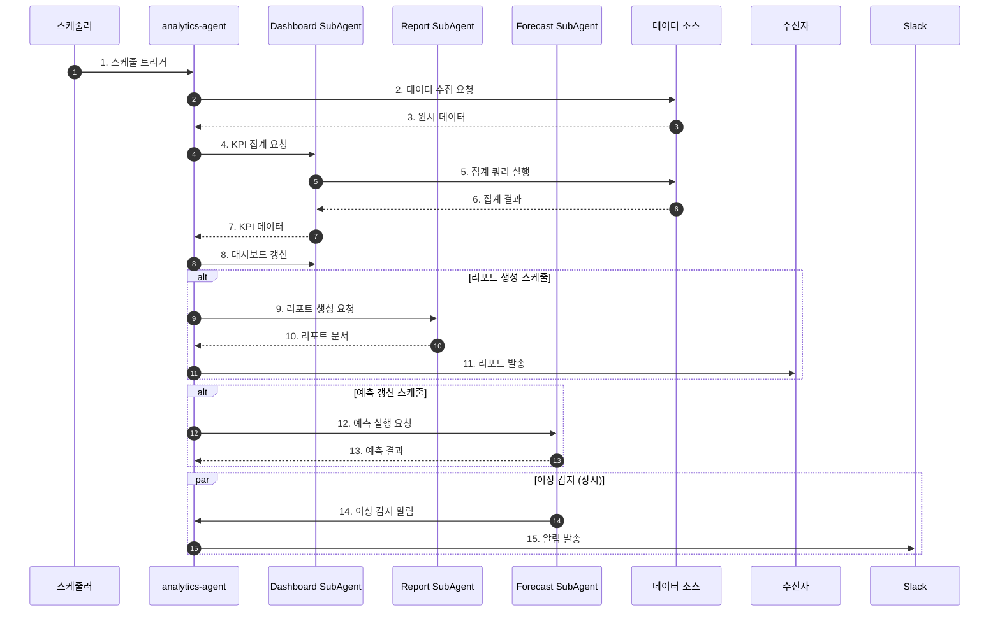
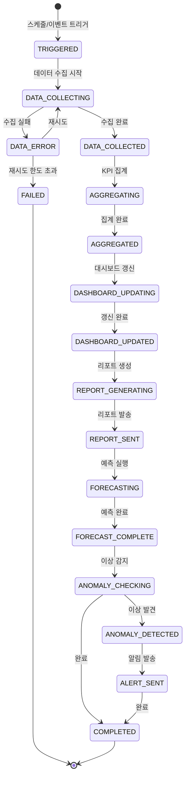

# 데이터 분석 워크플로우 (Data Analytics Flow)

## 기본 정보

| 항목 | 값 |
|------|-----|
| **워크플로우 ID** | `WF-ANL-001` |
| **버전** | 1.0.0 |
| **카테고리** | 데이터분석 (Data Analytics) |
| **트리거 유형** | Scheduled / Event |
| **SLA** | 일간: 30분 / 주간: 2시간 / 월간: 4시간 |
| **자동화 수준** | Fully Automated (L4) |
| **우선순위** | High |
| **담당 팀** | Data |
| **최종 수정** | 2024-01-26 |

---

## 워크플로우 개요

데이터 분석 워크플로우는 비즈니스 KPI 집계, 대시보드 갱신, 정기 리포트 생성, 예측 분석, 이상 감지 등 데이터 기반 의사결정을 지원하는 전 과정을 자동화합니다.

### 핵심 단계
1. **데이터 수집** - 다양한 소스에서 데이터 수집
2. **KPI 집계** - 핵심 지표 계산 및 집계
3. **대시보드 갱신** - 실시간 시각화 데이터 갱신
4. **리포트 생성** - 정기 리포트 자동 생성
5. **예측 분석** - 매출/수요 예측 실행
6. **이상 감지** - 메트릭 이상치 감지 및 알림

---

## 트리거 조건

### 스케줄 트리거

| 스케줄명 | 주기 | 시간 | 설명 |
|----------|------|------|------|
| `daily_kpi` | 매일 | 06:00 | 일간 KPI 집계 |
| `daily_report` | 매일 | 08:00 | 일간 리포트 생성 |
| `weekly_report` | 매주 월요일 | 09:00 | 주간 리포트 생성 |
| `monthly_report` | 매월 1일 | 10:00 | 월간 리포트 생성 |
| `forecast_update` | 매주 일요일 | 00:00 | 예측 모델 갱신 |
| `anomaly_check` | 매 5분 | - | 실시간 이상 감지 |

### 이벤트 트리거

| 이벤트명 | 소스 | 조건 | 설명 |
|----------|------|------|------|
| `report.request` | user | - | 즉시 리포트 요청 |
| `metric.threshold` | system | `value > threshold` | 임계치 초과 |
| `data.anomaly` | anomaly_detector | `score > 0.9` | 이상 감지 |

### 이벤트 페이로드 예시

```json
{
  "event_type": "scheduled.daily_kpi",
  "timestamp": "2024-01-26T06:00:00+09:00",
  "data": {
    "job_id": "KPI-2024012600001",
    "date_range": {
      "start": "2024-01-25T00:00:00+09:00",
      "end": "2024-01-25T23:59:59+09:00"
    },
    "metrics": ["revenue", "orders", "customers", "conversion", "aov"],
    "dimensions": ["channel", "category", "region"]
  }
}
```

---

## 프로세스 흐름

### 전체 흐름도



### 상태 전이도



---

## 단계별 상세

### Step 1: 데이터 수집 (Data Collection)

| 항목 | 내용 |
|------|------|
| **Step ID** | `STEP-ANL-001` |
| **담당 에이전트** | `analytics-agent` |
| **설명** | 다양한 데이터 소스에서 원시 데이터 수집 |
| **SLA** | 5분 |
| **재시도** | 3회 |

**데이터 소스**

| 소스 | 데이터 유형 | 수집 방식 | 갱신 주기 |
|------|------------|----------|----------|
| Supabase | 주문, 고객, 상품 | SQL Query | 실시간 |
| Google Analytics | 트래픽, 전환 | API | 일간 |
| 광고 플랫폼 | 광고 성과 | API | 일간 |
| CRM | 고객 행동 | API | 실시간 |
| 배송사 | 배송 현황 | API | 실시간 |

---

### Step 2: KPI 집계 (KPI Aggregation)

| 항목 | 내용 |
|------|------|
| **Step ID** | `STEP-ANL-002` |
| **담당 에이전트** | `analytics-agent` → `Dashboard SubAgent` |
| **설명** | 핵심 비즈니스 지표 계산 및 집계 |
| **SLA** | 10분 |
| **재시도** | 2회 |

**주요 KPI 정의**

| KPI | 정의 | 계산식 | 단위 |
|-----|------|--------|------|
| 매출 (Revenue) | 총 판매 금액 | SUM(order_amount) | 원 |
| 주문 수 (Orders) | 총 주문 건수 | COUNT(order_id) | 건 |
| AOV | 평균 주문 금액 | Revenue / Orders | 원 |
| 전환율 (CVR) | 방문 대비 구매 비율 | Orders / Sessions * 100 | % |
| 신규 고객 | 첫 구매 고객 수 | COUNT(first_order) | 명 |
| 재구매율 | 재구매 고객 비율 | Repeat / Total * 100 | % |
| CAC | 고객 획득 비용 | Marketing Cost / New Customers | 원 |
| LTV | 고객 생애 가치 | Avg Revenue * Avg Lifespan | 원 |

**집계 로직**

```python
def aggregate_kpis(date_range, dimensions):
    # 1. 기본 메트릭 집계
    base_metrics = db.query("""
        SELECT
            date,
            channel,
            category,
            SUM(order_amount) as revenue,
            COUNT(DISTINCT order_id) as orders,
            COUNT(DISTINCT customer_id) as customers,
            AVG(order_amount) as aov
        FROM orders
        WHERE order_date BETWEEN :start AND :end
        GROUP BY date, channel, category
    """, date_range)

    # 2. 전환율 계산
    traffic_data = get_traffic_data(date_range)
    cvr = calculate_conversion_rate(base_metrics, traffic_data)

    # 3. 고객 지표 계산
    customer_metrics = calculate_customer_metrics(date_range)

    # 4. 비용 지표 계산
    cost_metrics = calculate_cost_metrics(date_range)

    # 5. 결과 통합
    return merge_metrics(
        base_metrics, cvr, customer_metrics, cost_metrics
    )
```

---

### Step 3: 대시보드 갱신 (Dashboard Update)

| 항목 | 내용 |
|------|------|
| **Step ID** | `STEP-ANL-003` |
| **담당 에이전트** | `analytics-agent` → `Dashboard SubAgent` |
| **설명** | 실시간 대시보드 데이터 갱신 |
| **SLA** | 2분 |
| **재시도** | 2회 |

**대시보드 위젯**

| 위젯 | 유형 | 데이터 | 갱신 주기 |
|------|------|--------|----------|
| 오늘 매출 | 숫자 + 트렌드 | revenue | 5분 |
| 주문 현황 | 숫자 + 상태별 | orders | 5분 |
| 시간별 매출 | 라인 차트 | hourly_revenue | 1시간 |
| 채널별 매출 | 파이 차트 | channel_revenue | 일간 |
| 상품 순위 | 테이블 | top_products | 1시간 |
| 전환 퍼널 | 퍼널 차트 | funnel_data | 일간 |

---

### Step 4: 리포트 생성 (Report Generation)

| 항목 | 내용 |
|------|------|
| **Step ID** | `STEP-ANL-004` |
| **담당 에이전트** | `analytics-agent` → `Report SubAgent` |
| **설명** | 정기 리포트 자동 생성 및 발송 |
| **SLA** | 일간 30분 / 주간 1시간 / 월간 2시간 |
| **재시도** | 2회 |

**리포트 유형**

| 리포트 | 주기 | 내용 | 수신자 |
|--------|------|------|--------|
| 일간 리포트 | 매일 08:00 | 전일 매출, 주문, 주요 이벤트 | 전체 |
| 주간 리포트 | 매주 월요일 | 주간 트렌드, 채널 분석, 목표 달성률 | 관리자 |
| 월간 리포트 | 매월 1일 | 월간 성과, 고객 분석, 예측 | 경영진 |
| 캠페인 리포트 | 캠페인 종료 시 | 캠페인 성과 분석 | 마케팅 |

**리포트 구조**

```yaml
daily_report:
  sections:
    - executive_summary:
        metrics: [revenue, orders, aov, cvr]
        comparison: ["전일", "전주 동요일", "전년 동일"]

    - sales_analysis:
        charts: [hourly_trend, channel_breakdown]
        highlights: [top_products, growth_categories]

    - customer_insights:
        metrics: [new_customers, returning_customers]
        segments: [vip_activity, churn_risk]

    - operational_status:
        metrics: [fulfillment_rate, return_rate]
        issues: [delayed_orders, stock_alerts]

    - action_items:
        recommendations: [priority_actions]
```

---

### Step 5: 예측 분석 (Forecast Analysis)

| 항목 | 내용 |
|------|------|
| **Step ID** | `STEP-ANL-005` |
| **담당 에이전트** | `analytics-agent` → `Forecast SubAgent` |
| **설명** | 매출, 수요 예측 모델 실행 |
| **SLA** | 1시간 |
| **재시도** | 1회 |

**예측 모델**

| 모델 | 대상 | 기간 | 알고리즘 |
|------|------|------|----------|
| 매출 예측 | 일별 총 매출 | 7일, 30일 | Prophet + ARIMA |
| 수요 예측 | 상품별 판매량 | 14일, 30일 | XGBoost |
| 재고 예측 | 재고 소진일 | 30일 | 이동평균 + 계절성 |
| 고객 이탈 | 이탈 확률 | 30일 | Logistic Regression |

**예측 로직**

```python
def run_forecast(forecast_type, params):
    # 1. 학습 데이터 준비
    training_data = prepare_training_data(
        forecast_type=forecast_type,
        lookback_days=params.lookback_days
    )

    # 2. 특성 엔지니어링
    features = engineer_features(
        data=training_data,
        include_seasonality=True,
        include_holidays=True,
        include_promotions=True
    )

    # 3. 모델 실행
    model = load_model(forecast_type)
    predictions = model.predict(
        features,
        horizon=params.horizon
    )

    # 4. 신뢰 구간 계산
    confidence_intervals = calculate_confidence_intervals(
        predictions,
        confidence_level=0.95
    )

    # 5. 결과 저장
    save_forecast_results(
        forecast_type=forecast_type,
        predictions=predictions,
        confidence_intervals=confidence_intervals,
        model_metrics=model.get_metrics()
    )

    return {
        'predictions': predictions,
        'confidence': confidence_intervals,
        'accuracy': model.get_metrics()
    }
```

---

### Step 6: 이상 감지 (Anomaly Detection)

| 항목 | 내용 |
|------|------|
| **Step ID** | `STEP-ANL-006` |
| **담당 에이전트** | `analytics-agent` → `Forecast SubAgent` |
| **설명** | 실시간 메트릭 이상치 감지 및 알림 |
| **SLA** | 5분 이내 감지 |
| **재시도** | N/A |

**이상 감지 규칙**

| 메트릭 | 감지 방식 | 임계치 | 알림 대상 |
|--------|----------|--------|----------|
| 매출 | 이동평균 대비 | ±30% | 경영진 |
| 주문량 | 이동평균 대비 | ±40% | 운영팀 |
| 전환율 | 기준값 대비 | -50% | 마케팅 |
| 오류율 | 절대값 | >5% | 개발팀 |
| 반품률 | 이동평균 대비 | +100% | QC팀 |

**이상 감지 로직**

```python
def detect_anomalies(metric, window_size=24):
    # 1. 최근 데이터 조회
    recent_data = get_recent_data(metric, hours=window_size)

    # 2. 기준값 계산 (이동 평균 + 표준편차)
    baseline = calculate_baseline(recent_data)

    # 3. Z-score 계산
    current_value = get_current_value(metric)
    z_score = (current_value - baseline.mean) / baseline.std

    # 4. 이상 여부 판단
    is_anomaly = abs(z_score) > 3  # 3-sigma rule

    if is_anomaly:
        # 5. 알림 생성
        alert = create_alert(
            metric=metric,
            current_value=current_value,
            expected_range=(baseline.lower, baseline.upper),
            severity=calculate_severity(z_score),
            possible_causes=analyze_root_cause(metric, recent_data)
        )

        # 6. 알림 발송
        send_alert(alert)

    return {
        'metric': metric,
        'is_anomaly': is_anomaly,
        'z_score': z_score,
        'current': current_value,
        'baseline': baseline
    }
```

---

## 예외 처리

### 예외 유형 및 처리 방법

| 예외 코드 | 예외 유형 | 원인 | 처리 방법 | 에스컬레이션 |
|----------|----------|------|----------|-------------|
| `ERR-ANL-001` | DataFetchError | 데이터 소스 연결 실패 | 재시도 후 캐시 데이터 사용 | Ops 알림 |
| `ERR-ANL-002` | AggregationError | 집계 쿼리 실패 | 부분 집계 후 알림 | Data 알림 |
| `ERR-ANL-003` | ReportError | 리포트 생성 실패 | 재시도 후 수동 생성 안내 | 수신자 알림 |
| `ERR-ANL-004` | ForecastError | 예측 모델 실패 | 이전 예측값 유지 | Data 알림 |
| `ERR-ANL-005` | AlertFlood | 과다 알림 발생 | 알림 통합 및 억제 | Ops 알림 |

---

## KPI (핵심 성과 지표)

| 지표명 | 측정 방법 | 목표치 | 알림 임계치 |
|--------|----------|--------|------------|
| 데이터 갱신 지연 | 집계 완료 시간 | < 5분 | > 10분 |
| 리포트 정시 발송률 | 예정 시간 대비 | 99% | < 95% |
| 예측 정확도 (MAPE) | 예측 vs 실제 | < 10% | > 15% |
| 이상 감지 정확도 | 유효 알림 비율 | > 90% | < 80% |
| False Positive Rate | 오탐 비율 | < 5% | > 10% |

---

## 연관 에이전트

| 에이전트 | 역할 | 상호작용 |
|----------|------|----------|
| `crisis-agent` | 이상 감지 시 위기 대응 | 알림 전달 |
| `marketing-agent` | 마케팅 성과 데이터 | 데이터 제공 |
| `order-agent` | 주문 데이터 | 데이터 제공 |
| `inventory-agent` | 재고 데이터 | 데이터 제공 |

---

## 변경 이력

| 버전 | 날짜 | 작성자 | 변경 내용 |
|------|------|--------|----------|
| 1.0.0 | 2024-01-26 | AI Agent | 초기 문서 작성 |

---

*이 문서는 데이터 분석 워크플로우의 상세 스펙을 정의합니다.*
