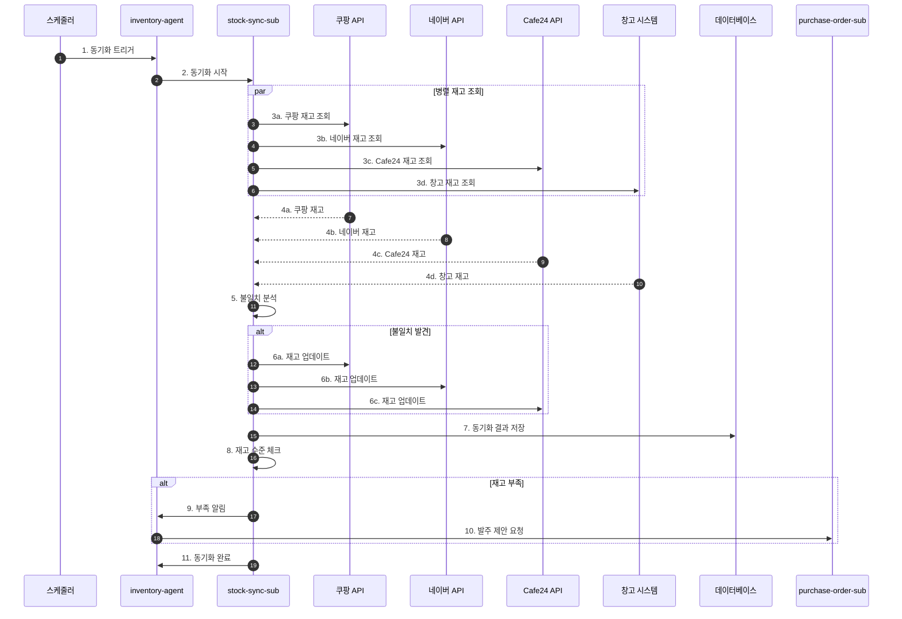
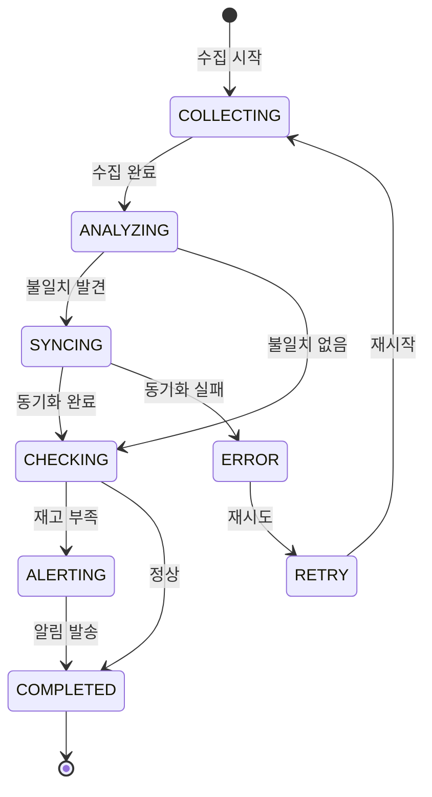

# 재고 동기화 워크플로우 (Inventory Sync Flow)

## 기본 정보

| 항목 | 값 |
|------|-----|
| **워크플로우 ID** | `WF-INV-001` |
| **버전** | 1.0.0 |
| **카테고리** | 재고관리 (Inventory Management) |
| **트리거 유형** | Schedule / Event |
| **SLA** | 응답: 5초 / 완료: 1분 |
| **자동화 수준** | Full-Auto |
| **우선순위** | High |
| **담당 팀** | Operations |
| **최종 수정** | 2025-01-26 |

---

## 워크플로우 개요

재고 동기화 워크플로우는 다중 판매 채널(쿠팡, 네이버, 자사몰)과 물류 창고 간의 재고 수량을 실시간으로 동기화합니다. 품절 방지와 과판매 방지를 위해 지속적인 모니터링과 자동 조정을 수행합니다.

### 핵심 단계
1. **재고 조회** - 채널별/창고별 현재 재고 수집
2. **불일치 감지** - 재고 차이 분석
3. **동기화 실행** - 채널 재고 업데이트
4. **수준 체크** - 재고 부족/과잉 확인
5. **알림 발송** - 필요시 알림 및 발주 트리거

---

## 트리거 조건

### 스케줄 트리거

```yaml
schedule:
  cron: "*/10 * * * *"  # 10분마다 실행
  timezone: "Asia/Seoul"
  enabled: true
```

### 이벤트 트리거

| 이벤트명 | 소스 | 조건 | 설명 |
|----------|------|------|------|
| `order.completed` | order-agent | 주문 완료 시 | 판매로 인한 재고 변동 |
| `inventory.received` | warehouse | 입고 완료 시 | 입고로 인한 재고 증가 |
| `inventory.manual_adjust` | admin | 수동 조정 시 | 관리자 재고 조정 |

---

## 프로세스 흐름

### 전체 흐름도



### 상태 전이도



---

## 단계별 상세

### Step 1: 재고 수집 (Stock Collection)

| 항목 | 내용 |
|------|------|
| **Step ID** | `STEP-INV-001` |
| **담당 에이전트** | `stock-sync-sub` |
| **설명** | 모든 채널과 창고에서 현재 재고 수집 |
| **SLA** | 10초 |
| **재시도** | 3회 |

**처리 로직**

```python
async def collect_all_stock():
    results = {}

    # 병렬로 모든 채널 조회
    tasks = [
        fetch_coupang_stock(),
        fetch_naver_stock(),
        fetch_cafe24_stock(),
        fetch_warehouse_stock()
    ]

    channel_stocks = await asyncio.gather(*tasks, return_exceptions=True)

    for channel, stock in zip(CHANNELS, channel_stocks):
        if isinstance(stock, Exception):
            log_error(f"{channel} stock fetch failed", stock)
            continue
        results[channel] = stock

    return results
```

---

### Step 2: 불일치 분석 (Mismatch Analysis)

| 항목 | 내용 |
|------|------|
| **Step ID** | `STEP-INV-002` |
| **담당 에이전트** | `stock-sync-sub` |
| **설명** | 채널 간 재고 차이 분석 |
| **SLA** | 5초 |

**분석 로직**

```python
def analyze_mismatches(channel_stocks, warehouse_stock):
    mismatches = []

    for product_id in warehouse_stock:
        warehouse_qty = warehouse_stock[product_id]

        for channel, stock in channel_stocks.items():
            channel_qty = stock.get(product_id, 0)

            if channel_qty != warehouse_qty:
                mismatches.append({
                    'product_id': product_id,
                    'channel': channel,
                    'channel_qty': channel_qty,
                    'warehouse_qty': warehouse_qty,
                    'difference': warehouse_qty - channel_qty
                })

    return mismatches
```

---

### Step 3: 동기화 실행 (Sync Execution)

| 항목 | 내용 |
|------|------|
| **Step ID** | `STEP-INV-003` |
| **담당 에이전트** | `stock-sync-sub` |
| **설명** | 채널별 재고 업데이트 API 호출 |
| **SLA** | 30초 |
| **재시도** | 5회 |

**동기화 로직**

```python
async def sync_channel_stock(mismatches):
    results = []

    for mismatch in mismatches:
        channel = mismatch['channel']
        product_id = mismatch['product_id']
        new_qty = mismatch['warehouse_qty']

        try:
            if channel == 'COUPANG':
                await coupang_api.update_stock(product_id, new_qty)
            elif channel == 'NAVER':
                await naver_api.update_stock(product_id, new_qty)
            elif channel == 'CAFE24':
                await cafe24_api.update_stock(product_id, new_qty)

            results.append({
                'product_id': product_id,
                'channel': channel,
                'status': 'SUCCESS',
                'new_qty': new_qty
            })
        except Exception as e:
            results.append({
                'product_id': product_id,
                'channel': channel,
                'status': 'FAILED',
                'error': str(e)
            })

    return results
```

---

### Step 4: 재고 수준 체크 (Stock Level Check)

| 항목 | 내용 |
|------|------|
| **Step ID** | `STEP-INV-004` |
| **담당 에이전트** | `stock-sync-sub` |
| **설명** | 재고 부족/과잉 상품 식별 |
| **SLA** | 5초 |

**체크 로직**

```python
def check_stock_levels(warehouse_stock, thresholds):
    alerts = {
        'critical': [],  # 재고 5개 이하
        'low': [],       # 재고 10개 이하
        'overstock': []  # 재고 100개 이상
    }

    for product_id, qty in warehouse_stock.items():
        if qty <= thresholds['critical']:
            alerts['critical'].append({
                'product_id': product_id,
                'quantity': qty,
                'threshold': thresholds['critical']
            })
        elif qty <= thresholds['low']:
            alerts['low'].append({
                'product_id': product_id,
                'quantity': qty,
                'threshold': thresholds['low']
            })
        elif qty >= thresholds['overstock']:
            alerts['overstock'].append({
                'product_id': product_id,
                'quantity': qty,
                'threshold': thresholds['overstock']
            })

    return alerts
```

---

## 예외 처리

### 예외 유형 및 처리 방법

| 예외 코드 | 예외 유형 | 원인 | 처리 방법 |
|----------|----------|------|----------|
| `ERR-INV-001` | ChannelAPITimeout | 채널 API 응답 지연 | 재시도 후 스킵 |
| `ERR-INV-002` | StockUpdateFailed | 재고 업데이트 실패 | 재시도 후 수동 처리 |
| `ERR-INV-003` | DataMismatch | 데이터 불일치 | 로그 기록 후 알림 |
| `ERR-INV-004` | WarehouseAPIError | 창고 시스템 오류 | 재시도 후 알림 |

---

## 알림 설정

### 내부 알림

| 시점 | 채널 | 대상 | 심각도 |
|------|------|------|--------|
| 재고 Critical (5개 이하) | Slack, 카카오톡 | #ops-inventory, CEO | HIGH |
| 재고 Low (10개 이하) | Slack | #ops-inventory | MEDIUM |
| 동기화 실패 | Slack | #ops-alert | HIGH |
| 대량 불일치 (10+ SKU) | Slack | #ops-inventory | MEDIUM |

---

## KPI (핵심 성과 지표)

| 지표명 | 측정 방법 | 목표치 | 알림 임계치 |
|--------|----------|--------|------------|
| 동기화 정확도 | 일치 SKU / 전체 SKU | >= 99% | < 97% |
| 동기화 소요 시간 | 시작~완료 | < 1분 | > 3분 |
| 품절률 | 품절 SKU / 전체 SKU | < 2% | > 5% |
| API 성공률 | 성공 호출 / 전체 호출 | >= 99% | < 95% |

---

## 변경 이력

| 버전 | 날짜 | 작성자 | 변경 내용 |
|------|------|--------|----------|
| 1.0.0 | 2025-01-26 | AI System | 초기 문서 작성 |

---

## 참고 문서

- [Inventory Agent 명세](../../agents/05-inventory/main.md)
- [주문 처리 워크플로우](./order-flow.md)
- [발주 관리 워크플로우](./inventory-po-flow.md)
