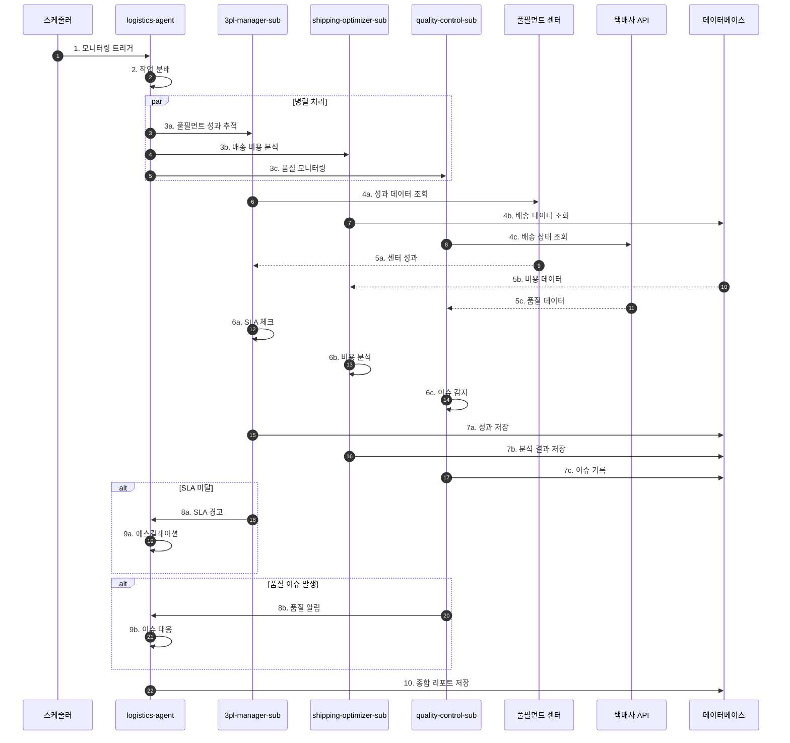
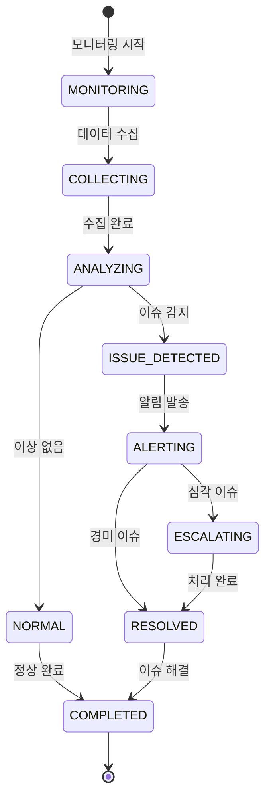

# 물류 관리 워크플로우 (Logistics Management Flow)

## 기본 정보

| 항목 | 값 |
|------|-----|
| **워크플로우 ID** | `WF-LOG-001` |
| **버전** | 1.0.0 |
| **카테고리** | 물류관리 (Logistics Management) |
| **트리거 유형** | Schedule / Event |
| **SLA** | 응답: 10초 / 완료: 5분 |
| **자동화 수준** | Full-Auto |
| **우선순위** | High |
| **담당 팀** | Operations, Fulfillment |
| **최종 수정** | 2025-01-26 |

---

## 워크플로우 개요

물류 관리 워크플로우는 3PL 풀필먼트 센터 성과 추적, 택배사 비용/성과 분석, 배송 품질 모니터링을 통합 관리합니다. 배송 최적화와 품질 관리를 통해 고객 만족도를 높이고 물류 비용을 절감합니다.

### 핵심 단계
1. **성과 수집** - 풀필먼트/택배사 성과 데이터 수집
2. **분석 실행** - 비용/품질 분석
3. **이슈 감지** - 지연/파손/분실 감지
4. **최적화 제안** - 개선 방안 도출
5. **알림 발송** - 이슈 및 리포트 알림

---

## 트리거 조건

### 스케줄 트리거

```yaml
schedule:
  performance_tracking:
    cron: "0 */2 * * *"  # 2시간마다
    description: "풀필먼트 성과 추적"

  cost_analysis:
    cron: "0 9 * * *"  # 매일 오전 9시
    description: "일간 배송 비용 분석"

  quality_monitoring:
    cron: "*/30 * * * *"  # 30분마다
    description: "품질 모니터링"
```

### 이벤트 트리거

| 이벤트명 | 소스 | 조건 | 설명 |
|----------|------|------|------|
| `shipment.delayed` | carrier | 배송 지연 감지 | 예상 배송일 초과 |
| `shipment.damaged` | customer | 파손 신고 | 고객 파손 접수 |
| `shipment.lost` | carrier | 분실 감지 | 배송 추적 불가 |

---

## 프로세스 흐름

### 전체 흐름도



### 상태 전이도



---

## 단계별 상세

### Step 1: 풀필먼트 성과 추적 (Fulfillment Performance Tracking)

| 항목 | 내용 |
|------|------|
| **Step ID** | `STEP-LOG-001` |
| **담당 에이전트** | `3pl-manager-sub` |
| **설명** | 풀필먼트 센터별 성과 데이터 수집 및 분석 |
| **SLA** | 30초 |
| **재시도** | 3회 |

**처리 로직**

```python
async def track_fulfillment_performance():
    performances = []

    for center in get_active_centers():
        # 성과 데이터 조회
        metrics = await center.get_performance_metrics(period='week')

        performance = {
            'center_id': center.id,
            'center_name': center.name,
            'metrics': {
                'total_orders': metrics.total_orders,
                'orders_shipped': metrics.shipped,
                'orders_on_time': metrics.on_time,
                'accuracy_rate': metrics.accuracy,
                'avg_processing_time': metrics.avg_time
            },
            'sla': {
                'on_time_target': 95,
                'actual': metrics.on_time_rate,
                'status': 'good' if metrics.on_time_rate >= 95 else 'warning'
            }
        }

        performances.append(performance)

        # SLA 미달 시 알림
        if metrics.on_time_rate < 95 * 0.95:
            await notify_sla_breach(center, metrics)

    return performances
```

---

### Step 2: 배송 비용 분석 (Shipping Cost Analysis)

| 항목 | 내용 |
|------|------|
| **Step ID** | `STEP-LOG-002` |
| **담당 에이전트** | `shipping-optimizer-sub` |
| **설명** | 택배사별/지역별/서비스별 배송 비용 분석 |
| **SLA** | 1분 |

**분석 로직**

```python
def analyze_shipping_costs(period='month'):
    shipments = get_shipments(period)

    analysis = {
        'total_shipments': len(shipments),
        'total_cost': sum(s.cost for s in shipments),
        'average_cost': 0,
        'by_courier': {},
        'by_region': {},
        'by_service': {},
        'savings_opportunities': []
    }

    analysis['average_cost'] = analysis['total_cost'] / analysis['total_shipments']

    # 택배사별 분석
    for courier_id, group in groupby(shipments, 'courier_id'):
        courier_shipments = list(group)
        analysis['by_courier'][courier_id] = {
            'count': len(courier_shipments),
            'total_cost': sum(s.cost for s in courier_shipments),
            'avg_cost': sum(s.cost for s in courier_shipments) / len(courier_shipments)
        }

    # 절감 기회 식별
    analysis['savings_opportunities'] = identify_savings(analysis['by_courier'])

    return analysis
```

---

### Step 3: 품질 모니터링 (Quality Monitoring)

| 항목 | 내용 |
|------|------|
| **Step ID** | `STEP-LOG-003` |
| **담당 에이전트** | `quality-control-sub` |
| **설명** | 지연/파손/분실 모니터링 및 KPI 추적 |
| **SLA** | 30초 |

**모니터링 로직**

```python
async def monitor_quality(thresholds):
    shipments = get_recent_shipments(days=7)
    issues = get_quality_issues(days=7)

    # 이슈율 계산
    total = len(shipments)
    delayed = len([s for s in shipments if s.is_delayed])
    damaged = len([s for s in shipments if s.is_damaged])
    lost = len([s for s in shipments if s.is_lost])

    rates = {
        'delay_rate': (delayed / total * 100) if total > 0 else 0,
        'damage_rate': (damaged / total * 100) if total > 0 else 0,
        'lost_rate': (lost / total * 100) if total > 0 else 0
    }

    # 임계치 초과 알림
    alerts = []
    if rates['delay_rate'] > thresholds['delay']:
        alerts.append({
            'type': 'delay',
            'message': f"지연율 {rates['delay_rate']:.2f}% (임계치: {thresholds['delay']}%)",
            'severity': 'critical' if rates['delay_rate'] > thresholds['delay'] * 2 else 'warning'
        })

    if rates['damage_rate'] > thresholds['damage']:
        alerts.append({
            'type': 'damage',
            'message': f"파손율 {rates['damage_rate']:.2f}% (임계치: {thresholds['damage']}%)",
            'severity': 'warning'
        })

    if rates['lost_rate'] > thresholds['lost']:
        alerts.append({
            'type': 'lost',
            'message': f"분실율 {rates['lost_rate']:.2f}% (임계치: {thresholds['lost']}%)",
            'severity': 'critical'
        })

    return {
        'rates': rates,
        'alerts': alerts,
        'top_issues': issues[:10]
    }
```

---

### Step 4: 택배사 추천 (Courier Recommendation)

| 항목 | 내용 |
|------|------|
| **Step ID** | `STEP-LOG-004` |
| **담당 에이전트** | `shipping-optimizer-sub` |
| **설명** | 주문 특성에 맞는 최적 택배사 추천 |
| **SLA** | 5초 |

**추천 로직**

```python
def recommend_courier(order):
    couriers = get_active_couriers()
    recommendations = []

    for courier in couriers:
        score = calculate_courier_score(courier, order)
        cost = estimate_shipping_cost(courier, order.weight, order.region)

        recommendations.append({
            'courier_id': courier.id,
            'courier_name': courier.name,
            'score': score,
            'estimated_cost': cost,
            'estimated_days': courier.avg_delivery_days,
            'reasons': generate_reasons(courier, score)
        })

    # 점수순 정렬
    recommendations.sort(key=lambda x: x['score'], reverse=True)

    return {
        'order_id': order.id,
        'recommendations': recommendations[:3],
        'selected': recommendations[0]['courier_id']
    }
```

---

## 예외 처리

### 예외 유형 및 처리 방법

| 예외 코드 | 예외 유형 | 원인 | 처리 방법 |
|----------|----------|------|----------|
| `ERR-LOG-001` | FulfillmentAPIError | 풀필먼트 API 오류 | 재시도 후 수동 확인 |
| `ERR-LOG-002` | CarrierTrackingFailed | 배송 추적 실패 | 재시도 후 스킵 |
| `ERR-LOG-003` | CostCalculationError | 비용 계산 오류 | 데이터 검증 |
| `ERR-LOG-004` | QualityDataMissing | 품질 데이터 누락 | 대체 소스 사용 |

---

## 알림 설정

### 내부 알림

| 시점 | 채널 | 대상 | 심각도 |
|------|------|------|--------|
| 지연율 10% 초과 | Slack, 카카오톡 | #ops-logistics, CEO | CRITICAL |
| 파손 발생 | Slack | #ops-logistics | HIGH |
| 분실 발생 | Slack, 카카오톡 | #ops-logistics, CEO | CRITICAL |
| SLA 미달 | Slack | #ops-logistics | HIGH |
| 비용 급증 (20%+) | Slack | #ops-logistics | MEDIUM |

---

## KPI (핵심 성과 지표)

| 지표명 | 측정 방법 | 목표치 | 알림 임계치 |
|--------|----------|--------|------------|
| 정시 배송율 | 정시배송 / 전체배송 | >= 95% | < 90% |
| 파손율 | 파손건수 / 전체배송 | < 1% | > 2% |
| 분실율 | 분실건수 / 전체배송 | < 0.5% | > 1% |
| 평균 배송비용 | 총비용 / 총건수 | 최적화 | +20% |
| 풀필먼트 SLA | SLA충족 / 전체 | >= 95% | < 90% |

---

## 변경 이력

| 버전 | 날짜 | 작성자 | 변경 내용 |
|------|------|--------|----------|
| 1.0.0 | 2025-01-26 | AI System | 초기 문서 작성 |

---

## 참고 문서

- [Logistics Agent 명세](../../agents/13-logistics/main.md)
- [주문 처리 워크플로우](./order-flow.md)
- [Order Agent 명세](../../agents/01-order/main.md)
