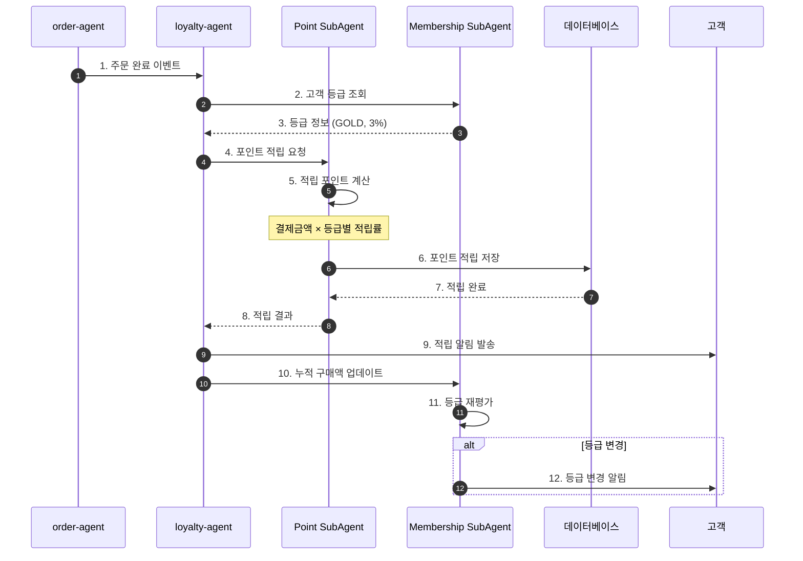
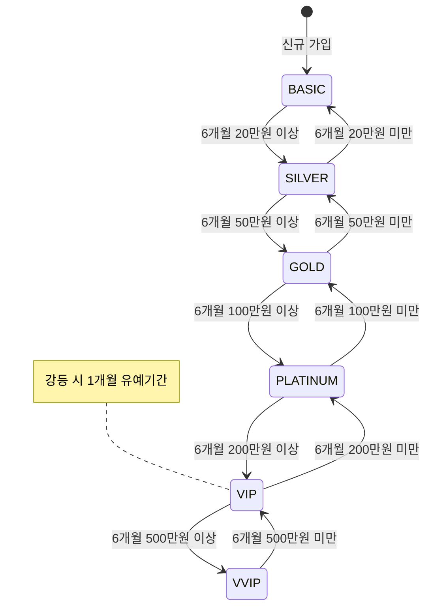

# 로열티 프로그램 워크플로우 (Loyalty Program Flow)

## 기본 정보

| 항목 | 값 |
|------|-----|
| **워크플로우 ID** | `WF-LOY-001` |
| **버전** | 1.0.0 |
| **카테고리** | 로열티 (Loyalty) |
| **트리거 유형** | Event / Scheduled |
| **SLA** | 포인트 적립: 즉시 / 등급 평가: 일간 / VIP 케어: 24시간 |
| **자동화 수준** | Fully Automated (L4) |
| **우선순위** | High |
| **담당 팀** | CRM, CS |
| **최종 수정** | 2024-01-26 |

---

## 워크플로우 개요

로열티 프로그램 워크플로우는 고객 충성도를 높이기 위한 멤버십 등급 관리, 포인트 운영, VIP 케어, 이탈 방지 활동 등을 자동화합니다. 고객의 구매 활동에 따라 혜택을 제공하고 장기적인 관계를 구축합니다.

### 핵심 단계
1. **포인트 적립** - 구매/활동 기반 포인트 적립
2. **포인트 사용** - 결제 시 포인트 사용 처리
3. **등급 평가** - 멤버십 등급 자동 평가
4. **혜택 적용** - 등급별 혜택 자동 적용
5. **VIP 케어** - VIP 고객 특별 관리
6. **이탈 방지** - 이탈 위험 고객 케어

---

## 트리거 조건

### 이벤트 트리거

| 이벤트명 | 소스 | 조건 | 설명 |
|----------|------|------|------|
| `order.completed` | order-agent | `status == 'delivered'` | 배송 완료 시 포인트 적립 |
| `review.created` | review-system | `is_verified == true` | 리뷰 작성 포인트 |
| `customer.signup` | auth-system | `is_new == true` | 신규 가입 포인트 |
| `point.use_request` | checkout | `point_amount > 0` | 포인트 사용 요청 |
| `customer.birthday` | scheduler | `birthday == today` | 생일 포인트 지급 |

### 스케줄 트리거

| 스케줄명 | 주기 | 시간 | 설명 |
|----------|------|------|------|
| `tier_evaluation` | 매일 | 00:00 | 일간 등급 평가 |
| `tier_change_monthly` | 매월 1일 | 06:00 | 월간 등급 변경 처리 |
| `point_expiry_alert` | 매일 | 09:00 | 포인트 소멸 알림 |
| `point_expiry_process` | 매일 | 00:00 | 포인트 소멸 처리 |
| `churn_analysis` | 매주 월요일 | 08:00 | 이탈 위험 분석 |

### 이벤트 페이로드 예시

```json
{
  "event_type": "order.completed",
  "timestamp": "2024-01-26T15:00:00+09:00",
  "data": {
    "order_id": "ORD-2024012600001",
    "customer_id": "CUST-12345",
    "order_amount": 85000,
    "payment_amount": 80000,
    "used_points": 5000,
    "customer_tier": "GOLD",
    "point_rate": 0.03,
    "items": [
      {
        "sku": "SKU-001",
        "name": "진정 앰플",
        "quantity": 2,
        "amount": 58000
      }
    ]
  }
}
```

---

## 프로세스 흐름

### 포인트 적립 흐름



### 상태 전이도 (멤버십)



---

## 단계별 상세

### Step 1: 포인트 적립 (Point Earning)

| 항목 | 내용 |
|------|------|
| **Step ID** | `STEP-LOY-001` |
| **담당 에이전트** | `loyalty-agent` → `Point SubAgent` |
| **설명** | 구매/활동 기반 포인트 자동 적립 |
| **SLA** | 즉시 |
| **재시도** | 3회 |

**포인트 적립 정책**

| 적립 유형 | 기준 | 적립률/포인트 | 조건 |
|----------|------|--------------|------|
| 구매 적립 | 결제 금액 | 등급별 1~7% | 배송 완료 시 |
| 리뷰 적립 | 텍스트 리뷰 | 100P | 구매 확정 후 |
| 포토 리뷰 | 사진 포함 리뷰 | 300P | 구매 확정 후 |
| 가입 적립 | 신규 가입 | 2,000P | 최초 1회 |
| 생일 적립 | 생일 | 등급별 상이 | 연 1회 |
| 출석 적립 | 앱 출석 | 10P/일 | 일 1회 |

**적립 로직**

```python
def earn_points(customer_id, earn_type, reference_id, amount=None):
    # 1. 고객 정보 조회
    customer = get_customer(customer_id)
    tier_info = get_tier_info(customer.tier)

    # 2. 적립 포인트 계산
    if earn_type == 'purchase':
        points = calculate_purchase_points(amount, tier_info.point_rate)
    elif earn_type == 'review_text':
        points = 100
    elif earn_type == 'review_photo':
        points = 300
    elif earn_type == 'signup':
        points = 2000
    elif earn_type == 'birthday':
        points = tier_info.birthday_points

    # 3. 중복 적립 체크
    if is_duplicate_earn(customer_id, earn_type, reference_id):
        raise DuplicateEarnError()

    # 4. 포인트 적립
    transaction = create_point_transaction(
        customer_id=customer_id,
        type='EARN',
        amount=points,
        earn_type=earn_type,
        reference_id=reference_id,
        expiry_date=calculate_expiry_date()  # 12개월 후
    )

    # 5. 잔액 업데이트
    update_point_balance(customer_id, points)

    # 6. 알림 발송
    send_point_notification(
        customer_id=customer_id,
        type='earn',
        points=points,
        balance=get_point_balance(customer_id)
    )

    return transaction
```

---

### Step 2: 포인트 사용 (Point Redemption)

| 항목 | 내용 |
|------|------|
| **Step ID** | `STEP-LOY-002` |
| **담당 에이전트** | `loyalty-agent` → `Point SubAgent` |
| **설명** | 결제 시 포인트 사용 처리 |
| **SLA** | 즉시 |
| **재시도** | 2회 |

**포인트 사용 정책**

| 정책 | 값 | 설명 |
|------|-----|------|
| 최소 사용 | 1,000P | 1,000포인트 이상 사용 가능 |
| 최대 사용 | 결제금액의 30% | 결제금액의 30%까지 사용 가능 |
| 사용 단위 | 100P | 100포인트 단위로 사용 |
| 제외 품목 | 특가/할인 상품 | 일부 상품 포인트 사용 불가 |

**사용 로직**

```python
def use_points(customer_id, order_id, requested_points, order_amount):
    # 1. 잔액 확인
    balance = get_point_balance(customer_id)
    if balance < requested_points:
        raise InsufficientPointsError()

    # 2. 사용 한도 확인
    max_usable = min(
        balance,
        order_amount * 0.3,  # 최대 30%
        requested_points
    )

    # 3. 최소 사용 금액 확인
    if max_usable < 1000:
        raise MinimumPointError()

    # 4. 100포인트 단위로 조정
    actual_use = (max_usable // 100) * 100

    # 5. 선입선출(FIFO)로 차감
    deducted = deduct_points_fifo(customer_id, actual_use)

    # 6. 트랜잭션 기록
    transaction = create_point_transaction(
        customer_id=customer_id,
        type='USE',
        amount=-actual_use,
        reference_id=order_id,
        details=deducted
    )

    return {
        'used_points': actual_use,
        'remaining_balance': balance - actual_use,
        'transaction_id': transaction.id
    }
```

---

### Step 3: 등급 평가 (Tier Evaluation)

| 항목 | 내용 |
|------|------|
| **Step ID** | `STEP-LOY-003` |
| **담당 에이전트** | `loyalty-agent` → `Membership SubAgent` |
| **설명** | 멤버십 등급 자동 평가 및 변경 |
| **SLA** | 일간 배치 |
| **재시도** | 2회 |

**등급 체계**

| 등급 | 조건 (6개월 누적) | 포인트 적립률 | 주요 혜택 |
|------|------------------|--------------|----------|
| BASIC | 기본 | 1% | 기본 혜택 |
| SILVER | 20만원 이상 | 2% | 생일 쿠폰 |
| GOLD | 50만원 이상 | 3% | 무료배송 (3만원↑) |
| PLATINUM | 100만원 이상 | 4% | 전용 상품, 우선 CS |
| VIP | 200만원 이상 | 5% | 전담 매니저 |
| VVIP | 500만원 이상 | 7% | 프리미엄 서비스 |

**등급 평가 로직**

```python
def evaluate_tiers():
    # 1. 평가 대상 고객 조회
    customers = get_all_active_customers()

    for customer in customers:
        # 2. 6개월 누적 구매액 계산
        purchase_amount = calculate_purchase_amount(
            customer_id=customer.id,
            period_months=6
        )

        # 3. 새로운 등급 결정
        new_tier = determine_tier(purchase_amount)
        current_tier = customer.tier

        # 4. 등급 변경 처리
        if new_tier != current_tier:
            if is_upgrade(current_tier, new_tier):
                # 즉시 승급
                process_tier_change(
                    customer_id=customer.id,
                    from_tier=current_tier,
                    to_tier=new_tier,
                    type='upgrade'
                )
                send_upgrade_notification(customer.id, new_tier)

            elif is_downgrade(current_tier, new_tier):
                # 강등 시 1개월 유예
                if not has_grace_period(customer.id):
                    start_grace_period(customer.id, new_tier)
                    send_downgrade_warning(customer.id, new_tier)
                elif is_grace_period_expired(customer.id):
                    process_tier_change(
                        customer_id=customer.id,
                        from_tier=current_tier,
                        to_tier=new_tier,
                        type='downgrade'
                    )
                    send_downgrade_notification(customer.id, new_tier)
```

---

### Step 4: 혜택 적용 (Benefit Application)

| 항목 | 내용 |
|------|------|
| **Step ID** | `STEP-LOY-004` |
| **담당 에이전트** | `loyalty-agent` → `Membership SubAgent` |
| **설명** | 등급별 혜택 자동 적용 |
| **SLA** | 즉시 |
| **재시도** | 1회 |

**등급별 혜택**

```yaml
tier_benefits:
  BASIC:
    point_rate: 0.01
    free_shipping_threshold: 50000
    birthday_coupon: 5000

  SILVER:
    point_rate: 0.02
    free_shipping_threshold: 40000
    birthday_coupon: 10000
    exclusive_promotions: true

  GOLD:
    point_rate: 0.03
    free_shipping_threshold: 30000
    birthday_coupon: 15000
    exclusive_promotions: true
    priority_cs: false

  PLATINUM:
    point_rate: 0.04
    free_shipping_threshold: 20000
    birthday_coupon: 20000
    exclusive_promotions: true
    priority_cs: true
    exclusive_products: true

  VIP:
    point_rate: 0.05
    free_shipping_threshold: 0
    birthday_coupon: 30000
    exclusive_promotions: true
    priority_cs: true
    exclusive_products: true
    dedicated_manager: true

  VVIP:
    point_rate: 0.07
    free_shipping_threshold: 0
    birthday_coupon: 50000
    exclusive_promotions: true
    priority_cs: true
    exclusive_products: true
    dedicated_manager: true
    premium_services: true
```

---

### Step 5: VIP 케어 (VIP Care)

| 항목 | 내용 |
|------|------|
| **Step ID** | `STEP-LOY-005` |
| **담당 에이전트** | `loyalty-agent` → `VIP SubAgent` |
| **설명** | VIP/VVIP 고객 특별 관리 |
| **SLA** | 24시간 |
| **재시도** | N/A |

**VIP 케어 활동**

| 활동 | 대상 | 주기 | 내용 |
|------|------|------|------|
| 환영 인사 | VIP 신규 승급 | 즉시 | 전화 + 환영 선물 |
| 생일 케어 | VIP 이상 | 연 1회 | 개인화 메시지 + 선물 |
| 정기 연락 | VVIP | 월 1회 | 전담 매니저 안부 |
| 신상품 미리보기 | VIP 이상 | 신상품 출시 시 | 사전 구매 기회 |
| 특별 이벤트 | VIP 이상 | 분기 1회 | 오프라인 이벤트 초대 |

---

### Step 6: 이탈 방지 (Churn Prevention)

| 항목 | 내용 |
|------|------|
| **Step ID** | `STEP-LOY-006` |
| **담당 에이전트** | `loyalty-agent` → `VIP SubAgent` |
| **설명** | 이탈 위험 고객 감지 및 케어 |
| **SLA** | 감지 후 24시간 내 대응 |
| **재시도** | N/A |

**이탈 위험 지표**

| 지표 | 가중치 | 위험 기준 |
|------|--------|----------|
| 구매 간격 | 30% | 평균 대비 2배 이상 |
| 구매 금액 | 25% | 전월 대비 50% 감소 |
| 사이트 방문 | 20% | 30일 이상 미방문 |
| CS 불만 | 15% | 최근 불만 접수 |
| 경쟁사 이용 | 10% | 이용 징후 감지 |

**이탈 방지 액션**

```python
def analyze_and_prevent_churn():
    # 1. 이탈 위험 고객 분석
    customers = get_customers_for_analysis()

    for customer in customers:
        risk_score = calculate_churn_risk(customer)

        if risk_score < 30:
            continue  # 위험 낮음

        risk_level = categorize_risk(risk_score)

        # 2. 위험 수준별 액션
        if risk_level == 'LOW':
            # 자동 리마인드 메시지
            send_reminder_message(customer.id)

        elif risk_level == 'MEDIUM':
            # 특별 할인 쿠폰 발송
            issue_retention_coupon(
                customer_id=customer.id,
                discount=15,
                valid_days=7
            )

        elif risk_level == 'HIGH':
            # 전화 연락 + 특별 혜택
            create_call_task(customer.id, priority='high')
            issue_special_offer(customer.id)

        elif risk_level == 'CRITICAL':
            # 담당자 직접 케어
            assign_dedicated_care(customer.id)
            create_urgent_task(customer.id)

        # 3. 이력 기록
        log_churn_prevention_action(
            customer_id=customer.id,
            risk_score=risk_score,
            action=risk_level
        )
```

---

## 포인트 소멸 처리

### 소멸 알림 및 처리

```python
def process_point_expiry():
    # 1. 7일 전 알림 대상 조회
    expiring_soon = get_expiring_points(days=7)
    for record in expiring_soon:
        send_expiry_warning(
            customer_id=record.customer_id,
            points=record.amount,
            expiry_date=record.expiry_date,
            reminder_type='7_days'
        )

    # 2. 1일 전 알림 대상 조회
    expiring_tomorrow = get_expiring_points(days=1)
    for record in expiring_tomorrow:
        send_expiry_warning(
            customer_id=record.customer_id,
            points=record.amount,
            expiry_date=record.expiry_date,
            reminder_type='1_day'
        )

    # 3. 당일 소멸 처리
    expired_today = get_expired_points()
    for record in expired_today:
        expire_points(
            customer_id=record.customer_id,
            transaction_id=record.id,
            amount=record.amount
        )
        send_expiry_notification(record.customer_id, record.amount)
```

---

## 예외 처리

### 예외 유형 및 처리 방법

| 예외 코드 | 예외 유형 | 원인 | 처리 방법 | 에스컬레이션 |
|----------|----------|------|----------|-------------|
| `ERR-LOY-001` | InsufficientPoints | 포인트 잔액 부족 | 사용 가능 포인트 안내 | N/A |
| `ERR-LOY-002` | DuplicateEarn | 중복 적립 시도 | 적립 거부 및 로그 | N/A |
| `ERR-LOY-003` | InvalidRedemption | 사용 조건 미충족 | 사용 불가 사유 안내 | N/A |
| `ERR-LOY-004` | TierEvaluationError | 등급 평가 실패 | 재시도 후 수동 처리 | CRM 담당자 |
| `ERR-LOY-005` | SpecialPointError | 보상 포인트 오류 | 승인 후 수동 지급 | CS 매니저 |

---

## KPI (핵심 성과 지표)

| 지표명 | 측정 방법 | 목표치 | 알림 임계치 |
|--------|----------|--------|------------|
| 등급 승급률 | 월간 승급 비율 | 5% | < 3% |
| 포인트 사용률 | 적립 대비 사용 | 60% | < 50% |
| VIP 유지율 | VIP 등급 유지 | 90% | < 85% |
| 이탈 방지율 | 위험 고객 유지 | 70% | < 60% |
| 재구매율 | 30일 내 재구매 | 35% | < 30% |

---

## 연관 에이전트

| 에이전트 | 역할 | 상호작용 |
|----------|------|----------|
| `order-agent` | 구매 완료 이벤트 | 트리거 |
| `cs-agent` | VIP 우선 응대 | 협업 |
| `marketing-agent` | 리텐션 캠페인 | 협업 |
| `analytics-agent` | 고객 분석 데이터 | 참조 |

---

## 변경 이력

| 버전 | 날짜 | 작성자 | 변경 내용 |
|------|------|--------|----------|
| 1.0.0 | 2024-01-26 | AI Agent | 초기 문서 작성 |

---

*이 문서는 로열티 프로그램 워크플로우의 상세 스펙을 정의합니다.*
