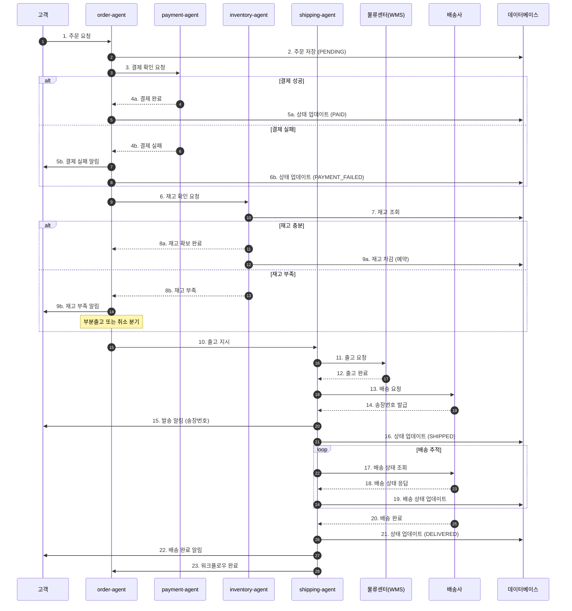
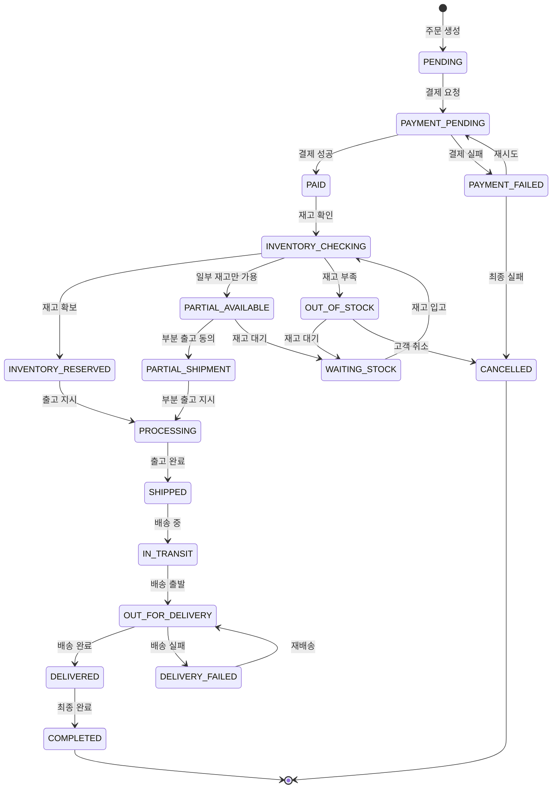
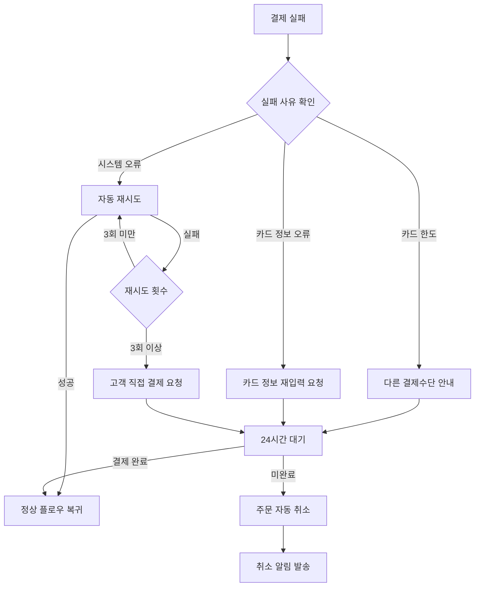
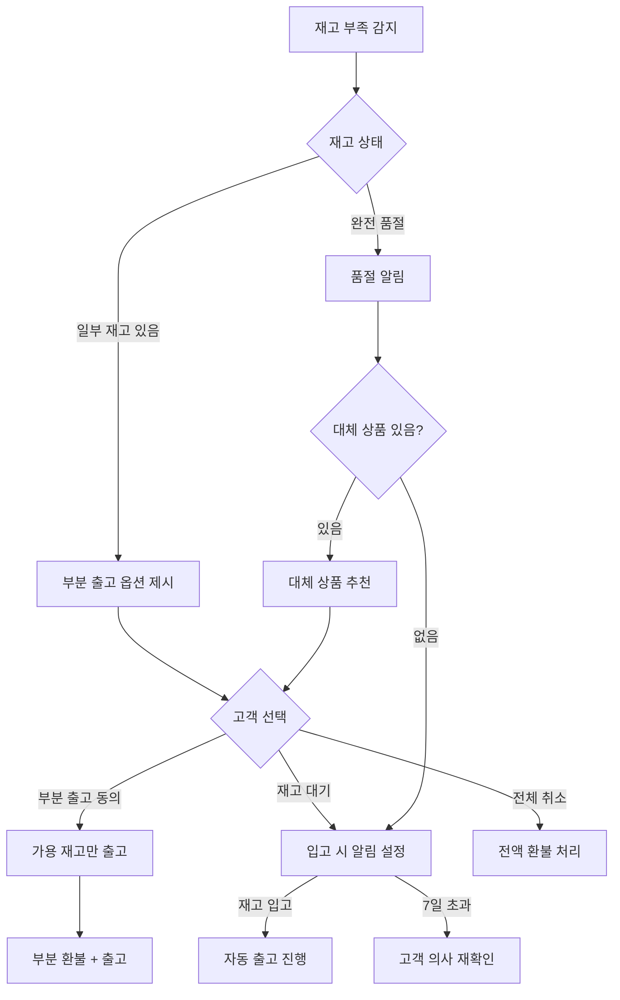

# 주문 처리 워크플로우 (Order Processing Flow)

## 기본 정보

| 항목 | 값 |
|------|-----|
| **워크플로우 ID** | `WF-ORD-001` |
| **버전** | 1.0.0 |
| **카테고리** | 주문관리 (Order Management) |
| **트리거 유형** | Event |
| **SLA** | 응답: 3초 / 완료: 24시간 (배송 출고 기준) |
| **자동화 수준** | Semi-Auto (일부 수동 검토 필요) |
| **우선순위** | Critical |
| **담당 팀** | Operations, Fulfillment |
| **최종 수정** | 2025-01-26 |

---

## 워크플로우 개요

주문 처리 워크플로우는 고객의 주문 접수부터 배송 완료까지 전체 프로세스를 관리합니다. 이 워크플로우는 결제 확인, 재고 확인, 출고 지시, 배송 추적 등 핵심 이커머스 프로세스를 자동화합니다.

### 핵심 단계
1. **주문 접수** - 주문 데이터 검증 및 저장
2. **주문 확인** - 고객 정보 및 배송지 검증
3. **결제 확인** - 결제 상태 확인 및 처리
4. **재고 확인** - 상품 가용 재고 확인
5. **출고 지시** - 물류센터 출고 요청
6. **배송 추적** - 배송 상태 모니터링
7. **완료 처리** - 배송 완료 및 후속 처리

---

## 트리거 조건

### 이벤트 트리거

| 이벤트명 | 소스 | 조건 | 설명 |
|----------|------|------|------|
| `order.created` | webhook | `status == 'pending'` | 웹/앱에서 신규 주문 생성 |
| `order.payment_completed` | payment-gateway | `payment_status == 'success'` | 결제 완료 알림 |
| `order.retry_requested` | admin-console | `retry_count < 3` | 실패 주문 재처리 요청 |

### 이벤트 페이로드 예시

```json
{
  "event_type": "order.created",
  "timestamp": "2025-01-26T10:30:00+09:00",
  "data": {
    "order_id": "ORD-2025012600001",
    "customer_id": "CUST-001234",
    "items": [
      {
        "product_id": "PROD-5001",
        "variant_id": "VAR-5001-BLK-M",
        "quantity": 2,
        "unit_price": 35000
      }
    ],
    "total_amount": 70000,
    "shipping_address": {
      "name": "홍길동",
      "phone": "010-1234-5678",
      "address": "서울시 강남구 테헤란로 123",
      "postal_code": "06234"
    },
    "payment_method": "card"
  }
}
```

---

## 프로세스 흐름

### 전체 흐름도



### 상태 전이도



---

## 단계별 상세

### Step 1: 주문 접수 (Order Reception)

| 항목 | 내용 |
|------|------|
| **Step ID** | `STEP-ORD-001` |
| **담당 에이전트** | `order-agent` |
| **설명** | 신규 주문 데이터를 검증하고 시스템에 저장 |
| **SLA** | 3초 |
| **재시도** | 3회, exponential backoff |

**입력 (Input)**

```json
{
  "order_id": "string - 필수 - 주문 고유 ID",
  "customer_id": "string - 필수 - 고객 ID",
  "items": [
    {
      "product_id": "string - 필수 - 상품 ID",
      "variant_id": "string - 선택 - 옵션 ID",
      "quantity": "number - 필수 - 수량",
      "unit_price": "number - 필수 - 단가"
    }
  ],
  "shipping_address": {
    "name": "string - 필수",
    "phone": "string - 필수",
    "address": "string - 필수",
    "postal_code": "string - 필수"
  },
  "payment_method": "string - 필수 - card/bank/virtual"
}
```

**처리 로직**

```python
def process_order_reception(order_data):
    # 1. 입력 검증
    validate_order_schema(order_data)
    validate_customer_exists(order_data.customer_id)
    validate_products_exist(order_data.items)
    validate_shipping_address(order_data.shipping_address)

    # 2. 주문 생성
    order = Order.create(
        order_id=order_data.order_id,
        customer_id=order_data.customer_id,
        items=order_data.items,
        total_amount=calculate_total(order_data.items),
        status='PENDING'
    )

    # 3. 주문 이력 기록
    OrderHistory.create(order_id=order.id, status='PENDING', message='주문 접수')

    # 4. 고객 알림
    send_notification(
        customer_id=order_data.customer_id,
        template='order_received',
        data={'order_id': order.order_id}
    )

    return order
```

**출력 (Output)**

```json
{
  "success": true,
  "data": {
    "order_id": "ORD-2025012600001",
    "status": "PENDING",
    "created_at": "2025-01-26T10:30:00+09:00"
  },
  "next_step": "STEP-ORD-002"
}
```

**분기 조건**

| 조건 | 다음 단계 | 설명 |
|------|----------|------|
| 검증 성공 | STEP-ORD-002 | 주문 확인 단계로 |
| 검증 실패 | ERROR-HANDLER | 오류 처리 |

---

### Step 2: 주문 확인 (Order Validation)

| 항목 | 내용 |
|------|------|
| **Step ID** | `STEP-ORD-002` |
| **담당 에이전트** | `order-agent` |
| **설명** | 고객 정보, 배송지, 주문 금액 최종 검증 |
| **SLA** | 2초 |
| **재시도** | 2회 |

**처리 로직**

```python
def validate_order(order):
    # 1. 고객 상태 확인
    customer = Customer.get(order.customer_id)
    if customer.status == 'BLOCKED':
        raise BusinessRuleViolation('차단된 고객')

    # 2. 배송 가능 지역 확인
    if not is_deliverable_area(order.shipping_address.postal_code):
        raise BusinessRuleViolation('배송 불가 지역')

    # 3. 최소/최대 주문 금액 확인
    if order.total_amount < MIN_ORDER_AMOUNT:
        raise BusinessRuleViolation('최소 주문 금액 미달')
    if order.total_amount > MAX_ORDER_AMOUNT:
        raise BusinessRuleViolation('최대 주문 금액 초과')

    # 4. 프로모션/쿠폰 유효성 확인
    if order.coupon_code:
        validate_coupon(order.coupon_code, order.customer_id)

    return {'validated': True}
```

---

### Step 3: 결제 확인 (Payment Verification)

| 항목 | 내용 |
|------|------|
| **Step ID** | `STEP-ORD-003` |
| **담당 에이전트** | `payment-agent` |
| **설명** | 결제 상태 확인 및 결제 완료 처리 |
| **SLA** | 10초 |
| **재시도** | 3회 (결제 게이트웨이 장애 시) |

**입력**

```json
{
  "order_id": "ORD-2025012600001",
  "payment_method": "card",
  "amount": 70000,
  "payment_key": "PAY-XXXXX"
}
```

**처리 로직**

```python
def verify_payment(order_id, payment_data):
    # 1. 결제 게이트웨이 조회
    payment_status = PaymentGateway.get_status(payment_data.payment_key)

    if payment_status.status == 'SUCCESS':
        # 2. 결제 정보 저장
        Payment.create(
            order_id=order_id,
            payment_key=payment_data.payment_key,
            amount=payment_status.amount,
            method=payment_data.payment_method,
            status='COMPLETED'
        )

        # 3. 주문 상태 업데이트
        Order.update(order_id, status='PAID')

        return {'payment_verified': True, 'next_step': 'STEP-ORD-004'}

    elif payment_status.status == 'PENDING':
        # 가상계좌 등 입금 대기
        return {'payment_verified': False, 'wait': True, 'next_step': 'WAIT-PAYMENT'}

    else:
        # 결제 실패
        Order.update(order_id, status='PAYMENT_FAILED')
        send_notification(order.customer_id, 'payment_failed', {'order_id': order_id})
        return {'payment_verified': False, 'error': payment_status.error_message}
```

**분기 조건**

| 조건 | 다음 단계 | 설명 |
|------|----------|------|
| `payment_status == 'SUCCESS'` | STEP-ORD-004 | 재고 확인 |
| `payment_status == 'PENDING'` | WAIT-PAYMENT | 입금 대기 (가상계좌) |
| `payment_status == 'FAILED'` | NOTIFY-CUSTOMER | 결제 실패 알림 |

---

### Step 4: 재고 확인 (Inventory Check)

| 항목 | 내용 |
|------|------|
| **Step ID** | `STEP-ORD-004` |
| **담당 에이전트** | `inventory-agent` |
| **설명** | 주문 상품의 가용 재고 확인 및 예약 |
| **SLA** | 5초 |
| **재시도** | 2회 |

**처리 로직**

```python
def check_and_reserve_inventory(order):
    inventory_result = []

    for item in order.items:
        available = Inventory.get_available(item.product_id, item.variant_id)

        if available >= item.quantity:
            # 재고 예약
            Inventory.reserve(
                product_id=item.product_id,
                variant_id=item.variant_id,
                quantity=item.quantity,
                order_id=order.order_id
            )
            inventory_result.append({
                'product_id': item.product_id,
                'status': 'RESERVED',
                'quantity': item.quantity
            })
        elif available > 0:
            # 부분 재고
            inventory_result.append({
                'product_id': item.product_id,
                'status': 'PARTIAL',
                'available': available,
                'requested': item.quantity
            })
        else:
            # 재고 없음
            inventory_result.append({
                'product_id': item.product_id,
                'status': 'OUT_OF_STOCK',
                'available': 0
            })

    return analyze_inventory_result(inventory_result)
```

**분기 조건**

| 조건 | 다음 단계 | 설명 |
|------|----------|------|
| 전체 재고 확보 | STEP-ORD-005 | 출고 지시 |
| 부분 재고 | CUSTOMER-CHOICE | 부분출고/대기/취소 선택 |
| 전체 재고 없음 | NOTIFY-OOS | 재고 부족 알림 |

---

### Step 5: 출고 지시 (Fulfillment Request)

| 항목 | 내용 |
|------|------|
| **Step ID** | `STEP-ORD-005` |
| **담당 에이전트** | `shipping-agent` |
| **설명** | 물류센터에 출고 지시 및 피킹/패킹 요청 |
| **SLA** | 30초 |
| **재시도** | 3회 |

**처리 로직**

```python
def request_fulfillment(order):
    # 1. WMS 출고 요청
    fulfillment_request = WMS.create_outbound(
        order_id=order.order_id,
        items=order.items,
        shipping_address=order.shipping_address,
        priority=calculate_priority(order)
    )

    # 2. 주문 상태 업데이트
    Order.update(order.order_id, status='PROCESSING')

    # 3. 예상 출고일 계산
    estimated_ship_date = calculate_ship_date(fulfillment_request)

    return {
        'fulfillment_id': fulfillment_request.id,
        'estimated_ship_date': estimated_ship_date,
        'next_step': 'STEP-ORD-006'
    }
```

---

### Step 6: 배송 추적 (Shipment Tracking)

| 항목 | 내용 |
|------|------|
| **Step ID** | `STEP-ORD-006` |
| **담당 에이전트** | `shipping-agent` |
| **설명** | 배송 상태 모니터링 및 고객 알림 |
| **SLA** | N/A (비동기 모니터링) |
| **재시도** | 자동 재조회 |

**처리 로직**

```python
def track_shipment(order):
    # 1. 송장번호 조회
    shipment = Shipment.get_by_order(order.order_id)

    # 2. 배송사 API로 상태 조회
    tracking_info = Carrier.get_tracking(
        carrier_code=shipment.carrier_code,
        tracking_number=shipment.tracking_number
    )

    # 3. 상태 변경 시 업데이트
    if tracking_info.status != shipment.last_status:
        Shipment.update_status(shipment.id, tracking_info.status)

        # 주요 상태 변경 시 고객 알림
        if tracking_info.status in ['SHIPPED', 'OUT_FOR_DELIVERY', 'DELIVERED']:
            send_notification(
                order.customer_id,
                f'shipment_{tracking_info.status.lower()}',
                {'order_id': order.order_id, 'tracking': tracking_info}
            )

    return tracking_info
```

---

### Step 7: 완료 처리 (Completion)

| 항목 | 내용 |
|------|------|
| **Step ID** | `STEP-ORD-007` |
| **담당 에이전트** | `order-agent` |
| **설명** | 배송 완료 후 최종 처리 |
| **SLA** | 5초 |
| **재시도** | 1회 |

**처리 로직**

```python
def complete_order(order):
    # 1. 주문 상태 최종 업데이트
    Order.update(order.order_id, status='COMPLETED', completed_at=now())

    # 2. 재고 예약 → 확정 처리
    Inventory.confirm_reservation(order.order_id)

    # 3. 포인트/마일리지 적립
    if order.customer.loyalty_member:
        Loyalty.add_points(order.customer_id, calculate_points(order.total_amount))

    # 4. 리뷰 요청 스케줄링
    schedule_review_request(order.order_id, delay_days=3)

    # 5. 매출 기록 (회계 연동)
    Accounting.record_sale(order)

    # 6. 완료 알림
    send_notification(order.customer_id, 'order_completed', {'order_id': order.order_id})

    return {'completed': True}
```

---

## 예외 처리

### 예외 유형 및 처리 방법

| 예외 코드 | 예외 유형 | 원인 | 처리 방법 | 에스컬레이션 |
|----------|----------|------|----------|-------------|
| `ERR-ORD-001` | PaymentFailed | 결제 승인 실패 | 고객에게 재결제 요청, 24시간 대기 후 자동 취소 | 3회 실패 시 CS팀 알림 |
| `ERR-ORD-002` | OutOfStock | 재고 부족 | 고객에게 옵션 제시 (대기/부분출고/취소) | 48시간 미응답 시 자동 취소 |
| `ERR-ORD-003` | InvalidAddress | 배송 불가 주소 | 주소 수정 요청 | 24시간 미수정 시 CS팀 알림 |
| `ERR-ORD-004` | FulfillmentFailed | 출고 실패 | 물류팀 확인 후 재출고 | 즉시 물류팀 알림 |
| `ERR-ORD-005` | DeliveryFailed | 배송 실패 (수취인 부재 등) | 재배송 스케줄링 | 3회 실패 시 CS팀 연락 |
| `ERR-ORD-006` | CancellationRequested | 고객 취소 요청 | 취소 워크플로우로 전환 | 출고 후 취소는 CS팀 확인 |

### 결제 실패 처리 플로우



### 재고 부족 처리 플로우



---

## 관련 데이터

### 읽기 데이터 (Read)

| 데이터 | 소스 | 용도 | 접근 빈도 |
|--------|------|------|----------|
| 주문 정보 | `orders` 테이블 | 주문 상세 조회 | 매 단계 |
| 고객 정보 | `customers` 테이블 | 고객 상태/등급 확인 | 시작 시 |
| 상품 정보 | `products` 테이블 | 상품명/가격 확인 | 시작 시 |
| 재고 정보 | `inventory` 테이블 | 가용 재고 확인 | Step 4 |
| 배송 설정 | `shipping_config` | 배송비/배송가능지역 | 시작 시 |
| 결제 정보 | `payments` 테이블 | 결제 상태 확인 | Step 3 |

### 쓰기 데이터 (Write)

| 데이터 | 대상 | 용도 | 타이밍 |
|--------|------|------|--------|
| 주문 상태 | `orders.status` | 상태 업데이트 | 매 단계 |
| 주문 이력 | `order_histories` | 처리 이력 기록 | 매 단계 |
| 재고 수량 | `inventory.quantity` | 재고 차감/예약 | Step 4, 7 |
| 결제 기록 | `payments` | 결제 정보 저장 | Step 3 |
| 배송 정보 | `shipments` | 배송 정보 저장 | Step 5, 6 |
| 매출 기록 | `sales_records` | 매출 집계용 | Step 7 |

### 외부 API 연동

| API | 용도 | 메서드 | 엔드포인트 | SLA |
|-----|------|--------|-----------|-----|
| 결제 게이트웨이 (토스) | 결제 조회/승인 | GET/POST | `/v1/payments/{paymentKey}` | 3초 |
| WMS (풀필먼트) | 출고 요청 | POST | `/api/outbound/create` | 5초 |
| 배송사 API (CJ대한통운) | 배송 조회 | GET | `/api/tracking/{trackingNo}` | 2초 |
| 알림 서비스 | 푸시/SMS | POST | `/api/notifications` | 1초 |

---

## 알림 설정

### 고객 알림

| 시점 | 채널 | 템플릿 ID | 내용 |
|------|------|----------|------|
| 주문 접수 | SMS, Push, Email | `TPL-ORD-001` | 주문이 접수되었습니다 |
| 결제 완료 | Push | `TPL-ORD-002` | 결제가 완료되었습니다 |
| 결제 실패 | SMS, Push | `TPL-ORD-003` | 결제에 실패했습니다. 다시 시도해주세요 |
| 재고 부족 | SMS, Push | `TPL-ORD-004` | 일부 상품 재고가 부족합니다 |
| 출고 완료 | SMS, Push, Email | `TPL-ORD-005` | 상품이 발송되었습니다 (송장번호: XXX) |
| 배송 출발 | Push | `TPL-ORD-006` | 오늘 배송됩니다 |
| 배송 완료 | SMS, Push | `TPL-ORD-007` | 배송이 완료되었습니다 |

### 내부 알림

| 시점 | 채널 | 대상 | 심각도 |
|------|------|------|--------|
| 결제 3회 연속 실패 | Slack | #ops-order | MEDIUM |
| 재고 부족 알림 | Slack | #ops-inventory | MEDIUM |
| 출고 실패 | Slack | #ops-fulfillment | HIGH |
| 배송 3회 실패 | Slack | #cs-team | HIGH |
| 일 주문량 급증 (200% 이상) | Slack | #ops-alert | HIGH |

---

## KPI (핵심 성과 지표)

| 지표명 | 측정 방법 | 목표치 | 알림 임계치 |
|--------|----------|--------|------------|
| 주문 처리 성공률 | 완료 주문 / 전체 주문 | 99% | < 95% |
| 평균 출고 리드타임 | 주문~출고 시간 | < 4시간 | > 8시간 |
| 당일 출고율 | 당일 출고 / 전체 출고 | 90% | < 80% |
| 결제 전환율 | 결제 완료 / 주문 생성 | 85% | < 75% |
| 재고 부족률 | 품절 주문 / 전체 주문 | < 2% | > 5% |
| 배송 완료율 | 정상 배송 / 전체 배송 | 99% | < 97% |
| 평균 배송 시간 | 출고~배송완료 | < 2일 | > 3일 |

---

## 변경 이력

| 버전 | 날짜 | 작성자 | 변경 내용 |
|------|------|--------|----------|
| 1.0.0 | 2025-01-26 | AI Agent | 초기 문서 작성 |

---

## 참고 문서

- [토폴로지 개요](../README.md)
- [주문 취소 워크플로우](./order-cancel-flow.md)
- [교환/반품 워크플로우](./return-exchange-flow.md)
- [order-agent 명세](../../agents/order-agent/)
- [inventory-agent 명세](../../agents/inventory-agent/)
- [shipping-agent 명세](../../agents/shipping-agent/)
