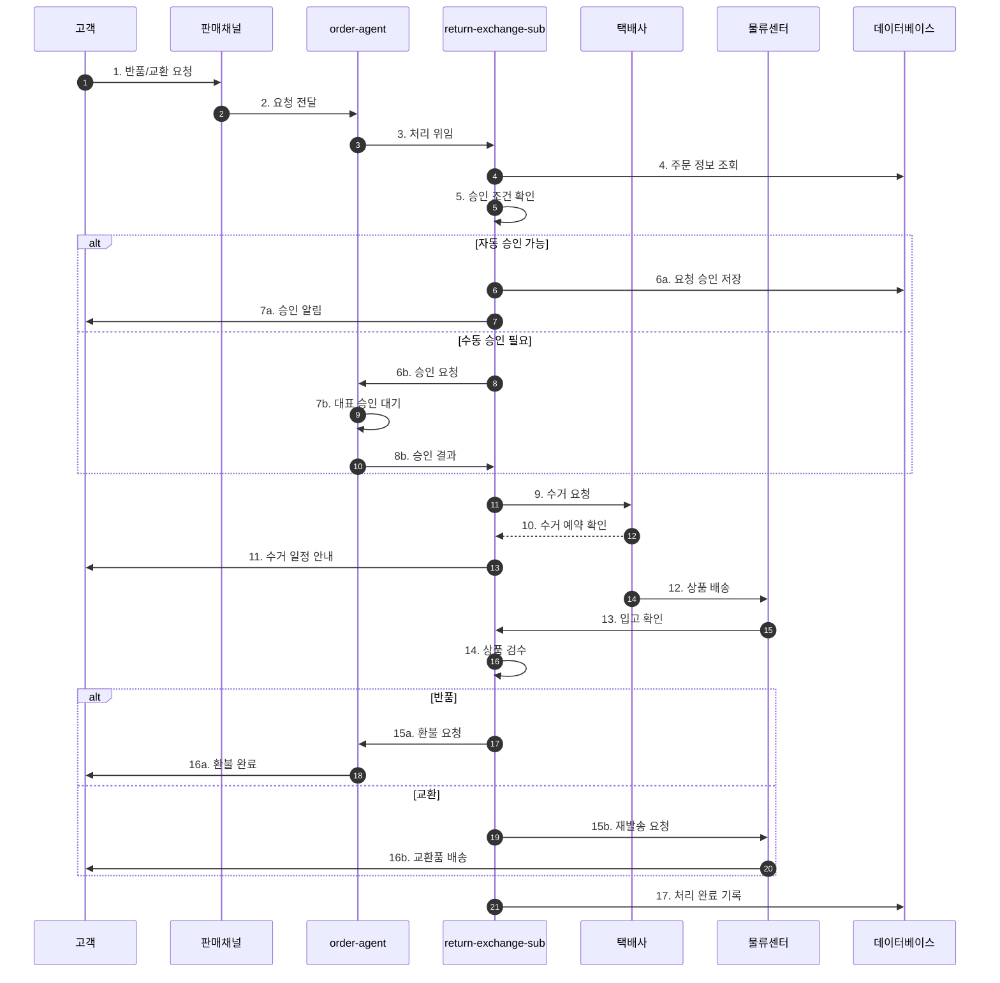
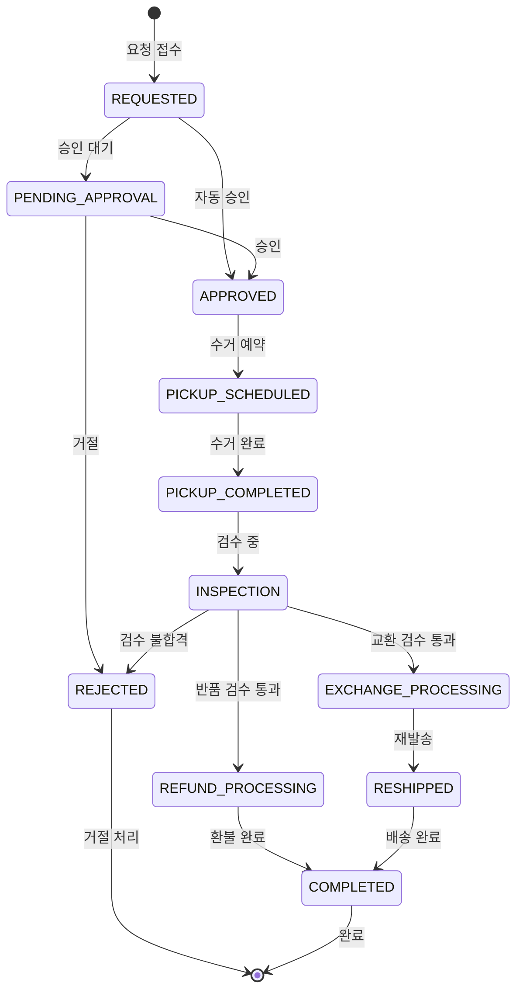

# 반품/교환 처리 워크플로우 (Return/Exchange Flow)

## 기본 정보

| 항목 | 값 |
|------|-----|
| **워크플로우 ID** | `WF-ORD-002` |
| **버전** | 1.0.0 |
| **카테고리** | 주문관리 (Order Management) |
| **트리거 유형** | Event / Manual |
| **SLA** | 응답: 1시간 / 완료: 48시간 |
| **자동화 수준** | Semi-Auto |
| **우선순위** | High |
| **담당 팀** | Operations, CS |
| **최종 수정** | 2025-01-26 |

---

## 워크플로우 개요

반품/교환 워크플로우는 고객의 반품 또는 교환 요청을 접수하고, 자동 승인 조건을 확인하여 처리합니다. 수거 요청, 환불 금액 계산, 재발송까지 전체 프로세스를 관리합니다.

### 핵심 단계
1. **요청 접수** - 반품/교환 요청 수신 및 검증
2. **승인 판단** - 자동/수동 승인 결정
3. **수거 요청** - 택배사 수거 스케줄링
4. **상품 검수** - 반품 상품 상태 확인
5. **처리 완료** - 환불 또는 재발송

---

## 트리거 조건

### 이벤트 트리거

| 이벤트명 | 소스 | 조건 | 설명 |
|----------|------|------|------|
| `return.requested` | 채널 API | 반품 요청 접수 | 판매 채널에서 반품 요청 |
| `exchange.requested` | 채널 API | 교환 요청 접수 | 판매 채널에서 교환 요청 |
| `return.manual` | admin | 수동 접수 | 관리자가 직접 접수 |

---

## 프로세스 흐름

### 전체 흐름도



### 상태 전이도



---

## 단계별 상세

### Step 1: 요청 접수 (Request Reception)

| 항목 | 내용 |
|------|------|
| **Step ID** | `STEP-RET-001` |
| **담당 에이전트** | `return-exchange-sub` |
| **설명** | 반품/교환 요청 데이터 검증 및 저장 |
| **SLA** | 5분 |
| **재시도** | 2회 |

**입력**

```json
{
  "order_id": "ORD-2025012600001",
  "request_type": "RETURN | EXCHANGE",
  "reason": "string - 사유",
  "reason_category": "SIZE | DEFECT | CHANGE_MIND | WRONG_ITEM",
  "items": [
    {
      "product_id": "PROD-5001",
      "quantity": 1
    }
  ],
  "customer_note": "string - 고객 메모"
}
```

**처리 로직**

```python
def receive_return_request(request_data):
    # 1. 주문 존재 확인
    order = Order.get(request_data.order_id)
    if not order:
        raise OrderNotFoundError()

    # 2. 반품 가능 기간 확인
    if is_return_period_expired(order):
        raise ReturnPeriodExpiredError()

    # 3. 반품 요청 생성
    return_request = ReturnRequest.create(
        order_id=order.id,
        type=request_data.request_type,
        reason=request_data.reason,
        reason_category=request_data.reason_category,
        items=request_data.items,
        status='REQUESTED'
    )

    return return_request
```

---

### Step 2: 승인 판단 (Approval Decision)

| 항목 | 내용 |
|------|------|
| **Step ID** | `STEP-RET-002` |
| **담당 에이전트** | `return-exchange-sub` |
| **설명** | 자동 승인 조건 확인 및 승인 처리 |
| **SLA** | 10초 |

**자동 승인 조건**

```yaml
auto_approve_conditions:
  enabled: true
  max_amount: 50000
  allowed_reasons:
    - "CHANGE_MIND"  # 단순 변심
    - "SIZE"         # 사이즈 교환
  max_days_from_delivery: 7
  exclude_categories:
    - "CUSTOM_MADE"  # 주문제작
    - "HYGIENE"      # 위생용품
```

**분기 조건**

| 조건 | 다음 단계 | 설명 |
|------|----------|------|
| 자동 승인 조건 충족 | STEP-RET-003 | 수거 요청 |
| 승인 필요 | WAIT-APPROVAL | 대표 승인 대기 |
| 반품 불가 | REJECT | 거절 처리 |

---

### Step 3: 수거 요청 (Pickup Request)

| 항목 | 내용 |
|------|------|
| **Step ID** | `STEP-RET-003` |
| **담당 에이전트** | `return-exchange-sub` |
| **설명** | 택배사 수거 스케줄링 |
| **SLA** | 30초 |

**처리 로직**

```python
def request_pickup(return_request):
    # 1. 수거 가능 일정 조회
    available_dates = Carrier.get_pickup_dates(
        address=return_request.pickup_address
    )

    # 2. 수거 예약
    pickup = Carrier.schedule_pickup(
        date=available_dates[0],
        address=return_request.pickup_address,
        items=return_request.items
    )

    # 3. 고객 알림
    send_notification(
        return_request.customer_id,
        'pickup_scheduled',
        {'date': pickup.date, 'tracking': pickup.tracking_number}
    )

    return pickup
```

---

### Step 4: 환불 금액 계산 (Refund Calculation)

| 항목 | 내용 |
|------|------|
| **Step ID** | `STEP-RET-004` |
| **담당 에이전트** | `return-exchange-sub` |
| **설명** | 환불 금액 계산 |
| **SLA** | 5초 |

**환불 계산 로직**

```python
def calculate_refund(return_request):
    order = Order.get(return_request.order_id)

    refund = {
        'product_amount': 0,
        'shipping_refund': 0,
        'penalty': 0,
        'total': 0
    }

    # 1. 상품 금액
    for item in return_request.items:
        refund['product_amount'] += item.unit_price * item.quantity

    # 2. 배송비 환불 여부
    if return_request.reason_category in ['DEFECT', 'WRONG_ITEM']:
        refund['shipping_refund'] = order.shipping_fee
    elif return_request.reason_category == 'CHANGE_MIND':
        # 고객 변심은 반품 배송비 차감
        refund['penalty'] = 3000

    # 3. 총 환불 금액
    refund['total'] = (
        refund['product_amount'] +
        refund['shipping_refund'] -
        refund['penalty']
    )

    return refund
```

---

## 예외 처리

### 예외 유형 및 처리 방법

| 예외 코드 | 예외 유형 | 원인 | 처리 방법 |
|----------|----------|------|----------|
| `ERR-RET-001` | ReturnPeriodExpired | 반품 기간 초과 | 고객에게 불가 안내 |
| `ERR-RET-002` | PickupFailed | 수거 실패 | 재예약 요청 |
| `ERR-RET-003` | InspectionFailed | 검수 불합격 | 고객 협의 후 처리 |
| `ERR-RET-004` | RefundFailed | 환불 처리 실패 | 재시도 후 수동 처리 |

---

## KPI (핵심 성과 지표)

| 지표명 | 측정 방법 | 목표치 | 알림 임계치 |
|--------|----------|--------|------------|
| 반품 처리 시간 | 요청~완료 | < 48시간 | > 72시간 |
| 자동 승인율 | 자동승인 / 전체 | >= 70% | < 50% |
| 수거 성공율 | 성공수거 / 전체 | >= 95% | < 90% |
| 고객 만족도 | 반품 후 CSAT | >= 4.0 | < 3.5 |

---

## 변경 이력

| 버전 | 날짜 | 작성자 | 변경 내용 |
|------|------|--------|----------|
| 1.0.0 | 2025-01-26 | AI System | 초기 문서 작성 |

---

## 참고 문서

- [주문 처리 워크플로우](./order-flow.md)
- [Order Agent 명세](../../agents/01-order/main.md)
- [CS Agent 명세](../../agents/02-cs/main.md)
