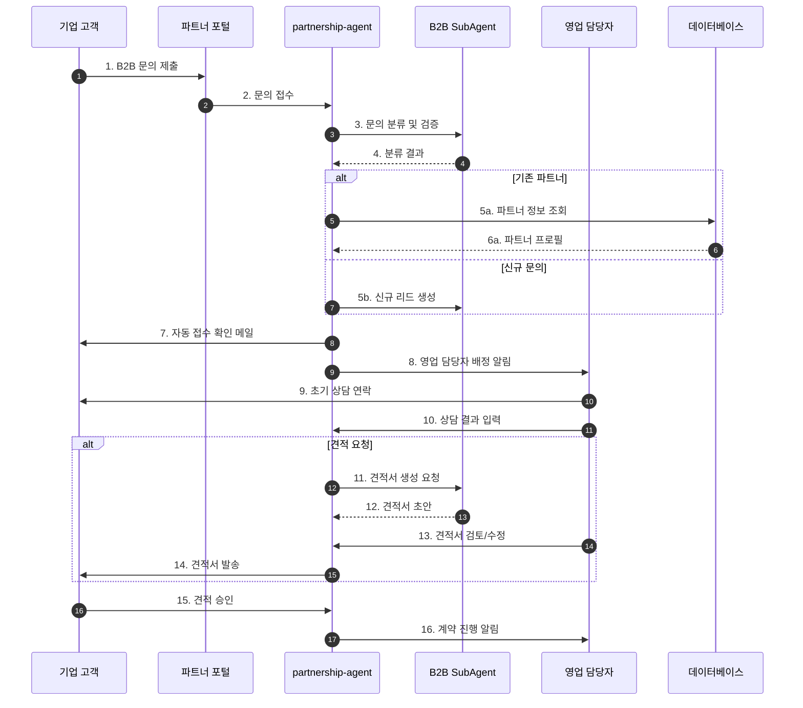
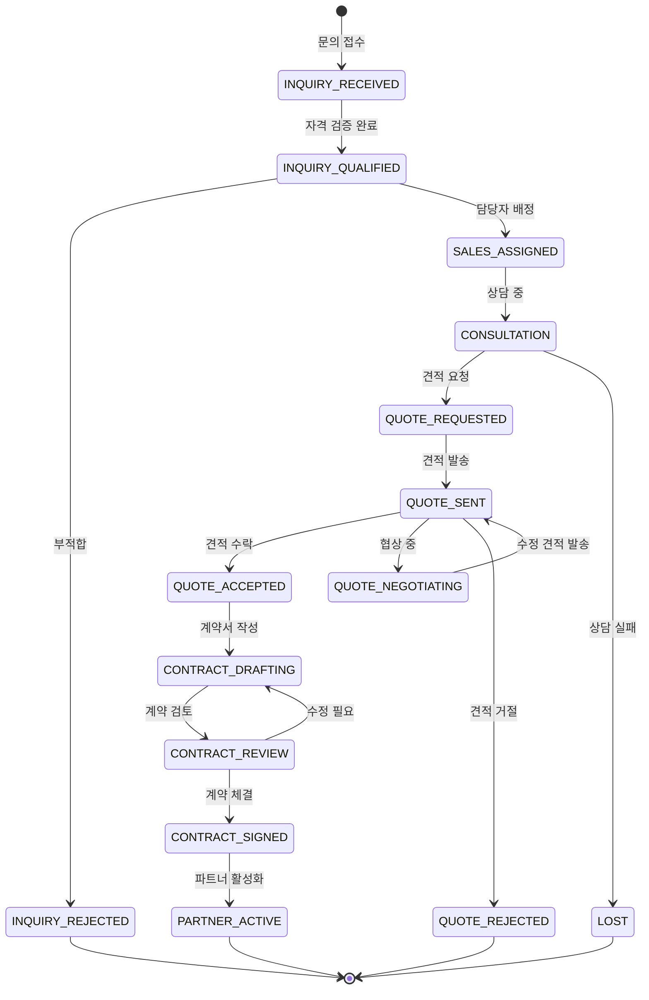
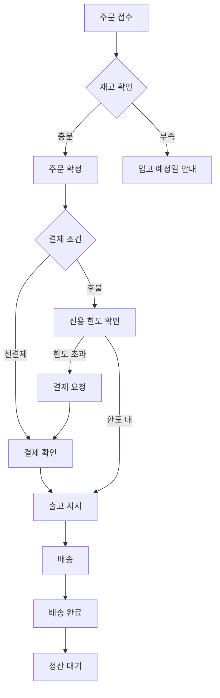

# 파트너십 관리 워크플로우 (Partnership Management Flow)

## 기본 정보

| 항목 | 값 |
|------|-----|
| **워크플로우 ID** | `WF-PTN-001` |
| **버전** | 1.0.0 |
| **카테고리** | 파트너십 (Partnership) |
| **트리거 유형** | Event / Manual |
| **SLA** | 문의 응답: 4시간 / 견적: 1영업일 / 계약: 3영업일 |
| **자동화 수준** | Human-in-the-Loop (L2) |
| **우선순위** | Medium |
| **담당 팀** | Sales, Operations |
| **최종 수정** | 2024-01-26 |

---

## 워크플로우 개요

파트너십 관리 워크플로우는 B2B 납품 문의부터 계약 체결, 주문 처리, 정산까지 파트너 관계의 전 생애주기를 관리합니다. 도매/총판 파트너와 공동구매 운영도 포함됩니다.

### 핵심 단계
1. **문의 접수** - B2B 납품 문의 접수 및 분류
2. **견적 작성** - 맞춤 견적서 작성 및 발송
3. **계약 체결** - 계약 조건 협상 및 체결
4. **주문 처리** - 파트너 주문 접수 및 이행
5. **정산 관리** - 정산 계산 및 지급 처리
6. **관계 관리** - 파트너 등급 관리 및 케어

---

## 트리거 조건

### 이벤트 트리거

| 이벤트명 | 소스 | 조건 | 설명 |
|----------|------|------|------|
| `b2b.inquiry` | web-form | `type == 'b2b_inquiry'` | B2B 문의 접수 |
| `partner.order` | partner-portal | `order_type == 'wholesale'` | 도매 주문 접수 |
| `contract.expiring` | scheduler | `expiry_date - 30 days` | 계약 만료 30일 전 |
| `settlement.period_end` | scheduler | `settlement_date` | 정산 기간 종료 |
| `groupbuy.request` | partner | `type == 'groupbuy'` | 공동구매 요청 |

### 이벤트 페이로드 예시

```json
{
  "event_type": "b2b.inquiry",
  "timestamp": "2024-01-26T10:00:00+09:00",
  "data": {
    "inquiry_id": "INQ-B2B-2024012600001",
    "company_name": "ABC 유통",
    "contact_name": "김영업",
    "contact_email": "sales@abc.com",
    "contact_phone": "010-1234-5678",
    "business_type": "wholesale",
    "inquiry_content": "화장품 도매 납품 문의드립니다.",
    "expected_volume": "월 500만원 이상",
    "product_categories": ["skincare", "makeup"],
    "source": "website"
  }
}
```

---

## 프로세스 흐름

### B2B 문의 처리 흐름



### 상태 전이도



---

## 단계별 상세

### Step 1: 문의 접수 및 분류 (Inquiry Reception)

| 항목 | 내용 |
|------|------|
| **Step ID** | `STEP-PTN-001` |
| **담당 에이전트** | `partnership-agent` → `B2B SubAgent` |
| **설명** | B2B 문의 접수, 분류, 자격 검증 |
| **SLA** | 접수 확인: 1시간 |
| **재시도** | N/A |

**문의 분류**

| 유형 | 설명 | 우선순위 | 처리 |
|------|------|----------|------|
| 도매 문의 | 대량 구매 도매 | High | 즉시 담당자 배정 |
| 총판 문의 | 지역 총판 계약 | High | 임원 검토 후 진행 |
| 납품 문의 | 기업 납품 | Medium | 규모 확인 후 진행 |
| 공동구매 | 인플루언서 공구 | Medium | 마케팅 협의 후 진행 |
| 제휴 문의 | 브랜드 제휴 | Low | 검토 후 회신 |

**자격 검증**

```python
def qualify_b2b_inquiry(inquiry):
    score = 0

    # 1. 사업자 정보 확인
    business_info = verify_business(inquiry.business_number)
    if business_info.valid:
        score += 30

    # 2. 예상 거래 규모
    volume_scores = {
        '월 100만원 미만': 10,
        '월 100-500만원': 20,
        '월 500-1000만원': 30,
        '월 1000만원 이상': 40
    }
    score += volume_scores.get(inquiry.expected_volume, 10)

    # 3. 업종 적합성
    if inquiry.business_type in ['retail', 'distribution', 'online_store']:
        score += 20

    # 4. 기존 거래 이력
    history = get_previous_transactions(inquiry.company_name)
    if history:
        score += 10

    return {
        'qualified': score >= 50,
        'score': score,
        'priority': 'high' if score >= 70 else 'medium' if score >= 50 else 'low'
    }
```

---

### Step 2: 견적 작성 (Quotation)

| 항목 | 내용 |
|------|------|
| **Step ID** | `STEP-PTN-002` |
| **담당 에이전트** | `partnership-agent` → `B2B SubAgent` |
| **설명** | 맞춤 견적서 작성 및 발송 |
| **SLA** | 1영업일 |
| **재시도** | N/A |

**견적 가격 정책**

| 파트너 등급 | 기본 할인율 | 수량 추가 할인 | 결제 조건 |
|------------|-----------|--------------|----------|
| Standard | 15% | 5% (1000개 이상) | 선결제 |
| Silver | 18% | 7% (1000개 이상) | Net 15 |
| Gold | 20% | 10% (1000개 이상) | Net 30 |
| Platinum | 25% | 15% (1000개 이상) | Net 45 |

**견적서 구조**

```yaml
quotation:
  header:
    quote_id: "견적 번호"
    date: "견적일"
    valid_until: "유효기간"
    company_info: "고객사 정보"

  items:
    - sku: "상품코드"
      name: "상품명"
      unit_price: "단가"
      quantity: "수량"
      discount: "할인율"
      amount: "금액"

  summary:
    subtotal: "소계"
    discount_total: "총 할인"
    shipping: "배송비"
    tax: "부가세"
    total: "총액"

  terms:
    payment: "결제 조건"
    delivery: "납품 조건"
    warranty: "품질 보증"
    notes: "특이사항"
```

---

### Step 3: 계약 체결 (Contract Signing)

| 항목 | 내용 |
|------|------|
| **Step ID** | `STEP-PTN-003` |
| **담당 에이전트** | `partnership-agent` → `B2B SubAgent` |
| **설명** | 계약 조건 협상 및 계약서 체결 |
| **SLA** | 3영업일 |
| **재시도** | N/A |

**계약 유형**

| 계약 유형 | 기간 | 최소 거래액 | 특징 |
|----------|------|-----------|------|
| 단건 계약 | 1회성 | 없음 | 단일 주문 |
| 연간 계약 | 1년 | 월 300만원 | 고정 할인율 |
| 총판 계약 | 2년 | 월 1000만원 | 독점 지역권 |
| 프랜차이즈 | 3년 | 월 500만원 | 브랜드 사용권 |

**계약 프로세스**

```python
def process_contract(partner_id, contract_type, terms):
    # 1. 계약서 초안 생성
    contract = generate_contract_draft(
        template=get_template(contract_type),
        partner=get_partner_info(partner_id),
        terms=terms
    )

    # 2. 내부 검토
    if terms.total_value > 10000000:  # 1천만원 이상
        approval = request_approval(
            approver='sales-manager',
            document=contract
        )
        if not approval.approved:
            return handle_rejection(approval.feedback)

    # 3. 계약서 발송
    send_contract(
        partner_id=partner_id,
        contract=contract,
        signing_method='electronic'  # 전자 서명
    )

    # 4. 서명 완료 대기
    wait_for_signature(contract.id)

    # 5. 계약 활성화
    activate_contract(contract.id)
    create_partner_account(partner_id, contract)

    return {'status': 'signed', 'contract_id': contract.id}
```

---

### Step 4: 주문 처리 (Order Processing)

| 항목 | 내용 |
|------|------|
| **Step ID** | `STEP-PTN-004` |
| **담당 에이전트** | `partnership-agent` → `Wholesale SubAgent` |
| **설명** | 파트너 주문 접수 및 이행 |
| **SLA** | 주문 확인: 2시간 / 출고: 3영업일 |
| **재시도** | 1회 |

**도매 주문 프로세스**



---

### Step 5: 정산 관리 (Settlement Management)

| 항목 | 내용 |
|------|------|
| **Step ID** | `STEP-PTN-005` |
| **담당 에이전트** | `partnership-agent` → `GroupBuying SubAgent` |
| **설명** | 파트너 정산 계산 및 지급 처리 |
| **SLA** | 정산서 발송: 익월 5일 / 지급: 익월 15일 |
| **재시도** | 1회 |

**정산 프로세스**

```python
def process_settlement(partner_id, period):
    # 1. 정산 대상 거래 조회
    transactions = get_settlement_transactions(
        partner_id=partner_id,
        start_date=period.start,
        end_date=period.end
    )

    # 2. 정산 금액 계산
    settlement = calculate_settlement(
        transactions=transactions,
        partner_terms=get_partner_terms(partner_id)
    )

    # 정산 상세
    # - 총 판매액
    # - 할인 적용액
    # - 반품/취소 차감
    # - 수수료 차감 (공구의 경우)
    # - 최종 정산액

    # 3. 정산서 생성
    statement = generate_settlement_statement(
        partner_id=partner_id,
        period=period,
        settlement=settlement
    )

    # 4. 정산서 발송
    send_settlement_statement(
        partner_id=partner_id,
        statement=statement
    )

    # 5. 이의 제기 기간 (5영업일)
    wait_for_dispute_period(statement.id)

    # 6. 지급 처리
    if not has_dispute(statement.id):
        process_payment(
            partner_id=partner_id,
            amount=settlement.net_amount,
            bank_info=get_partner_bank_info(partner_id)
        )

    return {'status': 'completed', 'amount': settlement.net_amount}
```

---

### Step 6: 공동구매 관리 (Group Buying)

| 항목 | 내용 |
|------|------|
| **Step ID** | `STEP-PTN-006` |
| **담당 에이전트** | `partnership-agent` → `GroupBuying SubAgent` |
| **설명** | 공동구매 캠페인 기획 및 운영 |
| **SLA** | 캠페인 설정: 3영업일 |
| **재시도** | N/A |

**공동구매 캠페인 설정**

```yaml
groupbuy_campaign:
  basic_info:
    campaign_id: "캠페인 ID"
    title: "캠페인명"
    host: "주최자 정보 (인플루언서 등)"
    period: "진행 기간"

  products:
    - sku: "상품코드"
      name: "상품명"
      original_price: "정가"
      groupbuy_price: "공구가"
      min_quantity: "최소 수량"
      max_quantity: "최대 수량"

  terms:
    commission_rate: "수수료율"
    settlement_period: "정산 주기"
    shipping: "배송 조건"

  targets:
    min_participants: "최소 참여 인원"
    target_sales: "목표 판매액"
```

---

## 예외 처리

### 예외 유형 및 처리 방법

| 예외 코드 | 예외 유형 | 원인 | 처리 방법 | 에스컬레이션 |
|----------|----------|------|----------|-------------|
| `ERR-PTN-001` | InvalidBusiness | 사업자 정보 불일치 | 재확인 요청 | N/A |
| `ERR-PTN-002` | CreditExceeded | 신용 한도 초과 | 선결제 요청 | 영업 담당자 |
| `ERR-PTN-003` | StockInsufficient | 재고 부족 | 대체 상품 제안 또는 입고 대기 | SCM |
| `ERR-PTN-004` | ContractDispute | 계약 분쟁 | 법무 검토 | Legal |
| `ERR-PTN-005` | SettlementDispute | 정산 이의 제기 | 재검토 후 조정 | 재무팀 |

---

## KPI (핵심 성과 지표)

| 지표명 | 측정 방법 | 목표치 | 알림 임계치 |
|--------|----------|--------|------------|
| 문의 응답 시간 | 접수 ~ 첫 연락 | < 4시간 | > 8시간 |
| 견적 발송 시간 | 요청 ~ 발송 | < 1영업일 | > 2영업일 |
| B2B 전환율 | 문의 → 계약 | 30% | < 20% |
| 파트너 유지율 | 연간 계약 갱신율 | 85% | < 75% |
| 정산 정확도 | 오류 없는 정산 비율 | 99.9% | < 99% |

---

## 연관 에이전트

| 에이전트 | 역할 | 상호작용 |
|----------|------|----------|
| `order-agent` | B2B 주문 처리 | 협업 |
| `inventory-agent` | 재고 할당 및 확인 | 협업 |
| `accounting-agent` | 정산 및 결제 처리 | 협업 |
| `marketing-agent` | 공동구매 홍보 | 협업 |

---

## 변경 이력

| 버전 | 날짜 | 작성자 | 변경 내용 |
|------|------|--------|----------|
| 1.0.0 | 2024-01-26 | AI Agent | 초기 문서 작성 |

---

*이 문서는 파트너십 관리 워크플로우의 상세 스펙을 정의합니다.*
