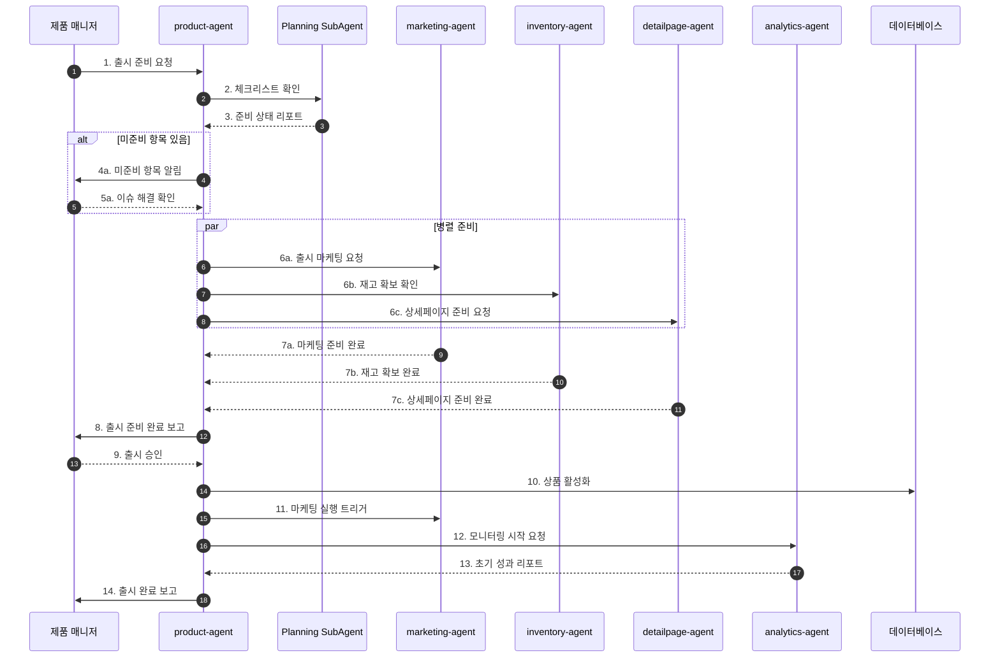
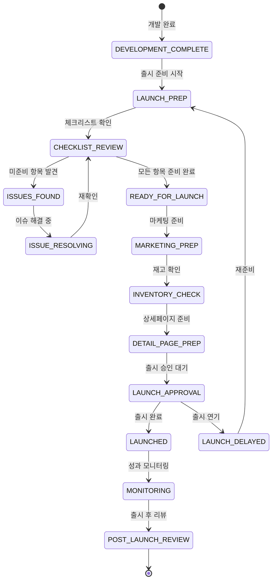

# 제품 출시 워크플로우 (Product Launch Flow)

## 기본 정보

| 항목 | 값 |
|------|-----|
| **워크플로우 ID** | `WF-PRD-002` |
| **버전** | 1.0.0 |
| **카테고리** | 제품출시 (Product Launch) |
| **트리거 유형** | Event |
| **SLA** | 출시 준비: 1주 |
| **자동화 수준** | Human-in-the-Loop |
| **우선순위** | High |
| **담당 팀** | Product, Marketing |
| **최종 수정** | 2024-01-26 |

---

## 워크플로우 개요

제품 출시 워크플로우는 기획이 확정된 제품을 실제 출시하기까지의 전 과정을 관리합니다. 출시 준비 체크리스트 확인, 마케팅 연계, 재고 확보, 상세페이지 준비 등 출시에 필요한 모든 활동을 조율합니다.

### 핵심 단계
1. **출시 준비 확인** - 체크리스트 기반 준비 상태 점검
2. **마케팅 연계** - 출시 마케팅 캠페인 준비
3. **재고 확보** - 초도 물량 확보 확인
4. **상세페이지 준비** - 상품 상세페이지 제작 및 등록
5. **출시 실행** - 판매 개시 및 모니터링
6. **출시 후 분석** - 초기 성과 분석 및 피드백

---

## 트리거 조건

### 이벤트 트리거

| 이벤트명 | 소스 | 조건 | 설명 |
|----------|------|------|------|
| `product.development_complete` | external | `status == 'ready'` | 제품 개발 완료 |
| `launch.scheduled` | product-manager | `launch_date - 7 days` | 출시 7일 전 |
| `inventory.ready` | inventory-agent | `initial_stock >= MOQ` | 재고 확보 완료 |

### 이벤트 페이로드 예시

```json
{
  "event_type": "product.development_complete",
  "timestamp": "2024-02-20T09:00:00+09:00",
  "data": {
    "product_id": "PRD-2024022000001",
    "sku": "SH-AMP-001",
    "name": "진정 앰플 30ml",
    "category": "skincare",
    "planned_launch_date": "2024-03-01",
    "initial_stock": 1000,
    "cogs": 8500,
    "msrp": 29000,
    "assets": {
      "images": ["url1", "url2"],
      "videos": ["url3"],
      "documents": ["spec.pdf", "certification.pdf"]
    }
  }
}
```

---

## 프로세스 흐름

### 전체 흐름도



### 상태 전이도



---

## 단계별 상세

### Step 1: 출시 준비 체크리스트 (Launch Checklist)

| 항목 | 내용 |
|------|------|
| **Step ID** | `STEP-LCH-001` |
| **담당 에이전트** | `product-agent` → `Planning SubAgent` |
| **설명** | 출시 전 필수 항목 점검 |
| **SLA** | 1일 |
| **재시도** | N/A |

**체크리스트 항목**

| 카테고리 | 항목 | 필수 여부 | 담당 |
|----------|------|----------|------|
| 제품 | 품질 검수 완료 | 필수 | QC |
| 제품 | 인증서 확보 | 필수 | QC |
| 제품 | 바코드 발급 | 필수 | Ops |
| 재고 | 초도 물량 입고 | 필수 | SCM |
| 재고 | 안전재고 설정 | 필수 | SCM |
| 상세페이지 | 상품 이미지 | 필수 | Creative |
| 상세페이지 | 상품 설명 | 필수 | Content |
| 상세페이지 | SEO 최적화 | 권장 | Content |
| 마케팅 | 런칭 캠페인 | 권장 | Marketing |
| 마케팅 | 프로모션 설정 | 권장 | Marketing |
| CS | FAQ 준비 | 필수 | CS |
| CS | 응대 가이드 | 필수 | CS |

---

### Step 2: 마케팅 연계 (Marketing Coordination)

| 항목 | 내용 |
|------|------|
| **Step ID** | `STEP-LCH-002` |
| **담당 에이전트** | `product-agent` → `marketing-agent` |
| **설명** | 출시 마케팅 캠페인 준비 및 연계 |
| **SLA** | 3일 |
| **재시도** | N/A |

**마케팅 연계 항목**

```yaml
marketing_coordination:
  pre_launch:
    - teaser_campaign: "티저 캠페인"
    - influencer_seeding: "인플루언서 시딩"
    - email_preview: "사전 알림 이메일"

  launch_day:
    - launch_announcement: "출시 공지"
    - sns_posting: "SNS 포스팅"
    - ad_activation: "광고 활성화"

  post_launch:
    - review_campaign: "리뷰 캠페인"
    - retargeting: "리타겟팅 광고"
```

---

### Step 3: 재고 확보 확인 (Inventory Verification)

| 항목 | 내용 |
|------|------|
| **Step ID** | `STEP-LCH-003` |
| **담당 에이전트** | `product-agent` → `inventory-agent` |
| **설명** | 초도 물량 및 안전재고 확보 확인 |
| **SLA** | 1일 |
| **재시도** | 2회 |

**처리 로직**

```python
def verify_inventory(product_id, planned_launch_date):
    # 1. 현재 재고 확인
    current_stock = get_inventory(product_id)

    # 2. 예상 수요 산출
    forecasted_demand = forecast_demand(
        product_id=product_id,
        period_days=30,
        confidence_level=0.95
    )

    # 3. 재고 충분성 검증
    required_stock = forecasted_demand.upper_bound * 1.2  # 20% 버퍼

    is_sufficient = current_stock >= required_stock

    # 4. 안전재고 설정 확인
    safety_stock = get_safety_stock_setting(product_id)

    return {
        'current_stock': current_stock,
        'required_stock': required_stock,
        'forecasted_demand': forecasted_demand,
        'is_sufficient': is_sufficient,
        'safety_stock': safety_stock,
        'recommendation': generate_recommendation(
            current_stock, required_stock, safety_stock
        )
    }
```

---

### Step 4: 상세페이지 준비 (Detail Page Preparation)

| 항목 | 내용 |
|------|------|
| **Step ID** | `STEP-LCH-004` |
| **담당 에이전트** | `product-agent` → `detailpage-agent` |
| **설명** | 상품 상세페이지 제작 및 등록 |
| **SLA** | 3일 |
| **재시도** | 1회 |

**상세페이지 구성요소**

| 구성요소 | 설명 | 자동화 레벨 |
|----------|------|------------|
| 대표 이미지 | 메인 상품 이미지 | L2 |
| 상세 이미지 | 상품 상세 이미지 세트 | L2 |
| 상품명 | SEO 최적화된 상품명 | L3 |
| 상품 설명 | 상세 설명 텍스트 | L3 |
| 스펙 정보 | 제품 스펙 테이블 | L4 |
| 사용법 | 제품 사용 가이드 | L3 |
| 리뷰 섹션 | 리뷰 영역 설정 | L4 |

---

### Step 5: 출시 실행 (Launch Execution)

| 항목 | 내용 |
|------|------|
| **Step ID** | `STEP-LCH-005` |
| **담당 에이전트** | `product-agent` |
| **설명** | 판매 개시 및 시스템 활성화 |
| **SLA** | 즉시 |
| **재시도** | 3회 |

**출시 실행 체크리스트**

```python
def execute_launch(product_id, launch_config):
    launch_steps = []

    # 1. 상품 상태 활성화
    launch_steps.append(
        activate_product(product_id)
    )

    # 2. 가격 설정 확인
    launch_steps.append(
        verify_pricing(product_id, launch_config.pricing)
    )

    # 3. 프로모션 활성화
    if launch_config.promotion:
        launch_steps.append(
            activate_promotion(launch_config.promotion)
        )

    # 4. 마케팅 캠페인 트리거
    launch_steps.append(
        trigger_marketing_campaign(product_id)
    )

    # 5. 모니터링 시작
    launch_steps.append(
        start_monitoring(product_id)
    )

    # 6. 알림 발송
    launch_steps.append(
        send_launch_notifications(product_id)
    )

    return {
        'launched_at': datetime.now(),
        'steps_completed': launch_steps,
        'status': 'LAUNCHED'
    }
```

---

### Step 6: 출시 후 분석 (Post-Launch Analysis)

| 항목 | 내용 |
|------|------|
| **Step ID** | `STEP-LCH-006` |
| **담당 에이전트** | `product-agent` → `analytics-agent` |
| **설명** | 초기 성과 분석 및 피드백 수집 |
| **SLA** | D+7 리포트 |
| **재시도** | N/A |

**분석 항목**

| 기간 | 분석 항목 | KPI |
|------|----------|-----|
| D+1 | 첫날 판매 | 판매량, 매출, 페이지뷰 |
| D+3 | 초기 반응 | 리뷰, 문의, 반품률 |
| D+7 | 주간 성과 | 주간 매출, 재구매율 |
| D+30 | 월간 성과 | 월 매출, 목표 달성률 |

---

## 예외 처리

### 예외 유형 및 처리 방법

| 예외 코드 | 예외 유형 | 원인 | 처리 방법 | 에스컬레이션 |
|----------|----------|------|----------|-------------|
| `ERR-LCH-001` | InsufficientStock | 재고 부족 | 출시 연기 또는 수량 한정 판매 | PM, SCM 알림 |
| `ERR-LCH-002` | DetailPageIncomplete | 상세페이지 미완성 | 페이지 완성 후 출시 | Creative 알림 |
| `ERR-LCH-003` | QualityIssue | 품질 이슈 발견 | 출시 중단 및 검토 | PM, QC 긴급 알림 |
| `ERR-LCH-004` | SystemFailure | 시스템 오류 | 재시도 후 수동 처리 | Ops 긴급 알림 |

---

## KPI (핵심 성과 지표)

| 지표명 | 측정 방법 | 목표치 | 알림 임계치 |
|--------|----------|--------|------------|
| 출시 정시율 | 예정일 출시 비율 | 95% | < 90% |
| 첫날 매출 | 출시일 매출 | 목표의 30% | < 20% |
| 첫주 리뷰 수 | D+7 리뷰 개수 | > 10개 | < 5개 |
| 반품률 | D+30 반품 비율 | < 3% | > 5% |

---

## 연관 에이전트

| 에이전트 | 역할 | 상호작용 |
|----------|------|----------|
| `marketing-agent` | 출시 마케팅 실행 | 협업 |
| `inventory-agent` | 재고 관리 | 협업 |
| `detailpage-agent` | 상세페이지 제작 | 협업 |
| `analytics-agent` | 성과 분석 | 참조 |
| `cs-agent` | 고객 문의 응대 | 협업 |

---

## 변경 이력

| 버전 | 날짜 | 작성자 | 변경 내용 |
|------|------|--------|----------|
| 1.0.0 | 2024-01-26 | AI Agent | 초기 문서 작성 |

---

*이 문서는 제품 출시 워크플로우의 상세 스펙을 정의합니다.*
