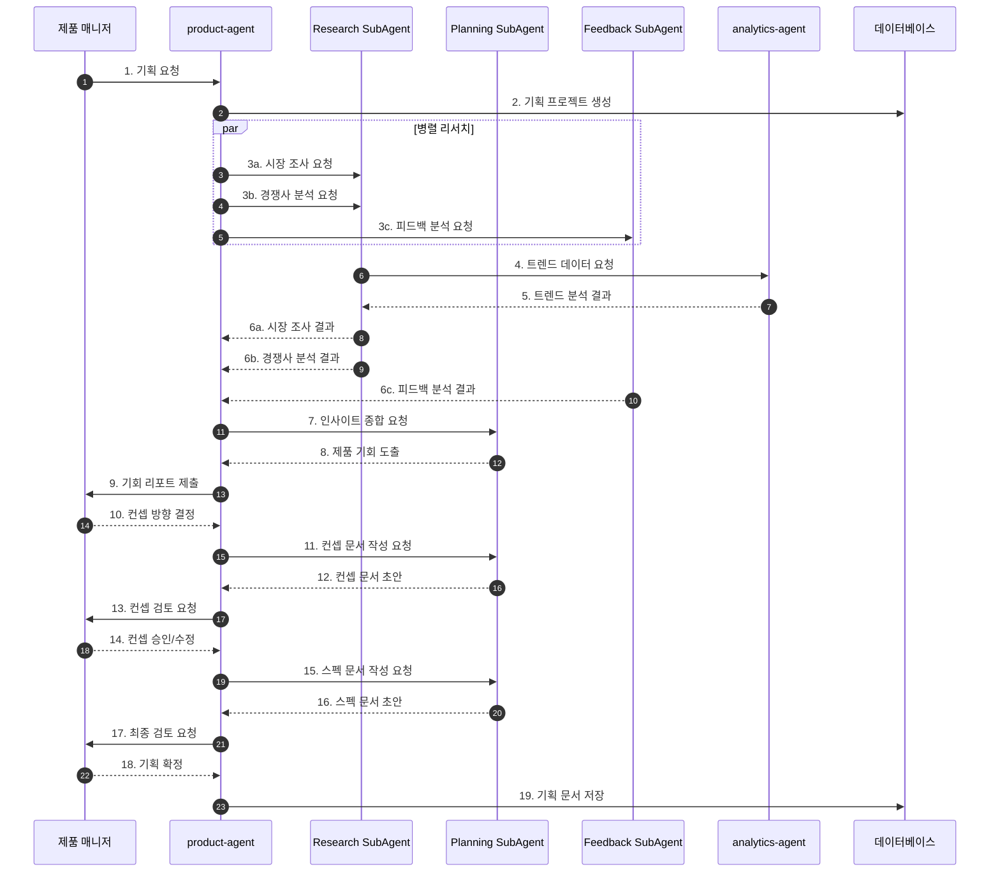
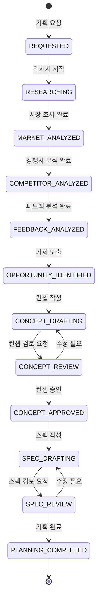

# 제품 기획 워크플로우 (Product Planning Flow)

## 기본 정보

| 항목 | 값 |
|------|-----|
| **워크플로우 ID** | `WF-PRD-001` |
| **버전** | 1.0.0 |
| **카테고리** | 제품기획 (Product Planning) |
| **트리거 유형** | Manual / Scheduled |
| **SLA** | 기획 완료: 2주 |
| **자동화 수준** | Human-in-the-Loop |
| **우선순위** | Medium |
| **담당 팀** | Product |
| **최종 수정** | 2024-01-26 |

---

## 워크플로우 개요

제품 기획 워크플로우는 시장 조사부터 제품 컨셉 확정까지의 전 과정을 관리합니다. 시장 트렌드 분석, 경쟁사 조사, 고객 피드백 분석을 통해 신제품 기회를 발굴하고 구체적인 제품 컨셉과 스펙을 정의합니다.

### 핵심 단계
1. **시장 조사** - 시장 규모, 성장률, 기회 분석
2. **경쟁사 분석** - 경쟁 제품, 가격, 전략 분석
3. **트렌드 분석** - 소비자 트렌드, 키워드 분석
4. **피드백 수집** - 기존 제품 리뷰, VOC 분석
5. **컨셉 도출** - 제품 컨셉 및 차별화 포인트 정의
6. **스펙 확정** - 상세 스펙 및 요구사항 정의

---

## 트리거 조건

### 이벤트 트리거

| 이벤트명 | 소스 | 조건 | 설명 |
|----------|------|------|------|
| `planning.request` | product-manager | `type == 'new_product'` | 신제품 기획 요청 |
| `planning.request` | product-manager | `type == 'improvement'` | 기존 제품 개선 기획 |
| `market.opportunity` | analytics-agent | `opportunity_score > 0.8` | 시장 기회 감지 |
| `scheduled.quarterly_review` | scheduler | `every quarter` | 분기별 제품 리뷰 |

### 이벤트 페이로드 예시

```json
{
  "event_type": "planning.request",
  "timestamp": "2024-01-26T09:00:00+09:00",
  "data": {
    "request_id": "PLN-2024012600001",
    "requester": "product-manager",
    "type": "new_product",
    "category": "skincare",
    "target_segment": "20-30대 여성",
    "initial_concept": "민감성 피부용 진정 앰플",
    "budget": "development",
    "timeline": {
      "research_deadline": "2024-02-09",
      "concept_deadline": "2024-02-16"
    },
    "priority": "high"
  }
}
```

---

## 프로세스 흐름

### 전체 흐름도



### 상태 전이도



---

## 단계별 상세

### Step 1: 시장 조사 (Market Research)

| 항목 | 내용 |
|------|------|
| **Step ID** | `STEP-PRD-001` |
| **담당 에이전트** | `product-agent` → `Research SubAgent` |
| **설명** | 목표 시장의 규모, 성장률, 기회 분석 |
| **SLA** | 3일 |
| **재시도** | 1회 |

**입력 (Input)**

```json
{
  "category": "string - 제품 카테고리",
  "target_segment": "string - 타겟 고객층",
  "geographic_scope": "string - 분석 지역",
  "analysis_depth": "enum - basic/standard/deep"
}
```

**출력 (Output)**

```json
{
  "market_size": {
    "current": "number - 현재 시장 규모",
    "projected": "number - 예상 시장 규모",
    "growth_rate": "number - 성장률"
  },
  "segments": [
    {
      "name": "string - 세그먼트명",
      "size": "number - 규모",
      "opportunity_score": "number - 기회 점수"
    }
  ],
  "entry_barriers": ["string - 진입 장벽"],
  "risks": ["string - 위험 요소"]
}
```

---

### Step 2: 경쟁사 분석 (Competitor Analysis)

| 항목 | 내용 |
|------|------|
| **Step ID** | `STEP-PRD-002` |
| **담당 에이전트** | `product-agent` → `Research SubAgent` |
| **설명** | 경쟁 제품, 가격, 전략 비교 분석 |
| **SLA** | 3일 |
| **재시도** | 1회 |

**분석 항목**

| 항목 | 설명 | 자동화 |
|------|------|--------|
| 제품 스펙 비교 | 경쟁 제품 상세 스펙 비교표 | L3 |
| 가격 포지셔닝 | 가격대별 시장 분포 | L4 |
| 강점/약점 분석 | SWOT 기반 분석 | L3 |
| 마케팅 전략 | 경쟁사 마케팅 활동 분석 | L3 |
| 고객 평가 | 경쟁사 제품 리뷰 분석 | L4 |

---

### Step 3: 고객 피드백 분석 (Customer Feedback Analysis)

| 항목 | 내용 |
|------|------|
| **Step ID** | `STEP-PRD-003` |
| **담당 에이전트** | `product-agent` → `Feedback SubAgent` |
| **설명** | 기존 제품 리뷰, VOC, 설문 데이터 분석 |
| **SLA** | 2일 |
| **재시도** | 1회 |

**처리 로직**

```python
def analyze_feedback(category, time_range):
    # 1. 피드백 데이터 수집
    reviews = collect_reviews(category, time_range)
    voc_data = collect_voc(category, time_range)
    survey_data = collect_surveys(category, time_range)

    # 2. 감성 분석
    sentiment_analysis = analyze_sentiment(reviews + voc_data)

    # 3. 주제 추출
    topics = extract_topics(reviews + voc_data)

    # 4. 개선 요구사항 도출
    improvements = identify_improvements(
        topics=topics,
        sentiment=sentiment_analysis,
        frequency_threshold=10
    )

    # 5. 우선순위화
    prioritized_improvements = prioritize(
        improvements,
        criteria=['frequency', 'sentiment_impact', 'feasibility']
    )

    return {
        'sentiment_summary': sentiment_analysis,
        'key_topics': topics,
        'improvements': prioritized_improvements
    }
```

---

### Step 4: 컨셉 도출 (Concept Development)

| 항목 | 내용 |
|------|------|
| **Step ID** | `STEP-PRD-004` |
| **담당 에이전트** | `product-agent` → `Planning SubAgent` |
| **설명** | 리서치 결과 기반 제품 컨셉 개발 |
| **SLA** | 3일 |
| **재시도** | N/A |

**컨셉 문서 구조**

```yaml
concept_document:
  - product_name: "제품명 (가칭)"
  - category: "제품 카테고리"
  - target_customer:
      demographic: "타겟 인구통계"
      psychographic: "타겟 심리특성"
      needs: ["해결하려는 니즈"]
  - value_proposition: "핵심 가치 제안"
  - key_features:
      - feature: "주요 기능"
        benefit: "고객 혜택"
  - differentiators: ["경쟁 차별화 포인트"]
  - positioning: "시장 포지셔닝"
  - price_range: "예상 가격대"
```

---

### Step 5: 스펙 확정 (Specification Finalization)

| 항목 | 내용 |
|------|------|
| **Step ID** | `STEP-PRD-005` |
| **담당 에이전트** | `product-agent` → `Planning SubAgent` |
| **설명** | 제품 상세 스펙 및 요구사항 정의 |
| **SLA** | 2일 |
| **재시도** | N/A |

**스펙 문서 구조**

```yaml
spec_document:
  - basic_info:
      sku: "제품 SKU"
      name: "정식 제품명"
      category: "카테고리"
  - physical_spec:
      size: "크기/용량"
      weight: "중량"
      packaging: "패키징 방식"
  - ingredients: ["주요 성분"]
  - certifications: ["필요 인증"]
  - manufacturing:
      method: "제조 방식"
      moq: "최소 주문량"
      lead_time: "제조 소요 기간"
  - cost_structure:
      target_cogs: "목표 원가"
      target_margin: "목표 마진율"
  - launch_requirements:
      assets: ["필요 자산"]
      timeline: "출시 일정"
```

---

## 예외 처리

### 예외 유형 및 처리 방법

| 예외 코드 | 예외 유형 | 원인 | 처리 방법 | 에스컬레이션 |
|----------|----------|------|----------|-------------|
| `ERR-PRD-001` | DataInsufficient | 분석 데이터 부족 | 추가 데이터 소스 탐색 | PM 알림 |
| `ERR-PRD-002` | ResearchTimeout | 리서치 SLA 초과 | 범위 축소 후 진행 | PM 알림 |
| `ERR-PRD-003` | ConceptRejected | 컨셉 반려 | 피드백 반영 후 재작성 | N/A |
| `ERR-PRD-004` | MarketShift | 시장 상황 급변 | 리서치 재실행 | PM 긴급 알림 |

---

## KPI (핵심 성과 지표)

| 지표명 | 측정 방법 | 목표치 | 알림 임계치 |
|--------|----------|--------|------------|
| 리서치 완료율 | 요청 대비 완료 비율 | 95% | < 90% |
| 기획 소요 시간 | 요청~완료 기간 | < 2주 | > 3주 |
| 컨셉 승인률 | 첫 제출 승인 비율 | 70% | < 50% |
| 시장 예측 정확도 | 예측 vs 실제 | > 80% | < 70% |

---

## 연관 에이전트

| 에이전트 | 역할 | 상호작용 |
|----------|------|----------|
| `analytics-agent` | 트렌드/판매 데이터 제공 | 참조 |
| `marketing-agent` | 마케팅 인사이트 공유 | 협업 |
| `cs-agent` | VOC 데이터 제공 | 참조 |

---

## 변경 이력

| 버전 | 날짜 | 작성자 | 변경 내용 |
|------|------|--------|----------|
| 1.0.0 | 2024-01-26 | AI Agent | 초기 문서 작성 |

---

*이 문서는 제품 기획 워크플로우의 상세 스펙을 정의합니다.*
