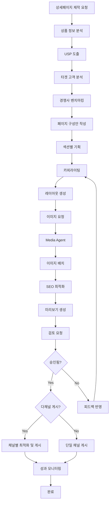
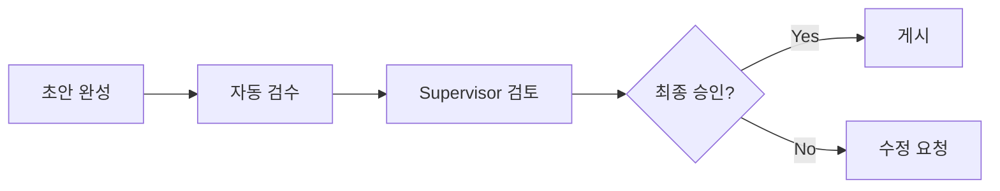

# 상세페이지 제작 워크플로우

> 상품 상세페이지의 기획부터 게시까지 전체 프로세스

---

## 1. 개요

상세페이지 제작 워크플로우는 DetailPage Agent가 주도하여 상품 분석, 페이지 기획, 카피라이팅, 이미지 배치, SEO 최적화를 수행하고 최종 게시하는 프로세스입니다.

## 2. 관련 에이전트

| 에이전트 | 역할 |
|---------|------|
| DetailPage Agent | 제작 총괄 |
| PlanningSubAgent | 상품 분석, 구성안 기획 |
| ProductionSubAgent | 카피/레이아웃/SEO |
| Media Agent | 이미지 에셋 제공 |
| Supervisor | 게시 승인 |

## 3. 워크플로우 다이어그램



## 4. 단계별 상세

### 4.1 상품 분석 및 기획

```typescript
// 1. 상품 분석
const plan = await planningAgent.createPlan({
  productId: 'product-123',
  productName: '아기 슬리핑백',
  includeCompetitorAnalysis: true,
});

// 결과: productAnalysis, targetAnalysis, recommendedStructure
```

### 4.2 페이지 제작

```typescript
// 2. 상세페이지 생성
const page = await productionAgent.createPage({
  productId: 'product-123',
  productName: '아기 슬리핑백',
  plan: plan,
  channels: [SalesChannel.NAVER, SalesChannel.COUPANG],
});
```

### 4.3 이미지 요청 및 배치

```typescript
// 3. 이미지 배치 계획
const placements = await productionAgent.placeImages({
  pageId: page.id,
});

// 4. Media Agent에서 이미지 준비
const images = await mediaAgent.prepareProductImages({
  productId: 'product-123',
});
```

### 4.4 SEO 최적화

```typescript
// 5. SEO 정보 생성
const seo = await productionAgent.optimizeSEO(page.id);

// 결과:
// {
//   metaTitle: '아기 슬리핑백 | 썬데이허그',
//   metaDescription: '안전 인증 완료된 프리미엄 슬리핑백...',
//   keywords: ['아기슬리핑백', '신생아수면', '썬데이허그']
// }
```

## 5. 페이지 섹션 구조

```
1. HERO (히어로)
   - 메인 이미지 + USP 헤드라인

2. PRODUCT_INFO (제품 소개)
   - 상품 기본 정보 및 특징

3. FEATURES (특장점)
   - 3-5개 핵심 특장점

4. USAGE (사용법)
   - 단계별 사용 가이드

5. REVIEWS (후기)
   - 실제 고객 리뷰 하이라이트

6. FAQ (자주 묻는 질문)
   - 5-7개 FAQ

7. SHIPPING (배송 안내)
   - 배송/교환/반품 정책

8. CTA (구매 유도)
   - 최종 구매 버튼
```

## 6. 채널별 최적화

| 채널 | 이미지 너비 | 특이사항 |
|------|-----------|---------|
| 네이버 스마트스토어 | 860px | 네이버 쇼핑 SEO 최적화 |
| 쿠팡 | 780px | 로켓배송 뱃지 표시 |
| 11번가 | 750px | 상품평 연동 |
| 자사몰 | 1200px | 반응형 레이아웃 |

## 7. 승인 프로세스



## 8. 품질 체크리스트

### 콘텐츠
- [ ] 맞춤법/문법 검수 완료
- [ ] 브랜드 톤앤매너 준수
- [ ] 과장 광고 표현 없음
- [ ] 안전/인증 정보 정확

### 이미지
- [ ] 고해상도 (860px 이상)
- [ ] 상품 상태 정확히 표현
- [ ] 워터마크 없음 (필요시 자사 마크)
- [ ] 저작권 이슈 없음

### SEO
- [ ] 메타 타이틀 60자 이내
- [ ] 메타 설명 160자 이내
- [ ] 주요 키워드 포함
- [ ] 이미지 alt 텍스트 설정

## 9. 예상 소요 시간

| 단계 | 자동화 | 소요 시간 |
|------|--------|----------|
| 상품 분석 | L3 | 5분 |
| 기획안 작성 | L2 | 15분 |
| 카피라이팅 | L2 | 30분 |
| 레이아웃 생성 | L3 | 10분 |
| 이미지 배치 | L3 | 15분 |
| SEO 최적화 | L4 | 5분 |
| **총 소요 시간** | - | **~1.5시간** |

---

*상세페이지 제작 워크플로우 v1.0*
