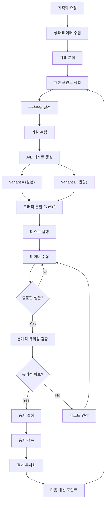

# 상세페이지 최적화 워크플로우

> A/B 테스트 및 전환율 개선 프로세스

---

## 1. 개요

상세페이지 최적화 워크플로우는 DetailPage Agent의 OptimizationSubAgent가 주도하여 기존 상세페이지의 성과를 분석하고, A/B 테스트를 통해 전환율을 개선하는 프로세스입니다.

## 2. 관련 에이전트

| 에이전트 | 역할 |
|---------|------|
| DetailPage Agent | 최적화 총괄 |
| OptimizationSubAgent | A/B 테스트, 분석, 제안 |
| ProductionSubAgent | 변형 페이지 생성 |
| Marketing Agent | 트래픽 분배 지원 |

## 3. 워크플로우 다이어그램



## 4. 분석 지표

### 4.1 핵심 지표

| 지표 | 설명 | 벤치마크 |
|------|------|---------|
| 전환율 (CVR) | 구매/방문자 | >= 3% |
| 장바구니 담기율 | 장바구니/방문자 | >= 8% |
| 이탈률 | 즉시 이탈/방문 | <= 40% |
| 평균 체류시간 | 페이지 체류 | >= 90초 |
| 스크롤 깊이 | 평균 스크롤 % | >= 70% |

### 4.2 지표 수집

```typescript
const metrics = await optimizationAgent.analyzeMetrics('page-123');

// 결과:
// {
//   pageViews: 10000,
//   uniqueVisitors: 8500,
//   avgTimeOnPage: 120, // 초
//   avgScrollDepth: 65, // %
//   bounceRate: 45, // %
//   addToCartCount: 700,
//   addToCartRate: 8.2, // %
//   purchaseCount: 250,
//   conversionRate: 2.9 // %
// }
```

## 5. 개선 제안 로직

### 5.1 자동 분석 규칙

```typescript
const suggestions = await optimizationAgent.generateSuggestions(
  'page-123',
  metrics
);

// 제안 생성 로직:
// - 전환율 < 2% → CTA 개선 제안
// - 이탈률 > 60% → 히어로 섹션 개선 제안
// - 스크롤 깊이 < 50% → 콘텐츠 순서 재배치 제안
// - 장바구니 담기율 < 5% → 이미지/정보 개선 제안
// - 체류시간 < 60초 → 카피 가독성 개선 제안
```

### 5.2 개선 제안 예시

| 영역 | 이슈 | 제안 | 예상 효과 |
|------|------|------|----------|
| CTA | 전환율 1.8% | 버튼 색상 강조 + 긴급성 메시지 | +20-30% |
| Hero | 이탈률 65% | 헤드라인 A/B 테스트 | 이탈률 -15% |
| Layout | 스크롤 45% | 특장점 섹션 상단 이동 | 스크롤 +20% |

## 6. A/B 테스트 프로세스

### 6.1 테스트 생성

```typescript
const test = await optimizationAgent.createABTest({
  pageId: 'page-123',
  testElement: 'headline', // headline, cta, images, layout
  variantBContent: {
    headline: '아기의 편안한 잠을 위한 최고의 선택',
  },
  goalMetric: 'conversion_rate',
});
```

### 6.2 테스트 분석

```typescript
const result = await optimizationAgent.analyzeABTest('test-123');

// 결과:
// {
//   winner: 'B',
//   statisticalSignificance: 97.5,
//   variantPerformance: [
//     { variant: 'A', conversions: 120, conversionRate: 2.4 },
//     { variant: 'B', conversions: 156, conversionRate: 3.1, improvement: 29.2 }
//   ],
//   recommendation: '변형 B가 97.5%의 신뢰도로 우세합니다.'
// }
```

## 7. 통계적 유의성

### 7.1 샘플 사이즈 계산

```
최소 샘플 사이즈 =
  (기준 전환율, 예상 개선율, 신뢰 수준, 검정력) 기반 계산

예시:
- 현재 전환율: 2%
- 예상 개선: 20%
- 신뢰 수준: 95%
- 검정력: 80%
→ 최소 샘플: 각 그룹 약 3,000명
```

### 7.2 유의성 기준

| 신뢰도 | 판정 |
|--------|------|
| >= 99% | 강력한 승자 |
| >= 95% | 승자 확정 |
| >= 90% | 약한 승자 (추가 테스트 권장) |
| < 90% | 결론 불가 (테스트 연장) |

## 8. 테스트 요소별 가이드

### 8.1 헤드라인 테스트

```yaml
test_elements:
  headline:
    variations:
      - 감성적 어필: "아기의 편안한 잠, 엄마의 행복"
      - 기능적 어필: "15시간 쾌적한 수면을 위한 설계"
      - 사회적 증거: "10만 맘들의 선택"
    success_metric: bounce_rate
    expected_impact: -10~20%
```

### 8.2 CTA 테스트

```yaml
test_elements:
  cta:
    variations:
      - 기본: "장바구니 담기"
      - 긴급성: "오늘만 특가 - 지금 구매하기"
      - 혜택 강조: "무료 배송 - 바로 주문하기"
    success_metric: add_to_cart_rate
    expected_impact: +10~30%
```

## 9. 최적화 사이클

```
1. 데이터 수집 (1주)
   ↓
2. 분석 & 가설 수립 (1일)
   ↓
3. A/B 테스트 실행 (2-4주)
   ↓
4. 결과 분석 & 적용 (1일)
   ↓
5. 다음 개선 포인트 (반복)
```

## 10. 성과 추적

| 기간 | 전환율 | 개선율 | 테스트 수 |
|------|--------|--------|----------|
| 1개월차 | 2.0% | - | 2 |
| 2개월차 | 2.3% | +15% | 3 |
| 3개월차 | 2.8% | +22% | 2 |
| 6개월차 | 3.5% | +75% | 10 |

---

*상세페이지 최적화 워크플로우 v1.0*
