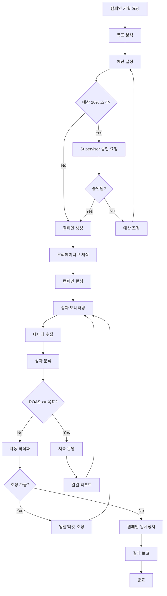

# 마케팅 캠페인 워크플로우

> 광고 캠페인의 기획부터 실행, 최적화까지의 전체 흐름

---

## 1. 개요

마케팅 캠페인 워크플로우는 Marketing Agent가 주도하여 광고 캠페인을 생성하고, 성과를 모니터링하며, 자동으로 최적화하는 프로세스입니다.

## 2. 관련 에이전트

| 에이전트 | 역할 |
|---------|------|
| Marketing Agent | 캠페인 총괄 |
| PerformanceSubAgent | 성과 분석, ROAS 최적화 |
| ContentSubAgent | 광고 크리에이티브 제작 |
| Supervisor | 예산 승인 |

## 3. 워크플로우 다이어그램



## 4. 단계별 상세

### 4.1 캠페인 기획

```typescript
// 1. 캠페인 목표 설정
const campaign = await marketingAgent.createCampaign({
  name: '신제품 슬리핑백 런칭',
  platform: AdPlatform.NAVER,
  objective: 'conversions',
  targetROAS: 400,
  budget: { daily: 100000, total: 3000000 },
  startDate: '2025-02-01',
});
```

### 4.2 성과 모니터링

```typescript
// 2. 일일 성과 수집
const dailyMetrics = await performanceAgent.collectDailyMetrics({
  campaignId: campaign.id,
  platform: AdPlatform.NAVER,
});

// 3. ROAS 분석
const roasAnalysis = await performanceAgent.analyzeROAS(campaign.id);
```

### 4.3 자동 최적화

```typescript
// 4. 성과 기반 최적화
if (roasAnalysis.currentROAS < roasAnalysis.targetROAS) {
  await performanceAgent.optimizeCampaign({
    campaignId: campaign.id,
    strategy: 'reduce_cpc',
    adjustment: -10, // 10% 입찰가 감소
  });
}
```

## 5. 트리거 조건

| 트리거 | 조건 | 액션 |
|--------|------|------|
| ROAS 하락 | ROAS < 목표의 80% | 입찰가 10% 감소 |
| ROAS 급락 | ROAS < 목표의 50% | 캠페인 일시정지 + 알림 |
| 예산 소진 | 일일 예산 90% 도달 | 리포트 발송 |
| 성과 우수 | ROAS > 목표의 120% | 예산 증액 제안 |

## 6. 에스컬레이션

| 상황 | 대상 | SLA |
|------|------|-----|
| 예산 10% 이상 증액 | Supervisor | 4시간 |
| 캠페인 중지 | Supervisor | 즉시 알림 |
| 이상 지출 감지 | CEO | 즉시 알림 |

## 7. 출력물

- 일일 성과 리포트 (Slack/카카오톡)
- 주간 ROAS 분석 리포트
- 캠페인 종료 결과 보고서

---

*마케팅 캠페인 워크플로우 v1.0*
