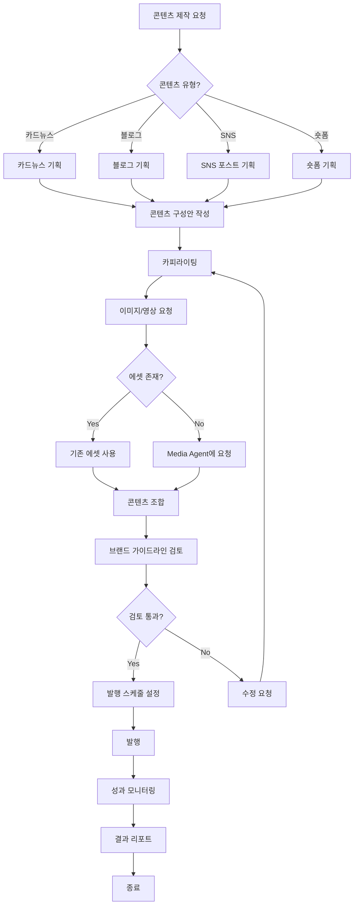

# 마케팅 콘텐츠 워크플로우

> SNS, 블로그, 카드뉴스 등 마케팅 콘텐츠 제작 프로세스

---

## 1. 개요

마케팅 콘텐츠 워크플로우는 Marketing Agent와 Media Agent가 협업하여 다양한 채널에 최적화된 콘텐츠를 기획하고 제작하는 프로세스입니다.

## 2. 관련 에이전트

| 에이전트 | 역할 |
|---------|------|
| Marketing Agent | 콘텐츠 기획 총괄 |
| ContentSubAgent | 카피/콘텐츠 제작 |
| Media Agent | 이미지/영상 에셋 제공 |
| BrandSubAgent | 브랜드 가이드라인 검토 |

## 3. 워크플로우 다이어그램



## 4. 콘텐츠 유형별 프로세스

### 4.1 카드뉴스 제작

```typescript
const cardNews = await contentAgent.createCardNews({
  productId: 'product-123',
  topic: '신생아 수면 교육',
  slideCount: 5,
  toneAndManner: 'warm_expert',
});

// 결과: 5장 슬라이드 (이미지 + 텍스트)
```

### 4.2 블로그 포스트 제작

```typescript
const blogPost = await contentAgent.createBlogPost({
  topic: '아기 수면 환경 가이드',
  productMention: ['product-123', 'product-456'],
  seoKeywords: ['아기수면', '신생아수면', '슬리핑백'],
  targetLength: 2000,
});
```

### 4.3 SNS 포스트 제작

```typescript
const snsPost = await contentAgent.createSNSPost({
  platform: 'instagram',
  type: 'feed',
  productId: 'product-123',
  hashtags: ['썬데이허그', '아기육아', '맘스타그램'],
});
```

## 5. 채널별 콘텐츠 규격

| 채널 | 유형 | 이미지 규격 | 텍스트 길이 |
|------|------|-----------|-----------|
| Instagram Feed | 정사각형 | 1080x1080 | 2,200자 |
| Instagram Story | 세로형 | 1080x1920 | 간결하게 |
| 네이버 블로그 | 가로형 | 860x auto | 2,000자+ |
| 카카오 채널 | 카드 | 400x400 | 300자 |

## 6. 브랜드 가이드라인 체크리스트

- [ ] 브랜드 컬러 사용 (Warm Beige 베이스)
- [ ] 친근하고 전문적인 톤앤매너
- [ ] 과장된 표현 지양
- [ ] 안전 관련 클레임 근거 확인
- [ ] 타사 비하 표현 없음

## 7. 발행 스케줄

| 채널 | 권장 시간 | 빈도 |
|------|----------|------|
| Instagram | 오후 12시, 저녁 8시 | 주 3-4회 |
| 블로그 | 오전 10시 | 주 2회 |
| 카카오 채널 | 오전 11시 | 주 1-2회 |

## 8. 성과 지표

| 지표 | 목표 | 측정 |
|------|------|------|
| 도달 수 | +10% MoM | 플랫폼 인사이트 |
| 참여율 | >= 5% | 좋아요+댓글+공유/도달 |
| 저장 수 | +20% MoM | 플랫폼 인사이트 |
| 클릭률 | >= 2% | UTM 트래킹 |

---

*마케팅 콘텐츠 워크플로우 v1.0*
