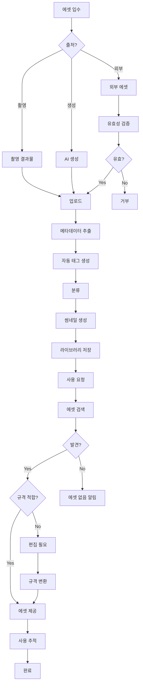
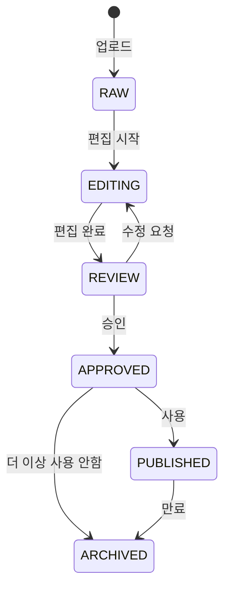

# 미디어 에셋 관리 워크플로우

> 에셋 라이브러리 운영 및 편집 프로세스

---

## 1. 개요

미디어 에셋 관리 워크플로우는 Media Agent가 이미지/영상 에셋을 체계적으로 관리하고, 각 채널에 최적화된 형태로 변환하여 제공하는 프로세스입니다.

## 2. 관련 에이전트

| 에이전트 | 역할 |
|---------|------|
| Media Agent | 에셋 관리 총괄 |
| AssetManagementSubAgent | 업로드, 분류, 검색 |
| EditingSubAgent | 편집, 변환 |
| DetailPage Agent | 에셋 요청 |
| Marketing Agent | 에셋 요청 |

## 3. 워크플로우 다이어그램



## 4. 에셋 업로드

### 4.1 업로드 프로세스

```typescript
const asset = await assetAgent.uploadAsset({
  filePath: '/uploads/product-123.jpg',
  productIds: ['product-123'],
  shootingScheduleId: 'schedule-456',
  tags: ['슬리핑백', '신생아', '스튜디오'],
  purposes: [ImagePurpose.DETAIL_MAIN],
});
```

### 4.2 자동 메타데이터 추출

| 항목 | 추출 방법 |
|------|----------|
| 파일 크기 | 시스템 |
| 이미지 크기 | 이미지 라이브러리 |
| MIME 타입 | 확장자/헤더 |
| 카메라 정보 | EXIF |
| 촬영 날짜 | EXIF |
| 색상 프로파일 | ICC 프로파일 |

### 4.3 자동 태그 생성

```typescript
// 자동 태그 규칙
- 에셋 타입: 'image', 'video', 'gif'
- 용도: 'detail_main', 'thumbnail', 'sns_feed'
- 촬영 관련: 'studio_shot' (촬영 스케줄 연결 시)
- 상품 관련: 'product_image' (상품 ID 연결 시)
```

## 5. 에셋 검색

### 5.1 검색 필터

```typescript
const assets = await assetAgent.searchAssets({
  type: AssetType.IMAGE,
  status: AssetStatus.APPROVED,
  productId: 'product-123',
  tags: ['슬리핑백'],
  purpose: ImagePurpose.DETAIL_MAIN,
  dateFrom: new Date('2025-01-01'),
  keyword: '신생아',
});
```

### 5.2 검색 결과 정렬

| 정렬 기준 | 설명 |
|----------|------|
| 최신순 | 생성일 기준 |
| 사용 빈도 | 많이 사용된 순 |
| 관련도 | 검색어 매칭 순 |

## 6. 에셋 편집

### 6.1 지원 편집 기능

| 기능 | 설명 | 자동화 |
|------|------|--------|
| 리사이징 | 크기 변경 | L4 |
| 크롭 | 영역 자르기 | L3 |
| 색보정 | 밝기/대비/채도 | L3 |
| 배경 제거 | 누끼 | L3 |
| 워터마크 | 로고 삽입 | L4 |
| 썸네일 | 미리보기 생성 | L4 |

### 6.2 편집 요청

```typescript
// 리사이징
const resized = await editingAgent.resizeImage({
  assetId: 'asset-123',
  width: 860,
  height: 860,
});

// 워터마크 추가
const watermarked = await editingAgent.addWatermark({
  assetId: 'asset-123',
  watermark: {
    text: '썬데이허그',
    position: 'bottomRight',
    opacity: 0.3,
  },
});
```

### 6.3 배치 편집

```typescript
// 여러 에셋 일괄 리사이징
const batch = await editingAgent.batchEdit({
  assetIds: ['asset-1', 'asset-2', 'asset-3'],
  editType: EditType.RESIZE,
  parameters: {
    targetWidth: 500,
    targetHeight: 500,
  },
});
```

## 7. 채널별 에셋 변환

### 7.1 채널 규격

| 채널 | 용도 | 크기 | 포맷 |
|------|------|------|------|
| 네이버 | 상세 메인 | 860x860 | JPG/PNG |
| 쿠팡 | 썸네일 | 500x500 | JPG/PNG |
| 인스타그램 | 피드 | 1080x1080 | JPG |
| 인스타 스토리 | 스토리 | 1080x1920 | JPG |
| 카카오 | 광고 | 400x400 | JPG/PNG |

### 7.2 자동 채널 변환

```typescript
const variants = await mediaAgent.generateChannelAssets({
  sourceAssetId: 'asset-123',
  channels: ['naver', 'coupang', 'instagram'],
});

// 결과: 각 채널에 맞게 리사이징된 에셋 목록
```

## 8. 라이브러리 관리

### 8.1 정리 작업

```typescript
const organized = await assetAgent.organizeLibrary({
  deleteExpired: false,
});

// 결과:
// {
//   organized: 45,   // 태그 추가된 에셋
//   archived: 12,    // 아카이브된 에셋
//   deleted: 0       // 삭제된 에셋
// }
```

### 8.2 자동 정리 규칙

| 조건 | 액션 |
|------|------|
| 6개월 미사용 RAW 에셋 | 아카이브 |
| 만료일 지난 에셋 | 아카이브 |
| 태그 없는 에셋 | 자동 태그 추가 |
| 중복 에셋 | 알림 발송 |

### 8.3 통계 조회

```typescript
const stats = await assetAgent.getLibraryStats();

// 결과:
// {
//   totalAssets: 1234,
//   byType: { image: 1100, video: 100, gif: 34 },
//   byStatus: { approved: 800, raw: 300, archived: 134 },
//   totalStorageUsed: 15000000000, // 15GB
//   thisMonthUploads: 45,
//   topTags: [
//     { tag: '슬리핑백', count: 120 },
//     { tag: '스튜디오', count: 95 },
//   ]
// }
```

## 9. 에셋 상태 관리

### 9.1 상태 흐름



### 9.2 상태 업데이트

```typescript
await assetAgent.updateAssetStatus(
  'asset-123',
  AssetStatus.APPROVED
);
```

## 10. 중복 관리

### 10.1 중복 감지

```typescript
const duplicates = await assetAgent.findDuplicates();

// 결과:
// {
//   groups: [
//     [asset1, asset2], // 중복 그룹 1
//     [asset3, asset4, asset5], // 중복 그룹 2
//   ]
// }
```

### 10.2 중복 처리 정책

- 최신 버전 유지
- 가장 많이 사용된 에셋 유지
- 나머지는 아카이브

---

*미디어 에셋 관리 워크플로우 v1.0*
