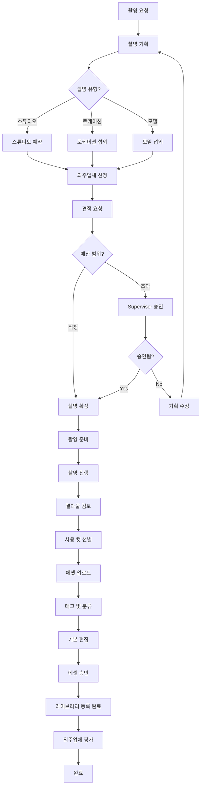
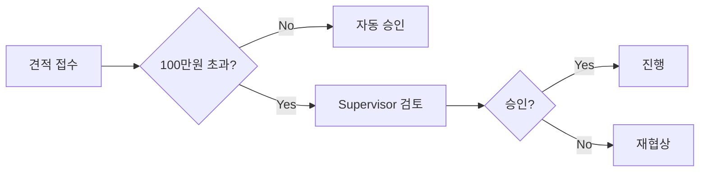

# 미디어 촬영 워크플로우

> 제품 촬영 기획부터 에셋 등록까지 전체 프로세스

---

## 1. 개요

미디어 촬영 워크플로우는 Media Agent의 ShootingManagementSubAgent가 주도하여 촬영을 기획하고, 외주업체를 조율하며, 촬영 결과물을 에셋 라이브러리에 등록하는 프로세스입니다.

## 2. 관련 에이전트

| 에이전트 | 역할 |
|---------|------|
| Media Agent | 촬영 총괄 |
| ShootingManagementSubAgent | 스케줄/외주 관리 |
| AssetManagementSubAgent | 에셋 등록/분류 |
| EditingSubAgent | 기본 편집 |
| Supervisor | 비용 승인 |

## 3. 워크플로우 다이어그램



## 4. 촬영 유형별 가이드

### 4.1 스튜디오 촬영 (제품)

```typescript
const schedule = await shootingAgent.scheduleShooting({
  title: '신제품 슬리핑백 촬영',
  type: ShootingType.STUDIO,
  productIds: ['product-123', 'product-124'],
  concept: '아늑하고 따뜻한 수면 환경',
  expectedShots: 50,
  scheduledDate: '2025-02-01',
});
```

**체크리스트:**
- [ ] 촬영 대상 상품 준비 (실물)
- [ ] 촬영 컨셉 시안 준비
- [ ] 레퍼런스 이미지 수집
- [ ] 소품 리스트 작성
- [ ] 스튜디오 예약 확인

### 4.2 모델 촬영

```typescript
const schedule = await shootingAgent.scheduleShooting({
  title: '슬리핑백 모델 촬영',
  type: ShootingType.MODEL,
  productIds: ['product-123'],
  concept: '행복한 엄마와 아기',
  expectedShots: 80,
  budget: 2000000,
});
```

**체크리스트:**
- [ ] 모델 에이전시 컨택
- [ ] 모델 포트폴리오 검토
- [ ] 계약서 작성
- [ ] 초상권 동의서 확보
- [ ] 헤어/메이크업 섭외

### 4.3 로케이션 촬영

**체크리스트:**
- [ ] 촬영 장소 사전 답사
- [ ] 촬영 허가 확인
- [ ] 날씨/조명 조건 체크
- [ ] 장비 운반 계획
- [ ] 비상 대체 장소 확보

## 5. 외주업체 관리

### 5.1 외주업체 선정

```typescript
// 조건에 맞는 업체 추천
const vendor = await shootingAgent.findRecommendedVendor(
  VendorType.PHOTOGRAPHER,
  1000000 // 예산
);
```

### 5.2 평가 기준

| 기준 | 비중 | 평가 방법 |
|------|------|----------|
| 결과물 품질 | 40% | 포트폴리오 리뷰 |
| 가격 | 25% | 견적 비교 |
| 일정 준수 | 20% | 이전 협업 이력 |
| 커뮤니케이션 | 15% | 이전 협업 이력 |

### 5.3 협업 후 평가

```typescript
await shootingAgent.rateVendor(
  'vendor-123',
  'schedule-123',
  4.5, // 평점 (1-5)
  '결과물 품질 우수, 일정 준수'
);
```

## 6. 촬영 결과물 처리

### 6.1 결과물 업로드

```typescript
// 촬영 완료 처리
const result = await shootingAgent.completeShooting({
  scheduleId: 'schedule-123',
  totalShots: 120,
  selectedShots: 45,
  actualCost: 800000,
  assetPaths: [
    '/raw/shoot-123/IMG_001.jpg',
    '/raw/shoot-123/IMG_002.jpg',
    // ...
  ],
});
```

### 6.2 선별 기준

| 순위 | 기준 | 설명 |
|------|------|------|
| 1 | 기술적 품질 | 초점, 노출, 구도 |
| 2 | 컨셉 적합성 | 촬영 목적과의 일치 |
| 3 | 상품 표현 | 상품 특징 효과적 표현 |
| 4 | 활용 가능성 | 다양한 채널 활용 가능 |

## 7. 비용 관리

### 7.1 예산 기준

| 촬영 유형 | 기본 예산 | 승인 필요 |
|----------|----------|----------|
| 스튜디오 (제품) | 50만원 | 80만원 초과 |
| 스튜디오 (모델) | 150만원 | 200만원 초과 |
| 로케이션 | 100만원 | 150만원 초과 |
| 영상 촬영 | 200만원 | 300만원 초과 |

### 7.2 비용 승인 프로세스



## 8. 일정 관리

### 8.1 표준 리드타임

| 단계 | 소요 시간 |
|------|----------|
| 기획 | 2-3일 |
| 외주업체 선정 | 1-2일 |
| 촬영 준비 | 3-5일 |
| 촬영 | 1일 |
| 결과물 전달 | 2-3일 |
| 편집 | 1-2일 |
| **총 소요** | **10-16일** |

### 8.2 다가오는 촬영 조회

```typescript
const upcoming = await shootingAgent.getUpcomingSchedules(7);
// 7일 이내 예정된 촬영 목록
```

## 9. 품질 관리

### 촬영 결과물 체크리스트

- [ ] 모든 필수 컷 촬영 완료
- [ ] RAW 파일 백업
- [ ] 색감 일관성 확인
- [ ] 상품 상태 정확히 표현
- [ ] 브랜드 가이드라인 준수

---

*미디어 촬영 워크플로우 v1.0*
