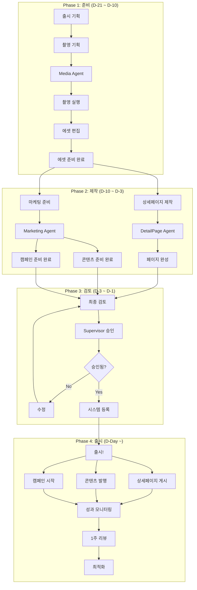

# 신제품 출시 워크플로우

> 신제품 출시를 위한 통합 에이전트 협업 프로세스

---

## 1. 개요

신제품 출시 워크플로우는 여러 에이전트가 협업하여 신제품의 상세페이지 제작, 마케팅 콘텐츠 준비, 광고 캠페인 런칭까지 통합적으로 진행하는 프로세스입니다.

## 2. 관련 에이전트

| 에이전트 | 역할 |
|---------|------|
| Supervisor | 전체 조율 및 승인 |
| Media Agent | 제품 촬영 및 에셋 관리 |
| DetailPage Agent | 상세페이지 제작 |
| Marketing Agent | 마케팅 콘텐츠 및 캠페인 |
| Inventory Agent | 재고 확인 (참조) |

## 3. 전체 타임라인

```
D-21: 촬영 기획
D-14: 제품 촬영
D-10: 에셋 편집 완료
D-7:  상세페이지 제작
D-5:  마케팅 콘텐츠 제작
D-3:  최종 검토 및 승인
D-1:  시스템 등록
D-Day: 출시!
D+1:  성과 모니터링 시작
D+7:  1주 리뷰
```

## 4. 워크플로우 다이어그램



## 5. Phase 1: 준비 (D-21 ~ D-10)

### 5.1 촬영 기획

```typescript
// Media Agent: 촬영 스케줄 생성
const shootingSchedule = await mediaAgent.scheduleShootingSession({
  title: '신제품 슬리핑백 A 출시 촬영',
  type: ShootingType.PRODUCT,
  productIds: ['new-product-001'],
  concept: '아늑한 수면 환경, 행복한 아기',
  expectedShots: 80,
  scheduledDate: 'D-14',
});
```

### 5.2 촬영 실행 체크리스트

- [ ] 제품 샘플 확보
- [ ] 촬영 컨셉 시안 확정
- [ ] 스튜디오/외주업체 확정
- [ ] 소품 준비
- [ ] 모델 섭외 (해당 시)

### 5.3 에셋 편집

```typescript
// 채널별 에셋 준비
const variants = await mediaAgent.generateChannelAssets({
  sourceAssetId: 'main-asset-001',
  channels: ['naver', 'coupang', 'instagram', 'kakao'],
});
```

## 6. Phase 2: 제작 (D-10 ~ D-3)

### 6.1 상세페이지 제작

```typescript
// DetailPage Agent: 상세페이지 생성
const detailPage = await detailPageAgent.createDetailPage({
  productId: 'new-product-001',
  productName: '슬리핑백 A',
  channels: [SalesChannel.NAVER, SalesChannel.COUPANG],
  includeABTest: false, // 신제품은 A/B 테스트 없이 시작
});
```

### 6.2 마케팅 콘텐츠 제작

```typescript
// Marketing Agent: 출시 콘텐츠 세트 준비
const launchContent = await marketingAgent.prepareLaunchContent({
  productId: 'new-product-001',
  contentTypes: [
    ContentType.CARD_NEWS,
    ContentType.SNS_POST,
    ContentType.BLOG,
  ],
});
```

### 6.3 광고 캠페인 준비

```typescript
// Marketing Agent: 출시 캠페인 생성
const launchCampaign = await marketingAgent.createCampaign({
  name: '슬리핑백 A 신제품 런칭',
  objective: 'awareness',
  platforms: [AdPlatform.NAVER, AdPlatform.META],
  budget: { daily: 200000, total: 6000000 },
  startDate: 'D-Day',
  targetROAS: 300, // 출시 초기 낮은 목표
});
```

## 7. Phase 3: 검토 (D-3 ~ D-1)

### 7.1 최종 검토 체크리스트

**상세페이지:**
- [ ] 맞춤법/문법 검수
- [ ] 이미지 품질 확인
- [ ] 가격 정보 정확성
- [ ] 재고 연동 확인
- [ ] 모바일 최적화 확인

**마케팅:**
- [ ] 브랜드 가이드라인 준수
- [ ] 광고 소재 승인
- [ ] 타겟 설정 확인
- [ ] 랜딩 페이지 연결 확인

### 7.2 Supervisor 승인

```typescript
// Supervisor에게 승인 요청
const approvalRequest = {
  type: 'product_launch',
  productId: 'new-product-001',
  items: [
    { type: 'detail_page', id: 'page-001', status: 'ready' },
    { type: 'marketing_content', count: 5, status: 'ready' },
    { type: 'ad_campaign', id: 'campaign-001', budget: 6000000 },
  ],
  requestedLaunchDate: 'D-Day',
};
```

## 8. Phase 4: 출시 (D-Day ~)

### 8.1 출시 실행

```typescript
// 동시 실행
await Promise.all([
  // 상세페이지 게시
  detailPageAgent.publishPage('page-001', [
    SalesChannel.NAVER,
    SalesChannel.COUPANG,
  ]),

  // 콘텐츠 발행
  marketingAgent.publishContent(launchContent.map(c => c.id)),

  // 캠페인 시작
  marketingAgent.startCampaign('campaign-001'),
]);
```

### 8.2 출시 후 모니터링

```typescript
// D+1: 초기 성과 확인
const initialPerformance = {
  detailPage: await detailPageAgent.analyzePerformance('page-001'),
  marketing: await marketingAgent.getCampaignMetrics('campaign-001'),
};

// 이상 감지 시 알림
if (initialPerformance.detailPage.bounceRate > 70) {
  await supervisor.alert('상세페이지 이탈률 높음');
}
```

## 9. 1주 리뷰

### 9.1 성과 지표

| 지표 | 목표 | 결과 | 상태 |
|------|------|------|------|
| 페이지뷰 | 5,000 | - | - |
| 전환율 | 2% | - | - |
| ROAS | 300% | - | - |
| SNS 참여율 | 5% | - | - |

### 9.2 최적화 액션

```typescript
// 1주 리뷰 결과에 따른 최적화
if (conversionRate < 2) {
  // 상세페이지 최적화 시작
  await detailPageAgent.startOptimization('page-001');
}

if (roas < 300) {
  // 광고 타겟 조정
  await marketingAgent.optimizeCampaign('campaign-001');
}
```

## 10. 성공 기준

| 기간 | 목표 |
|------|------|
| 1주 | 페이지뷰 5,000+, 첫 구매 발생 |
| 2주 | 전환율 2%+ 달성 |
| 1개월 | ROAS 400%+ 달성 |
| 3개월 | 월 매출 목표 달성 |

## 11. 리스크 관리

| 리스크 | 대응 |
|--------|------|
| 촬영 지연 | 버퍼 일정 3일 확보 |
| 재고 부족 | 사전 재고 확인, 예약 판매 고려 |
| 초기 반응 저조 | 빠른 A/B 테스트 시작 |
| 광고 성과 미달 | 타겟 재설정, 크리에이티브 변경 |

---

*신제품 출시 워크플로우 v1.0*
