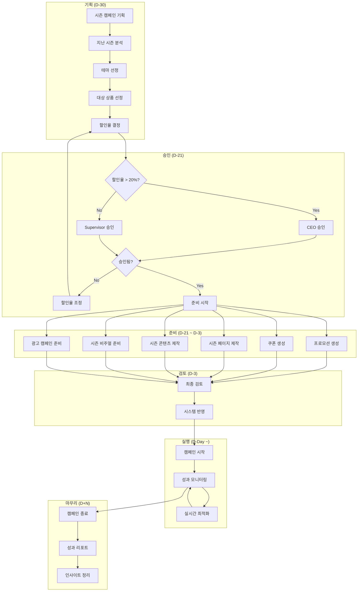

# 시즌 캠페인 워크플로우

> 명절, 시즌별 프로모션 캠페인 운영 프로세스

---

## 1. 개요

시즌 캠페인 워크플로우는 명절, 시즌 이벤트에 맞춰 Marketing Agent와 DetailPage Agent가 협업하여 프로모션을 기획하고 실행하는 프로세스입니다.

## 2. 관련 에이전트

| 에이전트 | 역할 |
|---------|------|
| Marketing Agent | 캠페인 총괄 |
| PromotionSubAgent | 프로모션/쿠폰 관리 |
| ContentSubAgent | 시즌 콘텐츠 제작 |
| DetailPage Agent | 시즌 페이지 제작 |
| Media Agent | 시즌 비주얼 제공 |
| Supervisor | 할인율 승인 |

## 3. 시즌 캘린더

| 시즌 | 시기 | 테마 | 할인율 |
|------|------|------|--------|
| 설날 | 1월 말 ~ 2월 초 | 새해 복 많이 | 15-20% |
| 봄맞이 | 3월 | 봄 육아 준비 | 10-15% |
| 어린이날 | 5월 초 | 아이를 위한 선물 | 15-20% |
| 여름 | 7-8월 | 시원한 육아 | 10-20% |
| 추석 | 9월 | 가족과 함께 | 15-20% |
| 블프 | 11월 말 | 연말 대세일 | 20-30% |
| 크리스마스 | 12월 | 따뜻한 선물 | 15-25% |

## 4. 워크플로우 다이어그램



## 5. Phase별 상세

### 5.1 기획 (D-30)

#### 지난 시즌 분석

```typescript
const lastYearPerformance = await marketingAgent.getSeasonalReport({
  season: 'chuseok',
  year: 2024,
});

// 분석 포인트:
// - 매출 목표 달성률
// - 가장 잘 팔린 상품
// - 가장 효과적인 채널
// - 고객 반응 (리뷰, 문의)
```

#### 대상 상품 선정

```typescript
const targetProducts = await inventoryAgent.getSeasonalRecommendations({
  season: 'chuseok',
  criteria: {
    stockLevel: 'high',
    marginRate: '>= 30%',
    lastYearSales: 'top50',
  },
});
```

### 5.2 프로모션 설정 (D-21)

#### 프로모션 생성

```typescript
const promotion = await promotionAgent.createPromotion({
  name: '2025 추석 명절 세일',
  type: PromotionType.SEASONAL,
  discountValue: 20,
  discountType: 'percent',
  startDate: '2025-09-01',
  endDate: '2025-09-15',
  productIds: targetProducts.map(p => p.id),
  channels: [SalesChannel.NAVER, SalesChannel.COUPANG],
});
```

#### 쿠폰 생성

```typescript
const coupon = await promotionAgent.createCoupon({
  code: 'CHUSEOK2025',
  name: '추석 특별 쿠폰',
  discountType: 'percent',
  discountValue: 10, // 추가 10% 할인
  maxDiscount: 10000,
  minPurchaseAmount: 50000,
  maxUsageCount: 1000,
  startDate: '2025-09-01',
  endDate: '2025-09-15',
});
```

### 5.3 콘텐츠 제작 (D-14)

#### 시즌 콘텐츠 세트

```typescript
const seasonalContent = await contentAgent.createSeasonalContentSet({
  season: 'chuseok',
  theme: '가족과 함께하는 편안한 명절',
  products: targetProducts.slice(0, 5),
  contentTypes: [
    { type: ContentType.CARD_NEWS, count: 3 },
    { type: ContentType.SNS_POST, count: 10 },
    { type: ContentType.BLOG, count: 2 },
  ],
});
```

#### 시즌 비주얼

```typescript
// 시즌 배너/이미지 요청
const seasonalVisuals = await mediaAgent.searchAssets({
  tags: ['추석', '명절', '가족'],
});

// 없으면 새로 제작 요청
if (seasonalVisuals.length < 5) {
  await mediaAgent.requestSeasonalAssets({
    theme: '추석',
    assetTypes: ['banner', 'thumbnail', 'sns'],
  });
}
```

### 5.4 광고 캠페인 (D-7)

```typescript
const seasonalCampaign = await marketingAgent.createCampaign({
  name: '2025 추석 명절 세일 캠페인',
  objective: 'conversions',
  platforms: [AdPlatform.NAVER, AdPlatform.META, AdPlatform.KAKAO],
  budget: {
    daily: 500000,
    total: 7500000, // 15일
  },
  targetROAS: 350,
  startDate: '2025-09-01',
  endDate: '2025-09-15',
  creatives: seasonalContent.map(c => c.id),
});
```

## 6. 실시간 운영

### 6.1 모니터링 대시보드

```
+------------------------------------------+
|         추석 시즌 캠페인 현황              |
+------------------------------------------+
| 매출: ████████░░ 80% (목표: 5000만)       |
| ROAS: ███████░░░ 380% (목표: 350%)        |
| 쿠폰 사용: ██████████ 847/1000            |
+------------------------------------------+
| 인기 상품:                                |
| 1. 슬리핑백 A    - 판매 234개             |
| 2. 수유쿠션 B    - 판매 189개             |
| 3. 보온 이불 C   - 판매 156개             |
+------------------------------------------+
```

### 6.2 자동 최적화 규칙

```typescript
const optimizationRules = {
  // 재고 부족 시 프로모션 제외
  lowStock: {
    condition: 'stock < 10',
    action: 'remove_from_promotion',
    notify: true,
  },

  // 광고 성과 미달 시 조정
  lowROAS: {
    condition: 'roas < 250',
    action: 'reduce_budget_20%',
    notify: true,
  },

  // 인기 상품 추가 노출
  hotProduct: {
    condition: 'sales_velocity > average * 2',
    action: 'increase_ad_budget',
    notify: false,
  },
};
```

## 7. 시즌별 특이사항

### 7.1 설날/추석

- 배송 마감일 공지 필수
- 선물 포장 옵션 강조
- 가족/세트 상품 프로모션

### 7.2 어린이날

- 육아 필수템 패키지
- 출산 선물 세트
- 키즈 안전 강조

### 7.3 블랙프라이데이

- 최대 할인 적용
- 한정 수량 긴급성
- 글로벌 트렌드 활용

## 8. 성과 리포트

### 8.1 주요 KPI

| 지표 | 목표 | 결과 | 달성률 |
|------|------|------|--------|
| 매출 | 5,000만원 | - | - |
| 주문 수 | 500건 | - | - |
| ROAS | 350% | - | - |
| 신규 고객 | 100명 | - | - |
| 쿠폰 사용률 | 80% | - | - |

### 8.2 인사이트 정리

```typescript
const seasonalLearnings = {
  whatWorked: [
    '카카오 채널 알림톡 효과 높음',
    '세트 상품 전환율 높음',
    '인스타그램 스토리 참여도 높음',
  ],
  improvements: [
    '배송 마감 3일 전부터 긴급성 강조',
    '선물 포장 옵션 조기 노출',
    '재고 실시간 연동 강화',
  ],
  nextSeasonNotes: [
    '세트 상품 SKU 확대',
    '예약 판매 도입 검토',
    '인플루언서 협업 사전 확정',
  ],
};
```

## 9. 에스컬레이션

| 상황 | 대상 | SLA |
|------|------|-----|
| 재고 소진 | Inventory + Supervisor | 1시간 |
| 할인율 변경 요청 | Supervisor | 4시간 |
| 매출 목표 50% 미달 | CEO | 24시간 |
| 고객 클레임 급증 | CS + Supervisor | 즉시 |

---

*시즌 캠페인 워크플로우 v1.0*
